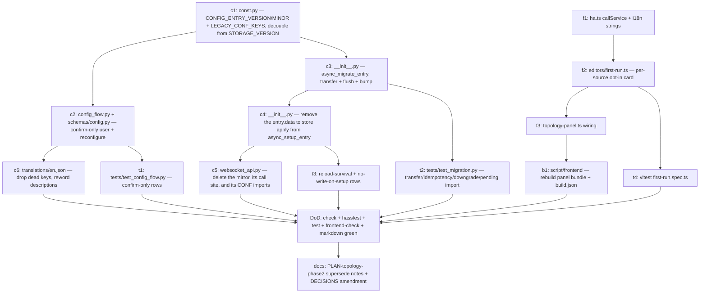

# Topology — Phase-2 Follow-up: Config-Flow Slimming — Implementation Plan

**Status:** Implementation plan (frozen artifact for the Phase-2 re-freeze
carved out of `PLAN-topology-phase7.md` D14) · Last updated 2026-07-25 ·
**Decisions D1–D14 ratified by the maintainer 2026-07-24 — cleared for
implementation.** Every "Recommended option" in §9 is now the binding decision;
this document is the frozen contract the implementation PR is written against.

> **Amendment 2026-07-25 — the deprecation window is collapsed; S1 and S2 ship
> together.** The maintainer decided to take the alternative recorded under
> D8/D9/D10/D12 rather than the two-stage window: ADR "Release Strategy"
> expressly permits it pre-1.0.0 ("no public deprecation window; a coordinated
> update of both repositories suffices"), and it removes ~20 lines of purely
> transitional code. Concretely, and superseding the S1/S2 split wherever the
> text below still describes one:
>
> - **One migration, 1.1 → 1.2**, which transfers **and** cleans up. There is no
>   `minor_version = 3`.
> - **`entry.data` is `{}` after the migration** — the legacy keys are removed in
>   the same `async_update_entry` call that bumps the version (§3.2 step 6,
>   S2 variant). The clearing still happens **only** after a successful
>   `async_save_now()`; a store error leaves the entry unbumped _and_ unemptied.
> - **`_sync_home_config_to_entry` is deleted**, together with its call site and
>   its `CONF_*` imports — not kept write-only.
> - **`_run_setup_imports` is deleted.** Never-executed import opt-ins are not
>   lost: the panel first-run card appears exactly when the `imports_done_at`
>   stamp is `null`, which is the same condition the function tested.
> - **Accepted risk, documented in the implementation PR:** after a rollback to
>   the pre-slim version the old reconfigure form shows defaults instead of the
>   real values, and submitting it there would write those defaults into the
>   store. The store's contents are never lost by the migration itself.
>
> Everything else in this document — D1–D7, D11, D13, D14, the confirm-only flow
> shape, the migration order of operations, the panel card, and the boundaries in
> §7 — is unchanged and still binding. §3.5 and the D8/D9/D10/D12 rows below carry
> the amendment inline; §1, §2.4 and §4.4 should be read with their S2 column as
> the shipped state and their S1 column as never-shipped.
> Phase 7 ratified the _direction_ ("slim the flow, move settings + the import
> opt-in to the panel") and explicitly sequenced the field removal here, as a
> separate change with a deprecation/migration window; ratification of §9 closes
> that sequencing. Five carve-outs survive ratification as **pre-implementation
> tasks, not open choices** — the **open verification items** listed under §9 are
> facts this environment could not establish (frontend form submission, hassfest on
> a field-less step, reconfigure reachability, `MockConfigEntry` version defaults,
> `hass.callService` availability). Each has a stated fallback that changes only
> the mechanism, never a ratified decision.

**Scope:** the second half of Phase-7 D14 — **slimming the Phase-2 config flow
to a confirm-only step**, **removing the four duplicated settings fields**
(`occupancy_extent`, the three projection toggles, `unannotated_repair_threshold`),
**moving the one-shot import opt-in (`import_aliases` / `import_labels`) out of
the flow into a panel first-run action**, and **migrating existing installations
`entry.data` → store without data loss**. (Amended 2026-07-25: the two-stage
deprecation window this originally sat behind is collapsed into one change, §3.5.)
Phase 7 already shipped the Phase-7-local half (`config_panel_domain=DOMAIN`, so
the integration tile's "Configure" opens the panel) and the panel itself
(`update_home_config` editor, `imports_done_at` visible in the WS `home_config`
payload) — this follow-up removes the now-duplicated flow surface on top of that
substrate.

**A config flow must keep existing.** Home Assistant creates a config entry
_only_ through a flow, and the Bronze rules `config-flow` /
`test-before-configure` require it to be present and to run meaningful checks.
The lever is not _whether_ the flow exists but _how thin_ it is: after this
change the flow collects **no data at all** — it confirms, runs the three
frozen test-before-configure checks (§2.1), and creates the entry. All settings
live in the store, edited through the panel via the frozen
`topology/update_home_config` command.

**Binding inputs:** `PLAN-topology-phase7.md` (**§9 D14** both halves, §2.1
`config_panel_domain`, §2.6 the home-config editor, §7 the boundary row
"Config-flow slimming to a confirm-step … Phase 2 (re-freeze)"),
`PLAN-topology-phase2.md` (**§5** the frozen config-flow field set + reconfigure
step + `strings.json` keys, **§4.9** `topology/update_home_config`, **§2.1/§2.2**
the store schema and its `additionalProperties: false` discipline, **§7** the
existing config-flow test rows), `DECISIONS.md` (ADR "Editing Surface" — config
flow for setup, panel for data; ADR "Release Strategy" — no tag/version/
`quality_scale` change, freezes binding internally, pre-1.0.0 changes need no
_public_ deprecation window), `AGENTS.md` (package rules, layering, validation
scripts, translation strategy — `en.json` + `services.yaml` only, breaking-change
policy: warn, migrate, document with a `BREAKING CHANGE:` footer). The real code
on `main` after the Phase-7 merge
(`config_flow_handler/**`, `__init__.py`, `websocket_api.py`, `store.py`,
`const.py`, `translations/en.json`, `frontend/src/**`) is the fixed substrate
every signature below is written against (Appendix B).

**Definition of done for this follow-up:** a developer implements it from this
document alone in ~1 working day; a fresh install creates the entry through a
confirm-only step with `entry.data == {}` and gets its home config from the
store defaults; an existing install migrates its five settings fields into the
store on the first load after the upgrade, loses nothing, and keeps working if
the migration is interrupted; a panel edit through `update_home_config`
**survives a reload** (the regression this change exists to remove); the
one-shot import opt-in is reachable from the panel's first-run card and still
stamps `imports_done_at` exactly once; the legacy `entry.data` keys are deleted
by the same migration that transferred them, leaving `entry.data == {}`
(amended 2026-07-25, §3.5); `script/check`, `script/hassfest`, `script/test`,
`script/frontend-check` and `script/markdown` stay green. **No** store-schema field, WS command, enum, entity, `health` field,
service, or `quality_scale` / manifest `version` / tag change — the only
version bump is the **config-entry `MINOR_VERSION`** (§3.1), which is a
migration requirement, not a release act.

---

## 1. Delta table

Basis: the tree on `main` after the Phase-7 merge (`6eb5a05`). "add" = new
file/content, "extend" = add to or edit an existing file, "keep" = untouched.
**Amended 2026-07-25:** the S1/S2 split below is collapsed — everything marked
**S2** ships in this same change and nothing marked **S1-only** was ever written
(§3.5). No store schema, WS command, WS response field, `health` field, entity,
or service is added or changed.

| Path                                                                                                                         | Action     | What changes                                                                                                                                                                                                                                                                                                                |
| ---------------------------------------------------------------------------------------------------------------------------- | ---------- | --------------------------------------------------------------------------------------------------------------------------------------------------------------------------------------------------------------------------------------------------------------------------------------------------------------------------- |
| `custom_components/topology/const.py`                                                                                        | **extend** | Add `CONFIG_ENTRY_VERSION = 1`, `CONFIG_ENTRY_MINOR_VERSION = 2` and `LEGACY_CONF_KEYS` (the seven Phase-2 flow keys). **Decouples the config-entry version from `STORAGE_VERSION`** (§3.1, D5). The `CONF_*` constants stay — the migration reads them to transfer the values and `LEGACY_CONF_KEYS` to strip them.        |
| `custom_components/topology/config_flow_handler/config_flow.py`                                                              | **extend** | `VERSION`/`MINOR_VERSION` from the new constants; `async_step_user` becomes confirm-only and creates the entry with `data={}`; `async_step_reconfigure` becomes confirm-only (re-runs the checks, reloads, aborts `reconfigure_successful`); `_normalize()` deleted. The three checks in `_async_run_checks` are unchanged. |
| `custom_components/topology/config_flow_handler/schemas/config.py`                                                           | **extend** | `get_user_schema` / `get_reconfigure_schema` collapse into one `get_confirm_schema() -> vol.Schema` returning `vol.Schema({})`; the selectors, defaults helpers, and the `CONF_*` imports go away. Module is kept (AGENTS.md package layout) rather than deleted.                                                           |
| `custom_components/topology/__init__.py`                                                                                     | **extend** | **Add `async_migrate_entry`** (§3.2). **Remove** the unconditional `store.async_apply_home_config(...)` call from `async_setup_entry` (§2.5) — the store is no longer overwritten from `entry.data` on every load. **Remove `_run_setup_imports`** (§4.4, D12 as amended): the panel card covers the pending-opt-in case.   |
| `custom_components/topology/websocket_api.py`                                                                                | **extend** | `_sync_home_config_to_entry`, its call site, and its `CONF_*` imports are **deleted** (§2.6/D10 as amended): nothing reads `entry.data` any more, so the mirror has no purpose left. `ws_update_home_config` itself is unchanged.                                                                                           |
| `custom_components/topology/store.py`                                                                                        | **keep**   | `async_apply_home_config` keeps its exact signature; only its **caller** moves (setup → migration). `async_update_home_config` / `async_mark_import_done` untouched. No schema, no new field — the store schema's `additionalProperties: false` forbids a "migrated" marker, which is why the config entry carries it.      |
| `custom_components/topology/translations/en.json`                                                                            | **extend** | Remove the dead `config.step.{user,reconfigure}.data` + `data_description` blocks and the now-unused `selector.occupancy_extent` block; reword `config.step.user.description` and `config.step.reconfigure.description` to point at the panel. Errors/aborts, service, entity, and issue strings unchanged (§5, D13).       |
| `frontend/src/editors/first-run.ts`                                                                                          | **add**    | The panel first-run card: shows a per-source import opt-in while `home_config.imports_done_at.<source> === null`, calls the existing `topology.import_from_core` service, client-local dismissal. Panel-only module — outside the D15 card-reuse boundary (§4, D4).                                                         |
| `frontend/src/topology-panel.ts`, `frontend/src/ha.ts`                                                                       | **extend** | Wire the first-run card into the map view; add `callService?` to the structural `HomeAssistant` type. `api/ws-client.ts` is **not** touched — it stays frozen to the topology WS contract (D15 boundary, §4.2).                                                                                                             |
| `frontend/src/i18n/en.ts`                                                                                                    | **extend** | First-run card strings (frontend-side i18n per Phase-7 D11 — no `en.json` key).                                                                                                                                                                                                                                             |
| `custom_components/topology/panel/*`                                                                                         | **extend** | Rebuilt bundle + `build.json` hash (`script/frontend`) — mechanical output of the frontend change, the CI freshness guard requires it.                                                                                                                                                                                      |
| `tests/conftest.py`                                                                                                          | **extend** | `entry_data` becomes `{}`; `mock_config_entry` gains `version`/`minor_version=CONFIG_ENTRY_*`; **add** `legacy_entry_data` (the Phase-2 field set), `legacy_config_entry` (`version=1, minor_version=1`), and `persisted_store` (see §6).                                                                                   |
| `tests/test_config_flow.py`                                                                                                  | **extend** | Rewrite the field-set rows for the confirm-only steps; keep the check/abort rows verbatim (§6).                                                                                                                                                                                                                             |
| `tests/test_migration.py`                                                                                                    | **add**    | The migration matrix: transfer, no-loss, idempotency, deferred bump on store error, downgrade rejection, pending-import handling (§6).                                                                                                                                                                                      |
| `tests/test_websocket.py`, `tests/test_imports.py`                                                                           | **extend** | Add the reload-survival regression row and the "import service works without flow flags" row (§6).                                                                                                                                                                                                                          |
| `docs/development/PLAN-topology-phase2.md`                                                                                   | **extend** | In the **implementation PR**: a superseded-by note on §5/§5.1/§5.2/§5.3 pointing here (§2.7). The frozen text stays readable; it is annotated, not rewritten.                                                                                                                                                               |
| `docs/development/DECISIONS.md`                                                                                              | **extend** | In the **implementation PR**: an amendment paragraph under ADR "Editing Surface" recording that the flow is now confirm-only and the import opt-in is a panel action.                                                                                                                                                       |
| `manifest.json`, `services.yaml`, `hacs.json`, `repairs.py`, `diagnostics.py`, `coordinator/`, `entity/`, `service_actions/` | **keep**   | Untouched. No `version` / `quality_scale` / `single_config_entry` change (ADR "Release Strategy"); `diagnostics.py` never read `entry.data`, so the redaction surface is unchanged.                                                                                                                                         |

---

## 2. Target config-flow specification (frozen)

### 2.1 Step `user` — confirm-only

```python
# config_flow_handler/config_flow.py (shape, not the final body)
VERSION = CONFIG_ENTRY_VERSION            # 1
MINOR_VERSION = CONFIG_ENTRY_MINOR_VERSION  # 2

async def async_step_user(self, user_input=None):
    await self.async_set_unique_id(CONFIG_ENTRY_UNIQUE_ID)
    self._abort_if_unique_id_configured()
    errors: dict[str, str] = {}
    if user_input is not None:
        abort = await self._async_run_checks(errors)   # unchanged, §5.1 of Phase 2
        if abort is not None:
            return self.async_abort(reason=abort)      # store_future_version
        if not errors:
            return self.async_create_entry(title="Topology", data={})
    return self.async_show_form(step_id="user", data_schema=get_confirm_schema(), errors=errors)
```

- **No fields.** `get_confirm_schema()` returns `vol.Schema({})` (D2). HA
  validates `{}` against it and passes `{}` back into the step, so the
  `user_input is not None` branch is what "Submit" means (Appendix A.3).
- **The three test-before-configure checks are unchanged and still run on
  submit** — area registry readable → form error `area_registry_unavailable`;
  store loadable → form error `store_corrupt`; store version ≤ `STORAGE_VERSION`
  → abort `store_future_version`. Bronze `config-flow` /
  `test-before-configure` therefore stay satisfied, and the form is what makes a
  recoverable _form error_ possible at all (the argument against auto-creating
  the entry with no form, D2).
- **`entry.data == {}`.** A fresh install's home config comes from
  `store.default_store_data()` — `whole_property`, all three projection toggles
  `False`, `unannotated_repair_threshold = 3`, both `imports_done_at` `null`.
  Those are byte-identical to the Phase-2 flow defaults, so a new install is
  functionally unchanged.
- **`unique_id`** stays `CONFIG_ENTRY_UNIQUE_ID = DOMAIN` with the
  belt-and-braces `_abort_if_unique_id_configured()` under the manifest's
  `single_config_entry: true`. Unchanged.
- **Title** stays the literal `"Topology"`.

### 2.2 Step `reconfigure` after the slimming

The step **stays** (D3) and becomes confirm-only as well: it re-runs the same
three checks and finishes with
`self.async_update_reload_and_abort(entry, data_updates={}, reason="reconfigure_successful")`
(signature verified, Appendix A.2). It no longer prefills anything, no longer
writes `entry.data`, and — critically — **no longer touches `home_config`**.

Why keep a step that configures nothing:

- The Gold rule `reconfiguration-flow` and the ADR "Editing Surface" statement
  ("reconfigure flow … mirrors the initial setup step only") both assume it
  exists; the manifest declares `quality_scale: platinum`, and dropping the step
  would be a self-declared-scale regression this follow-up has no mandate for.
- It remains the only user-reachable way to **re-run the setup checks and reload
  the entry** without removing and re-adding the integration — a real, if small,
  affordance (e.g. after restoring a store backup).
- Counter-argument (recorded, D3): a form with nothing to configure is arguably
  noise. Mitigation is textual — the reconfigure description says explicitly
  that settings live in the panel and that this step only re-validates and
  reloads.

### 2.3 Field-by-field disposition

| Phase-2 flow field (§5.1)          | After the slimming | Where it lives now                                                     | How a user changes it                                      |
| ---------------------------------- | ------------------ | ---------------------------------------------------------------------- | ---------------------------------------------------------- |
| `occupancy_extent`                 | **removed**        | `home_config.occupancy_extent` (store, default `whole_property`)       | Panel → home-config editor (`topology/update_home_config`) |
| `project_environment`              | **removed**        | `home_config.projection_toggles.environment`                           | Panel → home-config editor                                 |
| `project_type`                     | **removed**        | `home_config.projection_toggles.type`                                  | Panel → home-config editor                                 |
| `project_trust`                    | **removed**        | `home_config.projection_toggles.trust`                                 | Panel → home-config editor                                 |
| `unannotated_repair_threshold`     | **removed**        | `home_config.unannotated_repair_threshold` (default `3`)               | Panel → home-config editor                                 |
| `import_aliases` (one-shot opt-in) | **removed**        | Not a setting at all — an action, stamped in `imports_done_at.aliases` | Panel first-run card → `topology.import_from_core` (§4)    |
| `import_labels` (one-shot opt-in)  | **removed**        | Not a setting at all — stamped in `imports_done_at.labels`             | Panel first-run card → `topology.import_from_core` (§4)    |

Nothing becomes unreachable: every removed field already had a panel editor
(Phase-7 §2.6) or a service (`topology.import_from_core`, Phase 6) before this
change. That is precisely the duplication D14 identified.

### 2.4 `entry.data` role after the slimming

| Stage              | `entry.data` content        | Read by                                                  | Written by                                      |
| ------------------ | --------------------------- | -------------------------------------------------------- | ----------------------------------------------- |
| today (`main`)     | the seven Phase-2 flow keys | `async_setup_entry` (applies to store on **every** load) | flow, reconfigure, `_sync_home_config_to_entry` |
| **this follow-up** | `{}`                        | nothing                                                  | nothing                                         |

**The rule: the store is the single source of truth for home config;
`entry.data` is not a cache and is never read back as configuration.** Calling it
a "cache" is exactly the ambiguity that produced the overwrite-on-reload
behavior. Amended 2026-07-25: rather than keeping a frozen legacy copy for one
deprecation stage, the migration reads it once and deletes it (§3.5).

### 2.5 What `async_setup_entry` loses

The block that today reads `entry.data` and pushes it into the store —

```python
data = entry.data
await store.async_apply_home_config(
    occupancy_extent=data.get(CONF_OCCUPANCY_EXTENT), ...
)
```

— is **deleted** (its logic moves into the one-time migration, §3.2). This is
the whole point of the change: after it is gone, a reload re-reads the store and
leaves the panel's edits alone. `store.async_apply_home_config` itself stays in
the store API (it is what the migration and `async_update_home_config` call).

Everything else in `async_setup_entry` is untouched: the test-before-setup store
load and its three error branches, the `store_future_version` repair issue,
`coordinator.async_seed`, `runtime_data`, `async_reconcile_labels`, the registry
watcher, the platform forward, and the panel registration.

### 2.6 `_sync_home_config_to_entry` — what stays, what goes

Today the panel's `update_home_config` mirrors the changed fields back into
`entry.data` for exactly one reason, stated in its comment: so the next reload's
`entry.data → store` sync does not overwrite the panel edit. **Once §2.5 removes
that sync, the mirror has no functional purpose left.**

- **Amended 2026-07-25 (D10): delete the helper**, its call site, and its
  `CONF_*` imports, in this change. The only value keeping it write-only would
  have had is that a user who downgrades to the pre-slim version finds their
  _current_ values in `entry.data` rather than stale ones — and with the
  deprecation window gone (§3.5) there is no such window to serve. Its cost was
  real: one `async_update_entry` write (a `.storage/core.config_entries`
  rewrite) per panel edit, perpetuating the duplication this change removes.
- `ws_update_home_config`'s payload, response, error codes, label reconciliation,
  and `subscribe_updates` echo are **unchanged** — the frozen §4.9 contract is
  not touched.

### 2.7 Frozen Phase-2 statements this follow-up supersedes

Frozen text is superseded explicitly, never silently. The implementation PR
annotates each of these in `PLAN-topology-phase2.md` with a pointer here:

| Phase-2 statement                                                                                                | Superseded by                                                                      |
| ---------------------------------------------------------------------------------------------------------------- | ---------------------------------------------------------------------------------- |
| §5 preamble "`entry.data` holds exactly the flow fields below … entry data is the flow's state"                  | §2.4 — `entry.data` is `{}` for new installs; the store is the only config source  |
| §5.1 the seven-field `user` schema                                                                               | §2.1 — confirm-only, no fields                                                     |
| §5.2 reconfigure = "same schema as `user` minus the import flags"                                                | §2.2 — confirm-only, re-validate + reload                                          |
| §5.3 the `config.step.*.data*` / `selector.occupancy_extent` keys                                                | §5 — those keys are removed from `en.json`                                         |
| §5 "Import flags … one-shot actions executed during the first setup after the flow"                              | §4 — a panel first-run action; the `imports_done_at` stamp semantics are unchanged |
| §7 test rows `test_flow_user_full_input`, `test_flow_threshold_default_and_custom`, `test_reconfigure_prefilled` | §6 — replaced by the confirm-only + migration rows                                 |

**Not superseded and explicitly still binding:** the store schema (§2.2), the
enum catalog (§3), the whole WS contract v1 (§4) including §4.9, the migration
hook contract (§2.3), and the test-before-configure / test-before-setup check
sets (§5.1/§5.3). No Phase-3/4/5/6/7 artifact is affected — none of them read
`entry.data`.

---

## 3. Migration design (frozen)

### 3.1 Version constants — and the `VERSION = STORAGE_VERSION` hazard

`config_flow.py` currently declares `VERSION = STORAGE_VERSION`. The two numbers
are **semantically unrelated**: `STORAGE_VERSION` is the `.storage/topology.storage`
schema version (mirrored into the payload as `schema_version`, used by
`diagnostics.py` and by the future-version rejection), while `VERSION` is the
config-entry version. Bumping the config entry through that alias would bump the
store schema as well — every existing store would be treated as outdated, be run
through `async_migrate_store`, and be rewritten, and a rollback would then hit
`StoreFutureVersionError`. **Decoupling is a hard prerequisite of this change,
not a cleanup** (D5):

```python
# const.py
CONFIG_ENTRY_VERSION = 1        # unchanged major — no data shape a v1 reader cannot handle
CONFIG_ENTRY_MINOR_VERSION = 2  # entry.data transferred to the store, then emptied
LEGACY_CONF_KEYS: tuple[str, ...] = (
    CONF_OCCUPANCY_EXTENT, CONF_IMPORT_ALIASES, CONF_IMPORT_LABELS,
    CONF_PROJECT_ENVIRONMENT, CONF_PROJECT_TYPE, CONF_PROJECT_TRUST,
    CONF_UNANNOTATED_REPAIR_THRESHOLD,
)
```

`STORAGE_VERSION` / `STORAGE_VERSION_MINOR` keep their values (1 / 1) and their
current meaning. A **minor** bump is the correct HA semantics here: the change is
backwards-compatible (§3.4), so no major bump is warranted (D5).

### 3.2 `async_migrate_entry` — contract and order of operations

Placed in `custom_components/topology/__init__.py` (HA looks the function up on
the integration's component module, Appendix A.1):

```python
async def async_migrate_entry(hass: HomeAssistant, entry: TopologyConfigEntry) -> bool:
    """Migrate a config entry to CONFIG_ENTRY_VERSION.CONFIG_ENTRY_MINOR_VERSION."""
```

Order is load-bearing — **the store is written and flushed before any key is
considered migrated, and `entry.data` is never reduced before the store save
succeeded**:

1. **Reject a future entry** (§3.4): if
   `entry.version > CONFIG_ENTRY_VERSION` or
   (`entry.version == CONFIG_ENTRY_VERSION` and
   `entry.minor_version > CONFIG_ENTRY_MINOR_VERSION`) → log an error and
   `return False`. (Core already blocks a higher _major_ before calling us,
   Appendix A.1; the _minor_ case reaches us and must be handled here.)
2. **Nothing to do:** if `entry.minor_version >= CONFIG_ENTRY_MINOR_VERSION` →
   `return True`. (Core also early-returns on an exact match; this keeps the
   function total.)
3. **Load the store** with the existing `TopologyStore(hass)` + `async_load()`.
   On `StoreFutureVersionError` / `StoreCorruptError` / `TopologyStoreError`:
   log a warning, **`return True` without bumping the version** (§3.3) — the
   entry stays at its old minor version, so the migration is retried on the next
   load, while `async_setup_entry` (which runs immediately after) raises the
   proper `ConfigEntryError` / `ConfigEntryNotReady` and creates the
   `store_future_version` repair issue as it does today. Returning `False` here
   would instead park the entry in the **non-recoverable** `MIGRATION_ERROR`
   state (verified, Appendix A.1) and hide the real cause.
4. **Transfer** the legacy values into the store — the same call `setup` makes
   today, with only the keys actually present in `entry.data`:
   `await store.async_apply_home_config(occupancy_extent=…, project_environment=…,
project_type=…, project_trust=…, unannotated_repair_threshold=…)`.
   Absent keys stay `None` and are skipped by the store method, so a
   hand-trimmed `entry.data` cannot blank a store value.
5. **Flush and verify.** `await store.async_save_now()` — the store's normal
   save is debounced (`async_delay_save`) and the migration must not depend on a
   debounce that a crash could drop — followed by a **read-back**: load a fresh
   `TopologyStore` the same way `async_setup_entry` will, and compare its
   `home_config` against what was just applied. Anything short of a match is
   treated exactly like a load error in step 3 (log, `return True`, no bump, no
   clearing).

   _Added during implementation, 2026-07-25, after PR review._ "The save did not
   raise" turned out not to mean "the save succeeded":
   `Store._async_handle_write_data` **catches** `WriteError` — what a full or
   read-only disk produces — and only logs it, so `async_save_now()` returns
   normally after writing nothing, while an `OSError` from
   `_write_prepared_data`'s `os.makedirs` escapes instead and would have reached
   core as a failed migration (the non-recoverable `MIGRATION_ERROR`). Both
   break §3.3's stated invariant that _any_ failure path leaves the entry
   retryable; the silent one would additionally have emptied `entry.data` on top
   of an unwritten store, which is the one way this migration could lose data.
   The read-back costs one extra file read on the single boot that migrates.

6. **Bump the entry**:
   `hass.config_entries.async_update_entry(entry, data=<see below>, minor_version=CONFIG_ENTRY_MINOR_VERSION)`
   (`@callback`, keyword-only, verified in Appendix A.2).
   Amended 2026-07-25 (D8): `data={k: v for k, v in entry.data.items() if k not in LEGACY_CONF_KEYS}`
   — in practice `{}` — dropped in the **same** call that sets
   `minor_version=CONFIG_ENTRY_MINOR_VERSION`. One update, one write. (The
   two-stage variant, which passed `data` unchanged here and cleared it in a
   later `minor_version=3` migration, is not what ships, §3.5.)
7. `return True`.

**Precedence during the transfer: `entry.data` wins** (D7). That is not a
preference, it is behavior preservation: today `async_setup_entry` applies
`entry.data` over the store on _every_ load, so the values a user currently sees
after any restart _are_ the `entry.data` values. Doing that apply exactly one
last time reproduces the last reload, then stops. (Alternative considered:
"store wins / fill-missing-only" — rejected because it would silently change what
a user sees at the upgrade instant, in the rare case where the two disagree.)

### 3.3 Idempotency and retry safety

- **Idempotent by construction.** `async_apply_home_config` is a
  field-wise merge of equal values on a second run; the version bump is a
  no-op once applied; step 2 short-circuits any later call.
- **Retry-safe.** The version bump happens **only after** a successful store
  save. Any failure path leaves the entry at the old minor version with
  `entry.data` intact, so the next load simply retries. There is no
  half-migrated state: until the bump both copies are complete, and after it the
  store is the only copy — the transition between the two is a single
  `async_update_entry` call that happens after the store save returned.
- **No marker in the store.** The store schema is frozen with
  `additionalProperties: false` (Phase-2 §2.2); a `migrated_at`-style field would
  be a store-schema change. The config entry's `minor_version` is the marker.
- **Crash between step 5 and 6:** the store holds the (identical) values, the
  entry is unmigrated → the next load re-applies the same values. Harmless.
- **Interaction with `async_setup_entry`:** migration runs immediately before it
  (verified, Appendix A.1), on the same event loop, before the store is loaded a
  second time by setup. The double load is one extra file read on one boot; it is
  not worth optimizing with shared state.

### 3.4 Downgrade behavior

| Case                                                                            | Handled by                                          | Result                                                                                                                                                                                         |
| ------------------------------------------------------------------------------- | --------------------------------------------------- | ---------------------------------------------------------------------------------------------------------------------------------------------------------------------------------------------- |
| Entry `version` 2 on code with `VERSION` 1                                      | **HA core** (`ConfigEntry.async_migrate`, A.1)      | Error logged, `MIGRATION_ERROR`, our hook is never called. Cannot occur here (no major bump).                                                                                                  |
| Entry `minor_version` > 2 on code with `MINOR_VERSION` 2 (a future rollback)    | **our hook**, step 1                                | `return False` → `MIGRATION_ERROR` (not recoverable; user restores a backup or upgrades again).                                                                                                |
| Entry `minor_version` 2 on the **pre-slim** version (rollback past this change) | nothing — the old code has no `async_migrate_entry` | Core's `if not supports_migrate and same_major_version: return True` (verified, A.1) — the entry loads, but `entry.data` is now empty, so the old reconfigure form shows defaults (§3.5 risk). |

The middle row is the strict choice (D11, unchanged by the 2026-07-25
amendment): a higher **minor** version is backwards-compatible by HA's own
definition, so returning `True` and proceeding would be defensible in principle.
The decision is the documented HA idiom — an explicit, visible, testable
rejection — and with the window collapsed it is no longer merely stricter than
necessary: the legacy keys are gone from the moment this change lands, so a
tolerant `True` would mean older code silently reconfiguring the store from an
empty `entry.data`. Recorded counter-argument: strictness costs an unrecoverable
`MIGRATION_ERROR` where a warning might have sufficed.

### 3.5 Deprecation window — collapsed (amended 2026-07-25)

| Stage       | Ships with     | Flow         | `entry.data`            | `_sync_home_config_to_entry` | `_run_setup_imports` | Entry version |
| ----------- | -------------- | ------------ | ----------------------- | ---------------------------- | -------------------- | ------------- |
| today       | `main`         | 7 fields     | 7 keys, read every load | read-supporting              | active               | 1.1           |
| **shipped** | this follow-up | confirm-only | **`{}`**                | **deleted**                  | **deleted**          | **1.2**       |

**Policy (amends D9).** ADR "Release Strategy" is explicit that there is no
public release yet (`manifest.json` stays `0.x`; the single public release is
`1.0.0` at the end of the full scope) and that pre-release changes "need no
public deprecation window; a coordinated update of both repositories suffices".
Counting a window in _released versions_ is therefore meaningless, and counting
it in _phases_ — the ratified 2026-07-24 policy, "S2 no earlier than the end of
Phase 8, no later than the 1.0.0 preparation" — buys only rollback fidelity, at
the price of carrying two live copies of the same configuration through a whole
phase. **The maintainer decided on 2026-07-25 to take the recorded alternative
instead: one change, no window.** There is no S2 and no `minor_version = 3`.

What the window would have bought, and what is given up with it: a rollback to
the pre-slim version during the window would have found its fields still in
`entry.data`. After this change it does not — the old code's reconfigure form
falls back to its defaults, and submitting it there writes those defaults into
the store. The migration itself never loses anything: the store holds every
value before a single key is removed. This is the accepted risk, documented in
the implementation PR.

Nothing about the migration's **order of operations** relaxes: the legacy keys
are dropped in the same `async_update_entry` call that bumps the version, and
that call still happens only after `async_save_now()` has returned. A store
error leaves the entry at 1.1 with `entry.data` fully intact (§3.2 step 3).

### 3.6 Breaking-change policy compliance

AGENTS.md classes "removing config options (even if unused)" and "modifying how
data is stored in config entries" as changes that need an explicit warning and
approval, a migration path, and a `BREAKING CHANGE:` footer. This document is
that warning; the ratification of §9 is that approval. Concretely:

- **What a user loses:** the ability to change five settings from the config
  flow, and the import opt-in checkboxes in the setup dialog.
- **What replaces it:** the panel (already the ADR's primary editing surface,
  already reachable via the tile's "Configure" thanks to Phase-7
  `config_panel_domain`) and, for the imports, the panel first-run card plus the
  existing `topology.import_from_core` service.
- **What is preserved:** every stored value, via §3.2 — the store is written and
  flushed before a single legacy key is removed. (Amended 2026-07-25: the legacy
  copy in `entry.data` is _not_ preserved past the migration, §3.5.)
- **Commit/PR:** the implementation commit carries a
  `BREAKING CHANGE: the config flow no longer collects home settings; they are
edited in the Topology panel and migrated automatically (config entry
1.1 → 1.2)` footer, and the ADR amendment in `DECISIONS.md` (§1).
- **No release act:** no tag, no `manifest.json` `version`, no `quality_scale`
  change — only the config-entry `MINOR_VERSION` (§3.1).

---

## 4. Panel first-run import (frozen)

### 4.1 Where the opt-in appears

A first-run card in the panel's map view (`frontend/src/editors/first-run.ts`),
rendered per source while `home_config.imports_done_at.<source> === null`:

- "Seed annotations from area **aliases**" → runs `import_from_core`, `source: aliases`
- "Seed annotations from area **labels**" → runs `import_from_core`, `source: labels`

Both are explicit user actions — nothing auto-runs. The card carries the same
"fill-empty-only, never overwrites" wording the service documents, and a
**dismiss** control whose state is client-local (`localStorage`, the same
precedent Phase-7 §2.5 set for drag-to-declutter positions), so declining does
not require backend state.

### 4.2 How it is triggered — no new WS command

`topology.import_from_core` already exists (Phase 6, admin-only via
`async_register_admin_service`) and already performs both halves of the
operation: `async_run_import(...)` then `store.async_mark_import_done(source)`,
followed by `coordinator.async_publish(snapshot, "import", affected)` — which the
panel receives as a normal `subscribe_updates` event and re-seeds from. So:

- **No new WebSocket command, no new service, no new store field** (the hard
  rule from the task and from Phase-7 D7 holds).
- The call is a **frontend service call** (`hass.callService("topology",
"import_from_core", { source })`), which travels over HA core's own
  `call_service` WS command — not a topology command. The structural
  `HomeAssistant` type in `ha.ts` gains an optional `callService` member (D4).
- **The call site is `editors/first-run.ts`, not `api/ws-client.ts`.** The
  ws-client is frozen to the topology WS contract and its read half is the
  card-reuse boundary from Phase-7 D15; a service call belongs in the
  panel-only write layer.
- Errors surface through the existing toast helper (`editors/toast.ts`).

### 4.3 `imports_done_at` semantics are unchanged

The stamp remains the one-shot guard, written only by
`store.async_mark_import_done` and exposed in the WS `home_config` payload
(`_serialize_home_config`, verified Appendix B). A stamped source never shows the
card again — on any browser, because the state is server-side. Re-importing after
a stamp stays what it is today: a deliberate service call (`topology.import_from_core`
from Developer Tools), which is fill-empty-only and therefore safe.

### 4.4 The setup-time import is removed (amended 2026-07-25)

`_run_setup_imports` in `async_setup_entry` fired an import when
`entry.data[CONF_IMPORT_*]` was truthy **and** the stamp was `null`. After the
slimming no new install ever sets those keys, so the function is inert for new
installs; the only case it still served was an **existing** install whose opt-in
was recorded but never executed. **It is deleted in this change** (D12 as
amended): that pending intent is not dropped, because the panel's first-run card
appears on exactly the condition the function tested — `imports_done_at.<source>`
is `null`. A never-executed opt-in therefore surfaces as a visible, one-click
action instead of a silent boot-time import, which is strictly better feedback.

(The other alternative — running pending imports _inside_ the migration —
remains rejected: a migration should reshape data, not execute feature behavior,
and it would have no clean error surface.)

---

## 5. Translations / hassfest impact

`en.json` is the only translation file touched (AGENTS.md: `en.json` +
`services.yaml` only; `services.yaml` is not touched at all).

**Removed** (dead after §2.1/§2.2 — D13):

```text
config.step.user.data.*                      (all seven keys)
config.step.user.data_description.*
config.step.reconfigure.data.*               (all five keys)
config.step.reconfigure.data_description.*
selector.occupancy_extent.options.*          (its only consumer was the flow selector)
```

**Kept:** `config.step.user.title`, `config.step.reconfigure.title`, both
`description`s (**reworded**: what the confirm step does, and that settings live
in the Topology panel), `config.error.area_registry_unavailable`,
`config.error.store_corrupt`, `config.abort.store_future_version`,
`config.abort.reconfigure_successful`, and every `entity` / `services` /
`exceptions` / `issues` / remaining `selector` block.

**hassfest:** validates `manifest.json`, `services.yaml`, `translations/`, and
integration structure. Removing translation keys whose schema fields no longer
exist keeps the file consistent; no manifest or services change accompanies it.
`script/hassfest` is expected to stay green — verification item (§9, item 2),
because "a `config.step` with no `data` block" is a shape this repo has not
exercised before. If hassfest objects, the fallback is to keep the step's
`title`/`description` only (already the plan) and, if necessary, retain an empty
`data: {}` object.

**Panel strings** (the first-run card) are frontend-side per Phase-7 D11 —
`frontend/src/i18n/en.ts`, outside the AGENTS.md translation surface.

---

## 6. Test matrix

Style per Phase 4/5/6/7: IDs + fixtures, no bodies. **New fixtures:**
`legacy_entry_data` (the frozen Phase-2 seven-key mapping), `legacy_config_entry`
(`MockConfigEntry(..., version=1, minor_version=1, data=legacy_entry_data)`), and
`persisted_store` — `TopologyStore.async_load` reads the on-disk envelope
directly (Phase-2 §5.1) while the harness mocks `Store` writes into an in-memory
dict, so without it nothing reaches disk and a reload is unobservable; the
fixture restores that round-trip for the topology key (added during
implementation, 2026-07-25).
**Changed fixtures:** `entry_data` → `{}`; `mock_config_entry` pinned to
`minor_version=CONFIG_ENTRY_MINOR_VERSION` so ordinary tests do not silently
exercise the migration. Everything else (`setup_integration`, `hass_ws_client`,
`store_payload_full`, `area_registry`, `freezer`) is reused unchanged.

### Config flow (`tests/test_config_flow.py`, extend)

| ID                                     | Purpose                                                                                                         | Fixtures                |
| -------------------------------------- | --------------------------------------------------------------------------------------------------------------- | ----------------------- |
| `test_flow_user_form_has_no_fields`    | The `user` form's schema is empty — none of the seven Phase-2 keys is offered.                                  | hass                    |
| `test_flow_user_creates_empty_entry`   | Submitting the confirm step creates the entry: `data == {}`, `unique_id == "topology"`, `version/minor == 1/2`. | hass                    |
| `test_flow_defaults_come_from_store`   | After setup of a fresh entry, `home_config` equals `default_store_data()` (extent, toggles, threshold).         | hass, mock_config_entry |
| `test_flow_checks_run_on_confirm`      | Registry failure → form error `area_registry_unavailable`; store failure → `store_corrupt`; flow recoverable.   | hass                    |
| `test_flow_store_future_version_abort` | Version-2 store → abort `store_future_version` (unchanged Phase-2 row).                                         | hass                    |
| `test_flow_single_instance_abort`      | Second flow aborts `single_instance_allowed` (unchanged Phase-2 row).                                           | hass, mock_config_entry |
| `test_reconfigure_form_has_no_fields`  | The `reconfigure` form's schema is empty and prefills nothing.                                                  | hass, setup_integration |
| `test_reconfigure_reloads_and_aborts`  | Confirm → entry reloaded, abort `reconfigure_successful`, `entry.data` unchanged.                               | hass, setup_integration |
| `test_reconfigure_leaves_home_config`  | `home_config` is byte-identical before and after a reconfigure (it no longer writes settings).                  | hass, setup_integration |
| `test_reconfigure_runs_checks`         | Store-corrupt during reconfigure surfaces the same error path as `user` (unchanged Phase-2 row).                | hass, setup_integration |

### Migration (`tests/test_migration.py`, new)

| ID                                      | Purpose                                                                                                                                                     | Fixtures                            |
| --------------------------------------- | ----------------------------------------------------------------------------------------------------------------------------------------------------------- | ----------------------------------- |
| `test_migrate_transfers_legacy_fields`  | A 1.1 entry with the full legacy set → after setup the store's `home_config` carries all five values; `minor_version == 2`.                                 | hass, legacy_config_entry           |
| `test_migrate_no_data_loss_non_default` | Non-default values (`unit_within_building`, all toggles `True`, threshold 10) survive the transfer exactly.                                                 | hass, legacy_config_entry           |
| `test_migrate_partial_entry_data`       | An entry missing some legacy keys → only present keys are applied; store defaults survive for the rest (no blanking).                                       | hass                                |
| `test_migrate_clears_legacy_keys`       | Amended 2026-07-25: after migration `entry.data == {}` — the keys are dropped by the same update that bumps the version (D8 as amended).                    | hass, legacy_config_entry           |
| `test_migrate_is_idempotent`            | A second setup/reload runs no transfer and leaves store + entry unchanged (step 2 short-circuit).                                                           | hass, legacy_config_entry           |
| `test_migrate_store_error_defers_bump`  | Store load raising a transient error during migration → migration returns `True`, `minor_version` stays 1, setup surfaces the error; a later load migrates. | hass, legacy_config_entry           |
| `test_migrate_future_minor_rejected`    | Entry at `1.3` → `async_migrate_entry` returns `False`, entry state `MIGRATION_ERROR`.                                                                      | hass                                |
| `test_migrate_future_major_rejected`    | Entry at `2.1` → core rejects before the hook; state `MIGRATION_ERROR`, hook never called.                                                                  | hass                                |
| `test_migrate_current_entry_untouched`  | A `1.2` entry performs no store write and no entry update.                                                                                                  | hass, mock_config_entry             |
| `test_pending_import_not_run_at_setup`  | Amended 2026-07-25: a legacy entry with `import_aliases=True` imports nothing at setup and the stamp stays `null` — which is what makes the card appear.    | hass, area_registry, import_payload |
| `test_stamped_import_does_not_rerun`    | A stamp present before the migration survives it and a later reload untouched.                                                                              | hass, legacy_config_entry           |
| `test_config_entry_version_decoupled`   | `CONFIG_ENTRY_VERSION`/`MINOR` are independent constants; `STORAGE_VERSION` is still 1 and `schema_version` unchanged (D5).                                 | —                                   |

### Reload survival + panel path (`tests/test_websocket.py` / `tests/test_imports.py`, extend)

| ID                                                | Purpose                                                                                                                                         | Fixtures                          |
| ------------------------------------------------- | ----------------------------------------------------------------------------------------------------------------------------------------------- | --------------------------------- |
| `test_home_config_survives_reload`                | **The regression this change exists for:** `update_home_config` → reload the entry → the panel's values are still in the store.                 | setup_integration, hass_ws_client |
| `test_setup_does_not_write_home_config`           | A setup with a populated store makes no `home_config` mutation (the `entry.data → store` apply is gone, §2.5).                                  | setup_integration, load_payload   |
| `test_update_home_config_leaves_entry_data_empty` | Amended 2026-07-25: the panel edit writes the store only — `entry.data` stays `{}` and the §4.9 response payload is unchanged (D10 as amended). | setup_integration, hass_ws_client |
| `test_import_service_without_flow_flags`          | `topology.import_from_core` runs and stamps for an entry whose `data` has no import keys (the new-install/panel path).                          | setup_integration, area_registry  |
| `test_imports_done_at_in_home_config_payload`     | `list_annotations`/`update_home_config` expose `imports_done_at`, which is what the panel's first-run card keys off (§4.1).                     | setup_integration, hass_ws_client |

### Frontend (`frontend/src/test/first-run.spec.ts`, vitest)

| ID                                     | Purpose                                                                                              |
| -------------------------------------- | ---------------------------------------------------------------------------------------------------- |
| `first-run card visibility per source` | Card shows only while the source's `imports_done_at` is `null`; hides per source once stamped.       |
| `first-run triggers the service`       | The opt-in calls `callService("topology", "import_from_core", {source})` — never a WS write command. |
| `first-run dismissal is client-local`  | Dismissing suppresses the card without any backend call, and does not affect the other source.       |

(~30 tests. The Phase-3 ≥ 95 % Python coverage obligation continues; the Python
surface added here — `async_migrate_entry` plus two slimmer flow steps — is fully
covered by the rows above.)

---

## 7. Boundaries — what stays out

| Item                                                                            | Stance                                                                                                                                                                       |
| ------------------------------------------------------------------------------- | ---------------------------------------------------------------------------------------------------------------------------------------------------------------------------- |
| **Store schema change** (new field, marker, version bump)                       | **Out.** The store schema v1 is frozen with `additionalProperties: false`; the config entry's `minor_version` is the migration marker (§3.3).                                |
| **New WS command / enum / entity / `health` field / service**                   | **Out.** The panel first-run card drives the existing `topology.import_from_core` service over core's `call_service` (§4.2).                                                 |
| **Options flow**                                                                | **Out.** Settings live in the panel; adding an options flow would re-create exactly the duplication this change removes.                                                     |
| **Removing the config flow or the reconfigure step**                            | **Out.** HA creates entries only via a flow (Bronze `config-flow`, `test-before-configure`); the reconfigure step stays for the Gold `reconfiguration-flow` rule (§2.2, D3). |
| **`manifest.json` `version` / `quality_scale` / tag / release**                 | **Out** (ADR "Release Strategy"). The only version change is the config-entry `MINOR_VERSION` (§3.1).                                                                        |
| ~~**S2 cleanup** (deleting the legacy keys, the mirror, `_run_setup_imports`)~~ | **In**, as of the 2026-07-25 amendment: the window is collapsed and the cleanup ships with the transfer (§3.5). Kept here so the fence's history stays readable.             |
| **Panel redesign / 3D / map card / uninstall purge / user docs**                | **Out.** Unchanged Phase-7 §7 fences; this follow-up adds exactly one panel card.                                                                                            |
| **Touching Phase-3–7 artifacts**                                                | **Out.** None of them read `entry.data`; the WS contract, entities, repairs, diagnostics, and services are untouched.                                                        |

---

## 8. Umsetzungs-DAG (cluster ordering)

"A → B" = A must precede B. One developer, ~1 day (plus the frontend card).



Sequencing note: **c1 must land first** — every other Python cluster depends on
the decoupled version constants, and getting c1 wrong silently bumps the store
schema (§3.1). c3 before c4: the transfer must exist before the setup-time apply
is removed, or a reload between the two commits would leave an unmigrated entry
with no path into the store. The frontend clusters (f1–f3, b1) are independent of
the Python side and can be done in parallel or in a follow-up commit — the
backend change is complete and correct without the card (the import services stay
callable from Developer Tools).

---

## 9. Decision protocol (D1–D14)

Each row is a choice this plan makes, with a recommended, minimal-invasive option
and the counter-argument. **All fourteen were ratified by the maintainer on
2026-07-24 — every "Recommended option" is now the binding decision and the
implementation may be written against it.** The counter-arguments are retained as
the record of what was weighed, not as live alternatives.

**Amended 2026-07-25:** four rows were re-decided in favour of their recorded
alternative — **D8, D9, D10 and D12 now collapse the two-stage window into a
single change** (§3.5). The amended text is in the rows themselves. D1–D7, D11,
D13 and D14 stand exactly as ratified on 2026-07-24.

| #   | Question / gap                                           | Recommended option                                                                                                                                                                                        | Note / counter-argument                                                                                                                                                                                                                                                                                                  |
| --- | -------------------------------------------------------- | --------------------------------------------------------------------------------------------------------------------------------------------------------------------------------------------------------- | ------------------------------------------------------------------------------------------------------------------------------------------------------------------------------------------------------------------------------------------------------------------------------------------------------------------------ |
| D1  | Scope of this follow-up                                  | **Flow slimming + field removal + `entry.data`→store migration + the panel first-run card.** Nothing else. (Amended 2026-07-25: the cleanup formerly deferred to S2 is inside this scope, §3.5.)          | Matches the Phase-7 §7 boundary row and D14's "sequence the field removal into a Phase-2 follow-up". Ratify the fence.                                                                                                                                                                                                   |
| D2  | Confirm-only step vs. empty schema form                  | **A form with an explicit empty schema** (`vol.Schema({})`), submitted to create the entry.                                                                                                               | Alternatives: `data_schema=None` (equivalent at runtime — the schema is only applied when non-`None`, A.3 — but less explicit and harder to assert in a test); **auto-create without any form** (rejected: a form is what makes a _recoverable_ `area_registry_unavailable` / `store_corrupt` error displayable at all). |
| D3  | Keep or drop `async_step_reconfigure`                    | **Keep it, confirm-only** — re-runs the checks, reloads, aborts `reconfigure_successful`.                                                                                                                 | Gold `reconfiguration-flow` + ADR "Editing Surface" assume it exists, and `quality_scale: platinum` is declared. Counter: a form that configures nothing is arguably noise — mitigated by description text. Dropping it is a scale regression this follow-up has no mandate for.                                         |
| D4  | Import opt-in: panel action vs. service vs. keep in flow | **Panel first-run card calling the existing `topology.import_from_core` service** (`hass.callService`), per source, while the stamp is `null`.                                                            | No new WS command, no new service, no new store field (§4.2). Alternatives: _keep the flow checkboxes_ (rejected — it is the one field pair D14 explicitly names for relocation, and a setup dialog is the worst place for a one-shot action); _a new WS command_ (rejected — the service already does exactly this).    |
| D5  | Config-entry version bump                                | **`MINOR_VERSION` 1 → 2, `VERSION` stays 1**, via new `CONFIG_ENTRY_VERSION`/`CONFIG_ENTRY_MINOR_VERSION` constants that **decouple the flow from `STORAGE_VERSION`**.                                    | The change is backwards-compatible, so minor is the correct HA semantics. The decoupling is not optional: bumping through today's `VERSION = STORAGE_VERSION` alias would migrate and rewrite every store and break rollback (§3.1). A major bump is the alternative — rejected as unnecessarily disruptive.             |
| D6  | Where the `entry.data`→store transfer happens            | **In `async_migrate_entry`**, once, flushed with `async_save_now()` before the version bump.                                                                                                              | Alternative: keep applying at setup and merely stop after a flag (rejected — the flag would have to live in the frozen store schema). Risk: migration failure is a non-recoverable `MIGRATION_ERROR`; mitigated by returning `True` **without** bumping on store errors so setup reports the real cause (§3.2 step 3).   |
| D7  | Precedence when `entry.data` and the store disagree      | **`entry.data` wins, once.**                                                                                                                                                                              | Behavior preservation: today's setup applies `entry.data` over the store on every load, so those are the values the user currently sees. Alternatives (store wins / fill-missing-only) would silently change the visible state at the upgrade instant.                                                                   |
| D8  | `entry.data` after the slimming                          | **Amended 2026-07-25: `{}` immediately** — the legacy keys are removed in the same `async_update_entry` call that bumps the version. (Ratified 2026-07-24 was: keep them frozen through S1, clear in S2.) | The maintainer waived the window, so the alternative recorded here on 2026-07-24 became the decision: ~20 fewer transitional lines and one live copy of the configuration instead of two. Given up: a rollback no longer finds its fields in `entry.data` (§3.5, accepted risk).                                         |
| D9  | Deprecation-window length / policy                       | **Amended 2026-07-25: no window — S1 and S2 ship as one change** (§3.5). (Ratified 2026-07-24 was: S2 no earlier than the end of the next phase, no later than the 1.0.0 preparation.)                    | ADR "Release Strategy" makes "N releases" meaningless pre-1.0.0 and expressly allows a pre-1.0.0 change with no public deprecation window. Counting the window in phases would have cost a whole phase of carrying two copies of the same configuration for rollback fidelity alone.                                     |
| D10 | Fate of `_sync_home_config_to_entry`                     | **Amended 2026-07-25: delete it now**, with its call site and its `CONF_*` imports. (Ratified 2026-07-24 was: keep it write-only through S1.)                                                             | With no window there is nothing left for the mirror to serve: it would perpetuate exactly the duplication this change removes and cost one config-entry write per panel edit. `ws_update_home_config` itself is untouched (frozen §4.9).                                                                                 |
| D11 | Downgrade rejection                                      | **`return False` for a higher major or a higher minor** (the documented HA idiom); core already blocks the major case.                                                                                    | Explicit, visible, testable. Counter: during S1 a higher-minor entry would in fact still work (the legacy keys are present), so `False` is stricter than strictly necessary and costs an unrecoverable `MIGRATION_ERROR`. After S2 the strictness is required.                                                           |
| D12 | Pending (opted-in, never executed) one-shot imports      | **Amended 2026-07-25: delete `_run_setup_imports` now** and rely on the panel first-run card. (Ratified 2026-07-24 was: keep it stamp-guarded through S1.)                                                | Nothing is silently discarded after all: the card appears exactly when `imports_done_at.<source>` is `null`, which is the same condition the function tested — a pending opt-in surfaces as a visible, one-click action instead of a silent boot-time import. Running imports inside the migration stays rejected.       |
| D13 | Dead translation keys                                    | **Remove** the `config.step.*.data*` blocks **and** `selector.occupancy_extent` (its only consumer was the flow selector).                                                                                | Keeps `en.json` honest. Counter: `selector.occupancy_extent` is a string a future surface might want back — but panel i18n is frontend-side (Phase-7 D11), so nothing in Python will consume it. Trivially reversible.                                                                                                   |
| D14 | Test-fixture strategy for the old shape                  | **Change `entry_data` to `{}`, pin `mock_config_entry` to the current minor version, and add explicit `legacy_entry_data` / `legacy_config_entry` fixtures** for the migration tests.                     | Keeps the ~20 existing suites on the new shape while the legacy shape is exercised deliberately. Alternative: parametrize every setup fixture over both shapes (rejected — it would run the migration inside unrelated suites and hide failures).                                                                        |

**Open verification items — RESOLVED 2026-07-25 during implementation. All five
came out as this plan assumed, so no fallback was taken and no decision moved.
The evidence is recorded here; the original items follow underneath.**

| #   | Item                                       | Result                                                                                                                                                                                                                                                                                                                                                                                                                                                                                                  |
| --- | ------------------------------------------ | ------------------------------------------------------------------------------------------------------------------------------------------------------------------------------------------------------------------------------------------------------------------------------------------------------------------------------------------------------------------------------------------------------------------------------------------------------------------------------------------------------- |
| 1   | Field-less form submission (D2)            | **Confirmed.** `frontend/src/dialogs/config-flow/step-flow-form.ts`: `_stepData` is seeded from `computeInitialHaFormData(step.data_schema)`, `checkAllRequiredFields` is `[].every(...) === true` for an empty schema, and `_submitStep` builds `toSendData` by iterating `stepData`'s keys — so an empty schema submits `{}`. The `<ha-form>` is skipped for an empty schema but the dialog's submit button is rendered unconditionally for a `form` step (`dialog-data-entry-flow.ts`). §2.1 stands. |
| 2   | hassfest on a `config.step` with no `data` | **Confirmed green.** `script/hassfest` (2026.7.4) passes with both steps carrying only `title` + `description`. The empty-`data`-object fallback was not needed.                                                                                                                                                                                                                                                                                                                                        |
| 3   | Reconfigure reachability (D3)              | **Confirmed reachable.** `ha-config-entry-row.ts` gates the ⋮ menu's Reconfigure item on `!item.disabled_by && item.supports_reconfigure && item.source !== "system"` — `config_panel_domain` is read only by `_configPanel`, which swaps the row's _settings_ affordance for a panel link. The two are independent, so D3 does not flip.                                                                                                                                                               |
| 4   | `MockConfigEntry` version defaults (D14)   | **Confirmed necessary.** In the pinned `pytest-homeassistant-custom-component==0.13.344` the defaults are `version=1, minor_version=1` — the legacy shape. Without D14's explicit pin every unrelated suite would have run the migration; the fixtures now set both.                                                                                                                                                                                                                                    |
| 5   | `hass.callService` availability (§4.2)     | **Confirmed.** The frontend's `HomeAssistant` interface extends `HomeAssistantApi`, which declares `callService<T>(domain, service, serviceData?, target?, notifyOnError?, returnResponse?)`. `ha.ts` adds it as an optional structural member and the caller checks before use; the `sendMessagePromise` fallback was not needed.                                                                                                                                                                      |

The original items, for the record:

1. **Empty-schema form submission (D2).** This plan verified in the Python layer
   that a `vol.Schema({})` form validates `{}` and that the step is re-entered
   with a non-`None` `user_input` (A.3). What the **frontend** sends when the
   user presses Submit on a field-less form (`{}` vs. nothing) lives in
   `home-assistant/frontend` and was out of reach here. Check it (or the
   behavior of an existing Core confirm-only `user` step) before locking §2.1;
   the fallback is a step that also treats a repeated call as confirmation.
2. **hassfest on a `config.step` with no `data` block (§5).** Run
   `script/hassfest` after the `en.json` edit. Fallback: retain an empty `data`
   object.
3. **Reconfigure reachability with `config_panel_domain` set (D3).** Phase 7
   routed the tile's "Configure" to the panel. Confirm that the entry's ⋮ menu
   still exposes "Reconfigure" in the target frontend, otherwise the kept step
   (§2.2) would be unreachable and D3 flips to "drop it".
4. **`MockConfigEntry` version defaults** in the pinned
   `pytest-homeassistant-custom-component` — confirm the new fixtures set
   `version`/`minor_version` explicitly so unrelated suites do not migrate
   incidentally (D14).
5. **`hass.callService` availability on the panel's `hass` object (§4.2).** It is
   the canonical frontend API, but the panel deliberately types only a minimal
   structural subset; confirm the member exists at runtime before relying on it.
   Fallback: `hass.connection.sendMessagePromise({type: "call_service", …})`,
   which uses core's own WS command and still adds no topology command.

---

## Appendix A — HA 2026.7.0 signature verification

**Verified against the repo's real target.** `hacs.json` declares
`"homeassistant": "2026.7.0"`. The Phase-7 appendix could only introspect
2026.2.3 (the wheel requires Python ≥ 3.14.2 and only 3.11 is available in this
environment). For this plan the **2026.7.0 wheel itself was downloaded from PyPI
and its sources read directly** (`homeassistant-2026.7.0-py3-none-any.whl`,
`homeassistant/config_entries.py`, `homeassistant/data_entry_flow.py`), which
needs no matching interpreter. Everything below is quoted from that source; no
signature had to be assumed. **Deviation from the Phase-7 appendix: none of the
APIs used here changed between 2026.2 and 2026.7.**

### A.1 Migration entry point — `homeassistant/config_entries.py`

`ConfigEntry.async_migrate(hass) -> bool` (called from `ConfigEntry.async_setup`
immediately **before** `component.async_setup_entry`; on `False` the entry is
put into `ConfigEntryState.MIGRATION_ERROR` and setup is abandoned):

- `same_major_version = self.version == handler.VERSION`; if that holds **and**
  `self.minor_version == handler.MINOR_VERSION` → returns `True` at once (our
  hook is not called).
- `if self.version > handler.VERSION:` → logs
  "has version %s which is higher than the current version %s" and returns
  `False`. **A major downgrade never reaches the integration's hook.**
- A **higher minor with the same major does** reach the hook — hence the explicit
  guard in §3.2 step 1.
- `supports_migrate = hasattr(component, "async_migrate_entry")`; if the
  integration has no such function and the major matches, it returns `True`
  (a minor mismatch alone is tolerated by core).
- Otherwise `result = await component.async_migrate_entry(hass, self)`; a
  non-`bool` return is logged and treated as `False`; any exception is logged
  ("Error migrating entry …") and treated as `False`; on `True` core calls
  `hass.config_entries._async_schedule_save()`.
- `ConfigEntryState.MIGRATION_ERROR = "migration_error", False` — the second
  member is `recoverable`, i.e. **a migration failure is not auto-retried**
  (unlike `SETUP_RETRY`). This is why §3.2 step 3 prefers "return `True` without
  bumping" over `False` for store errors.

### A.2 Entry mutation — `homeassistant/config_entries.py`

- `ConfigEntries.async_update_entry(entry, *, data=UNDEFINED, discovery_keys=UNDEFINED, minor_version=UNDEFINED, options=UNDEFINED, pref_disable_new_entities=UNDEFINED, pref_disable_polling=UNDEFINED, title=UNDEFINED, unique_id=UNDEFINED, version=UNDEFINED) -> bool`
  — **`@callback`, keyword-only, synchronous** (returns `True` only if something
  changed; calls `hass.verify_event_loop_thread`). `data`, `version` and
  `minor_version` are exactly the parameters §3.2 step 6 uses.
- `ConfigFlow.async_update_reload_and_abort(entry, *, unique_id=UNDEFINED, title=UNDEFINED, data=UNDEFINED, data_updates=UNDEFINED, options=UNDEFINED, reason=UNDEFINED, reload_even_if_entry_is_unchanged=True) -> ConfigFlowResult`
  — used unchanged by the confirm-only reconfigure step (§2.2).
- `ConfigFlow.async_create_entry(...)` stamps `result["version"] = self.VERSION`
  and `result["minor_version"] = self.MINOR_VERSION`, so a **new** entry is born
  at `1.2` and never migrates (verified — this is what
  `test_flow_user_creates_empty_entry` asserts).

### A.3 Flow handler + forms — `homeassistant/data_entry_flow.py`

- `FlowHandler.VERSION = 1` / `FlowHandler.MINOR_VERSION = 1` are plain class
  attributes (lines 633–634) — overriding them from `const.py` constants is the
  documented mechanism and needs no other change.
- `async_show_form(*, step_id=None, data_schema: vol.Schema | None = None, errors=None, description_placeholders=None, last_step=None, preview=None)`
  — `data_schema` is optional; a field-less confirm form is legal.
- `FlowManager._async_configure`: the schema is applied **only** when
  `cur_step["data_schema"] is not None and user_input is not None`, i.e.
  `vol.Schema({})` validates `{}` to `{}` and the step is re-entered with a
  non-`None` `user_input`. (What the frontend sends for a field-less form is the
  open item §9.1.)

### A.4 Store — unchanged from Phase 2

`homeassistant/helpers/storage.Store` and the `_async_migrate_func` hook this
integration overrides are unchanged; **no store migration is involved in this
follow-up** (§3.1). `STORAGE_VERSION` stays `1`.

---

## Appendix B — verified topology substrate (`main`, Phase 1–7 merged)

Read from the tree at `6eb5a05`; every statement above is written against these.
Paths in this appendix are relative to `custom_components/topology/` (except the
`frontend/` and `tests/` entries, which are repo-root paths); the §1 delta table
spells every path out in full.

- `config_flow_handler/config_flow.py`: `TopologyConfigFlowHandler` with
  **`VERSION = STORAGE_VERSION`** (the alias §3.1 removes) and
  `MINOR_VERSION = 1`; `async_step_user` / `async_step_reconfigure`;
  `_async_run_checks` (registry → `area_registry_unavailable`, store →
  `store_corrupt`, future version → abort `store_future_version`); `_normalize`.
- `config_flow_handler/schemas/config.py`: `get_user_schema` (seven fields) /
  `get_reconfigure_schema` (five fields), the `SelectSelector`/`NumberSelector`
  definitions, and `DEFAULT_UNANNOTATED_REPAIR_THRESHOLD`.
- `__init__.py`: `async_setup_entry` loads the store, creates/deletes the
  `store_future_version` issue, **applies `entry.data` into the store via
  `store.async_apply_home_config(...)` on every load** (§2.5), runs
  `_run_setup_imports(hass, store, data)` (stamp-guarded, §4.4), seeds the
  coordinator, sets `runtime_data`, reconciles labels, starts the watcher,
  forwards platforms, registers the panel. There is **no** `async_migrate_entry`
  today.
- `websocket_api.py`: `ws_update_home_config` (frozen §4.9) →
  `store.async_update_home_config(...)` → `_sync_home_config_to_entry(...)` →
  `async_reconcile_labels` → `coordinator.async_publish(..., "home_config", [])`
  → `send_result(_serialize_home_config(...))`. `_serialize_home_config` exposes
  `occupancy_extent`, `projection_toggles`, **`imports_done_at`**, and
  `unannotated_repair_threshold` — the payload the panel's first-run card reads
  (§4.1).
- `store.py`: `default_store_data()` (the defaults a slimmed flow relies on),
  `async_apply_home_config(*, occupancy_extent, project_environment, project_type,
project_trust, unannotated_repair_threshold)` (skips `None` arguments — the
  partial-data safety in §3.2 step 4), `async_update_home_config`,
  `async_mark_import_done(source)` (validates the source, stamps
  `imports_done_at`), `async_save_now()` (the flush §3.2 step 5 uses),
  `_schedule_save()` (debounced — which is why the flush is needed).
- `service_actions/`: `topology.import_from_core` registered with
  `async_register_admin_service` and schema `{source: aliases|labels}`; its
  handler runs the import **and** stamps, then publishes an `"import"` update —
  everything the panel card needs (§4.2).
- `const.py`: `STORAGE_VERSION`/`STORAGE_VERSION_MINOR`, the seven `CONF_*` keys,
  `DEFAULT_UNANNOTATED_REPAIR_THRESHOLD`, `IMPORT_SOURCE_*`, the panel constants
  and `ISSUE_DEEP_LINKS`. No config-entry version constant exists yet (§3.1).
- `translations/en.json`: the `config.step.user` / `config.step.reconfigure`
  `data` + `data_description` blocks and `selector.occupancy_extent` — the keys
  §5 removes; the errors/aborts §5 keeps.
- `frontend/src/`: `api/ws-client.ts` (frozen v1 consumer, card-reuse boundary),
  `api/types.ts` (already types `imports_done_at`), `editors/home-config-editor.ts`,
  `editors/toast.ts`, `ha.ts` (minimal structural `HomeAssistant` — **no
  `callService` member yet**, §4.2), `i18n/en.ts`, `topology-panel.ts`.
- `tests/conftest.py`: `entry_data` (the seven-key mapping), `mock_config_entry`
  (`MockConfigEntry(domain, unique_id, data=entry_data, title="Topology")` — no
  explicit `version`/`minor_version`), `setup_integration`, `load_payload`.
