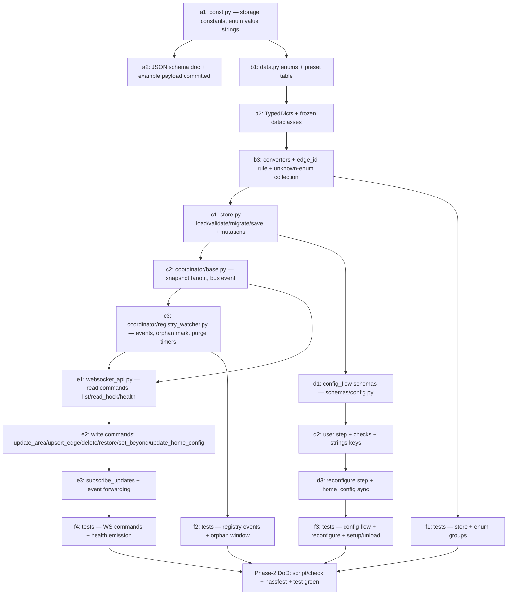

# Topology — Phase 1 + Phase 2 Implementation Plan

**Status:** Implementation plan (frozen artifacts per PLAN-topology.md §10,
gate "Before Phase 2") · Last updated 2026-07-23

**Scope:** Phase 1 (skeleton cleanup, compact delta) and Phase 2 (data
model, config flow, storage, WebSocket API). Nothing from Phase 3+ is
implemented here; later phases are referenced only where Phase 2 must
freeze an artifact for them.

**Binding inputs:** `PLAN-topology.md` (§1, §1a, §2, §5, §8, §10),
`DECISIONS.md` (ADRs "Manifest Declaration", "Coordinator Role",
"Entity Model", "Editing Surface", "Registry-Driven State"), `PLAN.md`
§9 (stability model), `AGENTS.md` (package rules, validation scripts).
Design decisions made _in this document_ that are not pre-decided there
are marked inline with **⚠️ derived here** + rationale, and listed again
in §9 (Open questions) where a reviewer should confirm them.

**Definition of done for Phase 2:** a developer implements Phase 2 from
this document alone in ~5 working days without going back to the design
plan; `script/check`, `script/hassfest`, and `script/test` green; every
artifact in §2–§7 implemented exactly as frozen here.

---

## 1. Phase 1 — Skeleton-cleanup delta

Basis: the actual current tree under `custom_components/topology/`
(blueprint boilerplate), not the abstract template. Freeze point
"Before Phase 1" (PLAN-topology.md §10) fixes the keep/delete package
list; entries below that go beyond that list are marked.

| Path                                                              | Action      | Reason                                                                                                                                                                                                            |
| ----------------------------------------------------------------- | ----------- | ----------------------------------------------------------------------------------------------------------------------------------------------------------------------------------------------------------------- |
| `manifest.json`                                                   | **rewrite** | `integration_type: helper`, `iot_class: calculated`, `single_config_entry: true`, `quality_scale: platinum`, `codeowners: ["@jpawlowski"]`, `after_dependencies: []`, `version` kept (ADR "Manifest Declaration") |
| `api/` (whole package)                                            | **delete**  | No external API; ADR "Coordinator Role" mandates deletion, not adaptation                                                                                                                                         |
| `fan/`, `switch/`, `number/`, `button/`                           | **delete**  | Example platforms; frozen delete list §10                                                                                                                                                                         |
| `select/`                                                         | **delete**  | ⚠️ derived here — not on §10's keep list and the frozen entity model (ADR "Entity Model") has no select entities; keeping it would be dead code                                                                   |
| `sensor/air_quality.py`, `sensor/diagnostic.py`                   | **delete**  | Example entities; `sensor/__init__.py` stays as an empty platform (returns no entities until Phase 3)                                                                                                             |
| `binary_sensor/connectivity.py`, `binary_sensor/filter.py`        | **delete**  | Same as above; `binary_sensor/__init__.py` stays empty until Phase 3                                                                                                                                              |
| `coordinator/data_processing.py`, `coordinator/error_handling.py` | **delete**  | Polling helpers; frozen delete list §10                                                                                                                                                                           |
| `coordinator/base.py`                                             | **reduce**  | Strip to a class skeleton `TopologyCoordinator` (event-fanout, `update_interval=None`, no `_async_update_data`); real body lands in Phase 2                                                                       |
| `coordinator/listeners.py`                                        | **delete**  | ⚠️ derived here — polling-callback utilities; Phase 2 re-creates a purpose-built `coordinator/registry_watcher.py` instead of bending this file                                                                   |
| `config_flow.py` (root shim)                                      | **keep**    | hassfest requires `config_flow.py` at package root; stays a re-export shim                                                                                                                                        |
| `config_flow_handler/config_flow.py`                              | **reduce**  | Strip to singleton `user` step stub; Phase 2 fills schema + checks                                                                                                                                                |
| `config_flow_handler/handler.py`                                  | **keep**    | Compat re-export wrapper, harmless                                                                                                                                                                                |
| `config_flow_handler/options_flow.py` + `schemas/options.py`      | **delete**  | ⚠️ derived here — the frozen editing-surface ADR defines config flow (user + reconfigure) and panel only; no options flow exists in the design                                                                    |
| `config_flow_handler/subentry_flow.py`                            | **delete**  | topology has no subentries (single entry, panel-edited data)                                                                                                                                                      |
| `config_flow_handler/validators/credentials.py`                   | **delete**  | No credentials (`reauthentication-flow: N/A`)                                                                                                                                                                     |
| `config_flow_handler/validators/sanitizers.py`                    | **delete**  | API-payload sanitizers; Phase 2 adds store/registry validators fresh                                                                                                                                              |
| `config_flow_handler/schemas/config.py`                           | **reduce**  | Emptied; Phase 2 defines the frozen schema (§5)                                                                                                                                                                   |
| `entity/base.py`                                                  | **reduce**  | Strip to `TopologyEntity(CoordinatorEntity)` skeleton; no API references                                                                                                                                          |
| `entity_utils/device_info.py`                                     | **delete**  | ⚠️ derived here — Quality-Scale mapping declares `devices: N/A` (§8); topology entities carry no device                                                                                                           |
| `entity_utils/state_helpers.py`                                   | **delete**  | API-format helpers; nothing to keep. Package `entity_utils/` itself stays (frozen keep list) with bare `__init__.py`                                                                                              |
| `service_actions/example_service.py`                              | **delete**  | Example; `service_actions/__init__.py` reduced to an empty `async_setup_services(hass)` that registers nothing until Phase 6                                                                                      |
| `services.yaml`                                                   | **empty**   | No service actions until Phase 6                                                                                                                                                                                  |
| `utils/validators.py`                                             | **delete**  | API-response validators                                                                                                                                                                                           |
| `utils/string_helpers.py`                                         | **delete**  | ⚠️ derived here — duplicate of `homeassistant.util.slugify`; consume, never rebuild. Package `utils/` stays with bare `__init__.py`                                                                               |
| `const.py`                                                        | **reduce**  | Keep `DOMAIN`, `LOGGER`; delete `ATTRIBUTION` + polling defaults; set `PARALLEL_UPDATES = 0` (frozen §10)                                                                                                         |
| `data.py`                                                         | **reduce**  | Drop `client`/`integration` fields; placeholder `TopologyRuntimeData` until Phase 2 freezes §6                                                                                                                    |
| `__init__.py`                                                     | **rewrite** | `PLATFORMS = [Platform.SENSOR, Platform.BINARY_SENSOR]`; no API client, no password/username imports; setup loads nothing yet beyond entry + empty platforms                                                      |
| `diagnostics.py`                                                  | **reduce**  | Stub returning `{}`; real export in Phase 6                                                                                                                                                                       |
| `repairs.py`                                                      | **reduce**  | Stub (no issues raised yet); Phase 2 adds the two store-related issue ids (§2.4)                                                                                                                                  |
| `translations/en.json`                                            | **reduce**  | Skeleton with `config` block only (keys per §5.3); example keys removed                                                                                                                                           |
| `tests/`                                                          | **keep**    | Currently only `.gitkeep`; Phase 2 adds the matrix in §7                                                                                                                                                          |

**Phase 1 DoD:** integration installs, a config entry sets up and unloads
cleanly with zero entities, `script/check` + `script/hassfest` green.

---

## 2. Store JSON schema v1

### 2.1 Constants

```python
# const.py
STORAGE_KEY = f"{DOMAIN}.storage"       # -> .storage/topology.storage
STORAGE_VERSION = 1                     # major, mirrored as schema_version in data
STORAGE_VERSION_MINOR = 1
ORPHAN_UNDO_WINDOW = timedelta(hours=72)   # ADR "Registry-Driven State"
UNANNOTATED_REPAIR_THRESHOLD = 3           # default per ADR; constant in v1
```

Persistence via `homeassistant.helpers.storage.Store[TopologyStoreData]`
(`private=False`, `atomic_writes=True`), writes debounced with
`async_delay_save`. Timestamps are UTC ISO 8601 strings produced by
`homeassistant.util.dt.utcnow().isoformat()`.

### 2.2 JSON Schema (draft 2020-12)

```json
{
  "$schema": "https://json-schema.org/draft/2020-12/schema",
  "$id": "https://github.com/jpawlowski/hass.topology/schemas/store-v1.json",
  "title": "topology store v1",
  "type": "object",
  "required": ["schema_version", "home_config", "areas", "edges"],
  "additionalProperties": false,
  "properties": {
    "schema_version": { "const": 1 },
    "home_config": {
      "type": "object",
      "required": ["occupancy_extent", "projection_toggles", "imports_done_at"],
      "additionalProperties": false,
      "properties": {
        "occupancy_extent": { "enum": ["whole_property", "unit_within_building"] },
        "projection_toggles": {
          "type": "object",
          "required": ["environment", "type", "trust"],
          "additionalProperties": false,
          "properties": {
            "environment": { "type": "boolean" },
            "type": { "type": "boolean" },
            "trust": { "type": "boolean" }
          }
        },
        "imports_done_at": {
          "type": "object",
          "additionalProperties": false,
          "properties": {
            "aliases": { "type": ["string", "null"], "format": "date-time" },
            "labels": { "type": ["string", "null"], "format": "date-time" }
          }
        }
      }
    },
    "areas": {
      "type": "object",
      "description": "Keyed by HA area_id (registry key; obligation §3.1)",
      "additionalProperties": { "$ref": "#/$defs/area_annotation" }
    },
    "edges": {
      "type": "object",
      "description": "Keyed by edge_id (see §2.3 id rule)",
      "additionalProperties": { "$ref": "#/$defs/edge" }
    }
  },
  "$defs": {
    "area_annotation": {
      "type": "object",
      "required": ["updated_at"],
      "additionalProperties": false,
      "properties": {
        "type": { "type": ["string", "null"] },
        "environment": { "enum": ["indoor", "outdoor", "semi_outdoor", null] },
        "trust": { "enum": ["private", "shared", "public", null] },
        "beyond": {
          "type": "object",
          "propertyNames": { "enum": ["N", "E", "S", "W"] },
          "additionalProperties": { "enum": ["outdoor", "neighbor", "earth"] }
        },
        "updated_at": { "type": "string", "format": "date-time" },
        "orphaned_at": { "type": "string", "format": "date-time" }
      }
    },
    "edge": {
      "type": "object",
      "required": ["area_a", "area_b", "connections", "created_at"],
      "additionalProperties": false,
      "properties": {
        "area_a": { "type": "string" },
        "area_b": {
          "type": ["string", "null"],
          "description": "null = exterior boundary edge: connections face outside the modeled home (window, outside door). See §2.3."
        },
        "connections": {
          "type": "array",
          "minItems": 1,
          "items": { "$ref": "#/$defs/connection" }
        },
        "created_at": { "type": "string", "format": "date-time" },
        "orphaned_at": { "type": "string", "format": "date-time" }
      }
    },
    "connection": {
      "type": "object",
      "required": ["passage", "barrier"],
      "additionalProperties": false,
      "properties": {
        "passage": { "enum": ["none", "level", "stairs", "ramp", "elevator", "ladder", "hatch"] },
        "barrier": { "enum": ["open", "door", "solid"] },
        "side": { "enum": ["N", "E", "S", "W"] },
        "sensor_entity_id": {
          "type": "string",
          "pattern": "^binary_sensor\\.[a-z0-9_]+$",
          "description": "Only valid when barrier == door"
        },
        "glazed": { "type": "boolean", "default": false },
        "preset_name": {
          "type": "string",
          "description": "UI provenance only; the two-axis form is authoritative (§1)"
        },
        "perimeter_override": {
          "type": "boolean",
          "description": "Force perimeter membership for same-trust boundaries (§1)"
        },
        "inline_trust": {
          "enum": ["private", "shared", "public"],
          "description": "Exterior-edge connections only: trust class beyond an unmodeled target (design §1: 'may carry an inline class'). Absent => public."
        }
      }
    }
  }
}
```

Notes on shape decisions:

- `schema_version` is stored in the payload _in addition to_ the
  `Store` version header — self-describing payloads make diagnostics
  dumps and manual restores unambiguous.
- `areas.*.orphaned_at`: an area annotation whose `area_id` vanished
  from the registry is orphaned exactly like an edge (same 72 h window),
  so a registry restore keeps the annotation.
- **Exterior connections** (`area_b: null`): the design (§1) requires
  windows / outside doors "attached to the one area" with an optional
  inline trust class, but the frozen root structure has only `areas` and
  `edges`. **⚠️ derived here** — exterior openings are stored as a
  single _boundary edge_ per area (`area_b: null`), all of the area's
  exterior connections in that edge's `connections` list, per-connection
  `side` + optional `inline_trust`. This keeps one collection for the
  perimeter derivation and adds no third top-level structure. The
  worked example (§2.5) depends on this (apartment door to an unmodeled
  `shared` stairwell).
- **Edge id rule** (deterministic, migration-safe): interior edge
  `edge_id = f"{min(a, b)}::{max(a, b)}"` (lexicographic; HA area ids
  never contain `:`), exterior boundary edge `edge_id = f"{area_id}::*"`.
  One edge per unordered area pair; one boundary edge per area — an
  edge is a _bundle_ of connections, so a second stair between the same
  two areas is a second connection, never a second edge. `upsert_edge`
  is therefore idempotent on the pair. **⚠️ derived here** — §10 froze
  that an edge id exists but not its form; deterministic ids remove a
  whole class of duplicate-edge bugs and need no uuid bookkeeping.

### 2.3 Migration hook

```python
async def async_migrate_store(
    hass: HomeAssistant,
    data: dict[str, Any],
    old_version: int,
) -> dict[str, Any]:
    """Migrate a stored payload to STORAGE_VERSION.

    Contract:
    - Called by TopologyStore._async_migrate_func for old_version < STORAGE_VERSION.
    - MUST return a NEW dict conforming to the current schema; MUST NOT
      mutate ``data`` (callers may retain the input for error reporting).
    - MUST be total for every version ever released (chain v1->v2->...).
    - Raises HomeAssistantError if the payload cannot be migrated;
      setup then fails (entities unavailable per Silver rule), the file
      is never overwritten with partial data.
    - Downgrades (old_version > STORAGE_VERSION) never reach this hook:
      the store wrapper raises before calling it and a repair issue
      ``store_future_version`` is created (see enum rule below).
    """
```

For v1 the hook is an identity `return dict(data)` — it exists so the
signature (and its tests) are frozen now.

### 2.4 Enum-versioning rule (v1 consumer meets v2 value)

Frozen policy (PLAN-topology.md §10 "Enum-versioning policy"):

1. **Reading:** converters (§6) parse enum fields leniently. A string
   not in the v1 catalog is kept verbatim in the store but surfaces as
   `null` on the dataclass / read hook (the same "null = unknown"
   discipline consumers already apply for unannotated areas, §1).
2. **Repair:** first occurrence per (scope, field, value) creates repair
   issue `unknown_enum_after_downgrade` (severity WARNING, not fixable,
   placeholders: field, value, count). Deleted automatically when the
   value disappears (upgrade or user edit).
3. **Round-trip safety:** saving the store never rewrites or drops the
   unknown raw value — an HA downgrade followed by an upgrade restores
   the newer annotation losslessly.
4. **Consumers** (Residents, Alarmo templates) validate against the
   documented v1 catalog and treat anything else as `null`; the health
   signal (§4.8) carries `unknown_enum_values` so consumers can degrade
   without re-deriving the check (§3.6 obligation).
5. `type` is exempt from (1): it is an **open catalog** (§1) — any
   string is a legal value, never "unknown". Only `environment`,
   `trust`, `passage`, `barrier`, `beyond`, `occupancy_extent`, `side`
   are closed enums.

### 2.5 Example payload — 3-room flat

Flat with hallway, living room, kitchen; hallway holds the apartment
door into an unmodeled `shared` stairwell; living room and kitchen each
have an exterior window; interior doors hallway↔living and
hallway↔kitchen, open passage living↔kitchen.

```json
{
  "schema_version": 1,
  "home_config": {
    "occupancy_extent": "unit_within_building",
    "projection_toggles": { "environment": false, "type": false, "trust": false },
    "imports_done_at": { "aliases": null, "labels": null }
  },
  "areas": {
    "flur": {
      "type": "hallway",
      "environment": "indoor",
      "trust": "private",
      "beyond": { "N": "neighbor" },
      "updated_at": "2026-07-23T10:00:00+00:00"
    },
    "wohnzimmer": {
      "type": "living",
      "environment": "indoor",
      "trust": "private",
      "beyond": { "S": "outdoor", "W": "outdoor" },
      "updated_at": "2026-07-23T10:01:00+00:00"
    },
    "kueche": {
      "type": "kitchen",
      "environment": "indoor",
      "trust": "private",
      "beyond": { "S": "outdoor" },
      "updated_at": "2026-07-23T10:02:00+00:00"
    }
  },
  "edges": {
    "flur::wohnzimmer": {
      "area_a": "flur",
      "area_b": "wohnzimmer",
      "connections": [{ "passage": "level", "barrier": "door", "preset_name": "interior_door" }],
      "created_at": "2026-07-23T10:05:00+00:00"
    },
    "flur::kueche": {
      "area_a": "flur",
      "area_b": "kueche",
      "connections": [{ "passage": "level", "barrier": "door", "preset_name": "interior_door" }],
      "created_at": "2026-07-23T10:05:30+00:00"
    },
    "kueche::wohnzimmer": {
      "area_a": "kueche",
      "area_b": "wohnzimmer",
      "connections": [{ "passage": "level", "barrier": "open", "preset_name": "open_passage" }],
      "created_at": "2026-07-23T10:06:00+00:00"
    },
    "flur::*": {
      "area_a": "flur",
      "area_b": null,
      "connections": [
        {
          "passage": "level",
          "barrier": "door",
          "side": "N",
          "sensor_entity_id": "binary_sensor.wohnungstuer_contact",
          "preset_name": "outside_door",
          "inline_trust": "shared"
        }
      ],
      "created_at": "2026-07-23T10:07:00+00:00"
    },
    "wohnzimmer::*": {
      "area_a": "wohnzimmer",
      "area_b": null,
      "connections": [
        {
          "passage": "none",
          "barrier": "door",
          "side": "S",
          "glazed": true,
          "sensor_entity_id": "binary_sensor.wohnzimmer_fenster_contact",
          "preset_name": "window"
        }
      ],
      "created_at": "2026-07-23T10:08:00+00:00"
    },
    "kueche::*": {
      "area_a": "kueche",
      "area_b": null,
      "connections": [
        {
          "passage": "none",
          "barrier": "door",
          "side": "S",
          "glazed": true,
          "preset_name": "window"
        }
      ],
      "created_at": "2026-07-23T10:09:00+00:00"
    }
  }
}
```

Semantics check against the design: the apartment door is a perimeter
connection (trust delta `private` ↔ inline `shared`); both windows are
perimeter (`private` ↔ implicit `public` beyond); the interior doors are
not. The hallway's `beyond.N: neighbor` marks the party wall around the
door; window placement on `S`/`W` sides is legal because those sides are
`beyond: outdoor`.

---

## 3. Enum catalog v1

All enums are Python `StrEnum` in `data.py` (§6); values below are the
frozen wire/store strings. Order shown is definition order.

### 3.1 `type` — area type (open catalog with defaults, §1)

Open catalog: any string is legal; the eleven values below are the
shipped defaults with UI presence. Not a closed enum (§2.4 rule 5).

| Value      | Meaning                                                     |
| ---------- | ----------------------------------------------------------- |
| `bedroom`  | A room whose primary use is sleeping.                       |
| `living`   | General shared living space (lounge, family room).          |
| `kitchen`  | Food preparation space.                                     |
| `dining`   | Eating space (may seed `dining_place` in Residents).        |
| `bathroom` | Bath / shower / WC space.                                   |
| `hallway`  | Circulation space connecting other areas.                   |
| `office`   | Work / study space.                                         |
| `utility`  | Laundry, boiler, technical room.                            |
| `storage`  | Pantry, closet room, attic used for storage.                |
| `garage`   | Vehicle storage, possibly multi-floor.                      |
| `outdoor`  | An outside area (garden, yard, terrace) modeled as an area. |

**Type-cascade defaults** (picking a type pre-fills the other two fields,
both stay editable; §1). Only the three cascades in bold are stated in
the design plan; the rest are **⚠️ derived here** by the same logic
(interior room ⇒ indoor, exclusively-yours default ⇒ private; trust
"stays individual", so the cascade never locks it):

| type                                                                      | environment default | trust default                         |
| ------------------------------------------------------------------------- | ------------------- | ------------------------------------- |
| **`bedroom`**                                                             | indoor              | private                               |
| **`hallway`**                                                             | indoor              | shared                                |
| **`outdoor`**                                                             | outdoor             | — (unset; §1: trust stays individual) |
| `living`, `kitchen`, `dining`, `bathroom`, `office`, `utility`, `storage` | indoor              | private                               |
| `garage`                                                                  | indoor              | private                               |

### 3.2 `environment`

| Value          | Meaning                                            |
| -------------- | -------------------------------------------------- |
| `indoor`       | Fully enclosed interior space.                     |
| `outdoor`      | Open-air space (garden, yard, uncovered terrace).  |
| `semi_outdoor` | Covered but not enclosed (covered balcony, porch). |

Unannotated = `null` on the read hook — never a silent `indoor` (§1).

### 3.3 `trust` (ordered: `private` < `shared` < `public`)

| Value     | Meaning                                                      |
| --------- | ------------------------------------------------------------ |
| `private` | Exclusively yours — rooms, a fenced back garden.             |
| `shared`  | Limited / communal access — building hallway, shared garden. |
| `public`  | Exposed to strangers — street, open front yard.              |

The ordering is machine-evaluable (perimeter = trust delta ≠ 0, §1).

### 3.4 `passage`

| Value      | Meaning                                         |
| ---------- | ----------------------------------------------- |
| `none`     | Adjacent but not traversable by a person.       |
| `level`    | Walkable crossing on the same floor.            |
| `stairs`   | Stair crossing (vertical).                      |
| `ramp`     | Ramp — wheelchair / vehicle capable, step-free. |
| `elevator` | Lift cabin crossing.                            |
| `ladder`   | Ladder crossing (loft ladder).                  |
| `hatch`    | Crawl-/climb-through opening without a ladder.  |

### 3.5 `barrier`

| Value   | Meaning                                                       |
| ------- | ------------------------------------------------------------- |
| `open`  | No barrier — open doorway, open stairwell / atrium void.      |
| `door`  | Closable, state-dependent (leaf mechanism not distinguished). |
| `solid` | Wall or floor/ceiling slab.                                   |

### 3.6 `side` (cardinal bearing)

| Value                 | Meaning                                                        |
| --------------------- | -------------------------------------------------------------- |
| `N` / `E` / `S` / `W` | Rough side only, never geometry; opposite sides pair N↔S, E↔W. |

### 3.7 `beyond`

| Value      | Meaning                                                  |
| ---------- | -------------------------------------------------------- |
| `outdoor`  | Open air — the only side an exterior opening may sit on. |
| `neighbor` | Party wall to a foreign occupied unit not modeled here.  |
| `earth`    | Buried wall (cellar against soil) — no window possible.  |

### 3.8 `occupancy_extent`

| Value                  | Meaning                                                                             |
| ---------------------- | ----------------------------------------------------------------------------------- |
| `whole_property`       | All areas together are a standalone home; unmodeled outer walls default `outdoor`.  |
| `unit_within_building` | A unit inside a larger structure; unmodeled outer walls default `neighbor`/unknown. |

### 3.9 Connection-preset table

Presets are UI convenience that expand into the two-axis form (§1); the
stored model stays `passage` + `barrier` (+ `glazed`). "sensor allowed"
follows the rule _sensor only meaningful for `barrier: door`_ (§1).

| `preset_name`    | passage    | barrier | glazed default | sensor allowed |
| ---------------- | ---------- | ------- | -------------- | -------------- |
| `interior_door`  | `level`    | `door`  | false          | yes            |
| `open_passage`   | `level`    | `open`  | false          | no             |
| `shared_wall`    | `none`     | `solid` | false          | no             |
| `open_stair`     | `stairs`   | `open`  | false          | no             |
| `enclosed_stair` | `stairs`   | `door`  | false          | yes            |
| `lift`           | `elevator` | `door`  | false          | yes            |
| `loft_ladder`    | `ladder`   | `door`  | false          | yes            |
| `ramp`           | `ramp`     | `open`  | false          | no             |
| `window`         | `none`     | `door`  | **true**       | yes            |
| `outside_door`   | `level`    | `door`  | false          | yes            |

Rare combinations (glass observation lift = `elevator` + `open`) remain
settable by hand without a preset (§1). `preset_name` is stored only as
provenance; validation never trusts it over the axes.

---

## 4. WebSocket API contract v1

Frozen as the internal analog of `PLAN.md` §9 public-interface
commitments: changing any command name, payload field, response field,
or error code after Phase 2 costs a deprecation window.

**Registration:** all commands are registered once in `async_setup()`
via `websocket_api.async_register_command(hass, handler)` (verified
signature, Appendix A.5). Handlers resolve the singleton config entry at
call time; if no entry is loaded they fail with `not_loaded` (below).

**Auth model:** all reads require an authenticated connection (any
user) — the WS layer enforces authentication for every registered
command; consumers like Residents call with their own connection. All
writes additionally require `@require_admin` (ADR "Editing Surface").
No public/unauthenticated command exists.

**Common error codes** (sent via `connection.send_error`): the standard
`websocket_api` codes `invalid_format` (vol schema rejection — raised by
the WS layer itself), `unauthorized` (admin gate), `unknown_error`; plus
these domain codes, frozen here:

| Code                 | Raised when                                                                                                                                                                         |
| -------------------- | ----------------------------------------------------------------------------------------------------------------------------------------------------------------------------------- |
| `not_loaded`         | No topology config entry is set up (store unavailable).                                                                                                                             |
| `area_not_found`     | An `area_id` payload value is not in the HA area registry.                                                                                                                          |
| `edge_not_found`     | `edge_id` not present in the store.                                                                                                                                                 |
| `invalid_enum`       | A closed-enum field value is outside the v1 catalog (§3).                                                                                                                           |
| `invalid_connection` | Connection-level semantic violation: `sensor_entity_id` with `barrier != door`, `sensor_entity_id` not a `binary_sensor.*`, `inline_trust` on an interior edge, `area_a == area_b`. |
| `store_error`        | Persisting the mutation failed (I/O).                                                                                                                                               |

Shared payload fragments (JSON Schema):

```json
{
  "$defs": {
    "connection_in": { "$ref": "store-v1.json#/$defs/connection" },
    "area_out": {
      "type": "object",
      "properties": {
        "area_id": { "type": "string" },
        "type": { "type": ["string", "null"] },
        "environment": { "enum": ["indoor", "outdoor", "semi_outdoor", null] },
        "trust": { "enum": ["private", "shared", "public", null] },
        "beyond": { "type": "object" },
        "orphaned_at": { "type": ["string", "null"] },
        "updated_at": { "type": "string" }
      }
    },
    "edge_out": {
      "type": "object",
      "properties": {
        "edge_id": { "type": "string" },
        "area_a": { "type": "string" },
        "area_b": { "type": ["string", "null"] },
        "axis": {
          "enum": ["horizontal", "vertical", "unknown"],
          "description": "Derived from the two areas' floor levels; never stored (§1). unknown when a floor level is unset or the edge is exterior."
        },
        "is_perimeter": {
          "type": "boolean",
          "description": "Derived: trust delta != 0 or any connection.perimeter_override (§1)."
        },
        "connections": { "type": "array", "items": { "$ref": "#/$defs/connection_in" } },
        "orphaned_at": { "type": ["string", "null"] },
        "created_at": { "type": "string" }
      }
    }
  }
}
```

Enum downgrade rule on every response: unknown stored values surface as
`null` (§2.4); the raw value appears only in `health.unknown_enum_values`.

### 4.1 `topology/list_annotations` — read, authenticated

The panel's snapshot. Areas include **every** registry area (annotated
or not) so the panel needs no second merge step; names/icons come from
the frontend's own registry subscription, not from topology.

- Payload: `{ "type": "topology/list_annotations" }` (no further fields)
- Response:

```json
{
  "home_config": { "occupancy_extent": "...", "projection_toggles": {...}, "imports_done_at": {...} },
  "areas": [ { "$ref": "#/$defs/area_out" } ],
  "edges": [ { "$ref": "#/$defs/edge_out" } ],
  "presets": [ { "preset_name": "...", "passage": "...", "barrier": "...", "glazed_default": false, "sensor_allowed": true } ]
}
```

- Errors: `not_loaded`.
- `presets` ships the §3.9 table so the panel never hardcodes it.

### 4.2 `topology/update_area` — write, `@require_admin`

- Payload:

```json
{
  "type": "topology/update_area",
  "area_id": { "type": "string" },
  "annotation": {
    "type": "object",
    "properties": {
      "type": { "type": ["string", "null"] },
      "environment": { "enum": ["indoor", "outdoor", "semi_outdoor", null] },
      "trust": { "enum": ["private", "shared", "public", null] }
    },
    "additionalProperties": false
  }
}
```

Partial update: only provided keys change; explicit `null` clears a
field. `beyond` is **not** editable here — `set_beyond` owns it.

- Response: the updated `area_out` object.
- Errors: `not_loaded`, `area_not_found`, `invalid_enum`, `store_error`.

### 4.3 `topology/upsert_edge` — write, `@require_admin`

- Payload:

```json
{
  "type": "topology/upsert_edge",
  "area_a": { "type": "string" },
  "area_b": { "type": ["string", "null"] },
  "connections": { "type": "array", "minItems": 1, "items": { "$ref": "#/$defs/connection_in" } }
}
```

Semantics: the edge id is computed from the pair (§2.2 id rule); the
`connections` list **replaces** the stored list atomically (the panel
always edits the full bundle — no per-connection ids needed). Upserting
an orphaned edge clears `orphaned_at` (explicit user edit = restore).

- Response: the resulting `edge_out`.
- Errors: `not_loaded`, `area_not_found` (either side), `invalid_enum`,
  `invalid_connection`, `store_error`.

### 4.4 `topology/delete_edge` — write, `@require_admin`

- Payload: `{ "type": "topology/delete_edge", "edge_id": { "type": "string" } }`
- Response: `{ "deleted": true }`
- Errors: `not_loaded`, `edge_not_found`, `store_error`.
- Deletion by an admin is immediate (no orphan window — that window is
  only for _registry-driven_ deletions, ADR "Registry-Driven State").

### 4.5 `topology/restore_edge` — write, `@require_admin`

**⚠️ derived here** — the orphan-undo window (ADR) needs a "restore"
entry point for the repair fix-flow / panel; nothing else in the design
provides one for edges whose area came back (registry restore).

- Payload: `{ "type": "topology/restore_edge", "edge_id": { "type": "string" } }`
- Response: the restored `edge_out` (`orphaned_at` cleared).
- Errors: `not_loaded`, `edge_not_found`, `area_not_found` (a referenced
  area is still missing from the registry — cannot restore), `store_error`.

### 4.6 `topology/set_beyond` — write, `@require_admin`

- Payload:

```json
{
  "type": "topology/set_beyond",
  "area_id": { "type": "string" },
  "side": { "enum": ["N", "E", "S", "W"] },
  "beyond": { "enum": ["outdoor", "neighbor", "earth", null] }
}
```

`null` clears the side.

- Response: the updated `area_out`.
- Errors: `not_loaded`, `area_not_found`, `invalid_enum`, `store_error`.

### 4.7 `topology/update_home_config` — write, `@require_admin`

**⚠️ derived here** — `occupancy_extent` and the projection toggles are
config-flow fields, but the panel (primary editing surface, ADR) must
not force users into the reconfigure flow for the one home-level enum
shown on the map. The command mirrors the reconfigure flow exactly; both
write the same store fields and reload nothing.

- Payload: `{ "type": "topology/update_home_config", "occupancy_extent"?: enum, "projection_toggles"?: {...} }`
- Response: the updated `home_config` object.
- Errors: `not_loaded`, `invalid_enum`, `store_error`.

### 4.8 `topology/read_hook` — read, authenticated (consumer contract)

The single command Residents / Alarmo / blueprints consume (§2, §3.5).
Versioned envelope; `api_version` bumps only with a deprecation window.

- Payload: `{ "type": "topology/read_hook" }`
- Response:

```json
{
  "api_version": 1,
  "home": {
    "occupancy_extent": "whole_property | unit_within_building",
    "floors": [{ "floor_id": "...", "level": 0 }]
  },
  "areas": [{ "$ref": "#/$defs/area_out" }],
  "edges": [{ "$ref": "#/$defs/edge_out" }],
  "perimeter": [
    {
      "edge_id": "...",
      "area_a": "...",
      "area_b": null,
      "connection_index": 0,
      "sensor_entity_id": "binary_sensor.x | null"
    }
  ],
  "health": { "$ref": "#/$defs/health" }
}
```

Notes:

- `home.floors` relays the floor registry's `floor_id` + `level`
  (consume, never rebuild — no topology copy is stored). Consumers get
  vertical ordering without a second registry fetch.
- `perimeter` is the derived perimeter-connection list (trust delta or
  `perimeter_override`, §1) — the Alarmo drop-in (§9 of the design
  plan). Orphaned edges are excluded from `perimeter` but present in
  `edges` (flagged via `orphaned_at`) so consumers can distinguish.
- Areas with no annotation appear with all-null fields — `null` means
  "unknown", never a default (§1).
- Errors: `not_loaded`.

### 4.9 `topology/health` — read, authenticated

The cheap consistency/health signal (§3.6 obligation) without the full
graph payload. Response = the `health` object alone.

**Frozen `health` shape** (§10 "Consistency / health signal shape"):

```json
{
  "$defs": {
    "health": {
      "type": "object",
      "required": [
        "status",
        "area_count",
        "annotated_count",
        "unannotated_areas",
        "orphaned_edges",
        "orphaned_areas",
        "unknown_enum_values",
        "isolated_areas",
        "indoor_areas_without_floor",
        "contradictory_bearings",
        "exterior_on_non_outdoor_side"
      ],
      "properties": {
        "status": { "enum": ["ok", "warning"] },
        "area_count": { "type": "integer" },
        "annotated_count": { "type": "integer" },
        "unannotated_areas": { "type": "array", "items": { "type": "string" } },
        "orphaned_edges": { "type": "array", "items": { "type": "string" } },
        "orphaned_areas": { "type": "array", "items": { "type": "string" } },
        "unknown_enum_values": {
          "type": "array",
          "items": {
            "type": "object",
            "properties": {
              "scope": { "enum": ["area", "edge", "home_config"] },
              "id": { "type": "string" },
              "field": { "type": "string" },
              "value": { "type": "string" }
            }
          }
        },
        "isolated_areas": { "type": "array", "items": { "type": "string" } },
        "indoor_areas_without_floor": { "type": "array", "items": { "type": "string" } },
        "contradictory_bearings": { "type": "array", "items": { "type": "string" } },
        "exterior_on_non_outdoor_side": { "type": "array", "items": { "type": "string" } }
      }
    }
  }
}
```

`status` is `warning` iff any list is non-empty. **Phase-2 emission
scope:** `area_count`, `annotated_count`, `unannotated_areas`,
`orphaned_edges`, `orphaned_areas`, `unknown_enum_values` are computed
in Phase 2; the four graph-consistency lists (`isolated_areas`,
`indoor_areas_without_floor`, `contradictory_bearings`,
`exterior_on_non_outdoor_side`) are **present but empty** until Phase 4
implements the checks (§7 of the design plan). The shape is frozen now
so consumers never see a field appear later.

### 4.10 `topology/subscribe_updates` — read, authenticated, subscription

- Payload: `{ "type": "topology/subscribe_updates" }`
- On success: `send_result(msg_id)`; an unsubscribe callback is stored
  in `connection.subscriptions[msg["id"]]` (standard pattern, Appendix
  A.5). Every subsequent change pushes via `send_event(msg_id, event)`:

```json
{
  "change": "area | edge | beyond | home_config | orphan | purge",
  "ids": ["<area_id or edge_id>", "..."]
}
```

Consumers re-fetch via `read_hook` on event — events carry ids, never
payload deltas (keeps the contract small; snapshot reads are cheap).

### 4.11 Bus event (in-process consumers + automations)

In addition to the WS subscription, the coordinator fires a bus event on
every store mutation and registry-driven change:

- **Event name:** `topology_updated` (constant `EVENT_TOPOLOGY_UPDATED`)
- **Payload:** identical to the §4.10 event object.

This is what Residents listens to in-process (no WS round-trip needed)
and what the §10 freeze point calls "change-notification event names".

---

## 5. Config-flow step definition

`config_flow_handler/config_flow.py`; `ConfigFlow` with `VERSION = 1`,
`MINOR_VERSION = 1` (inherited attrs, Appendix A.4). Manifest has
`single_config_entry: true`, so Core aborts a second flow with
`single_instance_allowed` before our code runs (verified enforcement,
Appendix A.4) — no manual `_async_current_entries()` check.

**`unique_id`:** constant `CONFIG_ENTRY_UNIQUE_ID = DOMAIN` (`"topology"`),
set via `await self.async_set_unique_id(DOMAIN)` +
`self._abort_if_unique_id_configured()` in `async_step_user` as
belt-and-braces beneath the manifest flag (the registry is a singleton;
there is no device-derived id).

**Entry data vs. store:** `entry.data` holds exactly the flow fields
below; `async_setup_entry` syncs them into `home_config` in the store
(store is what the read hook serves; entry data is the flow's state).
Import flags are **not** persisted in `entry.data` — they are one-shot
actions executed during the first setup after the flow, recorded in
`imports_done_at` (§2.2). Import _execution_ is Phase 6 scope
(`topology.import_from_core`); in Phase 2 the flags are collected,
stored as pending in `home_config` — **⚠️ derived here:** Phase 2 stores
the user's opt-in but performs no import; the checkbox text says the
import runs once import support lands. This keeps the flow field set
frozen without pulling Phase-6 logic forward.

### 5.1 Step `user`

```yaml
# vol schema (shown as YAML for readability; implemented in
# config_flow_handler/schemas/config.py)
user:
  occupancy_extent: # SelectSelector, mode dropdown, translation_key: occupancy_extent
    required: true
    default: whole_property
    options: [whole_property, unit_within_building]
  import_aliases: # BooleanSelector
    required: false
    default: false
  import_labels: # BooleanSelector
    required: false
    default: false
  project_environment: # BooleanSelector
    required: false
    default: false
  project_type: # BooleanSelector
    required: false
    default: false
  project_trust: # BooleanSelector
    required: false
    default: false
```

**⚠️ derived here** — the design says "label-projection toggle"
(singular) but the frozen store shape has three `projection_toggles`;
the flow exposes all three so flow and store stay isomorphic. Collapse
to one toggle = open question §9.

**test-before-configure** (runs on submit, before `async_create_entry`):

| Check                                                                                                                                    | Failure surface                                                     |
| ---------------------------------------------------------------------------------------------------------------------------------------- | ------------------------------------------------------------------- |
| Area registry accessible: `area_registry.async_get(hass)` returns and iterating `async_list_areas()` does not raise                      | form error `base: area_registry_unavailable`                        |
| Store readable: `Store(hass, STORAGE_VERSION, STORAGE_KEY).async_load()` completes (returns `None` for fresh installs — that is success) | form error `base: store_corrupt` on `HomeAssistantError`/JSON error |
| Version known: loaded payload's version ≤ `STORAGE_VERSION`                                                                              | abort `store_future_version` (a form retry cannot fix a downgrade)  |

### 5.2 Step `reconfigure`

Same schema as `user` minus the two one-shot import flags (an import
that already ran must not silently re-run; re-import stays a Phase-6
service call), pre-filled from the current entry via
`self._get_reconfigure_entry()`; finishes with
`self.async_update_reload_and_abort(entry, data_updates=...)`
(signatures verified, Appendix A.4). The same three checks from §5.1 run
again (test-before-configure applies to reconfigure too).

### 5.3 `strings.json` keys (keys only, en.json fills later)

```text
config.step.user.title
config.step.user.description
config.step.user.data.occupancy_extent
config.step.user.data_description.occupancy_extent
config.step.user.data.import_aliases
config.step.user.data_description.import_aliases
config.step.user.data.import_labels
config.step.user.data_description.import_labels
config.step.user.data.project_environment
config.step.user.data.project_type
config.step.user.data.project_trust
config.step.reconfigure.title
config.step.reconfigure.description
config.step.reconfigure.data.*            (same field keys as user)
config.error.area_registry_unavailable
config.error.store_corrupt
config.abort.store_future_version
config.abort.reconfigure_successful
selector.occupancy_extent.options.whole_property
selector.occupancy_extent.options.unit_within_building
issues.store_future_version.title
issues.store_future_version.description
issues.unknown_enum_after_downgrade.title
issues.unknown_enum_after_downgrade.description
```

(`single_instance_allowed` abort text comes from Core's homeassistant
domain — no key needed.)

**test-before-setup** (`async_setup_entry`): the same three checks;
transient I/O failure (OSError) raises `ConfigEntryNotReady`
(auto-retry); corrupt JSON raises `ConfigEntryError` (not transient, no
retry loop, file left untouched); future store version raises
`ConfigEntryError` + repair issue `store_future_version` (severity
ERROR, not fixable, `learn_more_url` to the docs' downgrade section).

---

## 6. `runtime_data` + dataclass signatures (`data.py`)

Signatures only; bodies land in Phase 2 implementation. Store-shape
TypedDicts mirror §2.2 exactly; frozen dataclasses are the in-memory
model the read hook and entities consume.

```python
"""Typed runtime data and domain model for topology."""

from __future__ import annotations

from dataclasses import dataclass
from enum import StrEnum
from typing import TYPE_CHECKING, NotRequired, TypedDict

if TYPE_CHECKING:
    from homeassistant.config_entries import ConfigEntry
    from .coordinator import TopologyCoordinator
    from .store import TopologyStore   # custom_components/topology/store.py


type TopologyConfigEntry = ConfigEntry[TopologyRuntimeData]


# --- enums (frozen catalog, §3) --------------------------------------

class Environment(StrEnum):
    INDOOR = "indoor"
    OUTDOOR = "outdoor"
    SEMI_OUTDOOR = "semi_outdoor"

class Trust(StrEnum):          # ordered private < shared < public
    PRIVATE = "private"
    SHARED = "shared"
    PUBLIC = "public"

TRUST_ORDER: dict[Trust, int] = {Trust.PRIVATE: 0, Trust.SHARED: 1, Trust.PUBLIC: 2}

class Passage(StrEnum):
    NONE = "none"
    LEVEL = "level"
    STAIRS = "stairs"
    RAMP = "ramp"
    ELEVATOR = "elevator"
    LADDER = "ladder"
    HATCH = "hatch"

class Barrier(StrEnum):
    OPEN = "open"
    DOOR = "door"
    SOLID = "solid"

class CardinalSide(StrEnum):
    N = "N"
    E = "E"
    S = "S"
    W = "W"

class BeyondClass(StrEnum):
    OUTDOOR = "outdoor"
    NEIGHBOR = "neighbor"
    EARTH = "earth"

class OccupancyExtent(StrEnum):
    WHOLE_PROPERTY = "whole_property"
    UNIT_WITHIN_BUILDING = "unit_within_building"

AREA_TYPE_CATALOG: tuple[str, ...] = (
    "bedroom", "living", "kitchen", "dining", "bathroom", "hallway",
    "office", "utility", "storage", "garage", "outdoor",
)
# type-cascade defaults, §3.1  (None = no default)
TYPE_CASCADE: dict[str, tuple[Environment | None, Trust | None]]

class ConnectionPreset(StrEnum):
    INTERIOR_DOOR = "interior_door"
    OPEN_PASSAGE = "open_passage"
    SHARED_WALL = "shared_wall"
    OPEN_STAIR = "open_stair"
    ENCLOSED_STAIR = "enclosed_stair"
    LIFT = "lift"
    LOFT_LADDER = "loft_ladder"
    RAMP = "ramp"
    WINDOW = "window"
    OUTSIDE_DOOR = "outside_door"

@dataclass(frozen=True, kw_only=True, slots=True)
class PresetDefinition:
    preset: ConnectionPreset
    passage: Passage
    barrier: Barrier
    glazed_default: bool
    sensor_allowed: bool

CONNECTION_PRESETS: dict[ConnectionPreset, PresetDefinition]   # §3.9 table


# --- store-shape TypedDicts (wire format, §2.2) ----------------------

class ConnectionDict(TypedDict):
    passage: str
    barrier: str
    side: NotRequired[str]
    sensor_entity_id: NotRequired[str]
    glazed: NotRequired[bool]
    preset_name: NotRequired[str]
    perimeter_override: NotRequired[bool]
    inline_trust: NotRequired[str]

class EdgeDict(TypedDict):
    area_a: str
    area_b: str | None
    connections: list[ConnectionDict]
    created_at: str
    orphaned_at: NotRequired[str]

class AreaAnnotationDict(TypedDict):
    type: NotRequired[str | None]
    environment: NotRequired[str | None]
    trust: NotRequired[str | None]
    beyond: NotRequired[dict[str, str]]
    updated_at: str
    orphaned_at: NotRequired[str]

class ProjectionTogglesDict(TypedDict):
    environment: bool
    type: bool
    trust: bool

class ImportsDoneAtDict(TypedDict):
    aliases: str | None
    labels: str | None

class HomeConfigDict(TypedDict):
    occupancy_extent: str
    projection_toggles: ProjectionTogglesDict
    imports_done_at: ImportsDoneAtDict

class TopologyStoreData(TypedDict):
    schema_version: int
    home_config: HomeConfigDict
    areas: dict[str, AreaAnnotationDict]
    edges: dict[str, EdgeDict]


# --- frozen domain dataclasses (in-memory model) ---------------------

@dataclass(frozen=True, kw_only=True, slots=True)
class Connection:
    passage: Passage
    barrier: Barrier
    side: CardinalSide | None = None
    sensor_entity_id: str | None = None
    glazed: bool = False
    preset_name: str | None = None
    perimeter_override: bool = False
    inline_trust: Trust | None = None      # exterior edges only

@dataclass(frozen=True, kw_only=True, slots=True)
class Edge:
    edge_id: str
    area_a: str
    area_b: str | None                      # None = exterior boundary edge
    connections: tuple[Connection, ...]
    created_at: str                         # ISO 8601 UTC
    orphaned_at: str | None = None

    @property
    def is_exterior(self) -> bool: ...

@dataclass(frozen=True, kw_only=True, slots=True)
class AreaAnnotation:
    area_id: str
    type: str | None = None                 # open catalog — plain str
    environment: Environment | None = None
    trust: Trust | None = None
    beyond: tuple[tuple[CardinalSide, BeyondClass], ...] = ()
    updated_at: str = ""
    orphaned_at: str | None = None

@dataclass(frozen=True, kw_only=True, slots=True)
class HomeConfig:
    occupancy_extent: OccupancyExtent = OccupancyExtent.WHOLE_PROPERTY
    project_environment: bool = False
    project_type: bool = False
    project_trust: bool = False
    imports_done_at_aliases: str | None = None
    imports_done_at_labels: str | None = None

@dataclass(frozen=True, kw_only=True, slots=True)
class UnknownEnumValue:
    scope: str          # "area" | "edge" | "home_config"
    id: str
    field_name: str
    value: str

@dataclass(frozen=True, kw_only=True, slots=True)
class TopologySnapshot:
    """Immutable view of the store served by coordinator + read hook."""
    home_config: HomeConfig
    areas: tuple[AreaAnnotation, ...]
    edges: tuple[Edge, ...]
    unknown_enum_values: tuple[UnknownEnumValue, ...]

@dataclass(frozen=True, kw_only=True, slots=True)
class TopologyRuntimeData:
    store: TopologyStore
    coordinator: TopologyCoordinator


# --- converters store-dict <-> dataclass -----------------------------
# from_dict converters are LENIENT on closed enums (§2.4): unknown values
# become None and are collected into the returned UnknownEnumValue list.
# to_dict converters are STRICT and lossless: fields the dataclass holds
# as None because of an unknown raw value are re-emitted from the raw
# dict (round-trip safety, §2.4 rule 3) — hence the raw parameter.

def connection_from_dict(raw: ConnectionDict) -> tuple[Connection, list[UnknownEnumValue]]: ...
def connection_to_dict(connection: Connection, raw: ConnectionDict | None = None) -> ConnectionDict: ...
def edge_from_dict(edge_id: str, raw: EdgeDict) -> tuple[Edge, list[UnknownEnumValue]]: ...
def edge_to_dict(edge: Edge, raw: EdgeDict | None = None) -> EdgeDict: ...
def area_annotation_from_dict(area_id: str, raw: AreaAnnotationDict) -> tuple[AreaAnnotation, list[UnknownEnumValue]]: ...
def area_annotation_to_dict(annotation: AreaAnnotation, raw: AreaAnnotationDict | None = None) -> AreaAnnotationDict: ...
def home_config_from_dict(raw: HomeConfigDict) -> tuple[HomeConfig, list[UnknownEnumValue]]: ...
def home_config_to_dict(config: HomeConfig, raw: HomeConfigDict | None = None) -> HomeConfigDict: ...
def snapshot_from_store(data: TopologyStoreData) -> TopologySnapshot: ...
def edge_id_for(area_a: str, area_b: str | None) -> str: ...   # §2.2 id rule
```

Supporting modules created in Phase 2 (inside frozen packages):

- `store.py` (integration root, sibling of `data.py`): `TopologyStore`
  wrapping `Store[TopologyStoreData]` — load/validate/migrate, debounced
  save, mutation methods (`async_update_area`, `async_upsert_edge`, …)
  that return the new `TopologySnapshot`. **⚠️ derived here** — a root
  module (like `data.py`/`diagnostics.py`) rather than a new package;
  AGENTS.md forbids new top-level _packages_, root modules follow the
  blueprint's own precedent.
- `coordinator/base.py`: `TopologyCoordinator(DataUpdateCoordinator[TopologySnapshot])`
  with `update_interval=None`, no `_async_update_data`; exposes
  `async_apply_mutation(...)` that persists via the store, refreshes the
  snapshot with `async_set_updated_data`, fires `topology_updated`.
- `coordinator/registry_watcher.py`: subscribes to
  `EVENT_AREA_REGISTRY_UPDATED` / `EVENT_FLOOR_REGISTRY_UPDATED`
  (constants + payload shapes verified, Appendix A.2/A.3); implements
  the ADR reactions (orphan on remove, fanout on update/create) and the
  startup + daily orphan purge (`async_track_time_interval`).
- `websocket_api.py` (integration root): command handlers §4.
  **⚠️ derived here** — same root-module reasoning as `store.py`; the
  filename mirrors Core convention for WS command modules.

---

## 7. Test matrix (Phase 2)

Shared fixtures (in `tests/conftest.py`): `hass` (HA test instance),
`mock_config_entry` (singleton entry, `entry.data` per §5.1 defaults),
`setup_integration` (entry set up incl. store), `store_payload_full`
(the §2.5 example), `hass_ws_client` + `hass_admin_user` /
`hass_read_only_user` (WS auth), `area_registry` / `floor_registry`
(populated: flur/wohnzimmer/kueche + one floor level 0), `freezer`
(freezegun for the 72 h window).

### Store persistence + migration

| ID                                      | Purpose                                                                                                       | Fixtures                         |
| --------------------------------------- | ------------------------------------------------------------------------------------------------------------- | -------------------------------- |
| `test_store_v1_roundtrip_empty`         | Fresh install: load returns defaults, save/load round-trips the empty structure.                              | hass                             |
| `test_store_v1_roundtrip_full`          | §2.5 payload survives load → snapshot → save byte-identically (key order aside).                              | hass, store_payload_full         |
| `test_store_load_missing_file`          | No store file → default payload, no error, no repair issue.                                                   | hass                             |
| `test_store_corrupt_json`               | Corrupt file → setup raises `ConfigEntryError` (not transient — no retry loop); file untouched, no data loss. | hass, mock_config_entry          |
| `test_store_migration_hook_called`      | Payload with version 0 triggers `async_migrate_store` exactly once with `(hass, data, 0)`.                    | hass                             |
| `test_store_migration_returns_new_dict` | Hook contract: input dict is not mutated; returned dict is stored.                                            | hass                             |
| `test_store_future_version_rejected`    | Version 2 payload → `ConfigEntryError` + repair `store_future_version`; file not rewritten.                   | hass, mock_config_entry          |
| `test_store_save_debounced`             | Two mutations in quick succession → one disk write (`async_delay_save`).                                      | hass, setup_integration          |
| `test_store_timestamps_utc_iso`         | `updated_at`/`created_at` written as aware UTC ISO 8601.                                                      | hass, setup_integration, freezer |

### Enum validation + unknown-enum downgrade

| ID                                    | Purpose                                                                   | Fixtures                                |
| ------------------------------------- | ------------------------------------------------------------------------- | --------------------------------------- |
| `test_enum_catalog_frozen`            | Exact member sets of all §3 enums (guard against accidental edits).       | —                                       |
| `test_type_open_catalog_passthrough`  | Custom `type: "sauna"` is stored and served verbatim, no repair issue.    | hass, setup_integration                 |
| `test_unknown_environment_reads_null` | Store value `environment: "underwater"` → dataclass/read hook `null`.     | hass, store_payload_full                |
| `test_unknown_enum_creates_repair`    | Same case raises `unknown_enum_after_downgrade` once, with placeholders.  | hass, setup_integration                 |
| `test_unknown_enum_raw_preserved`     | Mutating an unrelated field re-saves the unknown raw value untouched.     | hass, setup_integration                 |
| `test_unknown_enum_in_health`         | Unknown value listed in `health.unknown_enum_values` with scope/id/field. | hass, setup_integration, hass_ws_client |
| `test_preset_expansion_table`         | Every §3.9 preset expands to the frozen passage/barrier/glazed.           | —                                       |
| `test_trust_ordering`                 | `TRUST_ORDER` proves private < shared < public.                           | —                                       |

### Config flow — user

| ID                                     | Purpose                                                                              | Fixtures                |
| -------------------------------------- | ------------------------------------------------------------------------------------ | ----------------------- |
| `test_flow_user_success`               | Defaults accepted → entry created, `unique_id == "topology"`, data == schema fields. | hass                    |
| `test_flow_user_full_input`            | All fields set (unit_within_building, imports, toggles) land in `entry.data`.        | hass                    |
| `test_flow_single_instance_abort`      | Second flow aborts `single_instance_allowed` (manifest flag).                        | hass, mock_config_entry |
| `test_flow_store_corrupt_shows_error`  | Store load raising → form error `store_corrupt`, flow recoverable.                   | hass                    |
| `test_flow_store_future_version_abort` | Version-2 store → abort `store_future_version`.                                      | hass                    |
| `test_flow_area_registry_error`        | Registry access raising → form error `area_registry_unavailable`.                    | hass                    |

### Config flow — reconfigure

| ID                                     | Purpose                                                                                               | Fixtures                |
| -------------------------------------- | ----------------------------------------------------------------------------------------------------- | ----------------------- |
| `test_reconfigure_prefilled`           | Form defaults equal current `entry.data`; import flags absent.                                        | hass, setup_integration |
| `test_reconfigure_updates_and_reloads` | Changed extent → entry updated, reloaded, abort `reconfigure_successful`; store `home_config` synced. | hass, setup_integration |
| `test_reconfigure_runs_checks`         | Store-corrupt during reconfigure surfaces the same error path as user.                                | hass, setup_integration |

### Setup / unload

| ID                                        | Purpose                                                                                      | Fixtures                |
| ----------------------------------------- | -------------------------------------------------------------------------------------------- | ----------------------- |
| `test_setup_entry_populates_runtime_data` | `entry.runtime_data` is `TopologyRuntimeData` with store + coordinator; platforms forwarded. | hass, mock_config_entry |
| `test_setup_entry_store_ioerror_retries`  | OSError on load → `ConfigEntryNotReady`.                                                     | hass, mock_config_entry |
| `test_unload_entry_clean`                 | Unload removes registry listeners + timers; second setup works (no double-subscribe).        | hass, setup_integration |

### WebSocket commands

| ID                                                   | Purpose                                                                                           | Fixtures                                               |
| ---------------------------------------------------- | ------------------------------------------------------------------------------------------------- | ------------------------------------------------------ |
| `test_ws_not_loaded`                                 | Any command before setup → error `not_loaded`.                                                    | hass, hass_ws_client                                   |
| `test_ws_list_annotations_snapshot`                  | Returns all registry areas (annotated + null-filled), edges, presets, home_config.                | setup_integration, hass_ws_client                      |
| `test_ws_update_area_success`                        | Annotation persisted, response echoes `area_out`, `topology_updated` fired, subscribers notified. | setup_integration, hass_ws_client                      |
| `test_ws_update_area_partial_and_clear`              | Omitted keys untouched; explicit `null` clears.                                                   | setup_integration, hass_ws_client                      |
| `test_ws_update_area_unknown_area`                   | Unknown `area_id` → `area_not_found`.                                                             | setup_integration, hass_ws_client                      |
| `test_ws_update_area_invalid_enum`                   | `environment: "wet"` → `invalid_enum` (vol passes string, handler rejects).                       | setup_integration, hass_ws_client                      |
| `test_ws_write_denied_non_admin`                     | Every write command → `unauthorized` for non-admin user.                                          | setup_integration, hass_ws_client, hass_read_only_user |
| `test_ws_payload_validation`                         | Missing required field → `invalid_format` from the WS layer.                                      | setup_integration, hass_ws_client                      |
| `test_ws_upsert_edge_create_and_replace`             | First call creates (deterministic edge_id), second call replaces connection list.                 | setup_integration, hass_ws_client                      |
| `test_ws_upsert_edge_normalizes_pair`                | (b, a) and (a, b) hit the same edge_id.                                                           | setup_integration, hass_ws_client                      |
| `test_ws_upsert_edge_same_area_rejected`             | `area_a == area_b` → `invalid_connection`.                                                        | setup_integration, hass_ws_client                      |
| `test_ws_upsert_edge_sensor_rules`                   | Sensor on `barrier != door` or non-binary_sensor id → `invalid_connection`.                       | setup_integration, hass_ws_client                      |
| `test_ws_upsert_edge_inline_trust_interior_rejected` | `inline_trust` on interior edge → `invalid_connection`.                                           | setup_integration, hass_ws_client                      |
| `test_ws_delete_edge`                                | Deletes, `{deleted: true}`, event fired; unknown id → `edge_not_found`.                           | setup_integration, hass_ws_client                      |
| `test_ws_set_beyond_success_and_clear`               | Side set, then cleared with `null`; persisted.                                                    | setup_integration, hass_ws_client                      |
| `test_ws_read_hook_envelope`                         | `api_version == 1`; home.floors from registry; null-discipline for unannotated areas.             | setup_integration, hass_ws_client, floor_registry      |
| `test_ws_read_hook_perimeter_derivation`             | §2.5 payload yields apartment door + both windows as perimeter, interior doors not.               | setup_integration, store_payload_full, hass_ws_client  |
| `test_ws_read_hook_axis_derivation`                  | Edge across two floors → `vertical`; same floor → `horizontal`; unset level → `unknown`.          | setup_integration, floor_registry, hass_ws_client      |
| `test_ws_health_minimal`                             | Health-only response matches frozen shape incl. empty Phase-4 lists.                              | setup_integration, hass_ws_client                      |
| `test_ws_subscribe_updates`                          | Subscription receives event on mutation; unsubscribing stops delivery.                            | setup_integration, hass_ws_client                      |

### Registry events

| ID                                   | Purpose                                                                     | Fixtures                                             |
| ------------------------------------ | --------------------------------------------------------------------------- | ---------------------------------------------------- |
| `test_area_removed_orphans_edges`    | Removing wohnzimmer marks its edges + annotation `orphaned_at`, keeps data. | setup_integration, area_registry, store_payload_full |
| `test_area_removed_fires_event`      | Orphaning pushes `change: "orphan"` with affected ids.                      | setup_integration, area_registry                     |
| `test_area_rename_no_store_change`   | Update action → snapshot refresh + fanout, store bytes unchanged.           | setup_integration, area_registry                     |
| `test_area_created_updates_snapshot` | New area appears as unannotated in snapshot + health.                       | setup_integration, area_registry                     |
| `test_floor_registry_fanout`         | Floor level change re-emits snapshot (axis derivations refresh).            | setup_integration, floor_registry                    |

### Orphan-undo window

| ID                                          | Purpose                                                                       | Fixtures                                         |
| ------------------------------------------- | ----------------------------------------------------------------------------- | ------------------------------------------------ |
| `test_orphan_kept_within_window`            | 71 h after orphaning, cleanup keeps entries.                                  | setup_integration, freezer                       |
| `test_orphan_purged_after_window`           | 73 h after orphaning, daily cleanup purges edges + annotation, fires `purge`. | setup_integration, freezer                       |
| `test_orphan_restore_via_ws`                | Area re-created + `restore_edge` clears `orphaned_at`.                        | setup_integration, area_registry, hass_ws_client |
| `test_orphan_restore_missing_area_rejected` | `restore_edge` while area still absent → `area_not_found`.                    | setup_integration, hass_ws_client                |
| `test_orphan_cleanup_on_startup`            | Entries already past window at setup are purged during setup.                 | hass, mock_config_entry, freezer                 |

### Consistency-signal emission

| ID                                        | Purpose                                                                                 | Fixtures                              |
| ----------------------------------------- | --------------------------------------------------------------------------------------- | ------------------------------------- |
| `test_health_ok_when_complete`            | Fully annotated §2.5 home → `status: ok`, all lists empty.                              | setup_integration, store_payload_full |
| `test_health_unannotated_listed`          | New bare area → listed, `annotated_count` correct, `status: warning`.                   | setup_integration, area_registry      |
| `test_health_orphans_listed`              | Orphaned edge/area ids appear in the respective lists.                                  | setup_integration, area_registry      |
| `test_health_matches_house_sensor_inputs` | Health counts equal what Phase 3's house sensor will consume (single source: snapshot). | setup_integration                     |

(50 tests. No test bodies here — Phase-2 implementation writes them.
Note: AGENTS.md says "do not create tests unless explicitly requested" —
this plan _is_ the explicit request; the ≥95 % coverage obligation
starts Phase 3, but flow coverage is a Bronze rule now.)

---

## 8. Ordering graph

"A → B" = A must precede B. Letters match the requested clusters.



Practical sequencing for one developer (~5 days): day 1 = a + b;
day 2 = c1–c2 (+ f1 alongside); day 3 = c3 + d (+ f2/f3); day 4 = e
(+ f4); day 5 = health polish, en.json config block, hassfest/lint
loop, coverage of every flow branch (Bronze `config-flow-test-coverage`).

Parallelization note: d (config flow) depends only on c1, so a second
developer could take d + f3 while the first does c2/c3 + e.

---

## 9. Open questions

Collected `⚠️ derived here` items needing reviewer confirmation, plus
gaps the design plan does not answer. None block Phase 2 as specified —
each has a working default above.

1. **Floor-level completion storage.** v1 scope includes "floor-`level`
   consumption + completion where unset", but the frozen store root has
   only `home_config`/`areas`/`edges` — no `floors` section, and §10
   freezes no Floor dataclass. Default taken here: Phase 2 stores
   nothing for floors (read hook relays registry levels; unset level ⇒
   `axis: unknown`); a `floors` section would be a v1.x minor-version
   store addition. Confirm, or extend the schema now.
2. **Exterior connections as boundary edges** (`area_b: null`, one
   `{area_id}::*` edge per area, per-connection `inline_trust`). The
   design demands the capability (§1 inline class; windows) but the
   frozen root structure did not say where it lives. Confirm the
   boundary-edge modeling.
3. **Deterministic edge ids** (`min::max` / `id::*`) instead of opaque
   uuids — makes `upsert_edge` idempotent per pair. Confirm.
4. **Projection toggles: one or three?** Design text says "toggle"
   (singular); store spec says `projection_toggles` with three keys.
   Defaulted to three flow fields mirroring the store. Confirm.
5. **`update_home_config` WS command** duplicates reconfigure-flow
   fields so the panel can edit `occupancy_extent`. Alternative: panel
   deep-links into the reconfigure flow. Confirm the command.
6. **Import flags in Phase 2** are recorded but not executed (import
   engine is Phase 6). Alternative: drop the two checkboxes from the
   flow until Phase 6 and add them then — but that would unfreeze the
   §10-frozen config-flow field set later. Confirm recorded-not-executed.
7. **Phase-1 deletions beyond the frozen list:** `select/`,
   `coordinator/listeners.py`, `options_flow.py` + `schemas/options.py`,
   `subentry_flow.py`, `entity_utils/device_info.py` + `state_helpers.py`,
   `utils/string_helpers.py`. All are blueprint boilerplate with no place
   in the frozen architecture; confirm the sweep.
8. **`garage` cascade** defaulted to indoor+private; a garage is often
   only semi-enclosed. Cascade is just a pre-fill, so cost of a wrong
   default is one click. Confirm or change to `semi_outdoor`.
9. **Missing type-catalog values?** `balcony`/`terrace` feel natural for
   `semi_outdoor` spaces but are NOT in §1's catalog — not added here
   (no enum fabrication). Flag for a future catalog minor.
10. **`unannotated` repair threshold** ("default 3, configurable" per
    ADR) — the frozen config-flow field set has no field for it, so v1
    keeps it a constant; "configurable" would need a flow/panel field
    later. Confirm constant-only for v1.
11. **Store payload `schema_version` duplication** of the `Store` header
    version (deliberate, for self-describing diagnostics dumps). Confirm.

---

## Appendix A — HA 2026.7.0 signature verification

No devcontainer venv was available in the planning environment; all
signatures were verified against the `home-assistant/core` git tag
**2026.7.0** (raw file fetches). Line numbers refer to that tag.

### A.1 `homeassistant/helpers/storage.py`

- `class Store[_T: Mapping[str, Any] | Sequence[Any]]` — line 225.
- `Store.__init__(hass, version, key, private=False, *, atomic_writes=False, encoder=None, max_readable_version=None, minor_version=1, read_only=False, serialize_in_event_loop=True)` — lines 228–244.
- `async_load(self) -> _T | None` — line 304.
- `async_save(self, data: _T) -> None` — line 464.
- `async_delay_save(self, data_func: Callable[[], _T], delay: float = 0) -> None` — lines 480–484.
- Migration hook: subclasses override `_async_migrate_func(old_major_version, old_minor_version, old_data)` (lines 620–622); the loader calls it with three args unless the override takes two (dispatch at lines 449–456). `TopologyStore._async_migrate_func` delegates to `async_migrate_store` (§2.3).

### A.2 `homeassistant/helpers/area_registry.py`

- `EVENT_AREA_REGISTRY_UPDATED = EventType("area_registry_updated")` — lines 36–38.
- `EventAreaRegistryUpdatedData(TypedDict)`: `action: Literal["create", "remove", "update", "reorder"]`, `area_id: str | None` — lines 66–71.
- `AreaEntry` (frozen dataclass): `aliases: set[str]`, `floor_id: str | None`, `humidity_entity_id`, `icon`, `id: str`, `labels: set[str]`, `picture`, `temperature_entity_id`; `name`/`created_at`/`modified_at` inherited — lines 73–83.
- `async_get(hass) -> AreaRegistry` (singleton) — lines 551–555.

### A.3 `homeassistant/helpers/floor_registry.py`

- `EVENT_FLOOR_REGISTRY_UPDATED = EventType("floor_registry_updated")` — lines 27–29.
- Event data: union of `{action: Literal["create","remove","update"], floor_id: str}` and `{action: Literal["reorder"]}` — lines 52–70. (The reorder variant carries **no** `floor_id` — the watcher must branch on `action` before reading it.)
- `FloorEntry` (frozen dataclass): `aliases: set[str]`, `floor_id: str`, `icon: str | None`, `level: int | None` — lines 74–81. **No `labels` field** (confirms §6 of the design plan).
- `async_get(hass) -> FloorRegistry` (singleton) — lines 354–357.

### A.4 `homeassistant/config_entries.py`

- `class ConfigEntry[_DataT = Any]` with `runtime_data: _DataT` — lines 391–398; `runtime_data` is deleted on unload (lines 1044–1045), so never cache it across reloads.
- `VERSION = 1` / `MINOR_VERSION = 1` are inherited from `data_entry_flow.FlowHandler` (data_entry_flow.py lines 632–634) and written into the entry (config_entries.py lines 3442–3446).
- `SOURCE_RECONFIGURE = "reconfigure"` — line 129. No base `async_step_reconfigure` exists; the integration implements it.
- `_get_reconfigure_entry()` / `_reconfigure_entry_id` — lines 3620–3634.
- `async_update_reload_and_abort(entry, *, unique_id=..., title=..., data=..., data_updates=..., options=..., reason=..., reload_even_if_entry_is_unchanged=True)` — lines 3522–3533.
- `single_config_entry` enforcement: `_support_single_config_entry_only` (lines 4158–4161) aborts new flows with `single_instance_allowed` (lines 1515–1532) — reconfigure/reauth sources are exempt.

### A.5 `homeassistant/components/websocket_api/`

- `decorators.py`: `async_response` (lines 31–33), `require_admin` (line 54; checks `connection.user.is_admin`), `websocket_command(schema)` (lines 131–133).
- `connection.py` (`ActiveConnection`): `user: User` (lines 70/78), `subscriptions: dict[Hashable, Callable[[], Any]]` (line 81), `send_result(msg_id, result=None)` (line 145), `send_event(msg_id, event=None)` (line 150), `send_error(msg_id, code, message, translation_key=None, translation_domain=None, translation_placeholders=None)` (lines 155–163). Subscriptions are auto-unsubscribed on connection close (lines 259–267).
- `const.py` error codes (lines 35–46): `id_reuse`, `invalid_format`, `not_allowed`, `not_found`, `not_supported`, `home_assistant_error`, `service_validation_error`, `unknown_command`, `unknown_error`, `unauthorized`, `timeout`, `template_error`. Domain-specific codes (§4) are free-form strings on top.
- `__init__.py`: `async_register_command(hass, command_or_handler, handler=None, schema=None)` — lines 48–53.

### A.6 `homeassistant/helpers/issue_registry.py`

- `async_create_issue(hass, domain, issue_id, *, breaks_in_ha_version=None, data=None, is_fixable, is_persistent=False, issue_domain=None, learn_more_url=None, severity: IssueSeverity, translation_key, translation_placeholders=None)` — lines 339–353.

### A.7 `homeassistant/util/dt.py`

- `utcnow = partial(datetime.now, UTC)` — lines 121–122; serialization convention is `.isoformat()` on the aware datetime (used for all §2 timestamps).
