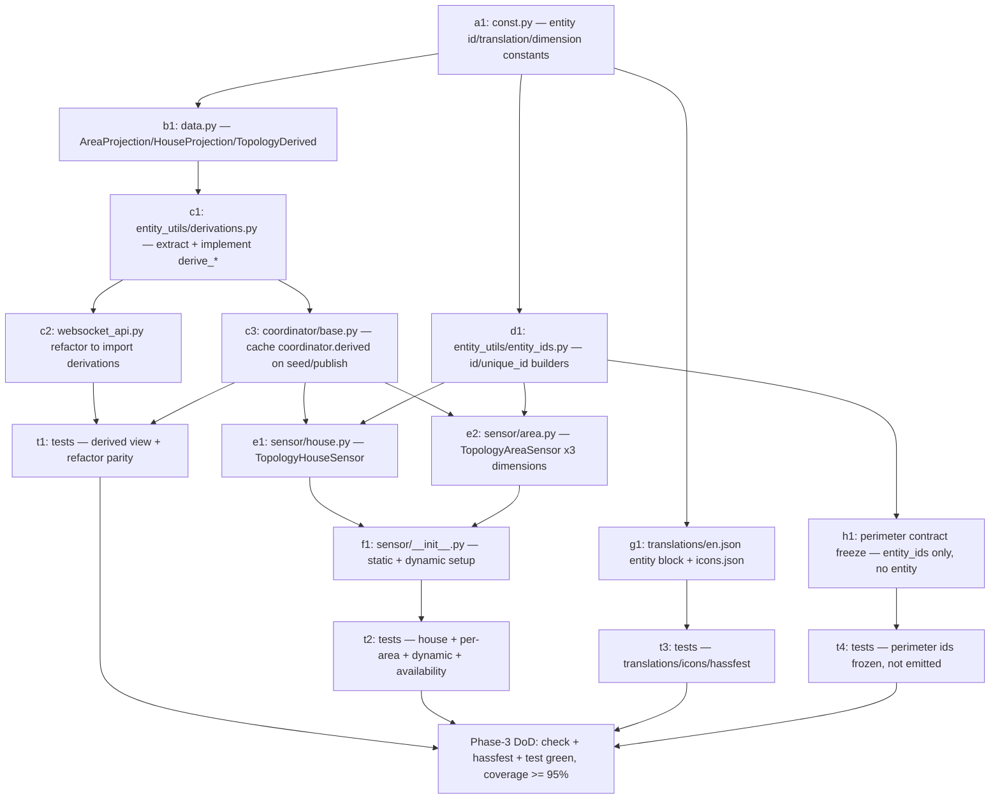

# Topology — Phase 3 Implementation Plan

**Status:** Implementation plan (frozen artifacts per PLAN-topology.md §10,
gate "Before Phase 3 (entities)") · Last updated 2026-07-24

**Scope:** Phase 3 (entities) only — the entity layer on top of the Phase 1+2
foundation (store snapshot as single source, `read_hook`/`health`, registry
watcher, `TopologyRuntimeData`). The two entity platforms (`sensor/`,
`binary_sensor/`) are currently present-but-empty skeletons; this document
turns them into the frozen entity set from the ADR "Entity Model". Nothing
from Phase 4+ is implemented here; later phases are referenced only where
Phase 3 must freeze an artifact for them, or where a boundary is drawn.

**Binding inputs:** `PLAN-topology.md` (§1a, §2, §8, §10 gate "Before
Phase 3"), `PLAN-topology-phase2.md` (§2 store schema, §3 enum catalog, §4 WS
contract incl. §4.10 `read_hook`/§4.11 `health`, §6 dataclasses),
`DECISIONS.md` (ADRs "Entity Model", "Registry-Driven State With Reactive
Cleanup", "Coordinator Role", "Editing Surface", "Release Strategy"),
`AGENTS.md` (package rules, layering `Entities → Coordinator → …`, validation
scripts, translation strategy). The real code on `main`
(`custom_components/topology/{data,store,websocket_api,const}.py`,
`coordinator/`) is the fixed substrate every signature below is written
against.

**Definition of done for Phase 3:** a developer implements Phase 3 from this
document alone in ~4 working days without going back to the design plan;
`script/check`, `script/hassfest`, and `script/test` green with ≥ 95 %
coverage (Silver `test-coverage`, mandatory from Phase 3 onward per
PLAN-topology.md §8); every artifact in §2–§8 implemented exactly as frozen
here; every open decision in §10 ratified before code is written.

**How this document must be used:** §10 is not optional reading. The design
plan deliberately leaves the entity layer under-specified (it stops "above
the code layer", PLAN-topology.md §10), and §8 of the design plan makes at
least one statement about Phase 3 that this plan contradicts on purpose
(the perimeter binary sensor, D1). Ratify §10 first; the sections above it
already assume the recommended options.

---

## 1. Phase-3 delta table

Basis: the actual tree under `custom_components/topology/` on `main` after the
Phase 1+2 merge. "add" = new file, "extend" = add to an existing file without
changing frozen Phase-2 behavior, "refactor" = move existing logic with no
behavior change. No Phase-2 artifact (store schema, enum catalog, WS contract,
`health` shape) changes — Phase 3 only **consumes** them.

| Path                          | Action       | What changes                                                                                                                                                                                                                               |
| ----------------------------- | ------------ | ------------------------------------------------------------------------------------------------------------------------------------------------------------------------------------------------------------------------------------------ |
| `const.py`                    | **extend**   | Entity constants: `ENTITY_ID_PREFIX = DOMAIN` provenance note, per-area dimension enum strings, translation-key constants, unique-id suffix constants. No storage/WS constant touched. (§4, §5)                                            |
| `data.py`                     | **extend**   | Add the registry-merged read model consumed by entities: `AreaProjection`, `HouseProjection`, `TopologyDerived` frozen dataclasses (§7). No change to any Phase-2 enum, TypedDict, dataclass, or converter.                                |
| `entity_utils/derivations.py` | **add**      | Pure functions `derive_house`, `derive_areas`, `derive_perimeter`, `effective_level`, computing the entity/WS projections from `(TopologySnapshot, AreaRegistry, FloorRegistry)`. Single source for both entities and the WS API. (§7, D2) |
| `websocket_api.py`            | **refactor** | `_derive_perimeter`, `_is_perimeter_edge`, `_effective_level`, and the count logic in `_build_health` move into `entity_utils/derivations.py` and are imported back. Response bytes unchanged (contract frozen). (§7, D2, D15)             |
| `coordinator/base.py`         | **extend**   | Compute and cache a `TopologyDerived` alongside the snapshot in `async_seed`/`async_publish`; expose it as `coordinator.derived`. Registry reads happen here (the coordinator owns `hass`), never in entities. (§7)                        |
| `entity/base.py`              | **extend**   | `TopologyEntity` gains a shared `_attr_should_poll = False` note (already implied) and the derived-view accessor helper; still one base class. No device info (`devices: N/A`).                                                            |
| `entity_utils/entity_ids.py`  | **add**      | Deterministic entity-id + unique-id builders (§4). One place owns the frozen id scheme.                                                                                                                                                    |
| `sensor/house.py`             | **add**      | `TopologyHouseSensor` — the household summary sensor (§3.1).                                                                                                                                                                               |
| `sensor/area.py`              | **add**      | `TopologyAreaSensor` — the per-area `type`/`environment`/`trust` triple (§3.3), one class parameterized by dimension.                                                                                                                      |
| `sensor/__init__.py`          | **rewrite**  | Real platform setup: add the house sensor + per-area triples for every registry area, and dynamically add triples for areas created at runtime (via a coordinator listener). Still `PARALLEL_UPDATES = 0`. (§6)                            |
| `binary_sensor/__init__.py`   | **keep**     | Stays an empty platform in Phase 3. The perimeter binary sensor's contract is frozen here (§3.2, §4, §5) but its live derivation is Phase 4 (D1). No entities added yet.                                                                   |
| `translations/en.json`        | **extend**   | New top-level `entity` block: `sensor.house`, `sensor.area_type`, `sensor.area_environment`, `sensor.area_trust`, `binary_sensor.perimeter_open` — names + closed-enum state labels (§5). `config`/`issues`/`selector` blocks untouched.   |
| `icons.json`                  | **add**      | New file: `entity` icon-translations for every entity + state combination (§5). Did not exist before Phase 3.                                                                                                                              |
| `diagnostics.py`              | **keep**     | Still the Phase-1 stub returning `{}`. Diagnostics export is Phase 6 (PLAN-topology.md §8). Not touched here.                                                                                                                              |
| `repairs.py`                  | **keep**     | Untouched. The unannotated-threshold repair (which consumes the same `unannotated_areas`) is Phase 5. Phase 3 only surfaces the attribute, never raises an issue.                                                                          |
| `tests/`                      | **add**      | The Phase-3 test matrix (§9). Coverage bar rises to ≥ 95 %.                                                                                                                                                                                |
| `manifest.json`               | **keep**     | No change. No version bump, no `quality_scale` change (ADR "Release Strategy"; release-please untouched).                                                                                                                                  |

**Phase-3 DoD:** with areas/floors present, `sensor.topology_house` reports a
percentage with the frozen attribute set; per-area diagnostic sensors exist
(disabled by default) and read their dimension from the snapshot; the
perimeter binary sensor's id/unique-id/contract are frozen and reserved but
not yet emitting (D1); `script/check` + `script/hassfest` + `script/test`
green.

---

## 2. Entity set overview

The ADR "Entity Model" fixes exactly three entity families (no per-connection
entities — registry churn stays proportional to user opt-in, not to graph
size):

| Family          | Platform        | Count             | Default state           | entity_category     | Phase 3 status                         |
| --------------- | --------------- | ----------------- | ----------------------- | ------------------- | -------------------------------------- |
| House summary   | `sensor`        | 1                 | enabled                 | — (user-facing)     | **implemented** (§3.1)                 |
| Perimeter open  | `binary_sensor` | 1                 | enabled                 | — (security-facing) | **contract frozen, impl Phase 4** (D1) |
| Per-area triple | `sensor`        | 3 × registry area | **disabled** by default | `diagnostic`        | **implemented** (§3.3)                 |

All entities: `_attr_has_entity_name = True` (inherited from `TopologyEntity`,
Gold `has-entity-name`); no device (`devices: N/A`, ADR "Manifest
Declaration"); `PARALLEL_UPDATES = 0` (Silver `parallel-updates`, already set
per platform). Entities read **only** from `coordinator.data`
(`TopologySnapshot`) and `coordinator.derived` (`TopologyDerived`, §7) — never
from the store, the area registry, or the floor registry directly
(AGENTS.md layering).

---

## 3. Entity catalog

Every state source below is a field of the Phase-2 `TopologySnapshot` (§6 of
the Phase-2 plan) or of the registry-merged `TopologyDerived` view (§7). No
entity recomputes a Phase-4 graph-consistency check; no entity reads a live
external state except the perimeter binary sensor, whose live read is the
Phase-4 boundary (D1).

### 3.1 `sensor.topology_house` — household summary

| Property                        | Value                                                                                                                                                |
| ------------------------------- | ---------------------------------------------------------------------------------------------------------------------------------------------------- |
| Class                           | `TopologyHouseSensor(TopologyEntity, SensorEntity)`                                                                                                  |
| entity_id (frozen)              | `sensor.topology_house` (§4)                                                                                                                         |
| unique_id (frozen)              | `f"{entry_id}_house"` (§4)                                                                                                                           |
| translation_key                 | `house`                                                                                                                                              |
| device_class                    | none                                                                                                                                                 |
| state_class                     | `SensorStateClass.MEASUREMENT`                                                                                                                       |
| native_unit_of_measurement      | `PERCENTAGE` (`"%"`)                                                                                                                                 |
| entity_category                 | none (primary user-facing summary, ADR)                                                                                                              |
| entity_registry_enabled_default | `True` (always on)                                                                                                                                   |
| native_value                    | `round(annotated_count / area_count * 100)` as `int`, `0` when `area_count == 0` (D10). Range 0–100.                                                 |
| availability                    | `coordinator.last_update_success` (base). Store-load failure already fails setup, so the entity is effectively always available once created (§3.5). |

**State source:** `TopologyDerived.house` (§7), a registry-merged projection.
`annotated_count`/`area_count` are the **same values** the `health` signal
reports (§4.11 of the Phase-2 plan) — both consume `derive_house` (§7, D2),
which is what the frozen Phase-2 test `test_health_matches_house_sensor_inputs`
already anticipates.

**Attribute contract** (§8; machine-readable; deprecation-bound from here):

| Attribute                    | Type        | Format / meaning                                                                                                                                  |
| ---------------------------- | ----------- | ------------------------------------------------------------------------------------------------------------------------------------------------- |
| `occupancy_extent`           | `str`       | `"whole_property" \| "unit_within_building"` (§3.8 catalog).                                                                                      |
| `area_count`                 | `int`       | Number of areas in the HA area registry.                                                                                                          |
| `annotated_count`            | `int`       | Registry areas with a non-orphaned store annotation (identical to `health.annotated_count`, D6).                                                  |
| `unannotated_areas`          | `list[str]` | Sorted registry `area_id`s with no annotation (identical to `health.unannotated_areas`).                                                          |
| `perimeter_connection_count` | `int`       | Count of derived perimeter connections (structural, `len(derive_perimeter(...))`; **not** how many are open — that is the Phase-4 binary sensor). |
| `outdoor_area_count`         | `int`       | Non-orphaned registry areas with `environment == "outdoor"` (semi_outdoor excluded, D7).                                                          |
| `floor_count`                | `int`       | Number of floors in the HA floor registry (D8).                                                                                                   |

Attribute keys are stable snake_case; list order is deterministic (sorted by
`area_id`). No freetext / PII (diagnostics redaction is a Phase-6 concern and
does not apply to this always-public attribute set).

### 3.2 `binary_sensor.topology_perimeter_open` — perimeter aggregate

**Phase 3 delivers the frozen contract only; the live derivation is Phase 4
(D1).** The id, unique_id, device_class, translations, icons, and the
attribute contract below are frozen now so a future consumer's automation
target never changes. The `is_on` any-of aggregation, the `open_connections`
population, the debounce interval, and the bound-sensor-unavailable policy are
exactly the artifacts the design plan schedules to freeze "Before Phase 4"
(PLAN-topology.md §10) and are implemented there.

| Property                        | Value                                                                                                                                                               |
| ------------------------------- | ------------------------------------------------------------------------------------------------------------------------------------------------------------------- |
| Class                           | `TopologyPerimeterBinarySensor(TopologyEntity, BinarySensorEntity)` (added in Phase 4)                                                                              |
| entity_id (frozen)              | `binary_sensor.topology_perimeter_open` (§4)                                                                                                                        |
| unique_id (frozen)              | `f"{entry_id}_perimeter_open"` (§4)                                                                                                                                 |
| translation_key                 | `perimeter_open`                                                                                                                                                    |
| device_class                    | `BinarySensorDeviceClass.OPENING` (Gold `entity-device-class`; `on` = open)                                                                                         |
| entity_category                 | none (primary security hook, ADR)                                                                                                                                   |
| entity_registry_enabled_default | `True` (always on)                                                                                                                                                  |
| `is_on` (Phase 4)               | `True` iff **any** perimeter connection with a bound `binary_sensor` is `on`; any-of over live states, debounce + unavailable policy per the Before-Phase-4 freeze. |

**Attribute contract** (frozen now, populated Phase 4):

| Attribute          | Type         | Format                                                                                                                                                                                                                                  |
| ------------------ | ------------ | --------------------------------------------------------------------------------------------------------------------------------------------------------------------------------------------------------------------------------------- |
| `open_connections` | `list[dict]` | Each: `{"edge_id": str \| null, "area_id": str, "connection_index": int, "source_entity": str}` — mirrors the `perimeter` entries of the read hook (§4.10 of the Phase-2 plan) plus the live `source_entity`. Empty list until Phase 4. |

The structural perimeter set feeding this entity is already available today via
`derive_perimeter` (§7) and the read hook's `perimeter` list — Phase 4 only
adds the live open/closed layer on top.

### 3.3 Per-area triple — `sensor.topology_<area_slug>_{type|environment|trust}`

One `TopologyAreaSensor` instance per (registry area) × (dimension). A single
class parameterized by a `dimension` value (`type` | `environment` | `trust`);
one `SensorEntityDescription` per dimension.

| Property                        | `_type`                        | `_environment`                           | `_trust`                           |
| ------------------------------- | ------------------------------ | ---------------------------------------- | ---------------------------------- |
| entity_id (frozen)              | `sensor.topology_<slug>_type`  | `sensor.topology_<slug>_environment`     | `sensor.topology_<slug>_trust`     |
| unique_id (frozen)              | `f"{entry_id}_{area_id}_type"` | `f"{entry_id}_{area_id}_environment"`    | `f"{entry_id}_{area_id}_trust"`    |
| translation_key                 | `area_type`                    | `area_environment`                       | `area_trust`                       |
| device_class                    | **none** (open catalog, D5)    | `SensorDeviceClass.ENUM`                 | `SensorDeviceClass.ENUM`           |
| options                         | — (open catalog; no `options`) | `["indoor", "outdoor", "semi_outdoor"]`  | `["private", "shared", "public"]`  |
| state_class                     | none (ENUM/plain — no stats)   | none (ENUM forbids state_class)          | none                               |
| entity_category                 | `EntityCategory.DIAGNOSTIC`    | `EntityCategory.DIAGNOSTIC`              | `EntityCategory.DIAGNOSTIC`        |
| entity_registry_enabled_default | `False` (opt-in, Gold rule)    | `False`                                  | `False`                            |
| native_value                    | `annotation.type` or `None`    | `annotation.environment.value` or `None` | `annotation.trust.value` or `None` |

**State source:** the matching field of the area's `AreaAnnotation` in
`coordinator.data` (`TopologySnapshot`). `None` renders as HA `unknown` — the
strict "null = unknown, never a silent default" discipline (PLAN-topology.md
§1). Unknown stored enum values already read as `None` upstream (§2.4 of the
Phase-2 plan), so a downgraded store surfaces `unknown` here, not a stale enum.

- **`type` is an open catalog** (§3.1 of the Phase-2 plan): the state may be
  any string (e.g. `sauna`). Therefore **no `SensorDeviceClass.ENUM`** and **no
  `options`** (ENUM would reject out-of-list values and spam the log) — D5.
  Icon-translations still apply to the 13 shipped types; custom types fall back
  to the default icon (§5).
- **`environment` / `trust` are closed enums** → `SensorDeviceClass.ENUM` with
  `options` = the catalog. State/icon translations key on the value.

**Attribute contract** (all three dimensions):

| Attribute | Type  | Format                                                            |
| --------- | ----- | ----------------------------------------------------------------- |
| `area_id` | `str` | The stable HA `area_id` this sensor annotates (machine key, D13). |

**Availability:** available iff the area is present in the registry and not
orphaned (`area_id in TopologyDerived.live_area_ids`) **and**
`coordinator.last_update_success`. A removed area's triple goes `unavailable`
(not deleted) for the 72 h undo window (D11, §3.5); a restore brings it back.

### 3.4 Why the graph, connections, and `beyond` are not entities

Deliberately unchanged from the ADR: adjacency edges, individual connections,
and `beyond` classifications stay accessible only through the read hook (§4.10)
and the panel. Phase 3 adds no entity for them. This bounds registry churn and
keeps the automation surface small.

### 3.5 Availability + `log-when-unavailable`

`CoordinatorEntity.available` returns `coordinator.last_update_success`
(verified, Appendix A.4). The event-fanout coordinator sets this `True` on
`async_seed`/`async_set_updated_data` and never runs a failing refresh (no
polling), so:

- **House / perimeter:** available whenever created. A store that cannot load
  fails setup (`ConfigEntryNotReady`/`ConfigEntryError`, Phase-2 §5.3), so the
  entities are never added on a bad store — the Silver `entity-unavailable`
  intent ("unavailable when the store fails to load") is satisfied structurally.
- **Per-area:** additionally gated on registry presence (§3.3). Transition to
  `unavailable` on area removal is logged once at info level via a small
  transition guard in the entity (Silver `log-when-unavailable`), and once on
  return to available. No logging inside property getters.

---

## 4. Entity-ID scheme & `unique_id` rules (frozen)

This is the primary artifact the design plan's §10 gate "Before Phase 3"
requires frozen. It is deterministic, migration-safe, and survives an area
rename.

### 4.1 The two identifiers are independent

- **`unique_id`** is the stable registry key. It **must** key on the
  registry-stable `area_id` (never on the area name/slug), so an area rename
  never changes it. Built once, stored by HA, never recomputed from display
  data.
- **`entity_id`** is the human-facing slug. It embeds the area **slug** at
  creation for readability, is frozen by HA on first registration, and is
  unaffected by later area renames (HA keeps the original object_id). Users may
  rename it freely; `unique_id` is what ties state history together.

### 4.2 `unique_id` (frozen)

| Entity               | `unique_id`                           | Example                             |
| -------------------- | ------------------------------------- | ----------------------------------- |
| House summary        | `f"{entry_id}_house"`                 | `01J2...ENTRY_house`                |
| Perimeter open       | `f"{entry_id}_perimeter_open"`        | `01J2...ENTRY_perimeter_open`       |
| Per-area (dimension) | `f"{entry_id}_{area_id}_{dimension}"` | `01J2...ENTRY_a1b2c3d4_environment` |

- `entry_id` is the config entry's ULID — stable across reloads (verified,
  Appendix A.4: `runtime_data` is dropped on unload but `entry_id` persists),
  singleton because `single_config_entry: true`. Scoping all three families on
  `entry_id` is consistent and matches PLAN-topology.md §8's per-area shape
  (D12).
- `dimension ∈ {"type", "environment", "trust"}` — the literal store field
  name. PLAN-topology.md §8 writes this suffix as `{axis}`; that word collides
  with the edge horizontal/vertical `axis` (§4 of the Phase-2 plan) and is
  read here as **`dimension`** (D4). No behavioral difference — only the
  suffix spelling is pinned.

### 4.3 `entity_id` (frozen)

The integration domain (`topology`) is **not** auto-prefixed into an
`entity_id` (verified, Appendix A.5), and topology has no device to supply the
prefix (`devices: N/A`). So the prefix is applied explicitly via a
deterministic object_id fed to `async_generate_entity_id` (verified signature,
Appendix A.4) in each entity's `__init__` — `has_entity_name` still drives the
friendly name from the translation, independently of the object_id (D3).

| Entity               | `object_id`                           | `entity_id`                             |
| -------------------- | ------------------------------------- | --------------------------------------- |
| House summary        | `topology_house`                      | `sensor.topology_house`                 |
| Perimeter open       | `topology_perimeter_open`             | `binary_sensor.topology_perimeter_open` |
| Per-area (dimension) | `f"topology_{area_slug}_{dimension}"` | `sensor.topology_wohnzimmer_trust`      |

- `area_slug` is `AreaProjection.slug` — i.e. `slugify(area.name)`
  (`homeassistant.util.slugify`) computed once by the coordinator's
  `derive_areas` and read from `coordinator.derived` (D16). The platform and
  entities therefore build entity_ids from coordinator-owned data and never
  read the area registry themselves (AGENTS.md layering, §6). Two areas that
  slugify identically get HA's `_2` disambiguator via
  `async_get_available_entity_id` — `unique_id` keeps them distinct.
- The builders live in `entity_utils/entity_ids.py` (one owner for the scheme):
  `house_unique_id(entry_id)`, `perimeter_unique_id(entry_id)`,
  `area_unique_id(entry_id, area_id, dimension)`,
  `area_object_id(area_slug, dimension)`, plus `ENTITY_ID_FORMAT` imports from
  `homeassistant.components.sensor` / `binary_sensor`.

### 4.4 Migration safety

Phase 3 is the **first** entity release and there is **no public release**
before full-scope completion (ADR "Release Strategy"), so no user has existing
topology entities — there is nothing to migrate and no deprecation window is
owed for pre-1.0.0 changes. The scheme is nonetheless designed to be stable
going forward: because `unique_id` is `area_id`-based, later phases (Phase 4
perimeter liveness, Phase 5 repairs) add behavior without ever reissuing an id.
The rename/floor-move/icon-change registry events already handled by the Phase-2
watcher (`update` action → snapshot fanout, no store write) never touch these
ids.

---

## 5. Translations & icon-translations key set (frozen)

Two files. `translations/en.json` gains a top-level `entity` block (Gold
`entity-translations`); a new `icons.json` supplies `entity` icon-translations
(Gold `icon-translations`). Both must pass `script/hassfest`. Per AGENTS.md
translation strategy, only `en.json` is authored — no other language files.

### 5.1 `translations/en.json` — new `entity` block

Keys only (English strings filled at implementation; the closed-enum `state`
maps are mandatory for `SensorDeviceClass.ENUM` and for the binary sensor):

```text
entity.sensor.house.name
entity.sensor.area_type.name
entity.sensor.area_environment.name
entity.sensor.area_environment.state.indoor
entity.sensor.area_environment.state.outdoor
entity.sensor.area_environment.state.semi_outdoor
entity.sensor.area_trust.name
entity.sensor.area_trust.state.private
entity.sensor.area_trust.state.shared
entity.sensor.area_trust.state.public
entity.binary_sensor.perimeter_open.name
entity.binary_sensor.perimeter_open.state.off
entity.binary_sensor.perimeter_open.state.on
```

- `area_type` has **no** `state` map (open catalog, D5): custom and shipped
  values render verbatim. The 13 shipped types get human labels only through
  icons (below), not through state translations — matching how an open catalog
  behaves in HA.
- The existing `config`, `selector`, and `issues` blocks are **not** touched.

### 5.2 `icons.json` — new file

Every entity + closed-state combination that needs an icon. Shape mirrors the
HA icon-translations schema (`entity.<platform>.<translation_key>.default` /
`.state.<value>`):

```text
entity.sensor.house.default
entity.sensor.area_type.default
entity.sensor.area_type.state.<each of the 13 §3.1 catalog values>
entity.sensor.area_environment.default
entity.sensor.area_environment.state.{indoor,outdoor,semi_outdoor}
entity.sensor.area_trust.default
entity.sensor.area_trust.state.{private,shared,public}
entity.binary_sensor.perimeter_open.default
entity.binary_sensor.perimeter_open.state.{on,off}
```

- `area_type.state.*` supplies icons for the 13 shipped catalog values
  (`bedroom`, `living`, `kitchen`, `dining`, `bathroom`, `hallway`, `office`,
  `utility`, `storage`, `garage`, `balcony`, `terrace`, `outdoor`). A custom
  `type` value has no `state` entry and falls back to `default` — legal and
  expected for icon-translations.
- Concrete `mdi:` glyphs are an implementation detail chosen at build time
  (e.g. `bedroom → mdi:bed`, `outdoor → mdi:tree`, `perimeter_open.state.on →
mdi:door-open`); the **key set** is what is frozen, not the glyph choice.

### 5.3 hassfest

`script/hassfest` validates that every `translation_key` used by an entity has
a matching `entity.<platform>.<key>.name`, that ENUM sensors' `options` all
have `state` translations, and that `icons.json` is well-formed. Generate both
files to pass on first run.

---

## 6. Platform setup & dynamic entities

### 6.1 `sensor/__init__.py`

```text
async_setup_entry(hass, entry, async_add_entities):
    coordinator = entry.runtime_data.coordinator
    # 1. Singleton house sensor.
    entities = [TopologyHouseSensor(coordinator)]
    # 2. Per-area triple for every area currently in the derived view.
    known: set[str] = set()
    for area_id in coordinator.derived.live_area_ids:
        entities += _area_triple(coordinator, area_id); known.add(area_id)
    async_add_entities(entities)
    # 3. Dynamically add triples for areas that appear later. The coordinator
    #    republishes on every area-registry create/update (Phase-2 watcher),
    #    so a listener on the coordinator sees new area_ids without the
    #    platform touching the registry directly (AGENTS.md layering).
    @callback
    def _async_add_new_areas() -> None:
        new = [a for a in coordinator.derived.live_area_ids if a not in known]
        fresh = []
        for area_id in new:
            fresh += _area_triple(coordinator, area_id); known.add(area_id)
        if fresh:
            async_add_entities(fresh)
    entry.async_on_unload(coordinator.async_add_listener(_async_add_new_areas))
```

- `_area_triple(coordinator, area_id)` looks up the matching `AreaProjection`
  in `coordinator.derived.areas`, reads its `slug` for the entity_id (§4.3),
  and returns the three `TopologyAreaSensor` instances (one per dimension) —
  no registry access in the platform. They are added even for areas with no
  annotation yet — they are `disabled_by_default`, so they create a registry
  entry but no state until the user enables them.
- **Removal is not deletion.** A removed area's triple stays registered and
  goes `unavailable` (§3.3/§3.5). The 72 h orphan window (Phase-2 watcher)
  governs the store data; the entities follow the derived view's
  `live_area_ids`. Purge (past the window) leaves the entity `unavailable`;
  actual entity cleanup is a user action or a later-phase concern — Phase 3
  does not auto-remove entities (keeps registry churn low and respects undo).
- The house sensor and the (Phase-4) perimeter sensor are singletons, added
  once, never dynamically.

### 6.2 `binary_sensor/__init__.py`

Stays the empty skeleton (returns no entities). The perimeter binary sensor
is added here in Phase 4 (D1). Keeping the platform registered now means
Phase 4 adds one class and a one-line setup, with the id/contract already
frozen (§3.2, §4, §5).

---

## 7. What the coordinator/snapshot must additionally expose

Entities may not read the area or floor registry (AGENTS.md layering); yet the
house sensor's counts and the per-area availability need registry facts. The
coordinator — which owns `hass` and already republishes on every registry
event — is the single place those facts are merged in.

### 7.1 New read model in `data.py`

```python
@dataclass(frozen=True, kw_only=True, slots=True)
class AreaProjection:
    """Registry-merged, entity-facing view of one area."""
    area_id: str
    name: str                  # registry area name at derive time (display/UI)
    slug: str                  # slugify(name) — the entity-id slug (§4.3), so
                               # the platform never reads the registry (D2/D16)
    exists: bool               # present in the area registry right now
    orphaned: bool             # store annotation flagged orphaned
    type: str | None
    environment: Environment | None
    trust: Trust | None

@dataclass(frozen=True, kw_only=True, slots=True)
class HouseProjection:
    """The house sensor's inputs — identical to the health counts (D6)."""
    occupancy_extent: OccupancyExtent
    area_count: int
    annotated_count: int
    unannotated_areas: tuple[str, ...]
    perimeter_connection_count: int
    outdoor_area_count: int
    floor_count: int

@dataclass(frozen=True, kw_only=True, slots=True)
class TopologyDerived:
    """Registry-merged projection cached on the coordinator (§7.3)."""
    house: HouseProjection
    areas: tuple[AreaProjection, ...]
    live_area_ids: frozenset[str]   # registry areas, non-orphaned
```

No Phase-2 dataclass changes. `TopologyDerived` is **additive** and lives next
to `TopologySnapshot`.

### 7.2 New pure functions in `entity_utils/derivations.py`

Registry-parameterized, side-effect-free, unit-testable without HA wiring:

```python
def effective_level(area_id, area_reg, floor_reg, overrides) -> int | None: ...
def derive_perimeter(snapshot, area_reg) -> list[dict[str, Any]]: ...   # §4.10 shape
def derive_areas(snapshot, area_reg) -> tuple[AreaProjection, ...]: ...
    # captures each area's registry name + slugify(name) into AreaProjection,
    # so entity-id construction (§4.3) reads the slug from the derived view and
    # never touches the registry from the platform/entity (D2/D16).
def derive_house(snapshot, area_reg, floor_reg) -> HouseProjection: ...
def derive(snapshot, area_reg, floor_reg) -> TopologyDerived: ...
```

`derive_perimeter`, `effective_level`, and the `health` count logic are
**moved** out of `websocket_api.py` into this module and imported back so the
WS responses are byte-identical (D2/D15). This makes `derive_house` and the
`health` signal share one implementation — realizing the frozen Phase-2 test
`test_health_matches_house_sensor_inputs`.

`derive_house` field rules (each pinned as a decision in §10):

- `area_count` = `len(area_reg.async_list_areas())`.
- `annotated_count` = registry areas with a non-orphaned annotation — the exact
  Phase-2 `health.annotated_count` definition, unchanged (D6).
- `unannotated_areas` = sorted `registry_ids − annotation_ids` (== `health`).
- `perimeter_connection_count` = `len(derive_perimeter(snapshot, area_reg))`
  (structural count; the Phase-4 binary sensor reports how many are _open_).
- `outdoor_area_count` = non-orphaned registry areas with
  `environment == Environment.OUTDOOR` (semi_outdoor excluded, D7).
- `floor_count` = `len(floor_reg.async_list_floors())` (registry floors, not
  store overrides, D8).

### 7.3 Coordinator wiring (`coordinator/base.py`)

`async_seed(snapshot)` and `async_publish(snapshot, change, ids)` additionally
call `self.derived = derive(snapshot, ar.async_get(hass), fr.async_get(hass))`
before/after pushing the snapshot (registry `async_get` is synchronous — safe
inside the existing `@callback` methods, Appendix A.2/A.3). `self.derived` is a
plain attribute (typed `TopologyDerived`), recomputed on every seed/publish, so
it is always consistent with `coordinator.data`. Entities read
`self.coordinator.derived`; the WS API keeps reading `coordinator.data` and
gains nothing new (its own serialization already merges the registry per call).

This keeps `coordinator.data` = the raw `TopologySnapshot` (unchanged type, WS
API untouched) and adds `coordinator.derived` for the entity layer (D2). The
recomputation is O(areas + edges) and only runs on actual changes (seed +
mutation/registry events), never on a timer.

---

## 8. Boundaries: Phase 2 "present-but-empty", and Phase 4+

Explicit fences so no later-phase work is pulled forward.

| Item                                                                                                                                        | Owner phase | Phase 3 stance                                                                                                                           |
| ------------------------------------------------------------------------------------------------------------------------------------------- | ----------- | ---------------------------------------------------------------------------------------------------------------------------------------- |
| `health` graph-consistency lists (`isolated_areas`, `indoor_areas_without_floor`, `contradictory_bearings`, `exterior_on_non_outdoor_side`) | Phase 4     | Stay **present-but-empty** (frozen Phase-2 shape). No entity reads or fills them; the house sensor exposes none of them.                 |
| Perimeter-**open** live derivation (`is_on` any-of, `open_connections`, debounce, unavailable policy)                                       | Phase 4     | **Contract frozen** (§3.2), implementation deferred (D1). Structural `perimeter_connection_count` is Phase 3 (a count, not a live read). |
| Adjacency-graph query surface (neighbors-of, path, `outdoor`-on-one-side)                                                                   | Phase 4     | Not added. Read hook keeps its Phase-2 shape.                                                                                            |
| Repairs (unannotated-threshold issue, orphaned-past-window, contradictory bearings, …)                                                      | Phase 5     | Not raised. Phase 3 surfaces `unannotated_areas` as a **house attribute** only; no `async_create_issue`.                                 |
| Services (`annotate_area`, `declare_connection`, …), diagnostics export                                                                     | Phase 6     | `diagnostics.py` stays the `{}` stub; `service_actions/` unchanged.                                                                      |
| Panel / 2D map / frontend                                                                                                                   | Phase 7     | Nothing frontend. Per-area entities are the only new user surface.                                                                       |
| Label projection, imports execution                                                                                                         | Phase 6     | Untouched (the `projection_toggles` / `imports_done_at` remain inert store fields).                                                      |

Phase 3 adds **no** new store field, **no** new WS command, **no** new enum,
**no** manifest/version/tag change.

---

## 9. Test matrix (Phase 3)

Style per §7 of the Phase-2 plan: IDs + fixtures, no test bodies. New shared
fixtures in `tests/conftest.py` (on top of the Phase-2 set): `enable_all`
(force-enable disabled-by-default entities via
`entity_registry_enabled_default` override / `er.async_update_entity`),
`snapshot` (Syrupy), `two_floor_registry` (floors at levels 0 and 1),
`area_registry_ext` (flur/wohnzimmer/kueche + a `garten` outdoor area). Silver
`test-coverage` ≥ 95 % applies from here.

### Derived view + shared derivations

| ID                                           | Purpose                                                                                                                                | Fixtures                                    |
| -------------------------------------------- | -------------------------------------------------------------------------------------------------------------------------------------- | ------------------------------------------- |
| `test_derive_house_counts`                   | `derive_house` returns correct area/annotated/unannotated/outdoor/floor/perimeter counts for §2.5.                                     | hass, store_payload_full, area_registry_ext |
| `test_derive_house_equals_health`            | `derive_house` counts == `topology/health` counts (single source, D2/D6).                                                              | setup_integration, hass_ws_client           |
| `test_derive_areas_projection`               | `derive_areas` marks `exists`/`orphaned`, carries type/env/trust (unknown enum → None) **and** `name` + `slug == slugify(name)` (D16). | hass, store_payload_full, area_registry     |
| `test_derive_perimeter_unchanged`            | Refactored `derive_perimeter` yields byte-identical read-hook `perimeter` as before the move (D15).                                    | setup_integration, store_payload_full       |
| `test_ws_responses_unchanged_after_refactor` | `list_annotations`/`read_hook`/`health` snapshots unchanged after the derivation extraction.                                           | setup_integration, hass_ws_client, snapshot |
| `test_coordinator_derived_recomputed`        | `coordinator.derived` refreshes on `async_publish` and on a registry event.                                                            | setup_integration, area_registry            |

### House sensor

| ID                                      | Purpose                                                                                              | Fixtures                                                 |
| --------------------------------------- | ---------------------------------------------------------------------------------------------------- | -------------------------------------------------------- |
| `test_house_entity_id_and_unique_id`    | `sensor.topology_house`; `unique_id == f"{entry_id}_house"`.                                         | setup_integration                                        |
| `test_house_state_percentage`           | State == `round(annotated/area*100)`; unit `%`; `state_class measurement`.                           | setup_integration, store_payload_full, area_registry_ext |
| `test_house_state_zero_areas`           | No registry areas → state `0` (D10), `area_count 0`, `annotated_count 0`.                            | hass, mock_config_entry                                  |
| `test_house_attributes_contract`        | Exact attribute key set + types/formats (§3.1); `unannotated_areas` sorted.                          | setup_integration, area_registry_ext                     |
| `test_house_outdoor_and_floor_counts`   | `outdoor_area_count` counts only `environment==outdoor` (D7); `floor_count` == registry floors (D8). | setup_integration, two_floor_registry, area_registry_ext |
| `test_house_perimeter_count_structural` | `perimeter_connection_count` == `len(derive_perimeter)`; independent of any live sensor state.       | setup_integration, store_payload_full                    |
| `test_house_enabled_by_default`         | House sensor is registered enabled (no `disabled_by`).                                               | setup_integration                                        |
| `test_house_refreshes_on_mutation`      | `update_area` fanout updates the house state without reload.                                         | setup_integration, hass_ws_client                        |

### Per-area sensors

| ID                                     | Purpose                                                                                               | Fixtures                                          |
| -------------------------------------- | ----------------------------------------------------------------------------------------------------- | ------------------------------------------------- |
| `test_area_triple_created_disabled`    | Three sensors per area, all `entity_registry_enabled_default is False`, `entity_category diagnostic`. | setup_integration, area_registry                  |
| `test_area_entity_ids`                 | `sensor.topology_<slug>_type/_environment/_trust` for a known area.                                   | setup_integration, area_registry                  |
| `test_area_unique_ids_area_id_based`   | `unique_id == f"{entry_id}_{area_id}_{dimension}"`; independent of the name.                          | setup_integration, area_registry                  |
| `test_area_unique_id_survives_rename`  | Renaming the area keeps `unique_id` and the state entry; `entity_id` unchanged (D4).                  | setup_integration, area_registry, enable_all      |
| `test_area_type_open_catalog_state`    | `type` sensor state passes through `sauna` verbatim; no ENUM device_class; no log error (D5).         | setup_integration, hass_ws_client, enable_all     |
| `test_area_environment_enum_state`     | `environment` sensor: `SensorDeviceClass.ENUM`, `options` == catalog, state == value.                 | setup_integration, hass_ws_client, enable_all     |
| `test_area_trust_enum_state`           | `trust` sensor: ENUM + options; state == value.                                                       | setup_integration, hass_ws_client, enable_all     |
| `test_area_unknown_enum_reads_unknown` | Store `environment: "underwater"` → sensor state `unknown` (None), not a default.                     | setup_integration, store_payload_full, enable_all |
| `test_area_null_is_unknown`            | Unannotated area → all three states `unknown` (null discipline).                                      | setup_integration, area_registry, enable_all      |
| `test_area_attribute_area_id`          | Each per-area sensor exposes `area_id` (D13).                                                         | setup_integration, enable_all                     |
| `test_area_added_dynamically`          | Creating a new registry area adds its triple via the coordinator listener (§6.1).                     | setup_integration, area_registry                  |
| `test_area_removed_unavailable`        | Removing an area → its triple `unavailable`, not deleted (D11); restore returns it.                   | setup_integration, area_registry, enable_all      |
| `test_area_refreshes_on_mutation`      | `update_area` fanout updates the matching per-area sensor state.                                      | setup_integration, hass_ws_client, enable_all     |

### Perimeter binary sensor (contract freeze)

| ID                                  | Purpose                                                                                                    | Fixtures          |
| ----------------------------------- | ---------------------------------------------------------------------------------------------------------- | ----------------- |
| `test_perimeter_ids_frozen`         | `entity_utils.entity_ids` yields `binary_sensor.topology_perimeter_open` + `f"{entry_id}_perimeter_open"`. | hass              |
| `test_perimeter_not_emitted_phase3` | No `binary_sensor.topology_perimeter_open` entity exists after Phase-3 setup (impl is Phase 4, D1).        | setup_integration |

### Translations, icons, quality

| ID                                 | Purpose                                                                                                  | Fixtures          |
| ---------------------------------- | -------------------------------------------------------------------------------------------------------- | ----------------- |
| `test_entity_translations_present` | Every entity `translation_key` has an `entity.<platform>.<key>.name`; ENUM `options` all have `state.*`. | —                 |
| `test_icons_json_keyset`           | `icons.json` covers every §5.2 default + closed-state key; is valid JSON.                                | —                 |
| `test_hassfest_translations`       | hassfest passes for translations + icons (CI parity).                                                    | —                 |
| `test_parallel_updates_zero`       | Both platforms expose `PARALLEL_UPDATES == 0`.                                                           | —                 |
| `test_has_entity_name_all`         | Every topology entity sets `has_entity_name is True`.                                                    | setup_integration |

(~35 tests. No bodies here — Phase-3 implementation writes them. The
≥ 95 % coverage obligation is enforced from this phase, PLAN-topology.md §8.)

---

## 10. Decision protocol (D1–D16)

Every place the design plan leaves room, or where this plan contradicts it, is
listed here with a recommended, minimal-invasive option. **These must be
ratified by the maintainer before Phase-3 code is written.** The sections above
already assume the recommended option; a different ruling means editing the
referenced section, not the code.

| #   | Question / gap                                                            | Recommended option (minimal-invasive)                                                                                                                                                                                                                                                                                                                                                                              | Contradiction / note                                                                                                                                                                                 |
| --- | ------------------------------------------------------------------------- | ------------------------------------------------------------------------------------------------------------------------------------------------------------------------------------------------------------------------------------------------------------------------------------------------------------------------------------------------------------------------------------------------------------------ | ---------------------------------------------------------------------------------------------------------------------------------------------------------------------------------------------------- |
| D1  | Does the perimeter binary sensor ship in Phase 3?                         | **Freeze its full contract now (id, unique_id, `device_class=opening`, attributes, translations, icons); implement it in Phase 4** together with the "perimeter-open derivation semantics" the design plan already schedules to freeze Before Phase 4. Avoids a permanently-`unknown` security entity and any Phase-4 pull-forward. Alternative offered: ship a registered shell now with `is_on=None`.            | **Contradicts PLAN-topology.md §8**, which maps `entity-device-class: Perimeter binary` to Phase 3. Resolution: the device*class is \_frozen* in Phase 3, _applied_ in Phase 4; annotate the §8 row. |
| D2  | How do entities get registry-merged facts without reading the registry?   | Coordinator computes a `TopologyDerived` view (§7) at seed/publish and exposes it as `coordinator.derived`; entities read that. Shared `entity_utils/derivations.py` is the single source for entities _and_ the WS `health`/`perimeter`.                                                                                                                                                                          | AGENTS.md layering. `coordinator.data` stays the raw snapshot (WS API untouched).                                                                                                                    |
| D3  | Force the `topology_` entity_id prefix without a device                   | Explicit `async_generate_entity_id(ENTITY_ID_FORMAT, object_id, hass=hass)` with a deterministic object_id; keep `has_entity_name` for the friendly name. **Reject** introducing a device (violates `devices: N/A`).                                                                                                                                                                                               | Verified: domain is not auto-prefixed; no `_attr_suggested_object_id` exists (Appendix A.4/A.5).                                                                                                     |
| D4  | Per-area `unique_id` suffix spelling                                      | `dimension ∈ {type, environment, trust}` (the store field name).                                                                                                                                                                                                                                                                                                                                                   | PLAN-topology.md §8 writes `{axis}`; that word collides with the edge `axis`. Only the spelling is pinned.                                                                                           |
| D5  | `type` sensor device_class                                                | **No `SensorDeviceClass.ENUM`, no `options`** — `type` is an open catalog; ENUM would reject custom values and log errors. `environment`/`trust` stay ENUM.                                                                                                                                                                                                                                                        | Consistent with §2.4 rule 5 / §3.1 of the Phase-2 plan (open catalog).                                                                                                                               |
| D6  | `annotated_count` semantics for the house sensor                          | Keep the **frozen Phase-2 `health` definition** (a registry area with a non-orphaned annotation entry), so house == health. Do not tighten to "≥1 field set" (that would change the frozen `health` contract).                                                                                                                                                                                                     | Preserves `test_health_matches_house_sensor_inputs`. Noted nuance: an all-null annotation still counts.                                                                                              |
| D7  | `outdoor_area_count`                                                      | Count `environment == outdoor` only; **exclude** `semi_outdoor` (and `terrace`-typed areas whose env is outdoor still count via env, not type).                                                                                                                                                                                                                                                                    | Matches the read hook's environment discipline.                                                                                                                                                      |
| D8  | `floor_count`                                                             | `len(floor_registry)` — registry floors, not store overrides.                                                                                                                                                                                                                                                                                                                                                      | Overrides only complete missing levels; they are not extra floors.                                                                                                                                   |
| D9  | Associate per-area sensors with their HA area                             | **Defer.** Phase 3 leaves them unassigned (no device, no post-registration area write). Users may assign; a later polish/Phase-7 pass can auto-assign.                                                                                                                                                                                                                                                             | Keeps Phase 3 free of entity-registry writes; not required by any Gold rule.                                                                                                                         |
| D10 | House state when `area_count == 0`                                        | State `0` (0 %), `annotated_count 0`. Not `unknown`.                                                                                                                                                                                                                                                                                                                                                               | Simple, monotone; a fresh install reads a real 0 %.                                                                                                                                                  |
| D11 | Per-area sensor on area removal                                           | Go `unavailable` (gated on `live_area_ids`); **do not delete** the entity. Restore within the 72 h window brings it back.                                                                                                                                                                                                                                                                                          | Mirrors the store's orphan-undo window (ADR "Registry-Driven State").                                                                                                                                |
| D12 | House/perimeter `unique_id` scoping                                       | `entry_id`-scoped (`f"{entry_id}_house"` / `_perimeter_open`), consistent with per-area.                                                                                                                                                                                                                                                                                                                           | Matches PLAN-topology.md §8's per-area shape; `entry_id` is a stable singleton.                                                                                                                      |
| D13 | Extra attribute on per-area sensors                                       | Expose `area_id` (stable machine key) and nothing else.                                                                                                                                                                                                                                                                                                                                                            | Keeps the diagnostic entities lean.                                                                                                                                                                  |
| D14 | Home for the derived-view module + dataclasses                            | `entity_utils/derivations.py` (functions) + new dataclasses in `data.py`. Both are frozen packages — no new top-level package (AGENTS.md).                                                                                                                                                                                                                                                                         | `entity_utils/` is on the keep list and is the documented home for entity-facing helpers.                                                                                                            |
| D15 | Move `_derive_perimeter`/`_build_health` counts out of `websocket_api.py` | **Yes** — extract to `entity_utils/derivations.py`, import back; WS responses byte-identical (guarded by `test_ws_responses_unchanged_after_refactor`). Required so entities and `health` share one implementation (D2/D6).                                                                                                                                                                                        | Refactor only; the frozen WS contract does not change.                                                                                                                                               |
| D16 | Where the per-area entity-id **slug** comes from                          | Carry `name` + `slug` (`slugify(name)`) on `AreaProjection` (§7.1), computed once by `derive_areas`. The platform reads the slug from `coordinator.derived` when building entity_ids, so nothing outside the coordinator touches the area registry. Without this the implementer must either read the registry from the platform/entity or emit `area_id`-based entity_ids instead of the documented `<slug>` ids. | AGENTS.md layering (Codex PR review r3642205066). The `<slug>` entity-id scheme (§4.3) is only realizable if the slug is coordinator-owned.                                                          |

**Explicit contradictions with the design plan to ratify:** D1 (§8 Phase-3
mapping of the perimeter binary sensor) and D4 (§8 `{axis}` suffix spelling).
Everything else is a gap the design plan left open.

---

## 11. Umsetzungs-DAG (cluster ordering)

"A → B" = A must precede B. Letters match the clusters a single developer
would tackle over ~4 days.



Practical sequencing (~4 days): day 1 = a + b + c1 (derivations, the keystone)

- c2 parity tests; day 2 = c3 + d + e1/e2; day 3 = f1 (setup incl. dynamic add)
- g1 (en.json/icons.json) + h1; day 4 = t2–t4, coverage to ≥ 95 %, hassfest +
  lint loop. Parallelization: g1 (translations/icons) depends only on a1 and can
  be done alongside c/e by a second developer.

---

## Appendix A — HA 2026.7.0 signature verification

No devcontainer venv was available in the planning environment; all signatures
were verified against the `home-assistant/core` git tag **2026.7.0** (raw file
fetches). Line numbers refer to that tag. These supplement the Phase-2 plan's
Appendix A (storage, registries, config entries, WS, issue registry, dt).

### A.1 `homeassistant/components/sensor/__init__.py`

- `class SensorEntity(Entity, cached_properties=CACHED_PROPERTIES_WITH_ATTR_)` — line 206.
- `class SensorEntityDescription(EntityDescription, frozen_or_thawed=True)` — line 125; fields incl. `device_class`, `options`, `state_class`, `native_unit_of_measurement` (lines 126–133).
- `native_value` property — line 382; returns `self._attr_native_value`.
- `SensorDeviceClass` / `SensorStateClass` imported from `.const` (lines 35–45). `ENTITY_ID_FORMAT = DOMAIN + ".{}"` is the platform's id format used with `async_generate_entity_id`.

### A.2 `homeassistant/components/sensor/const.py`

- `SensorStateClass` (from line 344): `MEASUREMENT = "measurement"` (345), `MEASUREMENT_ANGLE = "measurement_angle"` (348), `TOTAL = "total"` (352), `TOTAL_INCREASING = "total_increasing"` (356).
- `SensorDeviceClass.ENUM = "enum"` — line 147; requires `options`, forbids `state_class`/unit (used by `environment`/`trust`, not `type`, D5).

### A.3 `homeassistant/components/binary_sensor/__init__.py`

- `class BinarySensorEntity(Entity, …)` — line 137.
- `class BinarySensorEntityDescription(EntityDescription, frozen_or_thawed=True)` — line 127; `device_class: BinarySensorDeviceClass | None` — line 130.
- `is_on` property — lines 156–157 (`@cached_property`).
- `BinarySensorDeviceClass.OPENING = "opening"` — line 91 ("On means open, Off means closed").

### A.4 `homeassistant/helpers/entity.py`

- `_attr_has_entity_name` (868) / `has_entity_name` prop (972–979); `_attr_available = True` (862) / `available` (1033–1036); `_attr_unique_id = None` (876) / `unique_id` (967–970); `_attr_entity_registry_enabled_default` (871) / prop (1041–1049); `_attr_entity_category` (869) / prop (1070–1077); `_attr_translation_key` (877) / `translation_key` (1078–1084); `_attr_translation_placeholders` (878) / prop (1085–1091); `_attr_extra_state_attributes` (873) / `extra_state_attributes` (1016–1023).
- `async_generate_entity_id(entity_id_format, name, current_ids=None, hass=None)` — lines 106–119 (`@callback`).
- **No `_attr_suggested_object_id`** exists; `suggested_object_id` is a computed property derived from `name` (≈ line 1270). Hence the explicit-object_id approach (D3).

### A.5 `homeassistant/helpers/entity_platform.py`

- New-entity id generation: `_async_derive_object_ids(entity, platform, fallback_object_id=DEVICE_DEFAULT_NAME)` (≈ 1115–1150) → prefers `internal_integration_suggested_object_id` then `suggested_object_id`; `platform.entity_namespace` is prefixed but **the integration domain is not** — so `sensor.topology_*` requires an explicit object_id. Final id via `entity_registry.async_get_available_entity_id(self.domain, suggested_object_id)` (≈ 797–806).

### A.6 `homeassistant/helpers/update_coordinator.py`

- `class CoordinatorEntity[_DataUpdateCoordinatorT]` — lines 564–571; `__init__(self, coordinator, context=None)` — 573–582.
- `available` → `self.coordinator.last_update_success` — 587–590.
- `_handle_coordinator_update` → `self.async_write_ha_state()` (inherited, 554–557); `async_added_to_hass` registers the coordinator listener (548–553). The event-fanout coordinator sets `last_update_success = True` via `async_set_updated_data` (Phase-2 `async_seed`/`async_publish`), so `available` is `True` once seeded.
