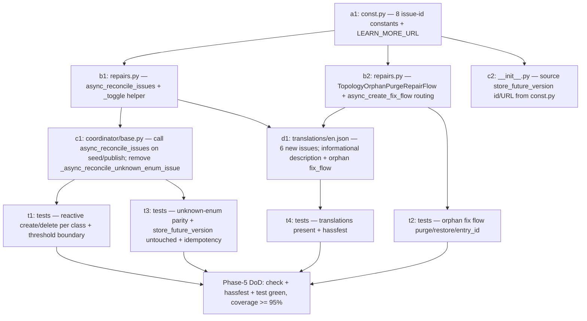

# Topology — Phase 5 Implementation Plan

**Status:** Implementation plan (frozen artifacts per PLAN-topology.md §10,
gate "Before Phase 5 (repairs + services)") · Last updated 2026-07-24

**Scope:** Phase 5 (**repairs only**) — the repair-issue layer on top of the
Phase 1–4 foundation. Phase 4 turned the four graph-consistency `health` lists
from empty to computed and cached them on `coordinator.derived.consistency`;
Phase 3 surfaced `unannotated_areas` as a house attribute; Phase 2 already
raises two non-fixable issues (`store_future_version`,
`unknown_enum_after_downgrade`). Phase 5 promotes those signals into the
Home Assistant **issue registry** (repair cards) — reactively, from the single
source Phase 4 built — and adds one guided fix flow (purge orphaned entries).
It writes **no** new derivation logic, **no** service, **no** diagnostics export,
**no** panel. Later phases are referenced only where Phase 5 must freeze an
artifact for them, or where a boundary is drawn.

**Binding inputs:** `PLAN-topology.md` (§1a entity model, §3.6–§3.7 health +
reactive registry integration, §5 v1 repair set, §7 consistency-check → repair
mapping, §8 Quality-Scale rows `repair-issues`/`exception-translations`, §10
gate "Before Phase 5"), `PLAN-topology-phase2.md` (§2.4 unknown-enum + future-
version policy, §4.11 frozen `health` shape, Appendix A.6 issue registry),
`PLAN-topology-phase3.md` (§3.1 house attributes incl. `unannotated_areas`),
`PLAN-topology-phase4.md` (§3 the four refined consistency checks, §5
`ConsistencyReport`/`TopologyDerived`), `DECISIONS.md` (ADRs "Registry-Driven
State With Reactive Cleanup", "Editing Surface", "Entity Model", "Release
Strategy"), `AGENTS.md` (package rules, layering, validation scripts,
translation strategy). The real code on `main` after the Phase-4 merge
(`custom_components/topology/{repairs,__init__,diagnostics}.py`,
`coordinator/base.py`, `websocket_api.py`, `entity_utils/derivations.py`,
`data.py`, `const.py`, `translations/en.json`) is the fixed substrate every
signature below is written against.

**Definition of done for Phase 5:** a developer implements Phase 5 from this
document alone in ~3 working days without going back to the design plan;
`script/check`, `script/hassfest`, and `script/test` green with ≥ 95 %
coverage on new Phase-5 code; every artifact in §2–§6 implemented exactly as
frozen here; every open decision in §10 ratified before code is written. No
store field, enum, WS command, entity, or `health` field changes — Phase 5 only
**consumes** `coordinator.derived` and the snapshot and **writes to the issue
registry**.

**How this document must be used:** §10 is not optional reading. The design
plan makes three statements Phase 5 must reconcile before code is written:
(1) §10 bundles the gate as "repairs + services" while the Phase-3/4 plans keep
services in Phase 6 (D1); (2) §8 maps `repair-issues` to **Phase 6** while §10's
own gate and §5 place them in Phase 5 (D1); (3) §10's frozen issue-id list omits
two checks (`isolated_areas`, `indoor_areas_without_floor`) that §7 and the
task explicitly call repair issues (D2). Ratify §10 first; the sections above it
already assume the recommended options.

---

## 1. Phase-5 delta table

Basis: the tree on `main` after the Phase-4 merge. "add" = new content, "extend"
= add to an existing file without changing frozen behavior, "refactor" = move
existing logic with no behavior change, "keep" = untouched. No store schema,
enum, WS response, `health` field, entity, or manifest change. The two existing
issues are **consolidated** into one reactive reconciler, not duplicated.

| Path                          | Action       | What changes                                                                                                                                                                                                                                           |
| ----------------------------- | ------------ | ------------------------------------------------------------------------------------------------------------------------------------------------------------------------------------------------------------------------------------------------------ |
| `const.py`                    | **extend**   | Issue-id constants (one per issue class), a shared `LEARN_MORE_URL`, and the `unannotated` threshold is already present (`DEFAULT_UNANNOTATED_REPAIR_THRESHOLD`). No storage/WS/entity constant touched. (§2, §10)                                     |
| `repairs.py`                  | **rewrite**  | Adds `async_reconcile_issues(hass, snapshot, derived)` — the single reactive reconciler for every snapshot-derived issue — plus `TopologyOrphanPurgeRepairFlow` (the one fix flow) and the `issue_id`→flow routing in `async_create_fix_flow`. (§2–§4) |
| `coordinator/base.py`         | **refactor** | `async_seed`/`async_publish` call `async_reconcile_issues(...)` instead of the private `_async_reconcile_unknown_enum_issue`; the unknown-enum logic **moves into** `repairs.py` (consolidation, no behavior change). No new call site. (§4, D3)       |
| `__init__.py`                 | **extend**   | `store_future_version` creation/clear stays here (setup-time, pre-snapshot); its literal id + URL now come from `const.py`. No other change. (§2.5, D3)                                                                                                |
| `translations/en.json`        | **extend**   | The `issues` block gains six new keys (title + description; the fixable orphan issue uses `fix_flow.step.confirm`). Existing two issue keys unchanged. No other block touched. (§5)                                                                    |
| `diagnostics.py`              | **keep**     | Stays the `{}` stub. Diagnostics **export** is Phase 6; §6 only **freezes the redaction ruleset** the §10 gate requires, as a spec Phase 6 consumes — no code here. (§6, D12)                                                                          |
| `data.py`                     | **keep**     | No new dataclass. The reconciler reads `TopologyDerived` (`house`, `consistency`) and `TopologySnapshot` (orphans, unknown enums) as they already exist. (§4)                                                                                          |
| `websocket_api.py`            | **keep**     | Untouched. `_build_health` already serializes the same lists; repairs read `coordinator.derived`, not the WS layer. No new command.                                                                                                                    |
| `entity_utils/derivations.py` | **keep**     | Untouched. `derive_consistency` (the four refined checks) and `derive_house` are the sole source; Phase 5 adds no derivation. (§4, D10)                                                                                                                |
| `tests/`                      | **add**      | `tests/test_repairs.py` — the Phase-5 test matrix (§8).                                                                                                                                                                                                |
| `manifest.json`               | **keep**     | No change. No version/tag/quality change (ADR "Release Strategy").                                                                                                                                                                                     |

**Phase-5 DoD:** every snapshot-derived defect surfaces as exactly one reactive
repair card (created when the condition holds, deleted when it clears);
`store_future_version` and `unknown_enum_after_downgrade` behave byte-for-byte
as before but are now reconciled through one path; the orphaned-entries card
offers a working "purge now" fix; `script/check` + `script/hassfest` +
`script/test` green.

---

## 2. Repair-issue catalog (frozen)

This is the primary artifact the §10 gate "Before Phase 5" requires frozen: one
`issue_id` per issue class, with severity, fixability, persistence, placeholders,
`learn_more_url`, the triggering condition (which `health` list / threshold),
and the resolution/deletion rule. `translation_key == issue_id` throughout
(HA convention, matching the two existing issues). All ids live in `const.py`.

Eight issue classes total: **two existing** (kept, reconciled through the new
path) + **six new**. No issue duplicates a `health` list — each keys exactly one.

### 2.1 Snapshot-derived issues (reactive; reconciled §4)

| `issue_id`                     | Severity  | `is_fixable` | `is_persistent` | Trigger condition (single source)                                                                                                                                         | Placeholders                             | Resolution / deletion                                                                                                                                      |
| ------------------------------ | --------- | ------------ | --------------- | ------------------------------------------------------------------------------------------------------------------------------------------------------------------------- | ---------------------------------------- | ---------------------------------------------------------------------------------------------------------------------------------------------------------- |
| `unannotated_areas_threshold`  | `WARNING` | `False`      | `False`         | `len(derived.house.unannotated_areas) >= snapshot.home_config.unannotated_repair_threshold` **and** threshold ≥ 1 (§3.1 house attr; ADR reactive add).                    | `count`, `threshold`                     | Deleted when the count drops below the threshold (annotation added, area removed, threshold raised).                                                       |
| `orphaned_registry_entries`    | `WARNING` | **`True`**   | `False`         | Any non-orphaned-filtered store entry carries `orphaned_at` — i.e. `health.orphaned_areas ∪ orphaned_edges ∪ orphaned_floors` is non-empty (§4.11).                       | `count`, `entry_id` (in fix-flow `data`) | Deleted when no orphan remains — because the user re-added the area (watcher auto-restores), the daily/startup purge ran, or the fix flow purged now (§3). |
| `isolated_areas`               | `WARNING` | `False`      | `False`         | `derived.consistency.isolated_areas` non-empty (§3.1 of Phase 4, D8).                                                                                                     | `count`                                  | Deleted when the list empties (an interior edge now touches every live area).                                                                              |
| `indoor_areas_without_floor`   | `WARNING` | `False`      | `False`         | `derived.consistency.indoor_areas_without_floor` non-empty (§3.2 of Phase 4, D9 — **only when the home uses floors**).                                                    | `count`                                  | Deleted when the list empties (floors assigned, or the home models no floors at all).                                                                      |
| `contradictory_bearings`       | `WARNING` | `False`      | `False`         | `derived.consistency.contradictory_bearings` non-empty (§3.3 of Phase 4, D10 — a side used as both interior edge and `beyond`).                                           | `count`                                  | Deleted when the list empties.                                                                                                                             |
| `exterior_on_non_outdoor_side` | `WARNING` | `False`      | `False`         | `derived.consistency.exterior_on_non_outdoor_side` non-empty (§3.4 of Phase 4, D11 — `earth`, **or** `neighbor` **and** `glazed`; a non-glazed neighbor door is allowed). | `count`                                  | Deleted when the list empties.                                                                                                                             |
| `unknown_enum_after_downgrade` | `WARNING` | `False`      | `False`         | `snapshot.unknown_enum_values` non-empty (§2.4 rule 2). **Existing** — behavior unchanged, reconciler now lives in `repairs.py`.                                          | `field`, `value`, `count`                | Deleted when no unknown enum values remain (re-upgrade). Unchanged from Phase 2.                                                                           |

All seven above are created/deleted **only** by `async_reconcile_issues` (§4).
`learn_more_url = LEARN_MORE_URL` (`https://github.com/jpawlowski/hass.topology`)
for every one (D11). Placeholders are **counts / enum field names only** — never
raw `area_id` lists — so the card text stays short and stable and no freetext
leaks into the issue registry (D9); the affected ids remain available via the
`health` signal and the house sensor's `unannotated_areas` attribute.

### 2.2 The `contradictory_bearings` / `exterior_on_non_outdoor_side` semantics are inherited, not re-derived

Both cards consume `derived.consistency` verbatim, so they carry Phase 4's
**refined** definitions automatically (D10): `indoor_areas_without_floor` fires
only when some registry area has a floor; `exterior_on_non_outdoor_side` flags
`earth` or a **glazed** opening on a `neighbor` side but **not** the §2.5
apartment door (a non-glazed door on a `neighbor` side). Phase 5 adds no check
and cannot drift from `health`/the panel — the task's "mirror the refined
semantics exactly" requirement is satisfied structurally.

### 2.3 Setup-time issue (not snapshot-derived)

| `issue_id`             | Severity | `is_fixable` | `is_persistent` | Trigger condition                                                                     | Placeholders | Resolution / deletion                                  |
| ---------------------- | -------- | ------------ | --------------- | ------------------------------------------------------------------------------------- | ------------ | ------------------------------------------------------ |
| `store_future_version` | `ERROR`  | `False`      | `False`         | `TopologyStore.async_load()` raises `StoreFutureVersionError` in `async_setup_entry`. | `version`    | Deleted on the next successful load (§ `__init__.py`). |

**Not** part of `async_reconcile_issues`: it is raised before any snapshot
exists (setup aborts with `ConfigEntryError`), so there is nothing to reconcile
from. It stays exactly where it is in `__init__.py` (D3); Phase 5 only sources
its literal id + URL from `const.py`.

### 2.4 Severity rationale (D7)

Only `store_future_version` blocks the integration from loading → `ERROR`.
Everything else is a data-quality or actionable-cleanup nag that leaves topology
fully functional → `WARNING`. Nothing renders HA itself unusable → **no
`CRITICAL`**. This matches the two severities already in the code.

### 2.5 Persistence rationale (D8)

Every issue is recomputed at setup — the snapshot-derived ones on the seed that
`async_setup_entry` performs, `store_future_version` on the load attempt — so
none needs to survive a restart independently of that recomputation.
`is_persistent = False` for all (the HA default; matches both existing issues).

---

## 3. Fix-flow entry points (`RepairsFlow`)

Exactly **one** issue is fixable; the other seven are informational
(`is_fixable=False`) and are cleared reactively when their condition ends
(the user may still dismiss/ignore them via the standard issue-registry UI).

### 3.1 `orphaned_registry_entries` → `TopologyOrphanPurgeRepairFlow` (fixable)

A guided **confirm-then-purge** flow. It subclasses `RepairsFlow` and mirrors
`ConfirmRepairFlow`'s two-step shape (verified, Appendix A.2), but the confirm
step has a side effect: it purges every currently-orphaned entry immediately
rather than waiting for the daily sweep.

```text
class TopologyOrphanPurgeRepairFlow(RepairsFlow):
    def __init__(self, entry_id: str) -> None:
        self._entry_id = entry_id

    async def async_step_init(user_input=None):
        return await self.async_step_confirm()

    async def async_step_confirm(user_input=None):
        if user_input is not None:
            entry = hass.config_entries.async_get_entry(self._entry_id)
            store = entry.runtime_data.store
            coordinator = entry.runtime_data.coordinator
            cutoff = dt_util.utcnow().isoformat()          # now > every orphaned_at
            snapshot, purged = await store.async_purge_orphans(cutoff)
            if purged:
                coordinator.async_publish(snapshot, "purge", purged)
            return self.async_create_entry(data={})        # HA removes the issue
        return self.async_show_form(step_id="confirm", data_schema=vol.Schema({}))
```

- **What the fix does:** calls the existing
  `TopologyStore.async_purge_orphans(cutoff_iso)` with `cutoff = utcnow()`
  (every `orphaned_at` is in the past, so all orphans purge), then publishes a
  `"purge"` change through the coordinator so entities and the `health` signal
  update. Completing the flow makes HA delete the issue; the follow-up
  `async_publish` also reconciles it away (§4) — both paths converge, no double
  card. (D6)
- **`entry_id` plumbing:** the reconciler creates the issue with
  `data={"entry_id": entry.entry_id}` (D6); `async_create_fix_flow` receives
  that `data` and constructs the flow with it, so the flow resolves
  `runtime_data` without guessing the singleton. (Singleton is guaranteed by
  `single_config_entry: true`, but keying on the passed id is explicit and
  test-friendly.)
- **Alternative offered (not recommended):** a non-fixable orphan card that only
  waits for the daily purge. Rejected — the ADR "Registry-Driven State"
  explicitly promises a "purge now" action, and the store already exposes the
  method.

### 3.2 The seven informational issues (not fixable)

`unannotated_areas_threshold`, `isolated_areas`, `indoor_areas_without_floor`,
`contradictory_bearings`, `exterior_on_non_outdoor_side`,
`unknown_enum_after_downgrade`, and `store_future_version` are all
`is_fixable=False`. Their real remediation is **annotating areas / editing the
graph**, which is the panel's job — and the panel is **Phase 7** (D4). Shipping
a `ConfirmRepairFlow` that only dismisses the card would be a fake fix; instead
each card is a clear, translated statement with a `learn_more_url`, auto-cleared
when the underlying `health` list empties. When the panel lands (Phase 7) these
can gain a deep-link fix flow **without changing the frozen ids** — the
`ADR "Editing Surface"` note that "repair-issue fix-flows may deep-link into
panel routes" is a Phase-7 upgrade, not a Phase-5 obligation (D4).

### 3.3 `async_create_fix_flow` routing

```text
async def async_create_fix_flow(hass, issue_id, data):
    if issue_id == ISSUE_ORPHANED_ENTRIES:
        return TopologyOrphanPurgeRepairFlow(entry_id=data["entry_id"])
    return ConfirmRepairFlow()   # defensive default; no other issue is fixable
```

HA only calls `async_create_fix_flow` for issues created with `is_fixable=True`,
so in practice only the orphan branch is reached; the `ConfirmRepairFlow`
fallback keeps the entry point valid (unchanged intent from the Phase-1 stub).

---

## 4. Where and when issues are created / deleted (reactive, single source)

All snapshot-derived issues are reconciled in **one** function, called on every
seed and every publish — the exact hooks that already recompute
`coordinator.derived` and reconcile the unknown-enum issue today. No new call
site, no timer, no duplicate derivation.

### 4.1 `repairs.async_reconcile_issues(hass, snapshot, derived)`

```text
@callback
def async_reconcile_issues(hass, snapshot, derived) -> None:
    entry_id = <the singleton entry's id>          # for the fixable orphan data
    threshold = snapshot.home_config.unannotated_repair_threshold
    _toggle(hass, ISSUE_UNANNOTATED_THRESHOLD,
            active = threshold >= 1 and len(derived.house.unannotated_areas) >= threshold,
            placeholders = {"count": ..., "threshold": ...})
    orphan_count = <count of orphaned areas+edges+floors in snapshot>
    _toggle(hass, ISSUE_ORPHANED_ENTRIES, active = orphan_count > 0,
            is_fixable=True, data={"entry_id": entry_id},
            placeholders={"count": orphan_count})
    c = derived.consistency
    _toggle(hass, ISSUE_ISOLATED_AREAS,          active=bool(c.isolated_areas),               placeholders={"count": len(c.isolated_areas)})
    _toggle(hass, ISSUE_INDOOR_WITHOUT_FLOOR,     active=bool(c.indoor_areas_without_floor),   placeholders={"count": len(c.indoor_areas_without_floor)})
    _toggle(hass, ISSUE_CONTRADICTORY_BEARINGS,   active=bool(c.contradictory_bearings),       placeholders={"count": len(c.contradictory_bearings)})
    _toggle(hass, ISSUE_EXTERIOR_NON_OUTDOOR,     active=bool(c.exterior_on_non_outdoor_side), placeholders={"count": len(c.exterior_on_non_outdoor_side)})
    _toggle(hass, ISSUE_UNKNOWN_ENUM,            active=bool(snapshot.unknown_enum_values),
            placeholders={"field": ..., "value": ..., "count": ...})
```

- `_toggle(...)` is a tiny local helper: when `active`, call
  `ir.async_create_issue(...)` (idempotent — HA updates an existing issue in
  place, so repeated publishes never stack cards); when not, call
  `ir.async_delete_issue(hass, DOMAIN, issue_id)` (a no-op if absent). This is
  exactly the shape the coordinator's current `_async_reconcile_unknown_enum_issue`
  uses (`create` else `delete`), generalized to eight ids. (Appendix A.1)
- The unknown-enum block is the **moved** existing logic (byte-identical
  placeholders `field`/`value`/`count`), so the Phase-2 behavior is preserved
  and the coordinator no longer owns issue code (D3).
- `orphan_count` is derived from the snapshot the same way `_build_health`
  already computes `orphaned_areas`/`orphaned_edges`/`orphaned_floors`
  (`orphaned_at is not None`); the reconciler reuses that rule, it does not
  invent a new one.

### 4.2 Coordinator wiring (`coordinator/base.py`)

`async_seed(snapshot)` and `async_publish(snapshot, change, ids)` replace the
call to `self._async_reconcile_unknown_enum_issue(snapshot)` with
`async_reconcile_issues(self.hass, snapshot, self.derived)` (placed **after**
`self.derived` is refreshed, which both methods already do first). The private
method and `_UNKNOWN_ENUM_ISSUE` constant are removed from the coordinator. No
new registry read — `derived` is already computed there.

Because `async_publish` fires on every store mutation and every
area/floor-registry event (the Phase-2 watcher), and the fix flow itself calls
`async_publish` after purging, the issue set is always consistent with the live
snapshot without any extra scheduling. The ADR's "area add → repair once the
count crosses a threshold" and "orphan → repair offering purge now" are both
realized here.

### 4.3 Import-cycle note

`coordinator/base.py` imports `async_reconcile_issues` from
`custom_components.topology.repairs`. `repairs.py` must therefore **not** import
the coordinator at module load — it references `entry.runtime_data.coordinator`
only inside the fix-flow method body (runtime), and types the coordinator/store
under `TYPE_CHECKING`. This keeps the dependency one-directional
(coordinator → repairs) and avoids a cycle. (D3)

---

## 5. Translations key set (frozen; hassfest-conform)

Only `translations/en.json` is authored (AGENTS.md translation strategy). The
`issues` block gains the six new keys; the existing `store_future_version` and
`unknown_enum_after_downgrade` entries are unchanged. hassfest validates each
issue against `gen_issues_schema`: every entry needs `title` **plus exactly one
of** `description` **or** `fix_flow` (Appendix A.3). The seven informational
issues use `description`; the one fixable issue uses `fix_flow.step.confirm`.

### 5.1 Informational issues — `title` + `description`

Keys (English strings filled at implementation; placeholders match §2):

```text
issues.unannotated_areas_threshold.title
issues.unannotated_areas_threshold.description        # uses {count}, {threshold}
issues.isolated_areas.title
issues.isolated_areas.description                     # uses {count}
issues.indoor_areas_without_floor.title
issues.indoor_areas_without_floor.description         # uses {count}
issues.contradictory_bearings.title
issues.contradictory_bearings.description             # uses {count}
issues.exterior_on_non_outdoor_side.title
issues.exterior_on_non_outdoor_side.description       # uses {count}
```

`unknown_enum_after_downgrade` and `store_future_version` already exist in this
shape and are left as-is.

### 5.2 Fixable issue — `title` + `fix_flow.step.confirm`

The orphan card has no top-level `description` (mutually exclusive with
`fix_flow`, Appendix A.3); its user-facing body is the confirm step:

```text
issues.orphaned_registry_entries.title                                 # uses {count}
issues.orphaned_registry_entries.fix_flow.step.confirm.title
issues.orphaned_registry_entries.fix_flow.step.confirm.description      # "Purge now / keep waiting" copy
```

`step.confirm` matches the flow's `step_id="confirm"` (§3.1). No `data` /
`data_description` sub-keys are needed (the confirm form is an empty schema).

### 5.3 hassfest

`script/hassfest` validates that every `issue_id` created in code has a matching
`issues.<id>` entry with the right shape, and that the fixable issue's
`fix_flow` is a well-formed data-entry schema. Generate the block to pass on
first run. `exception-translations` (§8 Gold row) is **not** in scope — no
service actions raise translated exceptions until Phase 6; Phase 5 adds no
`exceptions` block (D1).

---

## 6. Diagnostics redaction ruleset (frozen artifact; no code in Phase 5)

The §10 gate lists "Diagnostics redaction rules" alongside repairs "Before
Phase 5". The diagnostics **export** (`diagnostics.py`, `async_redact_data`) is
Phase 6 (PLAN-topology.md §8 `diagnostics` row; Phase-4 plan §6). Phase 5 does
**not** implement it — but it **freezes the ruleset** so the gate is satisfied
and Phase 6 has a fixed target (D12). `diagnostics.py` stays the `{}` stub.

**Store contents reviewed (from `data.py`):** `HomeConfig`
(`occupancy_extent`, projection booleans, `imports_done_at_*`,
`unannotated_repair_threshold`), `AreaAnnotation`
(`type`, `environment`, `trust`, `beyond`, `exterior_connections`,
`orphaned_at`), `Edge`/`Connection` (`passage`, `barrier`, `side`, `glazed`,
`sensor_entity_id`, `perimeter_override`, `inline_trust`, `orphaned_at`),
`FloorOverride` (`level_override`, `orphaned_at`), `UnknownEnumValue`. **None
carries credentials, tokens, or location coordinates.**

Frozen redaction rules for the Phase-6 export:

| Field / source                                                                                    | Rule                               | Reason                                                                                                       |
| ------------------------------------------------------------------------------------------------- | ---------------------------------- | ------------------------------------------------------------------------------------------------------------ |
| Registry-derived **area / floor display names** (if the export denormalizes them for readability) | **redact** via `async_redact_data` | Human-chosen names can carry personal detail ("Anna's room"); the stable `area_id`/`floor_id` keys are kept. |
| `AreaAnnotation.type` (open catalog — arbitrary user string)                                      | **redact** the value               | The only free-text field in the store (e.g. a custom `type`); could encode a personal label.                 |
| `sensor_entity_id` on connections                                                                 | keep                               | An entity id, not PII; consumers need it for support debugging (perimeter wiring).                           |
| `area_id`, `floor_id`, `edge_id`, enums, booleans, timestamps                                     | keep                               | Stable machine keys / enumerated values — non-sensitive by design (PLAN-topology.md §3).                     |
| Orphaned entries (`orphaned_at` set)                                                              | keep (included)                    | ADR "Registry-Driven State" wants orphans in diagnostics for debuggability.                                  |

Phase 5's own issue placeholders already honor this ruleset by construction:
they carry only counts, enum **field names** (not user values beyond the one
example already shipped in `unknown_enum_after_downgrade`), and no display
names (D9) — so the repair layer introduces nothing new to redact.

---

## 7. Boundaries: Phase 6+ and what stays put

Explicit fences so no later-phase work is pulled forward.

| Item                                                                           | Owner phase | Phase 5 stance                                                                                                   |
| ------------------------------------------------------------------------------ | ----------- | ---------------------------------------------------------------------------------------------------------------- |
| Service actions (`annotate_area`, `declare_connection`, `set_beyond`, imports) | Phase 6     | **Not added.** `service_actions/` untouched; `async_setup` already calls `async_setup_services` (a no-op today). |
| `exception-translations` (`strings.json` `exceptions` block)                   | Phase 6     | **Not added.** No topology code raises a translated exception until services land (D1).                          |
| Diagnostics **export** code (`diagnostics.py`, `async_redact_data`)            | Phase 6     | Stub kept; only the **redaction ruleset** is frozen (§6, D12).                                                   |
| Label projection execution, one-shot imports execution                         | Phase 6     | Inert `projection_toggles` / `imports_done_at` store fields stay inert. No repair drives them.                   |
| Panel / 2D map / deep-link fix flows                                           | Phase 7     | Nothing frontend. Informational cards carry a `learn_more_url` only; deep-links are a Phase-7 upgrade (D4).      |
| New consistency checks / derivations / aggregates                              | —           | Out of scope. Phase 5 consumes `derived.consistency` verbatim; adds no check (D10).                              |
| New store field / enum / WS command / entity / manifest-version change         | —           | None. Repairs write only to the issue registry.                                                                  |

Phase 5 adds **no** new store field, **no** new enum, **no** WS command, **no**
entity, **no** manifest/version/tag change. The only new outward surface is the
issue-registry cards and the one fix flow.

---

## 8. Test matrix (Phase 5)

Style per §7 of the Phase-4 plan: IDs + fixtures, no bodies. New fixtures in
`tests/conftest.py`: `unannotated_payload` (a store payload + registry with N
unannotated areas around a set threshold), `orphaned_payload` (a payload whose
area + edge already carry `orphaned_at`, or a helper that removes a registry
area to trigger orphaning through the watcher), and `repairs_client`
(`async_process_repairs_platforms` + the `repairs/list_issues` /
`repairs/apply_fix` WS helpers, or `hass_client()` for the fix-flow HTTP steps).
Reuses `setup_integration`, `area_registry`, `two_floor_registry`,
`store_payload_full`, `load_payload`, `hass_ws_client`,
and the Phase-4 consistency fixtures. ≥ 95 % on new code.

### Reactive creation / deletion (per issue class)

| ID                                         | Purpose                                                                                                           | Fixtures                                                                 |
| ------------------------------------------ | ----------------------------------------------------------------------------------------------------------------- | ------------------------------------------------------------------------ |
| `test_no_issues_when_healthy`              | Fully-wired §2.5 home → **zero** topology issues in the registry, `health.status == ok`.                          | setup_integration, store_payload_full, area_registry, two_floor_registry |
| `test_unannotated_threshold_created`       | Unannotated count == threshold → `unannotated_areas_threshold` present with `{count, threshold}`.                 | setup_integration, unannotated_payload                                   |
| `test_unannotated_threshold_boundary`      | count == threshold-1 → **no** issue; count == threshold → issue (off-by-one boundary, D5).                        | setup_integration, unannotated_payload                                   |
| `test_unannotated_threshold_cleared`       | Annotating an area below the threshold deletes the issue (reactive publish).                                      | setup_integration, unannotated_payload, hass_ws_client                   |
| `test_unannotated_threshold_zero_disables` | `unannotated_repair_threshold` semantics: threshold ≥ 1 required; never fires at a nonsensical value.             | setup_integration, unannotated_payload                                   |
| `test_isolated_areas_issue`                | An area with no interior edge → `isolated_areas` issue; removing the isolation clears it.                         | setup_integration, area_registry                                         |
| `test_indoor_without_floor_issue`          | Indoor floorless area **with the home using floors** → issue; a floors-less home raises none (mirrors D9).        | setup_integration, area_registry, two_floor_registry                     |
| `test_contradictory_bearings_issue`        | Same-side edge + `beyond` on one area → `contradictory_bearings` issue (mirrors D10).                             | setup_integration, area_registry                                         |
| `test_exterior_non_outdoor_issue`          | Glazed opening on a `neighbor` side → issue; a **non-glazed** neighbor door raises **none** (mirrors D11).        | setup_integration, area_registry                                         |
| `test_unknown_enum_issue_parity`           | `unknown_enum_after_downgrade` still created/cleared with `{field, value, count}` after the move to `repairs.py`. | setup_integration, store_payload_full                                    |
| `test_store_future_version_untouched`      | The reconciler never creates/deletes `store_future_version`; it remains `__init__`-owned (setup path).            | hass, mock_config_entry                                                  |

### Orphaned entries + fix flow

| ID                                       | Purpose                                                                                                 | Fixtures                                             |
| ---------------------------------------- | ------------------------------------------------------------------------------------------------------- | ---------------------------------------------------- |
| `test_orphaned_issue_on_area_removal`    | Removing a registry area orphans its annotation/edge → `orphaned_registry_entries` issue, `is_fixable`. | setup_integration, area_registry, store_payload_full |
| `test_orphaned_issue_cleared_on_restore` | Re-adding the area (watcher `async_restore_area`) clears the issue **without** purging data.            | setup_integration, area_registry, store_payload_full |
| `test_orphan_fix_flow_purges`            | Running the fix flow calls `async_purge_orphans(now)`, removes the orphans, deletes the issue.          | setup_integration, orphaned_payload, repairs_client  |
| `test_orphan_fix_flow_publishes`         | The purge fans out a `"purge"` change so `health.orphaned_*` and entities update.                       | setup_integration, orphaned_payload, hass_ws_client  |
| `test_orphan_issue_carries_entry_id`     | The created issue's `data` carries `entry_id`; the flow resolves `runtime_data` from it.                | setup_integration, orphaned_payload                  |

### Idempotency, consolidation, translations

| ID                                      | Purpose                                                                                            | Fixtures                                         |
| --------------------------------------- | -------------------------------------------------------------------------------------------------- | ------------------------------------------------ |
| `test_reconcile_idempotent`             | Two consecutive publishes with the same defect yield **one** card, not two (create is idempotent). | setup_integration, unannotated_payload           |
| `test_reconcile_runs_on_seed`           | Issues exist immediately after setup (seed path), before any mutation.                             | setup_integration, unannotated_payload           |
| `test_reconcile_runs_on_registry_event` | A registry event (area add) re-runs the reconciler and toggles the threshold issue.                | setup_integration, area_registry, hass_ws_client |
| `test_issue_placeholders_no_area_ids`   | No issue placeholder contains a raw `area_id` list — counts/field names only (D9).                 | setup_integration, unannotated_payload           |
| `test_issue_translations_present`       | Every created `issue_id` has an `issues.<id>` entry; the fixable one has `fix_flow.step.confirm`.  | —                                                |
| `test_hassfest_issue_translations`      | hassfest passes for the extended `issues` block (CI parity).                                       | —                                                |

(~26 tests. No bodies here — Phase-5 implementation writes them. The ≥ 95 %
coverage obligation continues from Phase 3, PLAN-topology.md §8.)

---

## 9. Umsetzungs-DAG (cluster ordering)

"A → B" = A must precede B. Letters match the clusters a single developer would
tackle over ~3 days.



Practical sequencing (~3 days): day 1 = a1 + b1/b2 (the reconciler + fix flow,
the keystone) with t1/t2 alongside; day 2 = c1 + c2 (coordinator refactor,
unknown-enum move) with t3, then d1 (translations); day 3 = t4, coverage to
≥ 95 %, hassfest + lint loop. Parallelization: d1 (translations) depends only on
the id constants (a1) and can be done alongside c1 by a second developer.

---

## 10. Decision protocol (D1–D13)

Every place the design plan leaves room, or where this plan diverges from it,
with a recommended, minimal-invasive option. **Ratify before Phase-5 code is
written.** The sections above assume the recommended option.

| #   | Question / gap                                                  | Recommended option                                                                                                                                                                                                                                                | Note / contradiction                                                                                                                                                                                                                                                                        |
| --- | --------------------------------------------------------------- | ----------------------------------------------------------------------------------------------------------------------------------------------------------------------------------------------------------------------------------------------------------------- | ------------------------------------------------------------------------------------------------------------------------------------------------------------------------------------------------------------------------------------------------------------------------------------------- |
| D1  | Phase-5 scope: repairs only, or "repairs + services"?           | **Repairs only.** Services + `exception-translations` + diagnostics export + label projection + imports stay Phase 6; panel Phase 7 — matching the Phase-3/4 cadence.                                                                                             | **Contradicts PLAN-topology.md §10** (gate reads "repairs + services") **and §8** (maps `repair-issues`/`diagnostics`/`exception-translations` to **Phase 6**). Ratify the split; annotate the §8 rows so `repair-issues` reads Phase 5.                                                    |
| D2  | Which health lists become repair issues?                        | **All six** the task names — `unannotated_areas_threshold`, `orphaned_registry_entries`, `isolated_areas`, `indoor_areas_without_floor`, `contradictory_bearings`, `exterior_on_non_outdoor_side` — plus the two existing.                                        | **§10's frozen id list omits** `isolated_areas` and `indoor_areas_without_floor`; **§7 names them repair issues**. This plan follows §7 + the task (the §10 list was illustrative "one id per class", not exhaustive). Ratify.                                                              |
| D3  | Where does issue reconciliation live?                           | One `async_reconcile_issues(hass, snapshot, derived)` in **`repairs.py`**, called from `coordinator.async_seed/async_publish`; move the existing unknown-enum reconciler out of the coordinator into it. `store_future_version` stays in `__init__` (setup-time). | Consolidates ("nicht doppeln"); AGENTS.md keeps `repairs.py` as the documented issue home. One-directional import (coordinator → repairs), fix flow reads `runtime_data` at call time (§4.3).                                                                                               |
| D4  | Fixability of the annotation/consistency cards                  | **`is_fixable=False`** (informational) for all five consistency/threshold cards; real remediation is the **panel (Phase 7)**. No fake confirm-only flow. Deep-link fix flows are a Phase-7 upgrade keeping the same ids.                                          | ADR "Editing Surface" allows deep-linking fix flows into panel routes — but the panel does not exist until Phase 7, so Phase 5 ships informational cards + `learn_more_url`.                                                                                                                |
| D5  | `unannotated_areas_threshold` trigger                           | `len(derived.house.unannotated_areas) >= home_config.unannotated_repair_threshold`, threshold ≥ 1; clears below. Placeholders `{count, threshold}`.                                                                                                               | Consumes the Phase-3 house attribute + the Phase-2 configurable threshold; the ADR's "area add → repair past a threshold" realized. The attribute always lists; the card is the escalation.                                                                                                 |
| D6  | `orphaned-past-undo` naming + semantics                         | Fire **while orphans exist** (within the undo window) as `orphaned_registry_entries`, **`is_fixable=True`** → "purge now" via `async_purge_orphans(utcnow())`. Auto-clears on restore, daily purge, or the fix.                                                   | **Divergence from §5's "orphaned edges past undo window"** — past-window entries are already auto-purged by the watcher, so surfacing them _after_ the window has nothing to act on. Surfacing them _while actionable_ matches the ADR's "restore / purge now". Ratify the rename + timing. |
| D7  | Severity mapping                                                | `store_future_version` = **ERROR** (blocks load); every other issue = **WARNING**; no **CRITICAL**.                                                                                                                                                               | Matches the two severities already in the code; nothing renders HA unusable.                                                                                                                                                                                                                |
| D8  | `is_persistent`                                                 | **`False`** for all eight (recomputed at every setup/seed; HA default).                                                                                                                                                                                           | Matches both existing issues; nothing must outlive a restart independent of the snapshot.                                                                                                                                                                                                   |
| D9  | Issue placeholder content                                       | **Counts + enum field names only** — no raw `area_id`/name lists in card text.                                                                                                                                                                                    | Keeps card text short/stable and leaks no freetext into the issue registry; affected ids stay available via `health` + the house attribute. Consistent with §6.                                                                                                                             |
| D10 | Re-derive the consistency checks for repairs, or consume?       | **Consume `derived.consistency` verbatim** — no check re-implemented; the Phase-4-refined semantics (indoor-uses-floors, earth/neighbor+glazed, non-glazed neighbor door allowed) are inherited automatically.                                                    | Single source; repairs, `health`, and the panel can never drift. Satisfies the task's "mirror the refined semantics exactly".                                                                                                                                                               |
| D11 | `learn_more_url` per issue                                      | One shared `LEARN_MORE_URL` (the repo) in `const.py`, reused by `__init__` + `repairs`. Per-issue doc anchors deferred to Phase 8 docs.                                                                                                                           | Docs pages (`docs/user/`) are Phase 8; the repo URL is the stable interim target, matching the existing `_LEARN_MORE_URL`.                                                                                                                                                                  |
| D12 | Diagnostics-redaction rules — freeze here or defer with export? | **Freeze the ruleset here** (§6, spec only) to satisfy the §10 gate; **implement `diagnostics.py` in Phase 6**. `diagnostics.py` stays the `{}` stub in Phase 5.                                                                                                  | §10 lists redaction "Before Phase 5", but the export it governs is Phase 6 (§8 `diagnostics` row). Freezing the rule set (not the code) reconciles both.                                                                                                                                    |
| D13 | Any new store field / enum / WS command for repairs?            | **None.** Repairs read `coordinator.derived` + the snapshot and write only to the issue registry.                                                                                                                                                                 | Consistent with Phases 3–4: additive, no frozen-contract change.                                                                                                                                                                                                                            |

**Explicit contradictions to ratify:** **D1** (§10 "repairs + services" and §8's
Phase-6 mapping of `repair-issues`), **D2** (§10's issue-id list omits two checks
§7 calls repairs), and **D6** (`orphaned-past-undo` timing vs. the auto-purge
that already removes past-window entries). Everything else fills a gap the design
left open.

---

## Appendix A — HA 2026.4.4 signature verification

Signatures verified against the pinned test target (`homeassistant`
**2026.4.4**, the version `pytest-homeassistant-custom-component==0.13.325`
installs; Python 3.14.6). No devcontainer venv was available in the planning
environment, so signatures were verified against the `home-assistant/core`
git tag **2026.4.4** (raw file fetches) — the same version the implementation
session installs and introspects. Line numbers refer to that tag. These
supplement the Phase-2 appendix (A.6 issue registry `async_create_issue`).

### A.1 `homeassistant/helpers/issue_registry.py`

- `IssueSeverity` (lines 43–47): `CRITICAL = "critical"`, `ERROR = "error"`, `WARNING = "warning"`. Phase 5 uses `ERROR` (future-version) and `WARNING` (all others), no `CRITICAL` (§2.4, D7).
- `async_create_issue(hass, domain, issue_id, *, breaks_in_ha_version=None, data=None, is_fixable, is_persistent=False, issue_domain=None, learn_more_url=None, severity, translation_key, translation_placeholders=None) -> None` — lines 248–273 (`@callback`). `data` is `dict[str, str | int | float | None] | None`; the fixable orphan issue passes `data={"entry_id": <str>}` (§3.1/§4.1).
- `async_delete_issue(hass, domain, issue_id) -> None` — lines 292–298 (`@callback`); a no-op when the issue is absent, so `_toggle`'s delete branch is safe to call unconditionally (§4.1).
- `async_ignore_issue(hass, domain, issue_id, ignore) -> None` — lines 317–323. Not called by Phase 5; the informational cards are user-dismissable through the standard UI without integration code.
- Synchronous `create_issue`/`delete_issue` wrappers exist (lines 276–306) but the coordinator path is already inside `@callback` context, so the `async_*` forms are used (as today).

### A.2 `homeassistant/components/repairs/` — `RepairsFlow`, `ConfirmRepairFlow`, platform protocol

- `models.py`: `class RepairsFlow(data_entry_flow.FlowHandler)` with public attributes `issue_id: str` and `data: dict[str, str | int | float | None] | None`. The base `FlowHandler` supplies `async_show_form(...)`, `async_create_entry(...)`, and `self.hass`/`self.handler` — used by the confirm step (§3.1).
- `models.py`: `class RepairsProtocol(Protocol)` — the platform interface: `async def async_create_fix_flow(self, hass, issue_id, data) -> RepairsFlow`. The module `async_create_fix_flow` in `repairs.py` implements exactly this signature (already present as the Phase-1 stub; §3.3).
- `issue_handler.py`: `class ConfirmRepairFlow(RepairsFlow)` — lines 24–48; `async_step_init(user_input=None)` delegates to `async_step_confirm(user_input=None)`, which returns `self.async_create_entry(data={})` when `user_input is not None`, else `self.async_show_form(step_id="confirm", data_schema=vol.Schema({}), description_placeholders=<issue.translation_placeholders>)`. `TopologyOrphanPurgeRepairFlow` mirrors this two-step shape and adds the purge side effect in the confirm branch (§3.1).
- `__init__.py` `__all__`: `"ConfirmRepairFlow"`, `"RepairsFlow"`, `"RepairsFlowManager"`, `"repairs_flow_manager"`, `"DOMAIN"` — the public imports; `repairs.py` imports `ConfirmRepairFlow` (already) and `RepairsFlow` (new, for the subclass).
- On successful fix-flow completion (`async_create_entry`) the `RepairsFlowManager` deletes the issue automatically; the follow-up `async_publish` → `async_reconcile_issues` also clears it — both converge on a single removal (§3.1, §4.2).

### A.3 `script/hassfest/translations.py` — `issues` schema

- `gen_issues_schema` (lines 326–343): each issue is `cv.has_at_least_one_key("description", "fix_flow")` **and** a schema of `{Required("title"): translation_value_validator, Exclusive("description", "fixable"): translation_value_validator, Exclusive("fix_flow", "fixable"): gen_data_entry_schema(...)}`. So `description` and `fix_flow` are mutually exclusive; `title` is always required. The seven informational issues use `title` + `description`; `orphaned_registry_entries` uses `title` + `fix_flow` (§5).
- `gen_data_entry_schema` (lines 241–324, invoked with `require_step_title=False`): the `fix_flow` value carries a `step` object whose entries allow `title`, `description`, `data`, `data_description`, `menu_options`, `submit`, `sections`. Phase 5 uses `fix_flow.step.confirm.{title, description}` only (empty confirm form; §5.2).

### A.4 Existing topology substrate (verified on `main`, Phase-1..4 merged)

- `custom_components/topology/__init__.py`: `async_setup_entry` raises `StoreFutureVersionError` → `ir.async_create_issue(... "store_future_version" ..., is_fixable=False, severity=ERROR, translation_placeholders={"version": ...})`, and `ir.async_delete_issue(... "store_future_version")` on successful load. Phase 5 keeps this verbatim, sourcing the id + URL from `const.py` (§2.5, D3).
- `custom_components/topology/coordinator/base.py`: `_async_reconcile_unknown_enum_issue(snapshot)` creates/deletes `"unknown_enum_after_downgrade"` (WARNING, `is_fixable=False`, placeholders `field`/`value`/`count`) and is called from `async_seed` **and** `async_publish` after `self.derived` is refreshed. Phase 5 replaces the call with `async_reconcile_issues(self.hass, snapshot, self.derived)` and moves the unknown-enum body into it unchanged (§4.2, D3).
- `custom_components/topology/store.py`: `async_purge_orphans(cutoff_iso) -> tuple[TopologySnapshot, list[str]]` removes entries whose `orphaned_at < cutoff_iso`; the fix flow passes `cutoff = dt_util.utcnow().isoformat()` to purge all currently-orphaned entries (§3.1). `async_restore_area(area_id, present)` (watcher path) clears orphan flags on re-add — the non-fix clearing route (§3.1, test `test_orphaned_issue_cleared_on_restore`).
- `custom_components/topology/data.py`: `TopologyDerived.house: HouseProjection` (`unannotated_areas: tuple[str, ...]`) and `TopologyDerived.consistency: ConsistencyReport` (the four sorted `tuple[str, ...]` lists) are the reconciler's sole derived inputs; `TopologySnapshot.unknown_enum_values` and the `orphaned_at` fields on `areas`/`edges`/`floors` are its snapshot inputs (§4.1). `HomeConfig.unannotated_repair_threshold: int` supplies the threshold (§2.1, D5).
