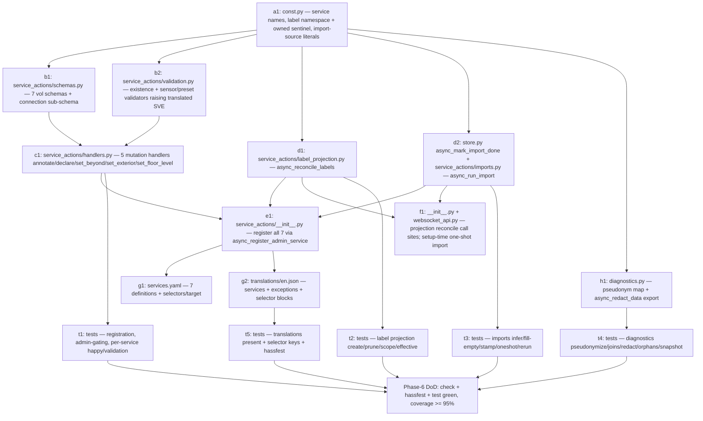

# Topology — Phase 6 Implementation Plan

**Status:** Implementation plan (frozen artifacts per PLAN-topology.md §10,
gate "Before Phase 5 (repairs + services)" — the **services** half, split out to
Phase 6 by PLAN-topology-phase5.md D1) · Last updated 2026-07-24

**Scope:** Phase 6 (**services + exception-translations + diagnostics export +
label-projection + one-shot imports**) — the action layer on top of the
Phase 1–5 foundation. Phase 2 built the store mutation methods and the admin
WebSocket write surface; Phase 3 added the entity set; Phase 4 filled the
derivations; Phase 5 (PR #8, merged) promoted the consistency signals into
repair cards and **froze** the diagnostics-redaction ruleset (Phase-5 §6) for
this phase to implement. Phase 6 turns four inert things on:

1. the **v1 service set** in `service_actions/` (today a no-op
   `async_setup_services`), registered in `async_setup` (Quality-Scale
   `action-setup`), with `services.yaml` definitions, voluptuous schemas, and
   translated exceptions (`action-exceptions`);
2. the **`exceptions` translation block** for the errors those services raise;
3. the **diagnostics export** (`diagnostics.py`, today a `{}` stub) implementing
   the Phase-5 §6 ruleset verbatim (pseudonymization + `async_redact_data`);
4. **label-projection execution** and **one-shot imports execution** — the
   `projection_toggles` and `imports_done_at` store fields, recorded but inert
   since Phase 2, become effective.

Nothing from Phase 7+ is implemented here; later phases are referenced only
where Phase 6 must freeze an artifact for them, or where a boundary is drawn. In
particular the **panel**, the **2D map**, and **deep-link repair fix-flows**
stay Phase 7; no new entity, enum, WebSocket command, or derivation is added
(the two new mutation helpers Phase 6 needs — one store method and two action
executors — are justified in §7/§9, not contract changes).

**Binding inputs:** `PLAN-topology.md` (§1a entities+services list, §5 v1
service set + repair/diagnostics/projection/imports scope, §6 label-projection
policy, §8 Quality-Scale rows `action-setup`/`action-exceptions`/`diagnostics`/
`exception-translations`, §10 gate "Before Phase 5 (repairs + services)"),
`PLAN-topology-phase2.md` (§2 store schema, §3 enum catalog + preset-expansion
table, §4 WS write contract this set mirrors, §5 config-flow field set / import
opt-ins), `PLAN-topology-phase3.md` (§4 id scheme, §7 `TopologyDerived`),
`PLAN-topology-phase4.md` (§3 the four consistency checks, §5 aggregates),
`PLAN-topology-phase5.md` (**§6 the frozen diagnostics-redaction ruleset Phase 6
implements**, §7 boundaries — services/diagnostics-export/exception-translations
placed in Phase 6 by D1/D12), `DECISIONS.md` (ADRs "Editing Surface" — panel is
the primary editor, services for automation/imports, writes admin-gated;
"Registry-Driven State"; "Entity Model"; "Release Strategy"), `AGENTS.md`
(package rules, `service_actions/` home + `async_setup` registration, layering,
validation scripts, translation strategy — `en.json` + `services.yaml` only).
The real code on `main` after the Phase-5 merge
(`custom_components/topology/{service_actions/__init__,store,websocket_api,
coordinator/base,diagnostics,data,__init__,const}.py`,
`config_flow_handler/`, `entity_utils/derivations.py`,
`translations/en.json`, `services.yaml`) is the fixed substrate every signature
below is written against.

**Definition of done for Phase 6:** a developer implements Phase 6 from this
document alone in ~3–4 working days without going back to the design plan;
`script/check`, `script/hassfest`, and `script/test` green with ≥ 95 %
coverage on new Phase-6 code; every artifact in §2–§6 implemented exactly as
frozen here; every open decision in §9 ratified before code is written. No store
**schema** change beyond the single additive `async_mark_import_done` writer
(the `imports_done_at` field it stamps already exists, §7/D9); no enum, WS
command, entity, `health` field, or manifest/version/tag change. The diagnostics
export must reproduce the Phase-5 §6 ruleset **without drift** — §4 only refines
it to an implementable spec.

**How this document must be used:** §9 is not optional reading. The design plan
leaves three things to reconcile before code is written: (1) §10's gate bundles
"repairs + services" while Phase-5 D1 already shipped repairs alone and deferred
services here (D1); (2) master §1a lists **five** services but the Phase-6 task
and the store/WS write surface imply **seven** (D2); (3) §8 maps
`diagnostics`/`exception-translations`/`action-*` to Phase 6, and `repair-issues`
to Phase 6 too, but Phase-5 D1 moved `repair-issues` to Phase 5 — the §8 table
must be annotated (D1). Ratify §9 first; the sections above it already assume the
recommended option.

---

## 1. Phase-6 delta table

Basis: the tree on `main` after the Phase-5 merge. "add" = new file/content,
"extend" = add to an existing file without changing frozen behavior, "refactor"
= move existing logic with no behavior change, "keep" = untouched. No store
schema field is renamed or removed; no enum, WS response field, `health` field,
entity, or manifest change. The single additive store method
(`async_mark_import_done`) writes an existing field.

| Path                                                                                                               | Action      | What changes                                                                                                                                                                                                                                                 |
| ------------------------------------------------------------------------------------------------------------------ | ----------- | ------------------------------------------------------------------------------------------------------------------------------------------------------------------------------------------------------------------------------------------------------------ |
| `service_actions/__init__.py`                                                                                      | **rewrite** | `async_setup_services(hass)` registers the seven v1 services via `async_register_admin_service` (§2); dispatches to per-service handlers. Still the single entry point `async_setup` calls. (§2, D1/D2/D4)                                                   |
| `service_actions/handlers.py`                                                                                      | **add**     | The seven service handler coroutines (`_annotate_area`, `_declare_connection`, `_set_beyond`, `_set_exterior`, `_set_floor_level`, `_project_labels`, `_import_from_core`), each resolving the singleton runtime and raising translated exceptions. (§2, §3) |
| `service_actions/schemas.py`                                                                                       | **add**     | The seven voluptuous call schemas + the shared connection sub-schema, built from the frozen enum value sets in `data.py` (no WS-layer reuse; §2, D5).                                                                                                        |
| `service_actions/validation.py`                                                                                    | **add**     | Existence + semantic validators shared by the handlers (`_require_area`, `_require_floor`, `_validate_sensor_binding`, preset expansion), each raising `ServiceValidationError` with a translated key (§3, D5/D6).                                           |
| `service_actions/label_projection.py`                                                                              | **add**     | `async_reconcile_labels(hass, snapshot)` — the one-way, owned+namespaced label-projection executor (master §6); called by `project_labels`, on setup, and on home-config change (§2.6, D9/D10).                                                              |
| `service_actions/imports.py`                                                                                       | **add**     | `async_run_import(hass, store, source)` — the one-shot alias/label import executor; called by `import_from_core` and once at setup when the opt-in is set and not yet done (§2.7, D9/D11).                                                                   |
| `services.yaml`                                                                                                    | **rewrite** | Replaces the "no services" stub with the seven service definitions: fields, selectors, `target`, examples (§2, §5).                                                                                                                                          |
| `store.py`                                                                                                         | **extend**  | Adds `async_mark_import_done(source)` — stamps `home_config.imports_done_at[source]` (the only new mutation; the field already exists). No other change. (§2.7, §7, D9)                                                                                      |
| `diagnostics.py`                                                                                                   | **rewrite** | `async_get_config_entry_diagnostics` implements the Phase-5 §6 ruleset: a per-bundle pseudonym map over every name-derived id, then `async_redact_data` for the free-text `type` (§4, D7/D8).                                                                |
| `__init__.py`                                                                                                      | **extend**  | `async_setup_entry` runs the setup-time label reconcile (D9) and the gated one-shot imports (D9/D11) after the home-config sync + seed. `async_setup` already calls `async_setup_services`. No other change. (§2.6/§2.7)                                     |
| `websocket_api.py`                                                                                                 | **extend**  | `ws_update_home_config` calls `async_reconcile_labels` after the change so a toggle flip is effective without a reload (D9). No command added, no response-shape change. (§2.6)                                                                              |
| `const.py`                                                                                                         | **extend**  | Service-name constants, the projection label namespace + owned-label description sentinel, and the import-source literals. No storage/WS/entity constant touched. (§2, §5)                                                                                   |
| `translations/en.json`                                                                                             | **extend**  | Adds a `services` block (7 services × fields), an `exceptions` block (§3), and `selector` entries for the new service enums (§5). Existing `entity`/`config`/`issues` blocks untouched.                                                                      |
| `tests/`                                                                                                           | **add**     | `tests/test_service_actions.py`, `tests/test_label_projection.py`, `tests/test_imports.py`, `tests/test_diagnostics.py` — the Phase-6 matrix (§6).                                                                                                           |
| `coordinator/base.py`, `repairs.py`, `entity_utils/derivations.py`, `data.py` (enums/dataclasses), `manifest.json` | **keep**    | Untouched. Services call the existing store methods and fan out through the existing `coordinator.async_publish`; the reconciler already reacts. No enum, entity, derivation, or version change.                                                             |

**Phase-6 DoD:** each v1 service validates its input, mutates the store through
an existing method (or the one new `async_mark_import_done`), and fans the change
out through `coordinator.async_publish` so entities, the `health` signal, and the
Phase-5 repair reconciler all update; unknown `area_id`/`floor_id` and semantic
violations raise **translated** `ServiceValidationError`s; the diagnostics bundle
carries the full graph with **no** name-derived string surviving and every
adjacency join intact; the projection toggles and import opt-ins are effective;
`script/check` + `script/hassfest` + `script/test` green.

---

## 2. Service catalog (frozen)

The primary artifact the §10 gate's "services" half requires frozen. Seven
services (D2): the five in master §1a plus `set_exterior` and `set_floor_level`
(named by the Phase-6 task, and already backed by store methods + WS commands).
All are `topology.<action>`, registered in `service_actions.async_setup_services`
(called from `async_setup`, **not** `async_setup_entry` — Quality-Scale
`action-setup`), admin-gated via `async_register_admin_service` (Appendix A.1);
automations/scripts without a user context are allowed (verified, A.1). Each
mutating service resolves the loaded singleton runtime the same way the WS layer
does (Appendix A.6) and, on success, calls `coordinator.async_publish(snapshot,
change, ids)` so the existing fan-out (entities, `health`, repairs, bus event)
runs unchanged. `delete_edge` / `restore_edge` / `update_home_config` are **not**
services — they stay panel/WS-only (destructive undo + setup mirror; D2).

**Common contract (every service):**

- **Registration:** `async_register_admin_service(hass, DOMAIN, name, handler,
schema=<vol schema>, supports_response=SupportsResponse.NONE)` (D13).
- **Runtime resolve:** `runtime = _runtime(hass)` (the loaded singleton, A.6);
  if `None` → `raise HomeAssistantError(translation_key="not_loaded")` (§3).
- **Enum validation:** closed enums are `vol.In(<value set from data.py>)` in the
  call schema, so a bad value fails schema validation; existence and semantic
  rules are checked in the handler and raise a **translated**
  `ServiceValidationError` (§3, D5).
- **`type` is open** (§2.4 rule 5 of the Phase-2 plan): `cv.string`, any value
  legal, passed through verbatim.
- **Publish:** exactly one `coordinator.async_publish(snapshot, change, ids)`
  after the mutation; the `change` label matches the WS layer's for the same
  mutation so `subscribe_updates` consumers see identical events.

### 2.1 `topology.annotate_area`

| Aspect                     | Value                                                                                                                                                                                                                                            |
| -------------------------- | ------------------------------------------------------------------------------------------------------------------------------------------------------------------------------------------------------------------------------------------------ |
| Purpose                    | Bulk area annotation setter (imports + automations + panel fallback). Master §1a.                                                                                                                                                                |
| Fields                     | `area_id` (required), `type?`, `environment?`, `trust?`                                                                                                                                                                                          |
| Schema                     | `{Required("area_id"): cv.string, Optional("type"): cv.string, Optional("environment"): vol.In(_ENVIRONMENT_VALUES), Optional("trust"): vol.In(_TRUST_VALUES)}`                                                                                  |
| Selector (`services.yaml`) | `area_id` → `area:` (single); `type` → `select:` (options = `AREA_TYPE_CATALOG`, `custom_value: true`, `translation_key: area_type`); `environment` → `select:` (`translation_key: environment`); `trust` → `select:` (`translation_key: trust`) |
| Validation                 | `area_id` in the area registry, else `area_not_found {area_id}`. At least one of `type`/`environment`/`trust` provided, else `nothing_to_update`.                                                                                                |
| Store method               | `async_update_area(area_id, updates)` — `updates` = the provided keys with their values (a service only **sets**; clearing a field is a panel/WS action, D2).                                                                                    |
| Publish                    | `("area", [area_id])`                                                                                                                                                                                                                            |
| Exceptions                 | `not_loaded`, `area_not_found`, `nothing_to_update`                                                                                                                                                                                              |

### 2.2 `topology.declare_connection`

| Aspect         | Value                                                                                                                                                                                                                                                                                                  |
| -------------- | ------------------------------------------------------------------------------------------------------------------------------------------------------------------------------------------------------------------------------------------------------------------------------------------------------ |
| Purpose        | Create/replace the interior edge between two areas from a named **preset** (master §1a). The preset expands to `passage`+`barrier` via the frozen §3.9 table (`CONNECTION_PRESETS`).                                                                                                                   |
| Fields         | `area_a` (required), `area_b` (required), `preset` (required), `side?`, `glazed?`, `sensor?`                                                                                                                                                                                                           |
| Schema         | `{Required("area_a"): cv.string, Required("area_b"): cv.string, Required("preset"): vol.In(_PRESET_VALUES), Optional("side"): vol.In(_SIDE_VALUES), Optional("glazed"): cv.boolean, Optional("sensor"): cv.string}`                                                                                    |
| Selector       | `area_a`/`area_b` → `area:`; `preset` → `select:` (`translation_key: connection_preset`); `side` → `select:` (`translation_key: cardinal_side`); `glazed` → `boolean:`; `sensor` → `entity: domain: binary_sensor`                                                                                     |
| Validation     | `area_a != area_b`, else `same_area`. Both ids in the registry, else `area_not_found {area_id}`. If `sensor` set: the preset's `barrier` must be `door` **and** `sensor_allowed` true, else `sensor_requires_door`; `sensor` must match `binary_sensor.<slug>`, else `invalid_sensor {sensor}`.        |
| Semantics (D3) | Builds **one** `ConnectionDict` from the preset: `{passage, barrier, preset_name, glazed = arg ?? definition.glazed_default, side?, sensor_entity_id?}`; calls `async_upsert_edge(area_a, area_b, [connection])`, which **replaces** the bundle. Multi-connection bundles remain a panel/WS operation. |
| Store method   | `async_upsert_edge(area_a, area_b, [connection]) -> (snapshot, edge_id)`                                                                                                                                                                                                                               |
| Publish        | `("edge", [edge_id])`                                                                                                                                                                                                                                                                                  |
| Exceptions     | `not_loaded`, `same_area`, `area_not_found`, `sensor_requires_door`, `invalid_sensor`                                                                                                                                                                                                                  |

### 2.3 `topology.set_beyond`

| Aspect       | Value                                                                                                                                 |
| ------------ | ------------------------------------------------------------------------------------------------------------------------------------- |
| Purpose      | Annotate (or clear) one outer-wall `beyond` side of an area (master §1a).                                                             |
| Fields       | `area_id` (required), `side` (required), `beyond?` (omit/`none` clears)                                                               |
| Schema       | `{Required("area_id"): cv.string, Required("side"): vol.In(_SIDE_VALUES), Optional("beyond"): vol.Any(vol.In(_BEYOND_VALUES), None)}` |
| Selector     | `area_id` → `area:`; `side` → `select:` (`translation_key: cardinal_side`); `beyond` → `select:` (`translation_key: beyond`)          |
| Validation   | `area_id` in registry, else `area_not_found {area_id}`. (`side`/`beyond` constrained by schema.)                                      |
| Store method | `async_set_beyond(area_id, side, beyond)` (`beyond=None` clears the side)                                                             |
| Publish      | `("beyond", [area_id])`                                                                                                               |
| Exceptions   | `not_loaded`, `area_not_found`                                                                                                        |

### 2.4 `topology.set_exterior`

| Aspect       | Value                                                                                                                                                                                                                                                                                                                                                                                                                                                           |
| ------------ | --------------------------------------------------------------------------------------------------------------------------------------------------------------------------------------------------------------------------------------------------------------------------------------------------------------------------------------------------------------------------------------------------------------------------------------------------------------- |
| Purpose      | Replace an area's exterior-connection list atomically (windows/outside doors on outer walls). Mirrors WS `set_exterior_connections`; named by the Phase-6 task (D2).                                                                                                                                                                                                                                                                                            |
| Fields       | `area_id` (required), `connections` (required — a list of connection objects)                                                                                                                                                                                                                                                                                                                                                                                   |
| Schema       | `{Required("area_id"): cv.string, Required("connections"): [_CONNECTION_SCHEMA]}` where `_CONNECTION_SCHEMA` = `{Required("passage"): vol.In(_PASSAGE_VALUES), Required("barrier"): vol.In(_BARRIER_VALUES), Optional("side"): vol.In(_SIDE_VALUES), Optional("sensor_entity_id"): cv.string, Optional("glazed"): cv.boolean, Optional("inline_trust"): vol.In(_TRUST_VALUES), Optional("perimeter_override"): cv.boolean, Optional("preset_name"): cv.string}` |
| Selector     | `area_id` → `area:`; `connections` → `object:` (freeform list — the panel remains the ergonomic surface; the service is the scriptable equivalent)                                                                                                                                                                                                                                                                                                              |
| Validation   | `area_id` in registry, else `area_not_found {area_id}`. Per connection: a `sensor_entity_id` requires `barrier == door` and `binary_sensor.<slug>` shape, else `sensor_requires_door` / `invalid_sensor {sensor}` (mirrors WS `_validate_connection`, `allow_inline_trust=True`).                                                                                                                                                                               |
| Store method | `async_set_exterior_connections(area_id, connections)` (empty list clears)                                                                                                                                                                                                                                                                                                                                                                                      |
| Publish      | `("exterior", [area_id])`                                                                                                                                                                                                                                                                                                                                                                                                                                       |
| Exceptions   | `not_loaded`, `area_not_found`, `sensor_requires_door`, `invalid_sensor`                                                                                                                                                                                                                                                                                                                                                                                        |

### 2.5 `topology.set_floor_level`

| Aspect       | Value                                                                                                                       |
| ------------ | --------------------------------------------------------------------------------------------------------------------------- |
| Purpose      | Store/clear a floor-level override where the registry level is unset. Mirrors WS `set_floor_level`; named by the task (D2). |
| Fields       | `floor_id` (required), `level?` (omit/`null` clears)                                                                        |
| Schema       | `{Required("floor_id"): cv.string, Optional("level"): vol.Any(vol.Coerce(int), None)}`                                      |
| Selector     | `floor_id` → `floor:`; `level` → `number:` (`mode: box`, no min/max — levels may be negative for basements)                 |
| Validation   | `floor_id` in the **floor registry**, else `floor_not_found {floor_id}` (matches WS `ERR_FLOOR_NOT_FOUND`).                 |
| Store method | `async_set_floor_level(floor_id, level)` (`level=None` clears the override)                                                 |
| Publish      | `("floor", [floor_id])`                                                                                                     |
| Exceptions   | `not_loaded`, `floor_not_found`                                                                                             |

### 2.6 `topology.project_labels`

| Aspect     | Value                                                                                                                                                                                                                                     |
| ---------- | ----------------------------------------------------------------------------------------------------------------------------------------------------------------------------------------------------------------------------------------- |
| Purpose    | Run the one-way, opt-in label projection (master §6): project `environment`/`type`/`trust` onto **area labels** `topology:<value>`. Makes `projection_toggles` effective (D9/D10).                                                        |
| Fields     | `scope?` (default `all`) ∈ `all` \| `environment` \| `type` \| `trust`                                                                                                                                                                    |
| Schema     | `{Optional("scope", default="all"): vol.In(("all", "environment", "type", "trust"))}`                                                                                                                                                     |
| Selector   | `scope` → `select:` (`translation_key: projection_scope`)                                                                                                                                                                                 |
| Validation | A named single dimension whose `projection_toggles.<dim>` is **off** → `projection_disabled {dimension}` (the toggle is the authoritative opt-in; `scope` only narrows). `scope=all` runs every **enabled** dimension (no error if none). |
| Executor   | `async_reconcile_labels(hass, snapshot)` (§2.6.1). Owned+namespaced: topology creates/updates/deletes only `topology:*` labels, marked owned via the label `description` sentinel `LABEL_OWNED_DESCRIPTION`. Never touches user labels.   |
| Publish    | **None** — labels live in the Core label registry, not in the topology snapshot; the projection changes no `TopologySnapshot` field, so no `async_publish` (and no repair reconcile) is warranted.                                        |
| Exceptions | `not_loaded`, `projection_disabled`                                                                                                                                                                                                       |

#### 2.6.1 `async_reconcile_labels(hass, snapshot)` (frozen)

The single projection core, called by the service **and** by the wiring that
makes toggles effective (setup + `ws_update_home_config`, D9):

```text
@callback-safe async fn async_reconcile_labels(hass, snapshot, *, scope="all") -> None:
    label_reg = label_registry.async_get(hass)
    area_reg  = area_registry.async_get(hass)
    toggles   = {environment: home.project_environment, type: home.project_type, trust: home.project_trust}
    dims      = [d for d in (environment, type, trust)
                 if toggles[d] and (scope == "all" or scope == d)]
    # desired[area_id] = set of topology:<value> label names the area should carry
    for each live (non-orphaned) registry area with an annotation:
        for dim in dims: if annotation.<dim> is not None: desired += f"topology:{value}"
    for each area:
        owned_now   = {name for name in area.labels-resolved if name.startswith("topology:")}
        target      = desired[area_id] (only for dims in scope; other dims' owned labels are LEFT as-is)
        ensure each target label exists (async_get_label_by_name or async_create(name,
                 description=LABEL_OWNED_DESCRIPTION)); collect its label_id
        area_reg.async_update(area_id, labels=(area.labels - stale_owned_ids_in_scope) | target_ids)
    # prune owned labels no longer used by ANY area (only those in scope):
    for label in label_reg.async_list_labels() if owned(label) and dim(label) in scope and unused: async_delete
```

- **Owned test:** `label.description == LABEL_OWNED_DESCRIPTION`
  (e.g. `"Managed by the Topology integration — do not edit"`). A user label that
  happens to be named `topology:foo` but lacks the sentinel is never modified or
  deleted (master §6 "owned + namespaced").
- **Dimension of a label:** derived from the value — `environment`/`trust` values
  are their own enums; a `type` value is any catalog/custom string. To keep
  scoping unambiguous the label carries its dimension in the name:
  **`topology:<dim>:<value>`** (e.g. `topology:environment:outdoor`,
  `topology:type:bedroom`, `topology:trust:public`). This is the frozen label
  format (D10); it makes "prune only this dimension's stale labels" a pure prefix
  test and avoids collisions between a `type` named `outdoor` and the
  `environment` value `outdoor`.
- **Turning a toggle off** (via reconfigure-reload or `ws_update_home_config`)
  re-runs the reconcile with that dimension **excluded from `dims`** but **in
  scope for pruning**, so its owned labels are removed from every area and then
  deleted — the projection is fully reversible while the integration is
  installed. Uninstall leave-behind/purge (master §6 "exit") is **Phase 8** (D10).

### 2.7 `topology.import_from_core`

| Aspect        | Value                                                                                                                                                                                                      |
| ------------- | ---------------------------------------------------------------------------------------------------------------------------------------------------------------------------------------------------------- |
| Purpose       | One-shot seed of area annotations from Core data (master §1a, §5). Makes `imports_done_at` effective (D9/D11). Never runs automatically except the setup-time opt-in (§2.7.2).                             |
| Fields        | `source` (required) ∈ `aliases` \| `labels`                                                                                                                                                                |
| Schema        | `{Required("source"): vol.In(("aliases", "labels"))}`                                                                                                                                                      |
| Selector      | `source` → `select:` (`translation_key: import_source`)                                                                                                                                                    |
| Validation    | None beyond the schema — re-running is the **intended** manual path (the reconfigure flow drops the one-shot flags precisely because re-import is a service, Phase-2 §5.2). No `already_done` error (D11). |
| Executor      | `async_run_import(hass, store, source) -> (snapshot, affected_ids)` (§2.7.1), then `async_mark_import_done(source)` (§7). Fill-empty-only semantics never clobber existing annotations.                    |
| Store methods | `async_update_area(area_id, updates)` per affected area, then `async_mark_import_done(source)` (new writer, §7).                                                                                           |
| Publish       | `("import", affected_ids)` (one publish after the batch, only if `affected_ids` non-empty).                                                                                                                |
| Exceptions    | `not_loaded`                                                                                                                                                                                               |

#### 2.7.1 `async_run_import(hass, store, source)` (frozen)

Conservative, **fill-empty-only** heuristics (never overwrite a user value):

- **`source = aliases`:** for each registry area, build candidate strings from
  `area.aliases ∪ {area.name}`, `slugify` each, and match against
  `AREA_TYPE_CATALOG`. On the first match set `type = <catalog value>` **iff** the
  area has no `type` yet, then cascade `environment`/`trust` from `TYPE_CASCADE`
  **only for fields still empty** (matching the panel's type-cascade). Areas with
  a `type` already, or no alias/name match, are skipped.
- **`source = labels`:** for each registry area, resolve `area.labels` to label
  **names**; match a name against the `Environment` value set → set `environment`
  (if empty); match against `AREA_TYPE_CATALOG` → set `type` (if empty) + cascade.
  `topology:*` owned labels (§2.6) are ignored as import sources (they are outputs,
  not user intent).
- Each area that gains a field is updated via `async_update_area`; its id is
  collected into `affected_ids`. The executor returns the final snapshot + ids.

#### 2.7.2 Making imports effective at setup (D9/D11)

In `async_setup_entry`, after the home-config sync and **before** `async_seed`:
for each `source ∈ (aliases, labels)`, if `entry.data.get(CONF_IMPORT_<SOURCE>)`
is true **and** the snapshot's `imports_done_at_<source>` is `None`, run
`async_run_import(...)` + `async_mark_import_done(source)`. This is the one-shot:
it fires once per opt-in and never again (the stamp guards it), exactly the
Phase-2 config-flow promise ("the import runs when import support lands"). The
manual `topology.import_from_core` service is the re-run path and ignores the
stamp (D11). The setup-time run happens pre-seed so the initial snapshot already
reflects the import.

### 2.8 Making label projection effective (D9)

`async_reconcile_labels` runs at three call sites, no new scheduling:

1. **`topology.project_labels`** — the manual/scoped run (§2.6).
2. **`async_setup_entry`** — once, after seed, with `scope="all"`, so the current
   toggle state is reflected in labels at every load. A reconfigure that flips a
   toggle calls `async_update_reload_and_abort` → `async_setup_entry` re-runs →
   reconcile picks up the change (no extra call site needed for reconfigure).
3. **`ws_update_home_config`** — the panel path does **not** reload, so it calls
   `async_reconcile_labels(hass, store.snapshot())` after `_sync_home_config_to_entry`,
   making a panel toggle flip effective immediately (extend only; no response-shape
   change).

---

## 3. Exception catalog (frozen)

Every translated error a service raises, with its class, `translation_key`
(== the `exceptions.<key>` entry, §5), placeholders, and trigger. All keys live
under `DOMAIN` (`translation_domain=DOMAIN`). Per Silver `action-exceptions`:
**invalid user input → `ServiceValidationError`**; **operational failure →
`HomeAssistantError`**. Unlike the Phase-5 repair-card placeholders (which carry
no ids, Phase-5 D9), a service exception **may** echo the caller-supplied id:
it is transient, shown only to the admin who just made the call, and the caller
already holds that id (D6).

| `translation_key`      | Class                    | Placeholders | Raised by (trigger)                                                                                                                                |
| ---------------------- | ------------------------ | ------------ | -------------------------------------------------------------------------------------------------------------------------------------------------- |
| `not_loaded`           | `HomeAssistantError`     | —            | Any service when no topology config entry is loaded (`_runtime` returns `None`). Operational, not user error.                                      |
| `area_not_found`       | `ServiceValidationError` | `area_id`    | `annotate_area`, `declare_connection` (each endpoint), `set_beyond`, `set_exterior` — id absent from the area registry.                            |
| `floor_not_found`      | `ServiceValidationError` | `floor_id`   | `set_floor_level` — id absent from the floor registry.                                                                                             |
| `same_area`            | `ServiceValidationError` | `area_id`    | `declare_connection` when `area_a == area_b`.                                                                                                      |
| `sensor_requires_door` | `ServiceValidationError` | —            | `declare_connection` (preset barrier ≠ `door` or not `sensor_allowed`) / `set_exterior` (connection barrier ≠ `door`) when a `sensor` is supplied. |
| `invalid_sensor`       | `ServiceValidationError` | `sensor`     | `declare_connection` / `set_exterior` when `sensor` is not a `binary_sensor.<slug>` entity id.                                                     |
| `nothing_to_update`    | `ServiceValidationError` | —            | `annotate_area` when none of `type`/`environment`/`trust` is supplied.                                                                             |
| `projection_disabled`  | `ServiceValidationError` | `dimension`  | `project_labels` when `scope` names a dimension whose toggle is off.                                                                               |

Nine handlers, eight keys (`area_not_found` shared). No `store_error` key: the
store mutations schedule a debounced write and do not perform synchronous I/O, so
they raise nothing to translate (a genuine disk failure surfaces later through
HA's own save-error path, not a service call). If a maintainer prefers an
explicit operational key, add `store_error` (`HomeAssistantError`) — noted as the
optional alternative in D5, not frozen.

---

## 4. Diagnostics export spec (frozen — implements Phase-5 §6, no drift)

`diagnostics.async_get_config_entry_diagnostics(hass, entry)` returns the store
model plus the health signal, with **every name-derived identifier
pseudonymized** under a per-bundle map (built first) and the **free-text `type`**
redacted via `async_redact_data` (run second). This reproduces the Phase-5 §6
ruleset exactly; §4 only fixes the pseudonym scheme (D8) and resolves the one
open choice §6 left ("if the export denormalizes names…") by **not**
denormalizing names at all (D7) — the strictest reading of "no name-derived
string survives".

### 4.1 Payload shape

Read from `entry.runtime_data.coordinator.data` (the snapshot) and `.derived`;
`area_reg = ar.async_get(hass)` for the health recompute:

```text
{
  "meta": { "schema_version": snapshot.…(STORAGE_VERSION), "area_count", "edge_count",
            "floor_count", "unknown_enum_count", "pseudonymized": true },
  "home_config": {                       # no ids here → kept verbatim
      "occupancy_extent", "projection_toggles", "imports_done_at",   # timestamps kept
      "unannotated_repair_threshold" },
  "areas":  [ area_out(a) for a in snapshot.areas ],      # ids pseudonymized, type redacted
  "edges":  [ edge_out(e) for e in snapshot.edges ],      # ids pseudonymized, edge_id rebuilt
  "floors": [ floor_out(f) for f in snapshot.floors ],    # floor_id pseudonymized
  "unknown_enum_values": [ {scope, id→pseudo, field, value} ],
  "health": _build_health(snapshot, area_reg) with every area_id-bearing list mapped,
}
```

### 4.2 Field-by-field rule (verbatim from Phase-5 §6)

| Field / source                                                                                                                                                                                                                                                                       | Rule                                                                                               |
| ------------------------------------------------------------------------------------------------------------------------------------------------------------------------------------------------------------------------------------------------------------------------------------ | -------------------------------------------------------------------------------------------------- |
| `area_id` (areas[], edge endpoints, health lists, `unknown_enum.id`)                                                                                                                                                                                                                 | **pseudonymize** → `area_<n>` via the bundle map (§4.3).                                           |
| `floor_id` (floors[], health `orphaned_floors`)                                                                                                                                                                                                                                      | **pseudonymize** → `floor_<n>`.                                                                    |
| `edge_id` (`area_a::area_b`; edges[], health `orphaned_edges`)                                                                                                                                                                                                                       | **rebuild** from the two endpoints' pseudonyms → `area_i::area_j`.                                 |
| `sensor_entity_id` (connection field, exterior + edge connections)                                                                                                                                                                                                                   | **split**: keep the domain, pseudonymize the object part → `binary_sensor.sensor_<n>` (§4.3).      |
| `AreaAnnotation.type` (open catalog, free text)                                                                                                                                                                                                                                      | **redact** the value via `async_redact_data(payload, {"type"})` → `**REDACTED**` (run after §4.3). |
| area / floor **display names**                                                                                                                                                                                                                                                       | **absent** — the export never denormalizes registry names (D7), so there is nothing to redact.     |
| `passage`, `barrier`, `side`, `glazed`, `perimeter_override`, `inline_trust`, `preset_name`, `environment`, `trust`, `beyond`, `occupancy_extent`, levels, `orphaned_at`/`created_at`/`updated_at`/`imports_done_at` timestamps, `unknown_enum.field`/`value`, all counts and status | **keep** — enumerated/structural/temporal, non-sensitive, carry the debug signal.                  |
| orphaned entries (`orphaned_at` set)                                                                                                                                                                                                                                                 | **included**, ids pseudonymized like everything else (ADR "Registry-Driven State" wants them).     |

### 4.3 The per-bundle pseudonym map (frozen scheme, D8)

Built **once per export**, before any field is emitted, so every occurrence of
the same raw id maps to the same token and every adjacency join stays intact:

```text
class _Pseudonymizer:
    _area:   dict[str,str]   # raw area_id  -> "area_<n>"   (first-seen order)
    _floor:  dict[str,str]   # raw floor_id -> "floor_<n>"
    _sensor: dict[str,str]   # raw object-part -> "sensor_<n>"
    def area(raw)  -> setdefault(_area,  raw, f"area_{len}")
    def floor(raw) -> setdefault(_floor, raw, f"floor_{len}")
    def edge(raw)  -> "::".join(self.area(part) for part in raw.split("::"))
    def sensor(raw)-> domain, _, obj = raw.partition("."); f"{domain}.{self.sensor_obj(obj)}"
```

- **Sequential counters in first-seen order** (recommended, D8): deterministic
  within a bundle, no salt to manage, and **not cross-correlatable** across
  bundles because the numbering carries no name and depends on iteration order /
  store state. `secrets`-salted short hashes are the noted alternative (Phase-5 §6
  "e.g. … or a salted short hash") if a maintainer wants tokens that are also
  stable across two exports of the same store — not a Phase-6 requirement.
- **Order of passes (Phase-5 §6, non-negotiable):** (1) build the map and emit the
  payload with **pseudonymized ids**; (2) run `async_redact_data(payload,
{"type"})` to redact the free-text `type`. Pseudonymization runs **before**
  `async_redact_data`, on the id fields; `async_redact_data` never sees a raw id
  and only touches `type` values (Appendix A.2 — it redacts by key and recurses;
  no other `"type"` key exists in the payload, so the target is unambiguous).
- The map is discarded when the bundle is built — nothing persists.

### 4.4 Phase-6 self-check

The services introduce no new PII surface: their inputs are the same ids the
store already holds, and the diagnostics pass pseudonymizes them uniformly. The
`exceptions` block (§3) is admin-facing runtime text, never written to a bundle.

---

## 5. Translations key set (frozen; hassfest-conform)

Only `translations/en.json` is authored (AGENTS.md strategy). Three blocks are
added; `entity`/`config`/`issues` are untouched. hassfest validates each
(Appendix A.4).

### 5.1 `services` block

For each of the seven services, `services.<name>.name` + `.description` (both
`translation_value_validator`), and `services.<name>.fields.<field>.name`
(required `str`) + `.description` (`translation_value_validator`). Field lists per
service exactly mirror §2. Custom integrations may also inline `name`/`description`
in `services.yaml`, but the `en.json` `services` block is authored so the UI is
localizable and hassfest's `services`/`strings` cross-check passes (A.4).

```text
services.annotate_area.{name, description}
services.annotate_area.fields.{area_id, type, environment, trust}.{name, description}
services.declare_connection.{name, description}
services.declare_connection.fields.{area_a, area_b, preset, side, glazed, sensor}.{name, description}
services.set_beyond.{name, description}
services.set_beyond.fields.{area_id, side, beyond}.{name, description}
services.set_exterior.{name, description}
services.set_exterior.fields.{area_id, connections}.{name, description}
services.set_floor_level.{name, description}
services.set_floor_level.fields.{floor_id, level}.{name, description}
services.project_labels.{name, description}
services.project_labels.fields.{scope}.{name, description}
services.import_from_core.{name, description}
services.import_from_core.fields.{source}.{name, description}
```

### 5.2 `exceptions` block

One `exceptions.<key>.message` (`translation_value_validator`) per §3 key:

```text
exceptions.not_loaded.message
exceptions.area_not_found.message           # uses {area_id}
exceptions.floor_not_found.message          # uses {floor_id}
exceptions.same_area.message                # uses {area_id}
exceptions.sensor_requires_door.message
exceptions.invalid_sensor.message           # uses {sensor}
exceptions.nothing_to_update.message
exceptions.projection_disabled.message      # uses {dimension}
```

### 5.3 `selector` block (service enum labels)

`services.yaml` `select:` fields reference `translation_key`s resolved under the
top-level `selector` block (the existing `occupancy_extent` entry is the
precedent). New entries — reuse enum values as option keys:

```text
selector.environment.options.{indoor, outdoor, semi_outdoor}
selector.trust.options.{private, shared, public}
selector.beyond.options.{outdoor, neighbor, earth}
selector.cardinal_side.options.{N, E, S, W}
selector.connection_preset.options.{interior_door, open_passage, shared_wall, open_stair,
    enclosed_stair, lift, loft_ladder, ramp, window, outside_door}
selector.projection_scope.options.{all, environment, type, trust}
selector.import_source.options.{aliases, labels}
selector.area_type.options.{bedroom, living, kitchen, dining, bathroom, hallway, office,
    utility, storage, garage, balcony, terrace, outdoor}   # custom_value:true → free entries allowed
```

`environment`/`trust` labels may duplicate the existing `entity.sensor.area_*`
state strings; the `selector` block is authored independently (they are separate
translation namespaces). hassfest requires every `select:` `translation_key` used
in `services.yaml` to resolve here.

### 5.4 hassfest

`script/hassfest` validates: the `services.yaml` schema (fields/selectors/target,
A.4); every service+field has a matching `services.<…>` translation; every
`exceptions.<key>` is well-formed; every `select:` `translation_key` resolves.
Generate all three blocks to pass on first run.

---

## 6. Test matrix (Phase 6)

Style per Phase 4/5: IDs + fixtures, no bodies. New fixtures in
`tests/conftest.py`: `service_calls` (a helper wrapping
`hass.services.async_call(DOMAIN, name, data, blocking=True)` returning the
resulting snapshot/registry state), `admin_context` / `non_admin_context`
(a `Context(user_id=…)` for the admin-gating tests), `label_registry`
(`lr.async_get`), and `import_payload` (a registry with areas whose
`aliases`/`labels`/`name` seed a known import result). Reuses `setup_integration`,
`area_registry`, `two_floor_registry`, `store_payload_full`, `load_payload`,
`hass_ws_client`, and the Phase-4/5 fixtures. ≥ 95 % on new code.

### Registration + admin-gating

| ID                            | Purpose                                                                                               | Fixtures                                   |
| ----------------------------- | ----------------------------------------------------------------------------------------------------- | ------------------------------------------ |
| `test_services_registered`    | All seven `topology.*` services exist after `async_setup` (before any entry, per `action-setup`).     | hass                                       |
| `test_service_requires_admin` | A non-admin user context is rejected (`Unauthorized`); no-user (automation) context is allowed (A.1). | setup_integration, admin/non_admin_context |
| `test_service_not_loaded`     | Calling a service with no loaded entry raises `HomeAssistantError` (`not_loaded`).                    | hass                                       |

### Per-service happy path + validation

| ID                                    | Purpose                                                                                              | Fixtures                              |
| ------------------------------------- | ---------------------------------------------------------------------------------------------------- | ------------------------------------- |
| `test_annotate_area_sets_fields`      | `annotate_area` writes type/environment/trust; fans `("area",[id])`; house sensor updates.           | setup_integration, area_registry      |
| `test_annotate_area_unknown_area`     | Unknown `area_id` → `ServiceValidationError` (`area_not_found` with `{area_id}`).                    | setup_integration, area_registry      |
| `test_annotate_area_nothing`          | No dimension supplied → `nothing_to_update`.                                                         | setup_integration, area_registry      |
| `test_declare_connection_preset`      | Preset expands to the frozen passage/barrier; edge created; `("edge",[edge_id])` published.          | setup_integration, area_registry      |
| `test_declare_connection_same_area`   | `area_a == area_b` → `same_area`.                                                                    | setup_integration, area_registry      |
| `test_declare_connection_sensor_rule` | Sensor on a non-door preset → `sensor_requires_door`; malformed sensor → `invalid_sensor`.           | setup_integration, area_registry      |
| `test_declare_connection_replaces`    | A second `declare_connection` on the same pair replaces the bundle (D3 single-connection semantics). | setup_integration, area_registry      |
| `test_set_beyond_and_clear`           | Sets a `beyond` side; omitting/`none` clears it.                                                     | setup_integration, area_registry      |
| `test_set_exterior_list`              | Replaces the exterior-connection list; per-connection sensor validation applies.                     | setup_integration, area_registry      |
| `test_set_floor_level`                | Sets/clears an override; unknown floor → `floor_not_found`.                                          | setup_integration, two_floor_registry |

### Label projection

| ID                                          | Purpose                                                                                                                       | Fixtures                                                         |
| ------------------------------------------- | ----------------------------------------------------------------------------------------------------------------------------- | ---------------------------------------------------------------- |
| `test_project_labels_creates_owned`         | With `project_environment` on, `project_labels` creates `topology:environment:<v>` labels (owned sentinel) and assigns them.  | setup_integration, area_registry, label_registry                 |
| `test_project_labels_scope_disabled`        | `scope=type` while the type toggle is off → `projection_disabled` `{dimension}`.                                              | setup_integration, area_registry                                 |
| `test_project_labels_prunes`                | Clearing an area's value (or flipping the toggle off) removes the owned label from the area and deletes the now-unused label. | setup_integration, area_registry, label_registry                 |
| `test_projection_never_touches_user_labels` | A user label named `topology:foo` without the sentinel is left untouched.                                                     | setup_integration, area_registry, label_registry                 |
| `test_projection_effective_on_setup`        | Toggles on at setup ⇒ labels reconciled without a manual service call (§2.8 site 2).                                          | setup_integration, area_registry, label_registry                 |
| `test_projection_effective_on_ws_update`    | A `ws_update_home_config` toggle flip reconciles labels immediately (§2.8 site 3).                                            | setup_integration, area_registry, hass_ws_client, label_registry |

### One-shot imports

| ID                                | Purpose                                                                                                    | Fixtures                                          |
| --------------------------------- | ---------------------------------------------------------------------------------------------------------- | ------------------------------------------------- |
| `test_import_aliases_infers_type` | `import_from_core source=aliases` seeds `type` from an alias/name match + cascades env/trust (fill-empty). | setup_integration, import_payload                 |
| `test_import_labels_seeds`        | `source=labels` seeds `environment`/`type` from label names; owned `topology:*` labels are ignored.        | setup_integration, import_payload, label_registry |
| `test_import_fill_empty_only`     | An area with an existing `type` is never overwritten by import.                                            | setup_integration, import_payload                 |
| `test_import_stamps_done_at`      | The import stamps `imports_done_at[source]` via `async_mark_import_done`.                                  | setup_integration, import_payload                 |
| `test_import_oneshot_at_setup`    | Opt-in flag + `imports_done_at is None` ⇒ import runs once at setup; a second setup does not re-import.    | import_payload                                    |
| `test_import_service_reruns`      | The manual service re-runs regardless of the stamp (D11).                                                  | setup_integration, import_payload                 |

### Diagnostics export

| ID                                   | Purpose                                                                                                                | Fixtures                              |
| ------------------------------------ | ---------------------------------------------------------------------------------------------------------------------- | ------------------------------------- |
| `test_diagnostics_pseudonymizes_ids` | No raw `area_id`/`floor_id`/`edge_id`/sensor object-part survives; each maps to a stable `area_/floor_/sensor_` token. | setup_integration, store_payload_full |
| `test_diagnostics_preserves_joins`   | An `edge_id` in the bundle equals `::`-join of its endpoints' pseudonyms; health lists reference the same tokens.      | setup_integration, store_payload_full |
| `test_diagnostics_redacts_type`      | Every `type` value is `**REDACTED**`; enums/booleans/levels/timestamps are kept.                                       | setup_integration, store_payload_full |
| `test_diagnostics_includes_orphans`  | Orphaned entries appear with pseudonymized ids (ADR debuggability).                                                    | setup_integration, orphaned_payload   |
| `test_diagnostics_no_names`          | No registry display name appears anywhere in the bundle (D7 — names never denormalized).                               | setup_integration, store_payload_full |
| `test_diagnostics_snapshot`          | Syrupy snapshot of a full bundle (regression guard on the frozen shape).                                               | setup_integration, store_payload_full |

### Translations / hassfest

| ID                                  | Purpose                                                                                    | Fixtures |
| ----------------------------------- | ------------------------------------------------------------------------------------------ | -------- |
| `test_service_translations_present` | Every registered service+field and every raised `exceptions.<key>` has an `en.json` entry. | —        |
| `test_selector_translation_keys`    | Every `select:` `translation_key` in `services.yaml` resolves under `selector`.            | —        |
| `test_hassfest_services`            | hassfest passes for `services.yaml` + the new translation blocks (CI parity).              | —        |

(~35 tests. No bodies here — the Phase-6 implementation writes them. The ≥ 95 %
coverage obligation continues from Phase 3, PLAN-topology.md §8.)

---

## 7. Boundaries: Phase 7+ and what stays put

Explicit fences so no later-phase work is pulled forward.

| Item                                                                    | Owner phase | Phase 6 stance                                                                                                              |
| ----------------------------------------------------------------------- | ----------- | --------------------------------------------------------------------------------------------------------------------------- |
| Panel / 2D map / WebGL house view                                       | Phase 7     | **Nothing frontend.** Services are the automation surface; the panel remains the human editor (ADR "Editing Surface").      |
| Deep-link repair fix-flows (Phase-5 informational cards → panel routes) | Phase 7     | **Not added.** Phase-5 cards keep `learn_more_url` only; deep-links wait for the panel (Phase-5 D4).                        |
| `delete_edge` / `restore_edge` / `update_home_config` as services       | —           | **Not services.** Destructive undo + the home-config setup-mirror stay panel/WS-only (D2). Automations use the seven above. |
| Uninstall label leave-behind / on-request purge (master §6 "exit")      | Phase 8     | Out of scope. Projection is fully reversible **while installed** (§2.6.1); uninstall-time behavior is a Phase-8 concern.    |
| User docs for services / diagnostics (`docs-actions`, `docs/user/`)     | Phase 8     | Out of scope. `services.yaml` + `en.json` descriptions ship now; the prose docs are Phase 8 (§8 of the master).             |
| New enum / WS command / entity / derivation / `health` field            | —           | **None.** Services reuse existing store methods + `coordinator.async_publish`; the reconciler already reacts.               |
| New store schema field                                                  | —           | **None.** The one new method `async_mark_import_done(source)` stamps the **existing** `imports_done_at` field (D9).         |
| Per-issue `learn_more_url` doc anchors, brands, HACS, blueprints        | Phase 8     | Out of scope (Release Strategy / §8 of the master).                                                                         |

Phase 6 adds three new **behaviours** justified by the task scope — the label
executor, the import executor, and the `async_mark_import_done` writer — and no
new **contract** (no enum/WS/entity/`health`/version change). The only new
outward surfaces are the seven registered services, the diagnostics bundle, and
the `topology:<dim>:<value>` projected labels.

---

## 8. Umsetzungs-DAG (cluster ordering)

"A → B" = A must precede B. Letters match the clusters a single developer would
tackle over ~3–4 days.



Practical sequencing (~3–4 days): **day 1** = a1 + b1/b2 + c1 (schemas,
validators, the five mutation handlers) with t1 alongside; **day 2** = d1/d2 +
e1 + f1 (the projection + import executors, registration, the wiring that makes
toggles/imports effective) with t2/t3; **day 3** = h1 (diagnostics) with t4, then
g1/g2 (services.yaml + translations) with t5; **day 4** buffer = coverage to
≥ 95 %, hassfest + lint loop. Parallelization: h1 (diagnostics) is independent of
the service clusters and can run start-to-finish by a second developer; g2
(translations) depends only on the id/name constants (a1) once the handler set is
fixed.

---

## 9. Decision protocol (D1–D13)

Every place the design plan leaves room, or where this plan diverges from it,
with a recommended, minimal-invasive option. **Ratify before Phase-6 code is
written.** The sections above assume the recommended option.

| #   | Question / gap                                   | Recommended option                                                                                                                                                                                                                                                                                      | Note / contradiction                                                                                                                                                                                                                                                                                                         |
| --- | ------------------------------------------------ | ------------------------------------------------------------------------------------------------------------------------------------------------------------------------------------------------------------------------------------------------------------------------------------------------------- | ---------------------------------------------------------------------------------------------------------------------------------------------------------------------------------------------------------------------------------------------------------------------------------------------------------------------------- |
| D1  | Phase-6 scope vs. the §8/§10 mapping             | **Phase 6 = services + `exception-translations` + diagnostics export + label-projection + one-shot imports.** Panel + deep-link fix-flows stay Phase 7; user docs stay Phase 8.                                                                                                                         | **Reconciles PLAN-topology.md §10** ("Before Phase 5 (repairs + services)") with Phase-5 D1, which shipped repairs alone and deferred services here. Annotate the §8 table: `repair-issues` = **Phase 5** (per Phase-5 D1); `action-setup`/`action-exceptions`/`diagnostics`/`exception-translations` = **Phase 6**. Ratify. |
| D2  | Exact service set                                | **Seven:** `annotate_area`, `declare_connection`, `set_beyond`, `set_exterior`, `set_floor_level`, `project_labels`, `import_from_core`. `delete_edge`/`restore_edge`/`update_home_config` stay panel/WS-only.                                                                                          | **Master §1a lists five** (omits `set_exterior`, `set_floor_level`); the **Phase-6 task names seven**, and both extra setters already exist as store methods + WS commands. Following the task + parity. Ratify the two additions.                                                                                           |
| D3  | `declare_connection` bundle semantics            | **Replace-with-one-connection** — the preset expands to a single `ConnectionDict`; `async_upsert_edge` replaces the pair's bundle. Multi-connection bundles (stair + lift) remain a panel/WS edit.                                                                                                      | Reuses the existing store method unchanged (minimal-invasive); matches master §1a "preset expands to passage + barrier". A merge/append variant would need a new store method — rejected for v1.                                                                                                                             |
| D4  | Admin-gating of services                         | **All seven via `async_register_admin_service`.** No-user (automation/script) calls are permitted; a non-admin **user** call is rejected (`Unauthorized`).                                                                                                                                              | Matches ADR "Editing Surface" ("writes admin-gated") and the WS `@require_admin` writes. Verified against installed HA (Appendix A.1): the admin check only fires when `context.user_id` is set.                                                                                                                             |
| D5  | Validation + where validators live               | **New `service_actions/validation.py` + `schemas.py`**, built from the frozen enum value sets in `data.py`; **do not** import or refactor `websocket_api.py`'s validators. Closed enums via `vol.In` in the schema; existence/semantic checks in the handler raise translated `ServiceValidationError`. | Keeps `service_actions/` self-contained (AGENTS.md package home) and leaves the WS layer untouched (no churn). The minor duplication of the sensor/enum checks is cheaper than a shared-module refactor across two packages. Optional: add a `store_error` HAE key.                                                          |
| D6  | Service-exception placeholders may carry ids?    | **Yes** — `area_not_found {area_id}`, `floor_not_found {floor_id}`, `invalid_sensor {sensor}`, etc.                                                                                                                                                                                                     | **Distinct from Phase-5 D9** (repair cards carry no ids, to avoid PII in the persistent issue registry). A service exception is transient, admin-only, and echoes the id the caller just supplied — not a leak. Ratify the distinction.                                                                                      |
| D7  | Diagnostics: denormalize registry names?         | **No.** The bundle is ids-only (then pseudonymized); registry display names are never included, so `async_redact_data` handles only the free-text `type`.                                                                                                                                               | **Refines Phase-5 §6**, which left name redaction conditional ("if the export denormalizes them"). Omitting names is the stricter reading of "no name-derived string survives" and removes a whole PII vector. No drift from §6 (names still never surface).                                                                 |
| D8  | Pseudonym scheme                                 | **Sequential per-bundle counters** in first-seen order (`area_<n>`, `floor_<n>`, `sensor_<n>`; `edge` rebuilt from endpoints). Salted-hash is the noted alternative.                                                                                                                                    | Refines Phase-5 §6's "e.g. `area_1` … or a salted short hash". Counters are deterministic-within-bundle, need no salt state, and are not cross-correlatable. Preserves every adjacency join (§4.3).                                                                                                                          |
| D9  | Making toggles + imports effective               | Label reconcile at **setup + `ws_update_home_config` + `project_labels`** (reconfigure is covered by its reload); one-shot import at **setup when opted-in and not yet stamped + the manual service**. One new store writer `async_mark_import_done`.                                                   | This is what "die heute inerten `projection_toggles` / `imports_done_at`-Felder werden wirksam" requires. The single new store method stamps an **existing** field — no schema change (§7).                                                                                                                                  |
| D10 | `project_labels` gating + label format           | **Toggle-gated** (`scope` narrows, a disabled dimension → `projection_disabled`); labels are **`topology:<dim>:<value>`**, owned via the `description` sentinel; un-projection removes owned labels; **uninstall purge deferred to Phase 8**.                                                           | Master §6 is one-way, opt-in, owned+namespaced. Encoding the dimension in the label name makes per-dimension pruning a pure prefix test and avoids `type=outdoor` vs `environment=outdoor` collisions. Ratify the label format.                                                                                              |
| D11 | Import heuristics + re-run policy                | **Fill-empty-only.** `aliases` → `type` via `AREA_TYPE_CATALOG` match on `aliases ∪ name` (+ `TYPE_CASCADE`); `labels` → `environment`/`type` via label-name match. The **manual service re-runs** (ignores the stamp); the **setup one-shot** respects the stamp.                                      | Conservative seeding never clobbers user data (master "heuristic … seed"). The reconfigure flow drops the one-shot flags precisely because re-import is a service (Phase-2 §5.2) — so the service must ignore `imports_done_at`. Ratify.                                                                                     |
| D12 | Any new enum / WS command / entity / derivation? | **None.** Only the two action executors + the one store writer (D9). `SupportsResponse.NONE` for all services (D13).                                                                                                                                                                                    | Consistent with Phases 3–5: additive behaviours, no frozen-contract change. The label registry is a Core registry, not a topology contract surface.                                                                                                                                                                          |
| D13 | Service response payloads                        | **`SupportsResponse.NONE`** for all seven (fire-and-forget).                                                                                                                                                                                                                                            | `project_labels`/`import_from_core` could return counts (`SupportsResponse.OPTIONAL`) as a later ergonomic upgrade; not needed for v1 and kept out to keep the surface minimal. Noted, not frozen.                                                                                                                           |

**Explicit contradictions to ratify:** **D1** (§10's "repairs + services" gate
and §8's Phase-6 mapping of `repair-issues`, both reconciled with Phase-5 D1),
**D2** (master §1a's five-service list vs. the task's seven), and **D6/D7**
(service-exception ids allowed, diagnostics names omitted — both refine, not
contradict, the Phase-5 PII stance). Everything else fills a gap the design left
open.

---

## Appendix A — HA 2026.4.4 signature verification

Signatures verified by **introspection of the installed test target**
(`homeassistant` **2026.4.4**, the version `pytest-homeassistant-custom-component
==0.13.325` pins, built and installed on Python 3.14.6 in a `uv` venv for this
plan), not guessed. Where the installed package differs from the online docs, the
plan follows the installed package. These supplement the Phase-2..5 appendices.

### A.1 Service registration + admin-gating — `homeassistant/helpers/service.py`

- `async_register_admin_service(hass, domain, service, service_func, schema=vol.Schema({}, extra=vol.PREVENT_EXTRA), supports_response=SupportsResponse.NONE, *, description_placeholders=None) -> None` — `@bind_hass @callback`. Wraps `service_func` with `_async_admin_handler` and calls `hass.services.async_register`. Used for all seven services (§2).
- `_async_admin_handler` (verified source): enforces admin **only when `call.context.user_id` is set** — `if call.context.user_id: user = await hass.auth.async_get_user(...); ... if not user.is_admin: raise Unauthorized`. A **no-user** context (automation/script/system) runs the handler without the admin check. So the seven admin services are callable from automations while blocking non-admin UI users (D4, `test_service_requires_admin`).
- `homeassistant.core.SupportsResponse` = `{NONE, OPTIONAL, ONLY}`; Phase 6 uses `NONE` (D13). `ServiceCall` exposes `hass`, `domain`, `service`, `data`, `context`, `return_response`.
- `homeassistant.helpers.config_validation` (`cv`): `cv.string`, `cv.boolean`, `cv.Coerce`/`vol.Coerce` for the schemas (§2). `vol.In(<value set>)` for closed enums.

### A.2 Exceptions + redaction — `homeassistant/exceptions.py`, `homeassistant/helpers/redact.py`

- `class HomeAssistantError(Exception)` with `__init__(self, *args, translation_domain=None, translation_key=None, translation_placeholders=None)` (verified signature) — so every §3 error is raised as `ServiceValidationError(translation_domain=DOMAIN, translation_key="…", translation_placeholders={…})`.
- `class ServiceValidationError(HomeAssistantError)` — no own `__init__`; inherits the translation kwargs. MRO: `ServiceValidationError → HomeAssistantError → Exception` (verified).
- `async_redact_data[_T, _ValueT](data, to_redact: Iterable[Any] | Mapping[Any, Callable[[_ValueT], _ValueT]]) -> _T` and `REDACTED = "**REDACTED**"` (verified). Redacts by **key**, recurses into nested dicts/lists, and **skips `None`/empty**. The `Mapping` form (per-key callable) exists and _could_ pseudonymize, but Phase-5 §6 freezes pseudonymization as a **separate pre-pass**, so §4 uses the plain `Iterable` form `async_redact_data(payload, {"type"})` after the id pass (§4.3).

### A.3 Selectors + services.yaml — `homeassistant/helpers/selector.py`

- Registered selector keys present in `selector.SELECTORS` (verified): `area`, `floor`, `entity`, `select`, `boolean`, `number`, `text`, `object` — the full set §2/§5 use.
- `SelectSelectorConfig` fields (verified): `options` (required), `multiple`, `custom_value`, `mode`, `translation_key`, `sort`, `read_only`. `annotate_area.type` uses `custom_value: true` + `translation_key: area_type` (open catalog); the enum fields use `translation_key` → `selector.<key>.options` (§5.3).
- `AreaSelector` (`area:`) config: `entity`, `device`, `multiple`. `FloorSelector` (`floor:`): `entity`, `device`, `multiple`. `EntitySelector` (`entity:`): `domain`, `device_class`, `filter`, `multiple`, … — `sensor` fields use `entity: {domain: binary_sensor}`.

### A.4 hassfest validation — `script/hassfest/{services,translations}.py`

- `services.yaml` per-service keys (custom integration): `fields` (optional), `target` (for targeted services), and optional inline `name`/`description`. Per-field keys: `selector` (`selector.validate_selector`), `required`, `advanced`, `example`, `default`, `filter`, and optional `name`/`description` (§5.1).
- `translations` — `exceptions`: `cv.schema_with_slug_keys({vol.Optional("message"): translation_value_validator})` (§5.2). `services`: `{Required("name"), Required("description"), Optional("fields"): {..., Required("name"): str, Optional("description"): translation_value_validator}}` (§5.1). `issues` (unchanged from Phase 5): `title` required, `description` XOR `fix_flow`.
- `translation_value_validator` forbids HTML, single-quoted placeholders, and combined translations — the §5 English strings must comply.

### A.5 Label + area/floor registries — `homeassistant/helpers/{label,area,floor}_registry.py`

- `label_registry.async_get(hass) -> LabelRegistry`; `LabelRegistry.async_create(name, *, color=None, icon=None, description=None) -> LabelEntry`, `async_update(label_id, *, color=…, description=…, icon=…, name=…)`, `async_delete(label_id)`, `async_get_label_by_name(name)`, `async_list_labels()` (all verified). `LabelEntry` fields include `label_id`, `name`, `description` — the `description` carries the `LABEL_OWNED_DESCRIPTION` sentinel (§2.6.1, D10).
- `area_registry.AreaEntry` fields include `id`, `name`, `floor_id`, **`aliases: set[str]`**, **`labels: set[str]`** (verified). `AreaRegistry.async_update(area_id, *, labels=set[str] | UNDEFINED, …)` is the mutator the projection uses to assign owned labels; `aliases` + `name` feed the alias import (§2.7.1).
- `floor_registry.FloorRegistry.async_get_floor(floor_id)` / `async_list_floors()`, `FloorEntry.level: int | None` — the `set_floor_level` existence check + level model (§2.5).

### A.6 Existing topology substrate (verified on `main`, Phase 1–5 merged)

- `service_actions/__init__.py`: `async_setup_services(hass)` is a no-op called from `__init__.async_setup`; Phase 6 fills it (§1, §2).
- `store.py` mutation methods the handlers call, unchanged: `async_update_area(area_id, updates)`, `async_upsert_edge(area_a, area_b, connections) -> (snapshot, edge_id)`, `async_set_beyond(area_id, side, beyond)`, `async_set_exterior_connections(area_id, connections)`, `async_set_floor_level(floor_id, level)`. New: `async_mark_import_done(source)` stamping `home_config["imports_done_at"][source]` (§2.7, §7, D9).
- `coordinator/base.py`: `async_publish(snapshot, change, ids)` refreshes `derived`, sets the coordinator data, fires `EVENT_TOPOLOGY_UPDATED`, and calls `repairs.async_reconcile_issues` — so a service mutation drives entities, `health`, **and** the Phase-5 repair cards through one call (§2 common contract). The singleton-runtime resolver mirrors `websocket_api._runtime` (loop over `hass.config_entries.async_entries(DOMAIN)` for `ConfigEntryState.LOADED`).
- `data.py`: the enum value sets (`Environment`, `Trust`, `Passage`, `Barrier`, `CardinalSide`, `BeyondClass`), `AREA_TYPE_CATALOG`, `TYPE_CASCADE`, `ConnectionPreset`/`CONNECTION_PRESETS` (preset → `passage`+`barrier`+`glazed_default`+`sensor_allowed`), and `ConnectionDict` — the schema/validation/expansion inputs (§2, D5).
- `diagnostics.py`: `async_get_config_entry_diagnostics(hass, entry) -> dict[str, Any]` — the platform hook Phase 6 fills (§4). No `async_get_device_diagnostics` (topology has no devices).
- `websocket_api.py`: `_validate_connection` (sensor requires `barrier == door` + `binary_sensor.<slug>` shape) is the behavior `service_actions/validation.py` reproduces independently (D5); `ws_update_home_config` gains the post-change `async_reconcile_labels` call (§2.8).
