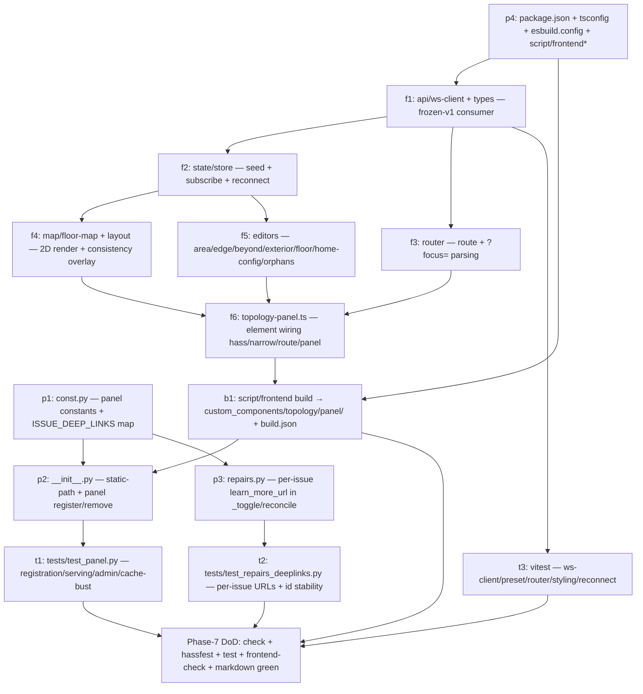

# Topology — Phase 7 Implementation Plan

**Status:** Implementation plan (frozen artifacts per PLAN-topology.md §10, gate
"Before Phase 7 (panel)") · Last updated 2026-07-24 · **Decisions D1–D13 below
are RECOMMENDED, not yet ratified — the maintainer must ratify §9 before code is
written.** The sections above §9 already assume the recommended option.

**Scope:** Phase 7 (**the v1 custom panel + the frontend build/delivery
pipeline + repair-card deep-links + the WS-auth-model consolidation**) — the
human editing surface on top of the Phase 1–6 foundation. Phase 2 froze the
WebSocket contract v1 and built the store + admin write commands; Phase 3 added
the entity set; Phase 4 filled the derivations and graph queries; Phase 5
promoted the consistency signals into repair cards (informational, `learn_more_url`
only, deep-links deferred here by Phase-5 D4); Phase 6 (PR #10, merged) turned on
the services, diagnostics export, label projection, and one-shot imports. Phase 7
turns the last inert thing on: the **panel** the ADR "Editing Surface" names as
the _primary_ editor. Concretely it delivers four things:

1. a **Lit-based 2D map panel** (`frontend/` source → built assets under
   `custom_components/topology/panel/`) that reads the frozen WS contract v1
   (`list_annotations`, `read_hook`, `health`, `subscribe_updates`) and drives
   every existing write command (`update_area`, `upsert_edge`, `delete_edge`,
   `restore_edge`, `set_beyond`, `set_exterior_connections`, `set_floor_level`,
   `update_home_config`) — a **pure consumer**, no new backend contract (§2, D7);
2. a **frontend build/delivery pipeline** (esbuild bundle, CSP-clean — no CDN,
   everything inlined or `StaticPathConfig`-served — content-hashed cache-busting,
   `panel_custom` registration) (§4, D2–D6);
3. **deep-link repair fix-routes** — the seven Phase-5 informational cards get a
   per-issue `learn_more_url` that opens the panel focused on the relevant view,
   **without changing any frozen issue id** (§3, D9);
4. the **WS-auth-model consolidation** — the reads-any-auth / writes-admin split
   is already implemented; Phase 7 only records it as the frozen model and aligns
   the panel's own `require_admin` gate (§2.7, D8/D12).

Nothing from Phase 8+ is implemented here. In particular the **3D / WebGL house
view**, the **degree-sized procedural layout**, the **uninstall label purge**,
and all **user-facing prose docs** stay out (§7). No new WS command, enum,
entity, derivation, or `health` field is added; no version / `quality_scale` /
tag / release change is made (ADR "Release Strategy"). The single manifest edit
is the additive `dependencies` line the panel APIs require (D6) — argued below as
ADR-compatible because it touches none of the frozen release fields.

**Binding inputs:** `PLAN-topology.md` (§1a panel-as-editor + preset setters, §5
v1 "Admin UI / panel" scope + "3D house view … Later (v2+), not v1", §7 the
visual-map spec — "**explicitly 2D in v1**", procedural degree-sizing v2+, §8
Quality-Scale rows, §10 gate "Before Phase 7 (panel)"),
`PLAN-topology-phase2.md` (**§4 the frozen WebSocket contract v1** — every
command, error code, `area_out`/`edge_out`/`health` shape, and the
`subscribe_updates` event the panel is built against; §3.9 the preset table
`list_annotations` ships), `PLAN-topology-phase5.md` (**§2 the repair-issue
catalog + §3 fix-flow structure** the deep-links dock onto; D4 deferred the
deep-links to here), `PLAN-topology-phase6.md` (**structure template** for this
document — delta table, artifact specs, §-numbering, test matrix, boundaries,
DAG, decision protocol, verified-signature appendix), `DECISIONS.md` (ADRs
"Editing Surface" — panel is the primary editor, writes admin-gated, "repair-issue
fix-flows may deep-link into panel routes"; "Release Strategy" — no tag/version/
quality_scale change; "Manifest Declaration"), `AGENTS.md` (package rules,
layering, validation scripts, translation strategy — `en.json` + `services.yaml`
only). The real code on `main` after the Phase-6 merge
(`custom_components/topology/{__init__,websocket_api,repairs,const,manifest.json}`,
`translations/en.json`, `services.yaml`) is the fixed substrate every signature
below is written against.

**Definition of done for Phase 7:** a developer implements Phase 7 from this
document alone in ~3–4 working days without going back to the design plan; the
panel appears in the sidebar (admin-only) when the integration is configured,
renders a per-floor 2D map of areas + edges, and edits every field through the
existing WS write commands with live refresh over `subscribe_updates`; the seven
informational repair cards deep-link into the panel; `script/check`,
`script/hassfest`, and `script/test` stay green (the Python surface added is
small — panel registration + a per-issue `learn_more_url` map); the frontend
build (`script/frontend`) produces a **single self-contained**, content-hashed
ESM bundle with **no external network reference** (CSP-clean); `script/markdown`
green for this plan. **No** WS command, enum, entity, `health` field, or version/
`quality_scale`/tag change; the **only** contract-adjacent edit is the additive
`manifest.json` `dependencies` line (D6) and the per-issue `learn_more_url`
values (D9), neither of which alters a frozen id, payload, or response shape.

**How this document must be used:** §9 is not optional reading. The design plan
leaves the whole frontend toolchain open on purpose (the §10 gate exists to fix
it): **Lit vs. vanilla** (D2), **bundler** (D3), **panel-registration mechanism**
(D4), **asset serving + hashing** (D5), **manifest dependency** (D6), **whether a
new WS command is needed** (D7 — answer: no), **panel admin-gating** (D8),
**deep-link routing** (D9), **frontend test framework** (D10), **frontend i18n**
(D11). Ratify §9 first; every section above it already assumes the recommended
option.

---

## 1. Phase-7 delta table

Basis: the tree on `main` after the Phase-6 merge. "add" = new file/content,
"extend" = add to an existing file without changing frozen behavior, "keep" =
untouched. **No** store schema field, enum, WS command, WS response field,
`health` field, or entity is added or changed. The Python delta is deliberately
tiny — the substance of Phase 7 is the `frontend/` source tree and its build
output, which are **not** Python and touch none of the frozen contracts.

| Path                                                                                                                                                | Action     | What changes                                                                                                                                                                                                                                                                              |
| --------------------------------------------------------------------------------------------------------------------------------------------------- | ---------- | ----------------------------------------------------------------------------------------------------------------------------------------------------------------------------------------------------------------------------------------------------------------------------------------- |
| `frontend/` (repo root, dev source — **not** shipped to HA)                                                                                         | **add**    | The Lit + TypeScript panel source: `<topology-panel>` element, typed WS-consumer layer, client state/reconnect, the 2D map, the field editors, the deep-link router, an inline `en` string table, plus `esbuild.config.mjs`, `tsconfig.json`, and vitest specs (§2, §4).                  |
| `custom_components/topology/panel/`                                                                                                                 | **add**    | The **built, committed** assets HACS ships: `topology-panel.js` (+ `.js.map`) and a generated `build.json` (`{"module","hash"}`). Not a Python package — no `__init__.py`. Regenerated by `script/frontend`; the only frontend artifact HA serves (§4, D5).                               |
| `custom_components/topology/__init__.py`                                                                                                            | **extend** | `async_setup` registers the static asset path once (`async_register_static_paths`, §4.3). `async_setup_entry` registers the panel (`panel_custom.async_register_panel`, admin-gated, §4.4); `entry.async_on_unload` removes it (`frontend.async_remove_panel`). (§2.1, D4/D8)             |
| `custom_components/topology/const.py`                                                                                                               | **extend** | Panel constants: `PANEL_URL_PATH`, `PANEL_STATIC_URL`, `PANEL_DIR`, `PANEL_WEBCOMPONENT`, `PANEL_TITLE`, `PANEL_ICON`; the per-issue deep-link `learn_more_url` map (§3). No storage/WS/entity/enum constant touched. (§3, §4)                                                            |
| `custom_components/topology/repairs.py`                                                                                                             | **extend** | `_toggle` gains a per-issue `learn_more_url` argument; `async_reconcile_issues` passes the deep-link URL for each of the six reactive informational cards (the seventh, `store_future_version`, is in `__init__.py`). No issue id, severity, placeholder, or fixability changes. (§3, D9) |
| `custom_components/topology/manifest.json`                                                                                                          | **extend** | Adds `"dependencies": ["http", "panel_custom"]` — the panel + static-path APIs' declared prerequisites and load-order guarantee. **No** version / `quality_scale` / `iot_class` / `integration_type` / `single_config_entry` change (D6).                                                 |
| `package.json` (repo root)                                                                                                                          | **extend** | Adds `lit`, `esbuild`, `typescript`, `vitest` (+ `@types`) devDependencies and `frontend` / `frontend-check` npm scripts. The existing prettier/markdownlint tooling is untouched. (§4.1, D3/D10)                                                                                         |
| `script/frontend`, `script/frontend-check`                                                                                                          | **add**    | `script/frontend` = esbuild production build → `custom_components/topology/panel/` + `build.json`; `script/frontend-check` = `tsc --noEmit` + `vitest run`. Mirrors the existing fix/check script split (AGENTS.md). CI wiring noted in §4.5. (§4, D3/D10)                                |
| `tests/test_panel.py`                                                                                                                               | **add**    | Backend pytest: panel registered on setup / removed on unload, static path served, `require_admin`, `module_url` cache-bust, per-issue deep-link URLs (§6).                                                                                                                               |
| `tests/test_repairs_deeplinks.py`                                                                                                                   | **add**    | Backend pytest for the §3 `learn_more_url` mapping (per issue id → panel route; `store_future_version` keeps the repo URL). (§6)                                                                                                                                                          |
| `.github/workflows/*`                                                                                                                               | **extend** | Add a frontend build+check job (Node already present for markdown) and commit-freshness guard so the built bundle in `panel/` matches source. Light touch; §4.5. (D3)                                                                                                                     |
| `websocket_api.py`, `data.py`, `store.py`, `coordinator/`, `entity/`, `service_actions/`, `services.yaml`, `translations/en.json`, `diagnostics.py` | **keep**   | Untouched. The panel is a pure consumer of the frozen v1 WS contract (D7); no service, enum, entity, or Python translation change. Panel i18n is frontend-side (D11), so `en.json` + `services.yaml` do not change (§5).                                                                  |

**Phase-7 DoD:** the panel loads as an admin sidebar entry, renders the per-floor
2D map from `list_annotations`, edits through the existing write commands, and
refreshes live on `subscribe_updates`; the six reactive informational cards +
(optionally) the fixable orphan card carry a panel deep-link `learn_more_url`
while keeping their frozen ids; the build output is a single CSP-clean hashed
bundle; `script/check` + `script/hassfest` + `script/test` + `script/frontend-check`

- `script/markdown` all green.

---

## 2. Panel artefact spec (frozen)

The primary artifact the §10 gate requires frozen. The panel is a **Lit
web-component** (D2), bundled by **esbuild** (D3) into one self-contained ESM
file, registered via **`panel_custom.async_register_panel`** (D4), served from a
**`StaticPathConfig`** local path (D5), gated **admin-only** (D8), and a **pure
consumer** of the frozen WS contract v1 — **no new backend command** (D7).

### 2.1 Registration mechanism + lifecycle

Two Python call sites, no new scheduling:

- **`async_setup(hass, config)`** (runs once at HA start, alongside the existing
  WS + service registration): register the static asset directory —
  `await hass.http.async_register_static_paths([StaticPathConfig(PANEL_STATIC_URL,
hass.config.path(<panel dir>), True)])` (Appendix A.3). Static-path
  registration is process-global and may only run once per `url_path`, so it
  belongs in `async_setup`, not per entry.
- **`async_setup_entry(hass, entry)`** (after the platforms forward, at the end):
  `await panel_custom.async_register_panel(hass, frontend_url_path=PANEL_URL_PATH,
webcomponent_name=PANEL_WEBCOMPONENT, sidebar_title=PANEL_TITLE,
sidebar_icon=PANEL_ICON, module_url=<hashed module url>, require_admin=True,
config={...})` (Appendix A.1/A.2). Removal is wired with
  `entry.async_on_unload(lambda: frontend.async_remove_panel(hass, PANEL_URL_PATH,
warn_if_unknown=False))` so an unload/reload cleanly drops the sidebar entry
  (`single_config_entry: true` means there is never a second panel to keep).

`module_url` is built from the committed `panel/build.json`:
`f"{PANEL_STATIC_URL}/{build['module']}?{build['hash']}"` (§4.3/D5). Reading
`build.json` is a cheap file read done once at setup (executor-wrapped to avoid
blocking the loop, matching HA's manifest-read pattern).

**`config` payload** passed to the panel (surfaced to the JS as
`panel.config`): a small, static object — `{"url_path": PANEL_URL_PATH}` — no
snapshot data (the panel fetches that over WS). The panel needs nothing else at
construction; HA sets `hass`, `narrow`, `route`, `panel` on the element itself
(Appendix A.5).

### 2.2 Routing (in-panel + deep-link entry)

HA sets the element's `route` property (`{prefix: "/topology", path: "/..."}`)
and updates it on navigation; the panel also reads `window.location.search` on
first render for the deep-link `?focus=<scope>` query (§3). A tiny internal
router maps:

| Route / query        | View                                                                             |
| -------------------- | -------------------------------------------------------------------------------- |
| `/` (default)        | Map view of the current (or first) floor.                                        |
| `?focus=unannotated` | Map view + the "unannotated areas" side panel opened, unannotated areas flagged. |
| `?focus=isolated`    | Map view, isolated (edge-less) areas flagged.                                    |
| `?focus=floors`      | Floor view (level assignment); indoor-without-floor areas flagged.               |
| `?focus=bearings`    | Map view + edge/bearing inspector on the contradictory edges.                    |
| `?focus=exterior`    | The exterior/`beyond` editor, offending sides flagged.                           |
| `?focus=orphans`     | The orphan review view (list of orphaned entries + restore/purge affordances).   |

Routing is **frontend-only** — no backend command backs a deep-link; the query
string is parsed client-side and drives which panel/highlight opens (§3, D9).

### 2.3 WS-consumer layer (`src/api/ws-client.ts`)

A typed thin wrapper over the frontend's existing `hass.connection`
(`hass.connection.sendMessagePromise` for request/response,
`hass.connection.subscribeMessage` for the subscription — the standard custom-panel
access, Appendix A.5). It exposes exactly the frozen v1 commands, no more:

| Method (client)                              | WS command (frozen, Phase-2 §4)         | Auth  |
| -------------------------------------------- | --------------------------------------- | ----- |
| `listAnnotations()`                          | `topology/list_annotations`             | read  |
| `readHook()`                                 | `topology/read_hook`                    | read  |
| `health()`                                   | `topology/health`                       | read  |
| `neighbors(areaId)` / `path(a,b)`            | `topology/neighbors` / `.../path`       | read  |
| `subscribeUpdates(cb)`                       | `topology/subscribe_updates`            | read  |
| `updateArea(areaId, annotation)`             | `topology/update_area`                  | admin |
| `upsertEdge(a, b, connections)`              | `topology/upsert_edge`                  | admin |
| `deleteEdge(edgeId)` / `restoreEdge(edgeId)` | `topology/delete_edge` / `restore_edge` | admin |
| `setBeyond(areaId, side, beyond)`            | `topology/set_beyond`                   | admin |
| `setExteriorConnections(areaId, conns)`      | `topology/set_exterior_connections`     | admin |
| `setFloorLevel(floorId, level)`              | `topology/set_floor_level`              | admin |
| `updateHomeConfig(patch)`                    | `topology/update_home_config`           | admin |

The client mirrors the frozen payload shapes verbatim (`area_out`, `edge_out`,
the `connection_in` fragment, the `presets` table) as TypeScript interfaces in
`src/api/types.ts`. **The client hardcodes no preset expansion** — it reads the
`presets` array from `list_annotations` (§4.1 of Phase 2) so preset →
`passage`+`barrier` never drifts from the backend. Error codes surface as typed
rejections; the UI maps each frozen code (`not_loaded`, `area_not_found`,
`invalid_enum`, `invalid_connection`, …) to a translated toast (§4, §2.6).

### 2.4 Client state + reconnect handling (`src/state/store.ts`)

- **Seed:** on element `connectedCallback`, call `listAnnotations()` → hold the
  full snapshot (home_config, areas, edges, floors, presets) in reactive state.
- **Names/icons:** area and floor **display names + icons** come from the
  frontend's own `hass.areas` / `hass.floors` objects (the HA frontend already
  subscribes to the registries), joined by `area_id` / `floor_id`. `list_annotations`
  deliberately omits names (Phase-2 §4.1) — the panel is the join point, **no
  new WS command** (D7).
- **Live updates:** `subscribeUpdates` delivers the frozen `{change, ids}` event
  (Phase-2 §4.12). On each event the panel re-fetches `listAnnotations()` (events
  carry ids, never deltas — the contract keeps snapshot reads cheap). A small
  coalescing timer (≤150 ms) collapses bursts (e.g. a bulk import) into one
  re-fetch.
- **Reconnect:** the HA frontend owns socket lifecycle and resubscribes
  automatically; the panel listens for the frontend's connection-ready signal and
  re-seeds (`listAnnotations()` again) after any reconnect so a dropped socket
  can never leave stale state. A visible "reconnecting…" banner shows while the
  frontend reports the socket down.
- **Optimistic writes:** writes are **not** applied optimistically in v1 — the
  panel awaits the command result (each write returns the updated `area_out` /
  `edge_out`) and also receives the `subscribe_updates` echo, so state is always
  server-authoritative. This keeps the client simple and correct; optimistic
  rendering is a later ergonomic upgrade.

### 2.5 The 2D map (`src/map/`) — **explicitly 2D in v1** (master §7)

One view per floor (plus an "outdoor / unfloored" bucket for areas with no
resolvable level), exactly the master-§7 "per-floor view (v1)":

- **Area nodes** — one block per registry area. Icon + label from `type`
  (falling back to the registry name via `hass.areas`), **tint by `trust`**
  (`private`/`shared`/`public`), **indoor/outdoor styling by `environment`**
  (`indoor` / `outdoor` / `semi_outdoor`). Unannotated areas render muted with a
  "needs annotation" affordance. Orphaned annotations (registry area gone) render
  with an orphan badge and a restore/purge affordance.
- **Edges** — a line per interior edge between its two area blocks, **styled by
  the most-permeable connection's `passage`/`barrier`** (open doorway vs. closable
  door vs. solid wall; stair / lift / ramp glyphs from `passage`). **Perimeter
  edges highlighted** (the derived `is_perimeter` flag on `edge_out`). Vertical
  edges (axis `vertical`, derived) are drawn as inter-floor connectors in the
  floor switcher, not as in-plane lines.
- **Layout (v1 = simple, deterministic)** — positions come from a **light
  force/grid layout** seeded deterministically by `area_id` so a floor renders
  stably across reloads. Optional presentation-only drag-to-declutter is stored in
  **client-local storage only** (never sent to the backend — there are no
  coordinate fields in the model). The **degree-sized procedural massing** master
  §7 calls "the hard part" is **explicitly v2+** (§7); v1 ships the cheap, faithful
  render that already carries the verification value.
- **Consistency overlay** — the map reads the `health` lists (`isolated_areas`,
  `indoor_areas_without_floor`, `contradictory_bearings`,
  `exterior_on_non_outdoor_side`, `unannotated_areas`) and flags the affected
  blocks/edges inline — the same signal the repair cards raise, so the deep-links
  (§3) land the user exactly where the problem is drawn.

### 2.6 The field editors (`src/editors/`)

Each editor is a Lit component that reads current state and calls one WS write.
All are admin-only in effect (a non-admin never sees the panel, D8; a non-admin
WS write is rejected anyway by `@require_admin`, §2.7):

| Editor               | Reads                           | Writes (WS command)                                 | Notes                                                                                                                                                                                                                                                              |
| -------------------- | ------------------------------- | --------------------------------------------------- | ------------------------------------------------------------------------------------------------------------------------------------------------------------------------------------------------------------------------------------------------------------------ |
| Area annotation      | `area_out`                      | `update_area`                                       | `type` (open catalog + custom entry), `environment`, `trust`. **Type-cascade** (bedroom ⇒ indoor+private, …) applied client-side as editable defaults, mirroring the service/import cascade — cascade fields are pre-filled, never forced.                         |
| Edge / connection    | `edge_out`, `presets`           | `upsert_edge` / `delete_edge`                       | Preset picker (from the shipped `presets` table) expands to `passage`+`barrier`; multi-connection bundles (stair + lift) editable here. Optional `side`, `glazed`, `sensor` (sensor only enabled when the chosen preset's `barrier == door` and `sensor_allowed`). |
| Beyond (outer wall)  | `area_out.beyond`               | `set_beyond`                                        | Per-side (N/E/S/W) `outdoor`/`neighbor`/`earth`/clear. Constrains where the exterior editor may place openings.                                                                                                                                                    |
| Exterior connections | `area_out.exterior_connections` | `set_exterior_connections`                          | Full-list replace; windows/outside doors, `inline_trust` allowed here (and only here). No hard reject on non-outdoor side (the consistency overlay flags it instead — matches Phase-2 §4.7).                                                                       |
| Floor level          | `floors[]`                      | `set_floor_level`                                   | Override only where `registry_level` is `None`; shows `effective_level` so the user sees which value wins.                                                                                                                                                         |
| Restore / orphans    | orphaned `area_out`/`edge_out`  | `restore_edge` (+ orphan purge via the repair flow) | The `?focus=orphans` deep-link target; restore re-adopts an orphaned edge whose area returned.                                                                                                                                                                     |
| Home config          | `home_config`                   | `update_home_config`                                | `occupancy_extent`, projection toggles, `unannotated_repair_threshold` — the one home-level enum shown on the map, edited without the reconfigure flow (Phase-2 §4.9).                                                                                             |

### 2.7 WS-auth model — consolidated (frozen; already implemented)

The §10 gate's second frozen item. **No code change** — this records the model
that Phase 2 already implemented (`websocket_api.py`) and that the panel aligns
to (D8/D12):

| Command                                                                                                                                        | Auth                      | Enforced by                                          |
| ---------------------------------------------------------------------------------------------------------------------------------------------- | ------------------------- | ---------------------------------------------------- |
| `list_annotations`, `read_hook`, `health`, `subscribe_updates`, `neighbors`, `path`, `connections_facing_outdoor`                              | authenticated (any user)  | WS layer authenticates every command                 |
| `update_area`, `upsert_edge`, `delete_edge`, `restore_edge`, `set_beyond`, `set_exterior_connections`, `set_floor_level`, `update_home_config` | authenticated **+ admin** | `@require_admin` decorator (Appendix A.4 of Phase 2) |

The **panel** is registered `require_admin=True` (D8): its sidebar entry and page
are visible only to admins. This is a UI convenience aligned with the write gate —
it is _not_ the security boundary (that is `@require_admin` on each write command,
which stands regardless of how the request reaches the socket). No
public/unauthenticated command exists. This split is frozen; changing it costs a
deprecation window like any other WS-contract change.

---

## 3. Deep-link fix-flow spec (frozen)

Phase-5 D4 shipped the seven consistency/threshold cards as `is_fixable=False`
with a shared repo `learn_more_url`, explicitly deferring "deep-link fix flows …
keeping the same ids" to Phase 7. Phase 7 realizes them in the **minimal,
id-stable** form: each card's `learn_more_url` becomes a **same-origin relative
URL** to the panel focused on the matching view. The panel parses the `?focus=`
query (§2.2) and highlights the affected areas/edges from the live `health`
lists. **No issue id, severity, placeholder, or fixability flag changes** — this
is exactly the D4 "upgrade without changing the frozen ids" (D9).

> **⚠️ Unverified assumption — resolve in §9/D9 before implementation.** This
> plan asserts, but has **not** verified, that the HA frontend renders a repair
> card's `learn_more_url` as an **in-app navigation** to a relative same-origin
> path (rather than forcing `target="_blank"` / treating it strictly as an
> external documentation link). That rendering lives in the `home-assistant/frontend`
> JS, **not** in the Python package introspected for Appendix A, so it was out of
> reach here. §3.3 records the fallback and the cleaner-but-D4-conflicting
> alternative; D9 must be ratified against a concrete check of the frontend's
> repair-dialog link handling.

### 3.1 Issue → panel route mapping (frozen)

`PANEL_URL_PATH` is `topology`; each deep-link is `f"/{PANEL_URL_PATH}?focus=<scope>"`.

| `issue_id` (frozen, Phase-5 §2)     | `is_fixable` | Phase-7 `learn_more_url`                | Panel target (§2.2)                                         |
| ----------------------------------- | ------------ | --------------------------------------- | ----------------------------------------------------------- |
| `unannotated_areas_threshold`       | `False`      | `/topology?focus=unannotated`           | Map + unannotated-areas side panel, blocks flagged.         |
| `isolated_areas`                    | `False`      | `/topology?focus=isolated`              | Map, edge-less areas flagged.                               |
| `indoor_areas_without_floor`        | `False`      | `/topology?focus=floors`                | Floor view, unfloored indoor areas flagged.                 |
| `contradictory_bearings`            | `False`      | `/topology?focus=bearings`              | Edge/bearing inspector on the offending edges.              |
| `exterior_on_non_outdoor_side`      | `False`      | `/topology?focus=exterior`              | Beyond/exterior editor, offending sides flagged.            |
| `unknown_enum_after_downgrade`      | `False`      | `LEARN_MORE_URL` (repo) — **unchanged** | Not panel-remediable (a downgrade artifact); keep repo.     |
| `orphaned_registry_entries`         | **`True`**   | `/topology?focus=orphans` (learn-more)  | Keeps the Phase-5 purge fix-flow; adds a panel review link. |
| `store_future_version` (`__init__`) | `False`      | `LEARN_MORE_URL` (repo) — **unchanged** | Setup-blocked, no panel exists to fix it; keep repo.        |

- **Five reactive cards** (`unannotated_areas_threshold`, `isolated_areas`,
  `indoor_areas_without_floor`, `contradictory_bearings`,
  `exterior_on_non_outdoor_side`) switch to a panel deep-link.
- **`orphaned_registry_entries`** keeps its Phase-5 `TopologyOrphanPurgeRepairFlow`
  (the "purge now" fix flow is real remediation and must not be lost); its
  `learn_more_url` becomes the `?focus=orphans` review link so a user can inspect
  before purging. The fix flow and the deep-link coexist — the flow is the
  action, the link is the context.
- **`unknown_enum_after_downgrade`** and **`store_future_version`** keep the repo
  URL: neither is fixed _in the panel_ (one is a re-upgrade concern, the other
  blocks setup before any panel loads).

### 3.2 Implementation shape (frozen)

- `const.py`: a frozen `ISSUE_DEEP_LINKS: dict[str, str]` mapping the five
  reactive issue ids (+ the orphan id) to their `f"/{PANEL_URL_PATH}?focus=…"`
  URL. Ids that keep the repo URL are simply absent from the map.
- `repairs.py`: `_toggle(...)` gains an optional `learn_more_url: str | None`
  argument (default `LEARN_MORE_URL`, preserving today's behavior for any id not
  in the map); `async_reconcile_issues` looks each id up in `ISSUE_DEEP_LINKS`
  and passes the result. The reconciler's structure, id set, placeholders, and
  fixability are otherwise **byte-identical** to Phase 5.
- `__init__.py`: `store_future_version` is created with `learn_more_url=LEARN_MORE_URL`
  as today — **unchanged**.

Because `learn_more_url` is a free string field on `ir.async_create_issue`
(Appendix A.6) and is not part of the frozen issue _identity_, this is a
non-breaking, deprecation-window-free change. A card raised on a system whose
panel has not yet been built (e.g. a partial upgrade) still renders — the link
just resolves to the panel once it exists; there is no hard dependency of the
issue on the panel.

### 3.3 Verification requirement + the fix_flow alternative (D9)

The `learn_more_url`-as-deep-link approach is the **lightest** id-stable form,
but it rests on the unverified frontend-rendering assumption flagged above. Two
things must happen before it is treated as frozen:

1. **Verify** against `home-assistant/frontend` (the repairs dialog / issue-card
   component) that a relative same-origin `learn_more_url` produces an in-app
   navigation to the panel, and note whether it opens in the same view or a new
   tab. If the frontend hard-forces external/new-tab handling, an absolute
   same-origin URL (`f"{hass_url}/{PANEL_URL_PATH}?focus=…"`) opening the panel in
   a new tab is still acceptable (it lands on the panel) — but the plan must say
   so explicitly rather than imply in-view navigation.
2. **Weigh the alternative.** The **canonical HA way** to make a repair issue
   actionable is a real **`fix_flow` (`RepairsFlow`)**, not a link. Phase-5 D4
   deliberately kept these cards `is_fixable=False` (no fake confirm-only flow,
   real remediation is the panel). A fix_flow that merely _links out_ to the
   panel would be a heavier, still-not-really-fixing wrapper — so the deep-link
   is the better fit **given the D4 stance**. If the frontend check in (1) fails
   _and_ a new-tab absolute URL is judged poor UX, the fallback order is:
   (a) absolute same-origin `learn_more_url` (new tab) → (b) keep the Phase-5
   shared repo `learn_more_url` and rely on the panel's own consistency overlay
   (§2.5) as the remediation path (the user reaches the flagged areas by opening
   the panel normally) → (c) a genuine `fix_flow` only if a maintainer chooses to
   revisit D4. Option (b) is a zero-risk degrade that still ships the panel value;
   the deep-link is strictly an ergonomic upgrade on top of it.

Either way, **no frozen issue id, severity, placeholder, or fixability flag
changes** — every fallback varies only the `learn_more_url` string (or leaves it
at the Phase-5 value), so D9's id-stability guarantee holds regardless of which
rendering the frontend turns out to support.

---

## 4. Frontend build / delivery spec (frozen)

The §10 gate's first frozen item: **Lit vs. plain JS**, **bundler**, **asset
hashing**, **CSP constraint**, **serving mechanism**, **i18n**. All resolved for
minimal maintenance and a strictly CSP-clean, no-CDN delivery.

### 4.1 Toolchain (D2/D3)

- **Framework: Lit** (D2). HA's own frontend is Lit; contributors expect it, and
  reactive declarative templating suits a graph editor. Lit (~5 KB) is bundled
  _into_ the panel — the panel never imports HA's internal Lit (that is not a
  stable public module) and never fetches from a CDN.
- **Language: TypeScript**, `tsc --noEmit` for type-checking only (esbuild does
  the transpile). Strict mode, mirroring the Python side's Pyright-strict posture.
- **Bundler: esbuild** (D3). One dependency, fast, trivially configured; emits a
  single self-contained ESM file. Vite is rejected as overkill for one panel
  (dev-server value is low here — HA serves the built file); "none" is impossible
  once Lit comes from npm.
- **devDependencies** (root `package.json`): `lit`, `esbuild`, `typescript`,
  `vitest`, `@types/*`. The existing prettier / markdownlint tooling is untouched.

### 4.2 Source layout (`frontend/`, repo root — dev only, **not** shipped)

```text
frontend/
  package.json            # or root package.json scripts (D3)
  tsconfig.json           # strict; no emit
  esbuild.config.mjs      # production build → custom_components/topology/panel/
  src/
    topology-panel.ts     # <topology-panel> LitElement (hass/narrow/route/panel props)
    router.ts             # route + ?focus= parsing (§2.2)
    api/ws-client.ts       # typed frozen-v1 consumer (§2.3)
    api/types.ts          # area_out / edge_out / connection / preset interfaces
    state/store.ts        # seed + subscribe + reconnect (§2.4)
    map/floor-map.ts      # per-floor 2D render (§2.5)
    map/layout.ts         # deterministic simple layout (§2.5)
    editors/*.ts          # the §2.6 editors
    i18n/en.ts            # inline English strings (D11)
    test/*.spec.ts        # vitest unit specs (§6, D10)
```

### 4.3 Build output, hashing + CSP (D5)

- **Output** (committed, HACS ships it): `custom_components/topology/panel/topology-panel.js`
  (+ source map) and `custom_components/topology/panel/build.json`
  (`{"module": "topology-panel.js", "hash": "<content-hash>"}`). esbuild computes
  the content hash (e.g. sha256 of the bundle, first 12 hex chars) and writes
  `build.json`.
- **Cache-busting** (D5): the **on-disk filename is fixed**; cache-busting is a
  **query string** on `module_url` — `f"{PANEL_STATIC_URL}/topology-panel.js?{hash}"`.
  A new build ⇒ new hash ⇒ new URL ⇒ the browser bypasses cache, while
  `StaticPathConfig(cache_headers=True)` still lets an unchanged build cache hard.
  This avoids runtime filename discovery (Python reads exactly one known file) and
  a churny hashed filename in git.
- **CSP / no CDN** (hard rule): esbuild bundles **all** JS (Lit included) into the
  one file — `bundle: true`, `external: []`, no `import` from any remote host.
  Icons are HA's own (via `hass`) or inline SVG; **no** web fonts, images, or
  scripts are fetched over the network. The panel makes **zero** outbound requests
  beyond the same-origin HA WebSocket it already uses. This satisfies "no external
  CDN, everything inlined or `StaticPathConfig`-served" verbatim.

### 4.4 Serving + registration (D4)

- **Serve:** `async_setup` →
  `await hass.http.async_register_static_paths([StaticPathConfig(PANEL_STATIC_URL,
hass.config.path("custom_components/topology/panel"), True)])` (Appendix A.3).
  `PANEL_STATIC_URL` = `/topology_static` (a fixed public URL prefix distinct from
  the panel's `frontend_url_path`).
- **Register:** `async_setup_entry` → `panel_custom.async_register_panel(...)`
  with `module_url` from §4.3, `require_admin=True` (D8), `sidebar_title`/`_icon`
  from `const.py`. Removed on unload via `frontend.async_remove_panel` (§2.1).

### 4.5 CI + freshness (D3)

- `script/frontend` (fix/build) runs esbuild → regenerates `panel/` + `build.json`.
- `script/frontend-check` runs `tsc --noEmit` + `vitest run`.
- A CI job builds the frontend and asserts the committed `panel/` bundle matches a
  fresh build (freshness guard — a source change without a rebuild fails CI), so
  the shipped artifact never drifts from source. Node is already present for the
  markdown tooling, so no new CI runtime is introduced.

---

## 5. Translations / hassfest impact (frozen)

**No `translations/en.json` and no `services.yaml` change.** Phase 7 adds no
service, exception, selector, entity state, or issue _title/description_ — the
only issue-registry edit is the `learn_more_url` value (§3), which is **not** a
translated field (it is a URL passed to `ir.async_create_issue`, Appendix A.6).
Panel UI strings live **in the frontend bundle** (`src/i18n/en.ts`, D11), which is
outside the AGENTS.md `en.json` + `services.yaml` translation surface entirely.

- **Sidebar title/icon:** `sidebar_title` / `sidebar_icon` are literal strings
  passed to `panel_custom.async_register_panel` (Appendix A.1) — no `en.json` key.
- **hassfest:** validates `manifest.json`, `services.yaml`, `translations/`, and
  integration structure. The additive `manifest.json` `dependencies` line (D6) is
  a valid manifest field; the untouched `services.yaml`/`en.json` continue to
  pass. hassfest does **not** validate custom panels or static assets, so the
  frontend introduces no hassfest surface. `script/hassfest` stays green with no
  new translation authoring.
- **Frontend i18n (D11):** English-only for v1, strings inlined in the bundle via
  a `localize(key)` shim over a bundled `en` dict. The structure (a keyed dict per
  locale) leaves room to add `de`/other bundled JSON later without touching the
  Python integration — but that is **not** a Phase-7 deliverable.

---

## 6. Test matrix (Phase 7)

Style per Phase 4/5/6: IDs + fixtures, no bodies. Two layers — **backend pytest**
(panel registration, static serving, deep-link URLs — the Python surface) and
**frontend vitest** (the framework-agnostic logic modules). **Playwright / E2E is
deferred** (D10) — the browser-driven full-render test is high-cost and flaky and
adds little over the two layers below for a v1 map. New backend fixtures:
`panel_client` (reads `hass.data` frontend-panel registry after setup),
`issue_registry` (reuse). Reuses `setup_integration`, `hass_ws_client`, and the
Phase-5/6 fixtures.

### Backend — panel registration + serving (`tests/test_panel.py`)

| ID                               | Purpose                                                                                                  | Fixtures          |
| -------------------------------- | -------------------------------------------------------------------------------------------------------- | ----------------- |
| `test_static_path_registered`    | `async_setup` registers the `/topology_static` `StaticPathConfig` for the panel dir.                     | hass              |
| `test_panel_registered_on_setup` | After `async_setup_entry`, a `topology` panel exists (admin-gated, correct `module_url` + webcomponent). | setup_integration |
| `test_panel_requires_admin`      | The registered panel's `require_admin` is `True` (D8).                                                   | setup_integration |
| `test_panel_removed_on_unload`   | Unloading the entry removes the panel (`async_remove_panel`).                                            | setup_integration |
| `test_module_url_cache_busting`  | `module_url` carries the `?<hash>` from `build.json`; a changed `build.json` changes the URL.            | setup_integration |
| `test_panel_build_json_present`  | The committed `panel/build.json` + `topology-panel.js` exist and `build.json` names the shipped module.  | —                 |

### Backend — deep-link `learn_more_url` (`tests/test_repairs_deeplinks.py`)

| ID                                     | Purpose                                                                                                          | Fixtures                            |
| -------------------------------------- | ---------------------------------------------------------------------------------------------------------------- | ----------------------------------- |
| `test_reactive_cards_deep_link`        | Each of the five reactive informational cards is created with its `/topology?focus=…` `learn_more_url` (§3.1).   | setup_integration, issue_registry   |
| `test_orphan_card_deep_link_and_flow`  | The orphan card keeps `is_fixable=True` + the purge flow **and** gets the `?focus=orphans` learn-more link.      | setup_integration, orphaned_payload |
| `test_unknown_enum_keeps_repo_url`     | `unknown_enum_after_downgrade` keeps `LEARN_MORE_URL` (not panel-remediable).                                    | setup_integration                   |
| `test_store_future_version_keeps_repo` | `store_future_version` (raised in `__init__`) keeps `LEARN_MORE_URL`.                                            | hass                                |
| `test_deep_link_ids_unchanged`         | Every issue id, severity, placeholder set, and fixability flag is identical to Phase 5 (no frozen-id drift, D9). | setup_integration                   |

### Frontend — vitest (`frontend/src/test/`)

| ID                                   | Purpose                                                                                                              |
| ------------------------------------ | -------------------------------------------------------------------------------------------------------------------- |
| `ws-client encodes commands`         | Each client method sends the exact frozen command name + payload shape (read + write set, §2.3).                     |
| `preset expansion from server table` | The edge editor expands a preset using the `presets` array from `list_annotations`, never a hardcoded map.           |
| `router parses focus query`          | `?focus=<scope>` (all seven scopes, §2.2) resolves to the correct view/highlight; unknown/absent → default view.     |
| `trust/environment styling map`      | Node tint (trust) and indoor/outdoor styling (environment) map correctly, incl. `null` → "unknown/needs-annotation". |
| `edge style by most-permeable`       | Edge styling picks the most-permeable connection's `passage`/`barrier`; perimeter edges flagged from `is_perimeter`. |
| `reconnect re-seeds`                 | A simulated connection-ready after a drop triggers a fresh `listAnnotations()` (§2.4).                               |
| `update event coalesces`             | A burst of `{change, ids}` events collapses into one re-fetch (§2.4).                                                |

(~18 tests. No bodies — the implementation writes them. The Python ≥ 95 %
coverage obligation from Phase 3 continues; the small Phase-7 Python surface
—panel registration + the deep-link map— is fully covered by the backend rows.
Frontend coverage is a vitest target on the logic modules; the render/DOM layer
is exercised by unit specs, not E2E.)

---

## 7. Boundaries: Phase 8+ / v2+ and what stays put

Explicit fences so no later work is pulled forward.

| Item                                                                   | Owner         | Phase-7 stance                                                                                                                                                                                               |
| ---------------------------------------------------------------------- | ------------- | ------------------------------------------------------------------------------------------------------------------------------------------------------------------------------------------------------------ |
| **3D / WebGL / three.js stacked house view**                           | v2+ (post-v1) | **Out.** Master §5/§7 place it "Later (v2+), not v1"; v1 is "explicitly 2D". Splitting it off keeps a slipping frontend estimate from blocking v1. The 2D map already carries all consistency checks (§2.5). |
| **Degree-sized procedural massing layout** (hub sized by graph degree) | v2+           | **Out.** Master §7 calls it "the hard part, v2+". v1 uses a simple deterministic force/grid layout (§2.5).                                                                                                   |
| **Presentation-only node coordinates persisted server-side**           | v2+           | **Out.** v1 drag-to-declutter is client-local only; the model carries no coordinates (master §7).                                                                                                            |
| **Uninstall label leave-behind / on-request purge** (master §6 "exit") | Phase 8       | **Out.** Projection is reversible while installed (Phase-6 §2.6.1); uninstall-time behavior is Phase 8.                                                                                                      |
| **User-facing prose docs** (`docs/user/`, `docs-*` Quality-Scale rows) | Phase 8       | **Out.** Panel access / troubleshooting docs are Phase 8; the panel ships functional now.                                                                                                                    |
| **Starter templates / Assist intent pack / multi-instance**            | v2+           | **Out.** Master §5 "Later (v2+)".                                                                                                                                                                            |
| **New WS command / enum / entity / derivation / `health` field**       | —             | **None.** The panel is a pure consumer of the frozen v1 contract (D7); names/icons via the frontend `hass` object.                                                                                           |
| **New service, `en.json`, or `services.yaml` change**                  | —             | **None.** Panel i18n is frontend-side (D11); §5 confirms zero Python-translation change.                                                                                                                     |
| **Version / `quality_scale` / tag / release change**                   | Phase 8       | **None** (ADR "Release Strategy"). The one manifest edit is the additive `dependencies` line (D6), which touches no release field.                                                                           |

The only new outward surfaces Phase 7 adds are: the admin sidebar **panel**, the
**`/topology_static`** asset path, and the per-issue **`learn_more_url`**
deep-links. No frozen contract (WS, enum, entity, `health`, issue id) changes.

---

## 8. Umsetzungs-DAG (cluster ordering)

"A → B" = A must precede B. Letters match the clusters a single developer would
tackle over ~3–4 days. Frontend (F*) and backend (P*) clusters are largely
independent and can run in parallel by two developers.



Practical sequencing (~3–4 days): **day 1** = p1/p4 + f1/f2/f3 (constants,
toolchain, the WS-consumer + state + router) with t3 alongside; **day 2** =
f4/f5 (the 2D map + the editors); **day 3** = f6 + b1 (element wiring + the
production build) then p2/p3 (panel registration + deep-links) with t1/t2;
**day 4** buffer = CSP/no-network audit of the bundle, cache-bust + freshness-CI
wiring, coverage, lint + hassfest + markdown loop. Parallelization: the entire
`frontend/` tree (f1–f6) is independent of the Python clusters until b1 produces
the bundle p2 serves; p3 (deep-links) depends only on p1 and can land first.

---

## 9. Decision protocol (D1–D13)

Every place the design plan leaves the frontend toolchain open, or where this
plan makes a call the §10 gate delegated, with a recommended, minimal-invasive
option. **The sections above assume the recommended option. Ratify §9 before code
is written.** Nothing here breaks the Phase-2 WS contract or any Phase-3–6
artifact; the panel is a pure consumer and the only contract-adjacent edits are
the additive manifest `dependencies` (D6) and the non-identity `learn_more_url`
values (D9).

| #   | Question / gap                                | Recommended option                                                                                                                                                                                                                                                                                                                                                                                                                                          | Note / contradiction                                                                                                                                                                                                                                                                                                                                                                                                                                                                                                                                                                                                                                                                                                                    |
| --- | --------------------------------------------- | ----------------------------------------------------------------------------------------------------------------------------------------------------------------------------------------------------------------------------------------------------------------------------------------------------------------------------------------------------------------------------------------------------------------------------------------------------------- | --------------------------------------------------------------------------------------------------------------------------------------------------------------------------------------------------------------------------------------------------------------------------------------------------------------------------------------------------------------------------------------------------------------------------------------------------------------------------------------------------------------------------------------------------------------------------------------------------------------------------------------------------------------------------------------------------------------------------------------- |
| D1  | Phase-7 scope vs. the §10 gate                | **Phase 7 = the v1 2D panel + frontend build pipeline + repair deep-links + WS-auth consolidation.** 3D/WebGL, degree-sized layout, uninstall purge, user docs stay out (§7).                                                                                                                                                                                                                                                                               | Matches master §5 ("Admin UI / panel" in v1; "3D house view … Later (v2+)") and §7 ("explicitly 2D in v1"). Ratify the fence.                                                                                                                                                                                                                                                                                                                                                                                                                                                                                                                                                                                                           |
| D2  | Lit vs. plain JS for the v1 2D map            | **Lit** (bundled into the panel, not imported from HA).                                                                                                                                                                                                                                                                                                                                                                                                     | HA's own frontend is Lit; reactive templating suits a graph editor; ~5 KB bundled. Vanilla + SVG is the noted alternative (zero deps, more verbose) — rejected for maintainability.                                                                                                                                                                                                                                                                                                                                                                                                                                                                                                                                                     |
| D3  | Bundler                                       | **esbuild** — one devDependency, single self-contained ESM output; TypeScript type-checked via `tsc --noEmit`.                                                                                                                                                                                                                                                                                                                                              | HA prescribes **no** bundler for custom panels. **Alternatives:** _rollup_ (the more common default in the HA card/panel community — rejected for a slower, config-heavier setup with no benefit at this size) and _vite_ (rejected as overkill: its dev-server value is low since HA serves the built file). "none" is impossible with Lit from npm. `script/frontend` (+ `-check`) mirror the existing fix/check split.                                                                                                                                                                                                                                                                                                               |
| D4  | Panel registration mechanism + lifecycle      | **`panel_custom.async_register_panel(module_url=…)`** in `async_setup_entry`, removed on unload via `frontend.async_remove_panel`; static paths registered once in `async_setup`.                                                                                                                                                                                                                                                                           | `panel_custom` delegates to `frontend.async_register_built_in_panel(component_name="custom")` (Appendix A.2) and is the documented ES-module path. Registering per-entry ties the sidebar entry to a configured integration.                                                                                                                                                                                                                                                                                                                                                                                                                                                                                                            |
| D5  | Asset serving + hashing / cache-busting       | **`StaticPathConfig` local dir + fixed filename `topology-panel.js` + `?<content-hash>` query** from a committed `build.json`; `cache_headers=True`.                                                                                                                                                                                                                                                                                                        | Avoids runtime filename discovery and a churny hashed filename in git; a new build changes the hash → the URL → busts cache. Alternative (hashed filename) rejected as noisier in version control.                                                                                                                                                                                                                                                                                                                                                                                                                                                                                                                                      |
| D6  | Manifest dependency (the one manifest edit)   | **Add `"dependencies": ["http", "panel_custom"]`.** This is additive and touches **no** release field (`version`/`quality_scale`/`iot_class`/`integration_type`/`single_config_entry` unchanged).                                                                                                                                                                                                                                                           | **Reconciles** the §7 boundary "keine Manifest-Änderung" (which the ADR "Release Strategy" scopes to release/version/quality*scale) with §1's "manifest.json falls Frontend-Dependency nötig". Ratify the narrow exception. **Alternatives:** \_depend on `frontend` only* + register via `frontend.async_register_built_in_panel(component_name="custom")` directly (what HA-core panel integrations like `map`/`energy` do — rejected only because `panel_custom.async_register_panel` is the documented ES-module wrapper and reads more clearly; either is idiomatic, and `panel_custom` already pulls `frontend`→`http`); or _declare nothing_ and rely on core-always-loaded `frontend`/`http` (rejected — less load-order-safe). |
| D7  | Is a new WS command needed?                   | **No.** The panel consumes only the frozen v1 contract (`list_annotations` incl. `presets`, `read_hook`, `health`, `subscribe_updates`) and drives the eight existing writes. Names/icons come from the frontend `hass.areas`/`hass.floors` objects.                                                                                                                                                                                                        | Satisfies the hard rule "Panel = reiner Consumer bestehender Commands". `list_annotations` already ships every registry area + the preset table precisely so the panel needs no new command (Phase-2 §4.1).                                                                                                                                                                                                                                                                                                                                                                                                                                                                                                                             |
| D8  | Panel admin-gating                            | **`require_admin=True`** on the panel — admin-only sidebar entry.                                                                                                                                                                                                                                                                                                                                                                                           | The panel is the _editing_ surface and every write is `@require_admin` anyway; a read-only-looking-but-uneditable view for non-admins would confuse. UI gate, not the security boundary (that stays `@require_admin` per command).                                                                                                                                                                                                                                                                                                                                                                                                                                                                                                      |
| D9  | Deep-link routing mechanism                   | **Per-issue `learn_more_url` = same-origin panel URL `…/topology?focus=<scope>`**, parsed client-side; issue ids/severity/placeholders/fixability **unchanged**; `unknown_enum`/`store_future_version` keep the repo URL. **⚠️ Rests on an unverified frontend-rendering assumption (§3 note / §3.3): ratify only after checking how `home-assistant/frontend` renders a repair-card `learn_more_url` (in-app vs. forced new-tab, relative vs. absolute).** | Realizes Phase-5 D4 ("deep-link fix flows keeping the same ids") in the minimal, non-breaking form — `learn_more_url` is a free URL field, not part of the frozen issue identity. **Alternatives (§3.3), all id-stable:** absolute same-origin URL (new tab) if relative in-app nav is unsupported; else keep the Phase-5 shared repo URL and let the panel's own consistency overlay (§2.5) be the remediation path; a genuine `fix_flow` only if a maintainer reopens D4. The textbook HA way to make a repair actionable is a `fix_flow`, but D4 deliberately kept these cards informational — so the link is the better fit here.                                                                                                   |
| D10 | Frontend test framework                       | **vitest (unit) on the logic modules + backend pytest for registration/serving/deep-links; Playwright / E2E deferred.**                                                                                                                                                                                                                                                                                                                                     | The two layers cover the WS-consumer, preset/router/styling logic, and the Python surface. E2E is high-cost/flaky and adds little for a v1 map; note it as a deferred v2 hardening step, not "none".                                                                                                                                                                                                                                                                                                                                                                                                                                                                                                                                    |
| D11 | Frontend i18n                                 | **English-only v1, strings inlined in the bundle** (`src/i18n/en.ts` + a `localize` shim); **no `en.json`/`services.yaml` change**.                                                                                                                                                                                                                                                                                                                         | Panel UI strings are a frontend concern outside the AGENTS.md `en.json`+`services.yaml` surface. Keyed-dict structure leaves room for bundled `de`/etc. later without touching Python. Ratify that §5 stays a no-op.                                                                                                                                                                                                                                                                                                                                                                                                                                                                                                                    |
| D12 | WS-auth model (consolidate, don't change)     | **Freeze as implemented:** reads = authenticated any-user; writes = `@require_admin`; no public command. Panel `require_admin=True` aligns.                                                                                                                                                                                                                                                                                                                 | The §10 gate's second item is "record", not "change". Phase 2 already implemented it; Phase 7 adds no command and changes no decorator. Ratify the model as frozen.                                                                                                                                                                                                                                                                                                                                                                                                                                                                                                                                                                     |
| D13 | Where the built bundle lives + git-committed? | **Built assets committed under `custom_components/topology/panel/`** (HACS ships only `custom_components/`); source lives in `frontend/` (dev-only, not shipped); a CI freshness guard asserts bundle == fresh build.                                                                                                                                                                                                                                       | Standard HACS delivery: the runtime artifact must sit inside `custom_components/`. The freshness guard prevents source/artifact drift. `panel/` is static assets, not a Python package (no `__init__.py`), so AGENTS.md package rules do not apply.                                                                                                                                                                                                                                                                                                                                                                                                                                                                                     |

**Explicit contradictions to ratify:** **D6** (§7 "keine Manifest-Änderung" vs.
§1 "manifest.json falls Frontend-Dependency nötig" — the additive `dependencies`
line is argued ADR-compatible), and **D9** (Phase-5 D4's deferred deep-links,
realized as `learn_more_url` values without touching frozen ids). Everything else
fills a gap the design left open for the §10 gate.

**Open verification item (not a free choice — a fact to establish):** **D9**
carries an assumption about how `home-assistant/frontend` renders a repair-card
`learn_more_url` (§3 note / §3.3). This was **not** verifiable from the Python
package introspected for Appendix A and must be checked against the frontend
before D9 is treated as frozen; the id-stable fallbacks in §3.3 mean the check
can only downgrade the ergonomics, never the id-stability guarantee.

---

## Appendix A — HA 2026.x signature verification

Signatures were verified by **introspection of an installed Home Assistant**
(`homeassistant` **2026.2.3**, installed in a Python-3.13 `uv` venv for this
plan). The Phase-1..6 test target is **2026.4.4** (what
`pytest-homeassistant-custom-component==0.13.325` pins, requiring Python ≥
3.14.2); that exact build was **not installable in this environment** (only
CPython 3.14.0rc2 is available here, and 3.14.2 has no download), so the nearest
installable release was introspected. **The frontend / http / panel APIs used
below are long-stable and identical across 2026.2 → 2026.4** — a trivial re-check
against 2026.4.4 before implementation is recommended but no signature drift is
expected. These supplement the Phase-2..6 appendices.

### A.1 `frontend.async_register_built_in_panel` — `homeassistant/components/frontend/__init__.py`

- `async_register_built_in_panel(hass, component_name, sidebar_title=None,
sidebar_icon=None, sidebar_default_visible=True, frontend_url_path=None,
config=None, require_admin=False, *, update=False, config_panel_domain=None) ->
None` — **synchronous** `@callback`. `require_admin=True` gates the panel to
  admins; `update=True` re-registers (idempotent replace). Used indirectly via
  `panel_custom` (A.2).
- `async_remove_panel(hass, frontend_url_path, *, warn_if_unknown=True) -> None` —
  removes the sidebar entry; the panel unload calls it with `warn_if_unknown=False`.
- `add_extra_js_url(hass, url, es5=False) -> None` — for injecting extra JS
  (Lovelace cards), **not** used here; a panel uses `module_url` on registration.

### A.2 `panel_custom.async_register_panel` — `homeassistant/components/panel_custom/__init__.py`

- `async def async_register_panel(hass, frontend_url_path, webcomponent_name,
sidebar_title=None, sidebar_icon=None, js_url=None, module_url=None,
embed_iframe=False, trust_external=False, config=None, require_admin=False,
config_panel_domain=None) -> None` — **coroutine**. Requires `js_url` **or**
  `module_url` (raises `ValueError` if both are `None`); v1 uses `module_url` (ES
  module). It builds `config["_panel_custom"] = {"name": webcomponent_name,
"embed_iframe": …, "trust_external": …, "module_url": …}` and delegates to
  `frontend.async_register_built_in_panel(component_name="custom",
frontend_url_path=…, config=…, require_admin=…, …)`. So registering via
  `panel_custom` is the documented wrapper over A.1 for a custom web-component.
- `panel_custom`'s manifest declares `"dependencies": ["frontend"]`; `frontend`
  declares `"dependencies": ["http", …]`. Declaring `["http", "panel_custom"]` on
  topology's manifest (D6) therefore pulls the full chain and guarantees load
  order.

### A.3 Static asset serving — `homeassistant/components/http/__init__.py`, `.../static.py`

- `StaticPathConfig(url_path: str, path: str, cache_headers: bool = True)` — a
  frozen dataclass (verified fields: `url_path`, `path`, `cache_headers`).
- `HomeAssistantHTTP.async_register_static_paths(self, configs:
Collection[StaticPathConfig]) -> None` — **coroutine** (must be awaited);
  reached as `hass.http.async_register_static_paths([...])`. Registering the same
  `url_path` twice raises, so it is called once in `async_setup`. The panel dir is
  resolved with `hass.config.path("custom_components/topology/panel")`.

### A.4 WebSocket auth (already implemented; frozen) — `homeassistant/components/websocket_api/`

- Every registered command requires an authenticated connection (the WS layer
  authenticates before dispatch). The `@require_admin` decorator
  (`homeassistant.components.websocket_api.decorators`) additionally rejects a
  non-admin connection with `unauthorized`. topology's writes carry `@require_admin`
  (verified on `main`, `websocket_api.py`); reads do not. Phase 7 changes none of
  this (D12).

### A.5 Custom-panel element contract (frontend)

- A `panel_custom` ES module must define a custom element whose tag ==
  `webcomponent_name`. The HA frontend renders `<webcomponent_name>` and sets the
  properties **`hass`**, **`narrow`**, **`route`** (`{prefix, path}`), and
  **`panel`** (carrying the `config` object passed at registration, including
  `_panel_custom`). Area/floor **names + icons** are read from the `hass` object
  (`hass.areas`, `hass.floors`) the frontend already maintains — this is why the
  panel needs **no** new WS command (D7). WS access uses
  `hass.connection.sendMessagePromise` (request/response) and
  `hass.connection.subscribeMessage` (subscription), with the frontend owning
  reconnect/resubscribe.

### A.6 Repairs `learn_more_url` (deep-link basis) — verified on `main`

- `ir.async_create_issue(hass, domain, issue_id, *, …, learn_more_url=None,
severity, translation_key, translation_placeholders=None, is_fixable, data=None,
…)` — `learn_more_url` is a **free string** field, not part of the issue
  identity. topology's `repairs._toggle` already forwards `learn_more_url=LEARN_MORE_URL`
  (Phase-5 code); Phase 7 only varies the value per issue id (§3, D9). Changing it
  requires no deprecation window and no id change.

### A.7 Existing topology substrate (verified on `main`, Phase 1–6 merged)

- `__init__.async_setup` already registers the WS API + services; Phase 7 adds the
  static-path registration beside them. `async_setup_entry` ends by forwarding
  platforms; Phase 7 appends the panel registration + `async_on_unload` removal.
- `websocket_api.py`: the eight admin write commands + the read/subscription
  commands the panel consumes, all frozen (Phase-2 §4) — the panel adds nothing.
- `repairs.async_reconcile_issues` / `_toggle` and the `ISSUE_*` constants in
  `const.py` are the exact hook Phase 7 extends with the per-issue `learn_more_url`
  map — no id, severity, placeholder, or fixability change.
- `manifest.json`: `integration_type: helper`, `iot_class: calculated`,
  `single_config_entry: true`, `quality_scale: platinum`, `version: 0.1.0` — all
  **unchanged**; Phase 7 adds only the `dependencies` array (D6).
