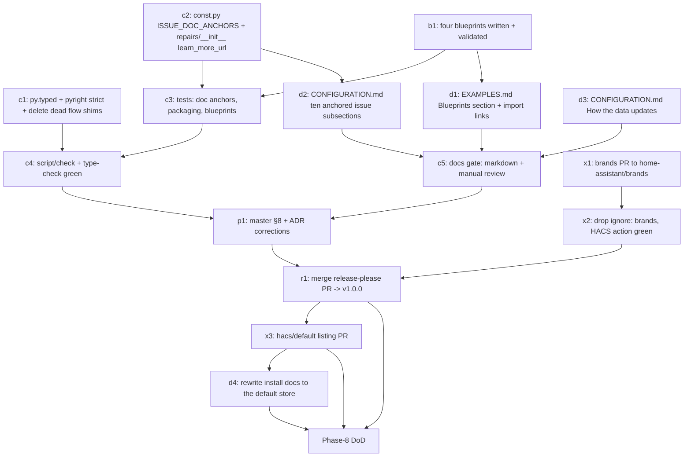

# Topology — Phase 8 Implementation Plan

**Status:** Implementation plan (frozen artifacts per `PLAN-topology.md` §10, gate "Before Phase 8 (release)") ·
Last updated 2026-07-25 · **Decisions D1–D16 proposed, awaiting maintainer ratification; D17 ratified and
implemented 2026-07-25.** Nothing in this
document may be implemented before §9 is ratified; §2 (the Quality-Scale audit) is a statement of _measured
fact_ and needs no ratification — it needs correcting if any row is wrong.

**Scope:** Phase 8 is **the release phase** — the last phase of the planned scope, and per `DECISIONS.md`
("Release Strategy: Internal Version Milestones, Single Initial Public Release") the phase whose completion
_is_ the release act. It delivers five things and deliberately no new capability:

1. an **honest Quality-Scale audit** of every rule the master §8 table marks IMPL-in-8, plus a re-verification of
   every other row against the code as it stands — met / not met / N/A-with-reason, with the remaining work
   named (§2);
2. **release mechanics** — the `manifest.json` version, the release-please merge, `CHANGELOG.md`, the
   `home-assistant/brands` submission, and the HACS default-store listing (§3);
3. **documentation completion** — the per-issue documentation anchors the `learn_more_url` comment in `const.py`
   has been deferring since Phase 5, the `docs-*` row → artifact mapping, and the `docs-data-update` gap (§4);
4. the **four automation blueprints** for the anchor consumers in master §9, shipped in-repo under
   `blueprints/automation/topology/` (§5) — **already written and schema-validated** (Appendix A.4);
5. the **v1 scope fence** — everything master §5 lists under "Later (v2+), not v1" plus the v3 propagation work
   stays out (§6).

**Phase 8 was planned to add no entity, attribute, WebSocket command, enum, service, store field, or
derivation.** Two of those were reopened by explicit maintainer decision on 2026-07-25 and are recorded where
they belong rather than smuggled in: **D17** (six response-returning read actions plus a
`monitored_connections` attribute — §5.4) and the `ceiling` connection preset with the geometry-check
correction it implies (§5.5). Everything else still holds. The remaining code touched is `const.py` (a documentation-anchor map), `repairs.py` (two `learn_more_url` values),
`pyproject.toml` (type-checking strictness), one new `py.typed` marker file, `manifest.json` (`version` only, via
release-please), and CI/lint script coverage for `blueprints/`. Everything else in Phase 8 is documentation,
YAML blueprints, and two external submissions (brands, HACS).

**Binding inputs:** `PLAN-topology.md` (**§8** the Quality-Scale rule mapping this plan audits, **§9** the anchor
consumers and the four named blueprints, **§5** the v1 scope and the "Later (v2+), not v1" list, **§10** gate
"Before Phase 8 (release)" — blueprint distribution mechanism, HACS listing form, brands PR content),
`DECISIONS.md` (**"Release Strategy"** — no tag/release/HACS listing per milestone, `1.0.0` on merging the
release-please PR, externally gated items excluded from the gate; **"Quality Target"** — Platinum-conformant,
whose "Core merge as v2+ path" framing D2 below revises; **"Manifest Declaration"**; **"Editing Surface"**),
`PLAN-topology-phase5.md` (the repair-issue catalog these anchors document),
`PLAN-topology-phase7.md` (**structure template** for this document, and §3/D9 which spent `learn_more_url` on
panel deep-links — the constraint §4.2 works around), `docs/user/CONFIGURATION.md` + `docs/user/EXAMPLES.md` +
`docs/user/GETTING_STARTED.md` + `README.md` (the user-doc surface the `docs-*` rows are audited against),
`AGENTS.md` (validation scripts, no stray markdown in code directories, translation strategy). The tree on
`main` plus the uncommitted Phase-2-follow-up and doc work in the working copy on 2026-07-25 is the substrate
every claim in §2 was verified against; Appendix A records how.

**Definition of done for Phase 8:** every row in §2 is either met or has a maintainer-accepted reason not to be;
`script/check`, `script/hassfest`, `script/test --cov` (≥ 95 % gate, 98 % measured), `script/frontend-check`,
`script/yaml-check`, and `script/markdown` are green; the four blueprints import cleanly into a real Home
Assistant and appear in the blueprint list; `home-assistant/brands` has merged `custom_integrations/topology/`
and the `ignore: brands` line is gone from `.github/workflows/validate.yml`; the HACS default-store PR is open
or merged; `docs/user/EXAMPLES.md` ships the four blueprints with import links instead of the "does not ship
blueprints yet" placeholder; and merging the release-please PR produces `v1.0.0`, a GitHub Release, and
`CHANGELOG.md`.

**How this document must be used:** §2 is the part to read first and the part most likely to be argued with — it
contradicts the master §8 table in four places (`brands`, `strict-typing`, `test-coverage`, and the `docs-*`
targets), and every contradiction is a real gap rather than a documentation slip. §9 is not optional reading: it
carries the ratification protocol and the two decisions that reach outside Phase 8 (D5 amends an ADR threshold,
D17 adds the read surface that makes the model reachable from YAML at all).

---

## 1. Phase-8 delta table

Basis: the working tree on 2026-07-25. "add" = new file/content, "extend" = add to an existing file without
changing frozen behavior, "submit" = an artifact that leaves this repository, "keep" = untouched.

| Path                                                      | Action     | What changes                                                                                                                                                                                                                     |
| --------------------------------------------------------- | ---------- | -------------------------------------------------------------------------------------------------------------------------------------------------------------------------------------------------------------------------------- |
| `blueprints/automation/topology/*.yaml`                   | **add**    | The four automation blueprints (§5). Four files, no `README.md` beside them (D15). **Written; validated against HA's own `AUTOMATION_BLUEPRINT_SCHEMA` + automation `PLATFORM_SCHEMA`** (Appendix A.4).                          |
| `custom_components/topology/py.typed`                     | **add**    | Empty PEP-561 marker. Frozen for Phase 1 by master §10, never created (§2.5, D3).                                                                                                                                                |
| `pyproject.toml`                                          | **extend** | `[tool.pyright] typeCheckingMode` `basic` → `strict` (D4). No other tool config changes.                                                                                                                                         |
| `custom_components/topology/const.py`                     | **extend** | `ISSUE_DOC_ANCHORS: dict[str, str]` — a documentation anchor for **all ten** issue ids; `LEARN_MORE_URL` keeps its value but stops being any card's actual target (§4.2, D11).                                                   |
| `custom_components/topology/repairs.py`                   | **extend** | `unknown_enum_after_downgrade` moves from `LEARN_MORE_URL` to its doc anchor. No id, severity, placeholder, or fixability change.                                                                                                |
| `custom_components/topology/__init__.py`                  | **extend** | Same one-line change for `store_future_version` (raised there, not in `repairs.py`).                                                                                                                                             |
| `docs/user/CONFIGURATION.md`                              | **extend** | The repair-issue table becomes ten anchored subsections so the anchors in `ISSUE_DOC_ANCHORS` resolve; a new "How the data updates" section (§4.3, D13). **Owned by the user-docs author — coordinate.**                         |
| `docs/user/EXAMPLES.md`                                   | **extend** | "A blueprint you can save" → "Blueprints" with the four shipped blueprints, their inputs, and My-HA import links (D14). **Owned by the user-docs author — coordinate.**                                                          |
| `README.md`                                               | **extend** | Installation switches from "custom repository" to the HACS default store once listed; blueprint pointer added. **Owned by the README author — coordinate.**                                                                      |
| `docs/development/PLAN-topology.md`                       | **extend** | §8 corrected against §2 of this document (four wrong rows, a stale `docs/user/index.md` target, "8 repair issues" now ten); §8's "Blockers for the official badge" list rewritten per D2. **Not owned by this plan — hand off.** |
| `docs/development/DECISIONS.md`                           | **extend** | ADR "Quality Target" amended per D2 (Core merge is not a goal) and per D5 (93 % gate / 95 % target). **Not owned by this plan — hand off.**                                                                                      |
| `script/yaml-check`, `.prettierignore`, `.vscode/*`       | **extend** | `blueprints/` added to the yamllint target list; the editor's SchemaStore auto-association for `blueprints/**` suppressed (§7, D16). **Not owned by this plan — hand off.**                                                      |
| `.github/workflows/validate.yml`                          | **extend** | Drop `ignore: brands` after the brands PR merges (D6).                                                                                                                                                                           |
| `.github/workflows/test.yml`                              | **keep**   | Already runs `script/test --cov` + `script/type-check`; the 93 % `fail_under` gate is landing with the CI change (§2.4, D5).                                                                                                     |
| `custom_components/topology/manifest.json`                | **extend** | `version` only, written by release-please when the release PR merges (D8). No other field changes (ADR "Manifest Declaration").                                                                                                  |
| `CHANGELOG.md`                                            | **add**    | Generated by release-please in the release commit, never hand-written (D9).                                                                                                                                                      |
| `home-assistant/brands` → `custom_integrations/topology/` | **submit** | `icon.png`, `icon@2x.png`, optional `logo.png`/`logo@2x.png` (§3.4, D6). External repository.                                                                                                                                    |
| `hacs/default` → `integration`                            | **submit** | One line, alphabetical, after a full GitHub Release exists (§3.3, D7). External repository.                                                                                                                                      |
| `hacs.json`                                               | **keep**   | **No change is possible or needed** — see §5.1. HACS ships only `custom_components/<domain>/` for an integration-category repository, and no `hacs.json` key changes that.                                                       |
| Everything under `custom_components/topology/` not listed | **keep**   | No entity, attribute, WS command, enum, service, store field, derivation, or translation change.                                                                                                                                 |

---

## 2. Quality-Scale reality check

### 2.1 The maintainer's position, stated plainly

`quality_scale: platinum` **stays** in the manifest, and Platinum is held as a **genuine engineering standard**,
not as a badge application. Two facts follow and are recorded here so no future reader mistakes them for
oversights:

- **A custom integration can never formally receive the Quality Scale.** The scale is awarded and displayed only
  for Core integrations, and the Platinum `documentation` rule presupposes a
  `https://www.home-assistant.io/integrations/<domain>` URL that only a Core merge can produce.
- **Joining Core is not a goal.** This revises the framing of ADR "Quality Target", which described a Core merge
  as the "v2+ path" to the badge. The rules are followed because they produce a better integration, and the
  three "blockers for the official badge" in master §8 stop being a roadmap: blocker 1 (the `home-assistant.io`
  documentation URL) is permanently accepted as not-applicable, blocker 2 (Core architecture review) is dropped,
  and blocker 3 (test coverage) is a real, kept engineering commitment (§2.4).

The consequence for this section is a specific discipline: **N/A must mean "the rule describes something this
integration genuinely does not have", never "this would be work".** Four rows below fail that test today and are
recorded as **NOT MET** with the work named, where the master §8 table optimistically records IMPL.

### 2.2 Method

Every row was checked against the working tree, not against the master table. The evidence column names the file
or command; Appendix A lists the measurements. Status values:

- **MET** — verified present and correct in the code/docs.
- **NOT MET** — verified absent or incorrect; the work is named and enters §7 as a Phase-8 deliverable.
- **PARTIAL** — the substance exists but a named piece is missing.
- **N/A** — the rule describes a capability this integration does not have, with the reason.

### 2.3 Bronze

| Rule                             | Status      | Evidence / remaining work                                                                                                                                                                                                                                                                                                   |
| -------------------------------- | ----------- | --------------------------------------------------------------------------------------------------------------------------------------------------------------------------------------------------------------------------------------------------------------------------------------------------------------------------- |
| `action-setup`                   | **MET**     | `__init__.async_setup` calls `async_setup_services(hass)`; nothing is registered in `async_setup_entry`.                                                                                                                                                                                                                    |
| `appropriate-polling`            | **N/A**     | No polling exists to tune. The coordinator has no `_async_update_data` and no `update_interval` (ADR "Coordinator Role").                                                                                                                                                                                                   |
| `brands`                         | **NOT MET** | No `home-assistant/brands` submission exists, and `.github/workflows/validate.yml` carries `ignore: brands` on the HACS action to compensate. **Work:** §3.4 + D6.                                                                                                                                                          |
| `common-modules`                 | **MET**     | `coordinator/` and `entity/` packages hold the coordinator and the base entity; the rule's intent (one obvious home for each) is satisfied by the package form.                                                                                                                                                             |
| `config-flow`                    | **MET**     | `config_flow: true`; confirm-only singleton in `config_flow_handler/config_flow.py`.                                                                                                                                                                                                                                        |
| `config-flow-test-coverage`      | **MET**     | `config_flow_handler/config_flow.py` at **100 %** line coverage. Two dead re-export shims (`config_flow_handler/handler.py`, `validators/__init__.py`, four statements total) are at 0 % — leftovers of the Phase-2 follow-up slimming and the only uncovered lines in the flow package. **Work:** delete them (§7, cheap). |
| `dependency-transparency`        | **MET**     | `manifest.json` has no `requirements` key at all — there is nothing to declare.                                                                                                                                                                                                                                             |
| `docs-actions`                   | **MET**     | All seven actions documented with fields and examples in `docs/user/CONFIGURATION.md` § "Service actions": `annotate_area`, `declare_connection`, `set_beyond`, `set_exterior`, `set_floor_level`, `project_labels`, `import_from_core`.                                                                                    |
| `docs-high-level-description`    | **MET**     | `README.md` § "What Topology is" + `docs/user/GETTING_STARTED.md`. **Note:** master §8 names `docs/user/index.md`, which has never existed — the row's target must be re-pointed (D12).                                                                                                                                     |
| `docs-installation-instructions` | **PARTIAL** | `README.md` § "Installation" and GETTING_STARTED Step 1 cover HACS **as a custom repository** plus manual install. Correct today; must be rewritten to the default store the moment D7 lands.                                                                                                                               |
| `docs-removal-instructions`      | **MET**     | `docs/user/CONFIGURATION.md` § "Removing Topology", including the deliberate projected-label leave-behind and how to delete it (master §6 "exit").                                                                                                                                                                          |
| `entity-event-setup`             | **MET**     | `binary_sensor/perimeter.py` subscribes in `async_added_to_hass` and tears the subscription plus debouncer down via `async_on_remove(self._async_teardown)`.                                                                                                                                                                |
| `entity-unique-id`               | **MET**     | Every unique id is built through `entity_utils/entity_ids.py`; area renames do not affect them.                                                                                                                                                                                                                             |
| `has-entity-name`                | **MET**     | `entity/base.py` sets `_attr_has_entity_name = True` for every entity.                                                                                                                                                                                                                                                      |
| `runtime-data`                   | **MET**     | `TopologyRuntimeData` on `entry.runtime_data`; `hass.data[DOMAIN]` is not used as a store.                                                                                                                                                                                                                                  |
| `test-before-configure`          | **MET**     | The confirm step runs the area-registry and store-readability checks before creating the entry.                                                                                                                                                                                                                             |
| `test-before-setup`              | **MET**     | The same checks run in `async_setup_entry`, raising `ConfigEntryNotReady` / `ConfigEntryError`.                                                                                                                                                                                                                             |
| `unique-config-entry`            | **MET**     | `single_config_entry: true` plus a fixed unique id.                                                                                                                                                                                                                                                                         |

### 2.4 Silver

| Rule                            | Status      | Evidence / remaining work                                                                                                                                                                                                                                                                                                                                                                                                          |
| ------------------------------- | ----------- | ---------------------------------------------------------------------------------------------------------------------------------------------------------------------------------------------------------------------------------------------------------------------------------------------------------------------------------------------------------------------------------------------------------------------------------- |
| `action-exceptions`             | **MET**     | `ServiceValidationError` for user error, `HomeAssistantError` otherwise; eight translated keys in the `exceptions` block of `translations/en.json`.                                                                                                                                                                                                                                                                                |
| `config-entry-unloading`        | **MET**     | Platforms, listeners, WS handlers, and the panel are all released on unload.                                                                                                                                                                                                                                                                                                                                                       |
| `docs-configuration-parameters` | **MET**     | The flow has **no** fields after the Phase-2 follow-up, and `docs/user/CONFIGURATION.md` § "What is configured where" says so explicitly, then documents the panel-owned settings that replaced them. Documenting the absence _is_ the correct discharge of this rule here.                                                                                                                                                        |
| `docs-installation-parameters`  | **MET**     | Same table plus § "Home configuration" (occupancy extent, three projection toggles, unannotated threshold) with values, defaults, and meanings.                                                                                                                                                                                                                                                                                    |
| `entity-unavailable`            | **MET**     | Entities go unavailable when the store snapshot is not loaded; per-area sensors additionally track `derived.live_area_ids`.                                                                                                                                                                                                                                                                                                        |
| `integration-owner`             | **MET**     | `codeowners: ["@jpawlowski"]`.                                                                                                                                                                                                                                                                                                                                                                                                     |
| `log-when-unavailable`          | **MET**     | `sensor/area.py` logs one info-level line per availability transition, not per update.                                                                                                                                                                                                                                                                                                                                             |
| `parallel-updates`              | **MET**     | `PARALLEL_UPDATES` re-exported in `sensor/__init__.py` and `binary_sensor/__init__.py`.                                                                                                                                                                                                                                                                                                                                            |
| `reauthentication-flow`         | **N/A**     | There are no credentials, so there is nothing that can expire.                                                                                                                                                                                                                                                                                                                                                                     |
| `test-coverage`                 | **PARTIAL** | **Measured today: 95 %** over `custom_components/topology`, 250 tests passing (Appendix A.1). CI runs `script/test --cov` and `script/type-check` on every push and PR; the **93 %** `fail_under` gate scoped to `custom_components/topology` is landing with the CI change. So the ADR's ≥ 95 % target is _met by measurement_ but only _enforced_ to 93 %. D5 resolves the mismatch. Weakest module: `websocket_api.py` at 84 %. |

### 2.5 Gold

| Rule                         | Status      | Evidence / remaining work                                                                                                                                                                                                                                                                                                                                               |
| ---------------------------- | ----------- | ----------------------------------------------------------------------------------------------------------------------------------------------------------------------------------------------------------------------------------------------------------------------------------------------------------------------------------------------------------------------- |
| `devices`                    | **N/A**     | Entities annotate registry areas the user already owns; a service device would add a meaningless device-registry entry (ADR "Manifest Declaration"). `TopologyEntity` sets no `_attr_device_info`.                                                                                                                                                                      |
| `diagnostics`                | **MET**     | `diagnostics.py` exports the whole model with stable pseudonyms for area/floor/edge ids and bound sensor object ids, adjacency joins preserved, registry display names excluded, free-text `type` redacted.                                                                                                                                                             |
| `discovery`                  | **N/A**     | There is no device or service on a network to find.                                                                                                                                                                                                                                                                                                                     |
| `discovery-update-info`      | **N/A**     | Follows from `discovery`.                                                                                                                                                                                                                                                                                                                                               |
| `docs-data-update`           | **NOT MET** | No user-facing text explains the update model. The nearest statements are "Changes take effect immediately — no reload, no restart" (CONFIGURATION § Home configuration) and one `subscribe_updates` table row in the README — neither describes the event-driven, no-polling design or the derive-on-read invalidation flow. **Work:** §4.3 + D13.                     |
| `docs-examples`              | **PARTIAL** | `docs/user/EXAMPLES.md` is thorough (perimeter automations, label targeting, completeness automations, service-driven scripts, dashboard cards, WS consumers) but its closing section states "Topology does not ship blueprints yet" and inlines one blueprint to copy. **Work:** the four blueprints exist now (§5); replace that section (D14).                       |
| `docs-known-limitations`     | **MET**     | `README.md` § "Known limitations".                                                                                                                                                                                                                                                                                                                                      |
| `docs-supported-devices`     | **N/A**     | No devices.                                                                                                                                                                                                                                                                                                                                                             |
| `docs-supported-functions`   | **MET**     | `README.md` § "What you can build with it" + § "Entities" + § "Service actions"; the full surface table at the top of EXAMPLES.md.                                                                                                                                                                                                                                      |
| `docs-troubleshooting`       | **MET**     | `docs/user/CONFIGURATION.md` § "Troubleshooting" (panel access, always-`off` perimeter, missing perimeter boundary, `axis: unknown`, accidental area deletion, debug logging) plus README and GETTING_STARTED sections.                                                                                                                                                 |
| `docs-use-cases`             | **MET**     | `README.md` § "What you can build with it"; master §9 anchor consumers; the four blueprints are the executable form (§5).                                                                                                                                                                                                                                               |
| `dynamic-devices`            | **N/A**     | No devices. The analogous behavior — new registry areas appearing — _is_ handled (registry watcher, `unannotated_areas`, threshold repair).                                                                                                                                                                                                                             |
| `entity-category`            | **MET**     | Per-area triples `diagnostic`; household and perimeter entities unset.                                                                                                                                                                                                                                                                                                  |
| `entity-device-class`        | **MET**     | Perimeter binary sensor `BinarySensorDeviceClass.OPENING`; no class fits the annotation sensors.                                                                                                                                                                                                                                                                        |
| `entity-disabled-by-default` | **MET**     | The three per-area annotation sensors are disabled by default; the two household entities are always enabled.                                                                                                                                                                                                                                                           |
| `entity-translations`        | **MET**     | `entity` block in `translations/en.json`, one key per entity and state.                                                                                                                                                                                                                                                                                                 |
| `exception-translations`     | **MET**     | `exceptions` block with all eight raised keys.                                                                                                                                                                                                                                                                                                                          |
| `icon-translations`          | **MET**     | `icons.json` per entity and state.                                                                                                                                                                                                                                                                                                                                      |
| `reconfiguration-flow`       | **MET**     | `config.step` carries `user` and `reconfigure`; the reconfigure step re-runs the checks and reloads. With no fields left, it mirrors setup exactly, which is what the rule asks.                                                                                                                                                                                        |
| `repair-issues`              | **MET**     | **Ten** issue classes (not the eight master §5/§8 imply): the six reactive cards, the fixable orphan card with `TopologyOrphanPurgeRepairFlow`, `unknown_enum_after_downgrade`, `store_future_version`, and the two edge-geometry advisories `edges_spanning_multiple_floors` / `vertical_edges_without_vertical_passage`. All ten have translated titles/descriptions. |
| `stale-devices`              | **N/A**     | No devices. The analogue — deleted areas/floors — is the 72 h orphan window plus daily cleanup.                                                                                                                                                                                                                                                                         |

### 2.6 Platinum

| Rule                | Status      | Evidence / remaining work                                                                                                                                                                                                                                                                                                                                                                                                                                                                  |
| ------------------- | ----------- | ------------------------------------------------------------------------------------------------------------------------------------------------------------------------------------------------------------------------------------------------------------------------------------------------------------------------------------------------------------------------------------------------------------------------------------------------------------------------------------------ |
| `async-dependency`  | **N/A**     | There is no dependency, async or otherwise.                                                                                                                                                                                                                                                                                                                                                                                                                                                |
| `inject-websession` | **N/A**     | The integration makes no outbound HTTP request. It _depends on_ `http` to **serve** the panel's static assets, which is the opposite direction from what this rule governs.                                                                                                                                                                                                                                                                                                                |
| `strict-typing`     | **NOT MET** | Two concrete failures against what master §8 claims ("Pyright strict mode; `py.typed` marker"): (a) `pyproject.toml` sets `[tool.pyright] typeCheckingMode = "basic"`, two levels below `strict`, with `reportUnusedImport`/`reportUnusedVariable`/`reportUnusedCoroutine`/`reportMissingTypeStubs` additionally silenced; (b) **no `py.typed` file exists anywhere** in the repository, although master §10 froze it before Phase 1. **Work:** D3 (add the marker) + D4 (raise the mode). |

### 2.7 The remaining-work list

Everything §2 found, as a numbered work list. G1–G6 are Quality-Scale gaps; G7–G11 are release and consistency
gaps found while auditing. Each maps to a §7 verification row.

| #      | Gap                                                                                                                                                                                                                                                                                                                                                                                                                                                                       | Rule / driver                    | Owner surface                                    |
| ------ | ------------------------------------------------------------------------------------------------------------------------------------------------------------------------------------------------------------------------------------------------------------------------------------------------------------------------------------------------------------------------------------------------------------------------------------------------------------------------- | -------------------------------- | ------------------------------------------------ |
| G1     | No `home-assistant/brands` submission; HACS action masks it with `ignore: brands`                                                                                                                                                                                                                                                                                                                                                                                         | `brands`                         | External repo + `.github/workflows/validate.yml` |
| G2     | `py.typed` marker absent                                                                                                                                                                                                                                                                                                                                                                                                                                                  | `strict-typing`                  | `custom_components/topology/py.typed`            |
| G3     | Pyright runs in `basic` mode with four report categories silenced                                                                                                                                                                                                                                                                                                                                                                                                         | `strict-typing`                  | `pyproject.toml`                                 |
| G4     | No user-facing "how the data updates" text                                                                                                                                                                                                                                                                                                                                                                                                                                | `docs-data-update`               | `docs/user/CONFIGURATION.md`                     |
| G5     | EXAMPLES.md says no blueprints are shipped                                                                                                                                                                                                                                                                                                                                                                                                                                | `docs-examples`                  | `docs/user/EXAMPLES.md`                          |
| ~~G6~~ | **Closed 2026-07-25.** Gate raised to `fail_under = 95` (== the ADR target); measured **98 %** after covering `websocket_api.py`, which went 82 % → 100 %. ADR "Quality Target" amended to record gate == target.                                                                                                                                                                                                                                                         | `test-coverage`                  | `DECISIONS.md` + `pyproject.toml`                |
| ~~G7~~ | **Closed 2026-07-25.** `ISSUE_DOC_ANCHORS` maps all ten ids to anchored subsections in CONFIGURATION.md. Both links now coexist on every card: `learn_more_url` keeps the deep link where the panel can fix it, and the documentation link is rendered _inside the description_ (the repairs dialog passes it through `<ha-markdown>` — verified against the frontend pinned by HA 2026.7.0). The two non-remediable cards moved off the bare repo URL onto their anchor. | `docs-troubleshooting` follow-on | `const.py` + `repairs.py` + CONFIGURATION.md     |
| G8     | Install docs describe HACS **custom repository**, not the default store                                                                                                                                                                                                                                                                                                                                                                                                   | `docs-installation-instructions` | `README.md`, `GETTING_STARTED.md`                |
| G9     | Master §8 is wrong in four rows and names a file (`docs/user/index.md`) that never existed; it also says eight repair issues where there are ten                                                                                                                                                                                                                                                                                                                          | plan hygiene                     | `PLAN-topology.md` §8                            |
| G10    | ADR "Quality Target" frames a Core merge as the path to the badge, which is no longer a goal                                                                                                                                                                                                                                                                                                                                                                              | plan hygiene                     | `DECISIONS.md`                                   |
| G11    | Two dead re-export shims at 0 % coverage (`config_flow_handler/handler.py`, `validators/__init__.py`)                                                                                                                                                                                                                                                                                                                                                                     | `config-flow-test-coverage`      | `custom_components/topology/config_flow_handler` |

---

## 3. Release mechanics

### 3.1 The gate that governs everything here

`DECISIONS.md` — "Release Strategy: Internal Version Milestones, Single Initial Public Release" — is binding and
this plan stays inside it:

- v1 / v2 / v3 are **internal planning milestones**. No git tag, GitHub Release, or HACS listing exists per
  milestone; implementation runs v1 → v2 → v3 back to back on `main`.
- The **single initial public release is `1.0.0`**, and it happens only when the full planned scope is
  implemented. The mechanism is deliberate: the release-please PR stays unmerged during development, and
  **merging it is the release act**. `manifest.json` stays on `0.x` until then (it reads `0.1.0` today).
- Phase 8 is deferred to the end of the full scope, which is where it now sits.
- Items **externally gated** on a published release or a nontrivial user base are outside the gate by definition
  and stay post-`1.0.0`.

Two consequences the ordering in §3.5 depends on. First, the HACS default-store listing requires a **full GitHub
Release**, which only exists after the release PR merges — so the HACS submission is necessarily _after_ the
release, not a precondition of it. Second, the brands submission has no such dependency and must land _before_
the release so the first published version already renders with an icon.

### 3.2 Version and CHANGELOG

- **Version source of truth:** `custom_components/topology/manifest.json` (`docs/development/RELEASE.md`),
  mirrored in `.release-please-manifest.json`. `script/version --check` verifies the two agree.
- **The bump:** the initial public release is `1.0.0`, so the release PR carries an explicit
  `Release-As: 1.0.0` commit footer (or the equivalent release-please config override) — the pre-1.0 bump rules
  in RELEASE.md would otherwise produce `0.1.1` / `0.2.0` and never reach `1.0.0` on their own. This is the one
  release-please intervention Phase 8 needs.
- **`CHANGELOG.md` is generated, never hand-written** (D9). It does not exist yet, which is correct: release-please
  creates it in the release commit. It is already listed in `.prettierignore` and the markdownlint ignores, so it
  will not fight the lint scripts.
- **Release notes** may optionally be enriched with `script/release-notes --apply` before merging.
- **Do not** hand-edit `manifest.json`'s `version`. Every other manifest field is frozen by ADR "Manifest
  Declaration" and Phase 8 changes none of them — `quality_scale: platinum` explicitly **stays** (D2).

### 3.3 HACS default-store listing

Verified against the HACS publishing documentation (Appendix A.2). Requirements, and their state here:

| Requirement                                                                                  | State                                                                                                     |
| -------------------------------------------------------------------------------------------- | --------------------------------------------------------------------------------------------------------- |
| Publicly hosted on GitHub                                                                    | Yes.                                                                                                      |
| Passes the HACS Action without errors                                                        | Runs in `.github/workflows/validate.yml`, currently **with `ignore: brands`** — that ignore must go (D6). |
| Passes hassfest                                                                              | Runs in the same workflow; `script/hassfest` locally.                                                     |
| **At least one full GitHub Release** (not just a tag)                                        | **Blocked until the release PR merges** — this is what forces the ordering in §3.5.                       |
| Repository description set                                                                   | Yes (the HACS action's description/topics checks were re-enabled per the workflow comment).               |
| Repository topics set                                                                        | Yes, same source.                                                                                         |
| Issues enabled                                                                               | Yes; `issue_tracker` in the manifest points at them.                                                      |
| Valid `manifest.json`                                                                        | Yes.                                                                                                      |
| `hacs.json` with at least a `name`                                                           | Yes — `{"name": "Topology", "homeassistant": "2026.7.0", "hacs": "2.0.5"}`.                               |
| Brand directory with `icon.png`                                                              | **Missing** — G1, §3.4.                                                                                   |
| PR added alphabetically to the `integration` default file, from a branch, using the template | Phase-8 action.                                                                                           |

The **listing form** the master §10 gate asks to freeze: category **`integration`** (not `plugin`, not
`blueprint` — see §5.1), no HACS filters beyond the category, and the screenshots for the PR/README are the
panel's per-floor map view and the two always-enabled entities. `hacs.json` needs **no** new key: `zip_release`,
`content_in_root`, and `filename` all describe how `custom_components/topology/` is delivered, and none of them
would add anything outside it.

### 3.4 The `home-assistant/brands` submission

Verified against the brands repository README (Appendix A.3). For a **custom** integration:

- Directory: **`custom_integrations/topology/`** — _not_ `core_integrations/`. The directory name must equal the
  manifest `domain`.
- Required: `icon.png` at **256×256** and `icon@2x.png` at **512×512**, square, PNG, compressed, transparency
  preferred and optimized for a white background.
- Optional: `logo.png` / `logo@2x.png` (shortest side 128–256 px and 256–512 px respectively, landscape, brand
  aspect ratio) and the `dark_*` variants. Topology has no wordmark, so **icon-only is the recommended
  submission** — a logo can follow later.
- Hard constraint: **must not use Home-Assistant-branded imagery**, which would imply this is an official
  integration. The panel's `mdi:home-floor-g` sidebar icon is likewise not usable as a brand icon (it is an MDI
  glyph, not an original mark) — the icon must be an original design.
- Symlinks are not allowed in `custom_integrations/`.

Once merged, delete the `ignore: brands` key from the HACS job in `.github/workflows/validate.yml` (D6). Leaving
it would hide a real regression later.

**The assets exist as of 2026-07-25.** `assets/brands/custom_integrations/topology/` holds `icon.png` (256²)
and `icon@2x.png` (512²), RGBA with a transparent background, generated by `assets/brands/generate.py` — the
mark is defined as code so it is reproducible and reviewable in a diff rather than as an opaque binary. The
directory name and layout mirror the brands repository exactly, so submitting is a copy of that directory. The
assets are **not** shipped to users: HACS downloads only `custom_components/<domain>/` for an
integration-category repository (§5.1), so nothing under `assets/` reaches an installation.

**The mark:** a section through a building — three storey slabs seen edge-on with the adjacency graph drawn on
them (nodes on each storey, one horizontal edge, one vertical connector climbing all three). It is what the
integration models, and it survives being shown at 32 px in the HACS list because it is four shapes. It borrows
nothing from Home Assistant's own logo (which would imply an official integration) and is not an MDI glyph
either — the panel's `mdi:home-floor-g` sidebar icon is someone else's artwork under someone else's licence,
and a brand icon has to be original.

**The PR to `home-assistant/brands`, as it must be opened:**

- Fork `home-assistant/brands`, branch from `master`.
- Add exactly `custom_integrations/topology/icon.png` and `custom_integrations/topology/icon@2x.png`. Nothing
  else — no `logo.png` (topology has no wordmark; a logo can follow later), no `dark_*` variant, no symlinks
  (forbidden in `custom_integrations/`).
- Directory name must equal the manifest `domain` (`topology`) exactly, and it is `custom_integrations/`, never
  `core_integrations/`.
- Use the repository's PR template. The one thing reviewers check beyond the file layout is that the artwork is
  original and unbranded, so state that the mark is an original design generated from
  `assets/brands/generate.py` in this repository and link that file.
- Title: `Add topology (custom integration)`.

After it merges: drop `ignore: brands` from `.github/workflows/validate.yml`, re-run the HACS action, and
confirm it is still green — that is what turns the submission into a kept invariant instead of a one-off.

### 3.5 Ordering

The dependencies above force exactly one order:

1. Close G2, G3, G7, G11 (code), G4, G5, G8-prep (docs), and land the four blueprints. `script/check`,
   `script/hassfest`, `script/test --cov`, `script/frontend-check`, `script/yaml-check`, `script/markdown` green.
2. Submit and merge the brands PR (§3.4). Drop `ignore: brands`; confirm the HACS action still passes.
3. Fix G9/G10 (master §8 and the ADR) so the plan documents describe the shipped state.
4. Merge the release-please PR → `v1.0.0`, GitHub Release, `CHANGELOG.md`, `manifest.json` at `1.0.0`.
5. Submit the HACS default-store PR (§3.3) — now that a full Release exists.
6. Rewrite the install docs from "custom repository" to the default store once the listing is live (G8).

Steps 5 and 6 are, by the ADR's own words, "necessarily post-release" and therefore **not** blockers for the
release act.

---

## 4. Documentation completion

### 4.1 `docs-*` row → artifact mapping (D12)

Master §8 attributes every `docs-*` row to a `docs/user/index.md` that has never existed. The real mapping, which
§8 must be corrected to (G9):

| Rule                             | Artifact                                                                               |
| -------------------------------- | -------------------------------------------------------------------------------------- |
| `docs-high-level-description`    | `README.md` § "What Topology is"                                                       |
| `docs-installation-instructions` | `README.md` § "Installation" + `docs/user/GETTING_STARTED.md` Step 1                   |
| `docs-removal-instructions`      | `docs/user/CONFIGURATION.md` § "Removing Topology"                                     |
| `docs-configuration-parameters`  | `docs/user/CONFIGURATION.md` § "What is configured where" (the flow has no fields)     |
| `docs-installation-parameters`   | `docs/user/CONFIGURATION.md` § "Home configuration"                                    |
| `docs-actions`                   | `docs/user/CONFIGURATION.md` § "Service actions"                                       |
| `docs-data-update`               | `docs/user/CONFIGURATION.md` § "How the data updates" — **new** (§4.3)                 |
| `docs-examples`                  | `docs/user/EXAMPLES.md`, incl. the new § "Blueprints" (§5, D14)                        |
| `docs-known-limitations`         | `README.md` § "Known limitations"                                                      |
| `docs-supported-functions`       | `README.md` § "Entities" / "Service actions" + the surface table in EXAMPLES.md        |
| `docs-troubleshooting`           | `docs/user/CONFIGURATION.md` § "Troubleshooting" + the per-issue subsections from §4.2 |
| `docs-use-cases`                 | `README.md` § "What you can build with it" + the four blueprints                       |

### 4.2 Per-issue documentation anchors (D11)

**The constraint.** A repair card has exactly **one** link field, `learn_more_url`, and Phase 7 spent it: eight
of the ten cards point at `homeassistant://topology?focus=<scope>`, which opens the panel on the view where the
problem is drawn. The remaining two point at `LEARN_MORE_URL`, the **bare repository root** — no anchor, no
section, not even the user docs. So "per-issue documentation anchors" cannot mean "put the anchor in
`learn_more_url` for every card": for the eight remediable cards, walking the user to the fix is strictly better
than walking them to prose, and Phase-7 D9 already ratified that.

**The resolution**, in three parts:

1. **Anchors exist for all ten.** `docs/user/CONFIGURATION.md`'s single repair-issue table becomes ten anchored
   subsections under § "Repair issues", one per issue id, each saying what the card means, what to do, and what
   happens if it is ignored. A frozen `ISSUE_DOC_ANCHORS: dict[str, str]` in `const.py` maps **every** issue id
   to its anchor, so the mapping is code, testable, and cannot silently rot.
2. **`learn_more_url` policy.** The eight panel-remediable cards keep their deep-link — remediation beats
   reading. The two that the panel cannot fix move **off the bare repo URL and onto their anchor**, which is a
   strict improvement: both are recovery situations where prose is the actual remedy.
3. **`LEARN_MORE_URL` stops being any card's target** but stays as the fallback default of `repairs._toggle`, so
   a future issue id added without an entry in either map still produces a working link.

| `issue_id`                                | `is_fixable` | `learn_more_url` after Phase 8               | Documentation anchor (`ISSUE_DOC_ANCHORS`)                     |
| ----------------------------------------- | ------------ | -------------------------------------------- | -------------------------------------------------------------- |
| `unannotated_areas_threshold`             | `False`      | `homeassistant://topology?focus=unannotated` | `.../CONFIGURATION.md#several-areas-are-not-annotated`         |
| `isolated_areas`                          | `False`      | `homeassistant://topology?focus=isolated`    | `.../CONFIGURATION.md#some-areas-are-not-connected`            |
| `indoor_areas_without_floor`              | `False`      | `homeassistant://topology?focus=floors`      | `.../CONFIGURATION.md#indoor-areas-have-no-floor`              |
| `contradictory_bearings`                  | `False`      | `homeassistant://topology?focus=bearings`    | `.../CONFIGURATION.md#contradictory-wall-bearings`             |
| `exterior_on_non_outdoor_side`            | `False`      | `homeassistant://topology?focus=exterior`    | `.../CONFIGURATION.md#exterior-opening-on-a-non-outdoor-side`  |
| `edges_spanning_multiple_floors`          | `False`      | `homeassistant://topology?focus=geometry`    | `.../CONFIGURATION.md#an-edge-spans-more-than-one-storey`      |
| `vertical_edges_without_vertical_passage` | `False`      | `homeassistant://topology?focus=geometry`    | `.../CONFIGURATION.md#a-vertical-edge-has-no-vertical-passage` |
| `orphaned_registry_entries`               | **`True`**   | `homeassistant://topology?focus=orphans`     | `.../CONFIGURATION.md#topology-has-orphaned-entries`           |
| `unknown_enum_after_downgrade`            | `False`      | **→ its doc anchor** (was the bare repo URL) | `.../CONFIGURATION.md#topology-store-has-unrecognized-values`  |
| `store_future_version`                    | `False`      | **→ its doc anchor** (was the bare repo URL) | `.../CONFIGURATION.md#topology-store-is-from-a-newer-version`  |

Anchors are absolute `https://github.com/jpawlowski/hass.topology/blob/main/docs/user/CONFIGURATION.md#…` URLs:
a repair card renders in the frontend, which has no access to repository-relative paths, and only a
`homeassistant://` URL is treated as in-app navigation (verified for HA 2026.7.0 in the `const.py` comment).
Anchor slugs must match the heading text GitHub generates — the test in §7 asserts every anchor resolves to a
heading that actually exists in the file, so a heading rename breaks CI instead of shipping a dead link.

**Which `docs-*` rows this satisfies:** `docs-troubleshooting` gains the per-issue depth (the ten subsections are
the troubleshooting reference the current single table only summarizes); `docs-known-limitations` gains the two
edge-geometry advisories' explanation that a void or atrium legitimately spans storeys; and it retires the
`const.py` comment "Per-issue doc anchors are deferred to the Phase 8 user docs (decision D11)", which has been
the standing IOU since Phase 5.

### 4.3 `docs-data-update` (D13)

A new § "How the data updates" in `docs/user/CONFIGURATION.md`, stating in user language:

- Topology **never polls**. `iot_class: calculated`; there is no external service and no update interval.
- Everything derived — the perimeter, neighbors, paths, distances, the health signal, the household counts — is
  **computed on read**, never stored, so it cannot go stale relative to the model.
- Three things push a change: a **store write** (panel or service action), a **registry event**
  (`area_registry_updated` / `floor_registry_updated`), and a **bound sensor's state change** for the perimeter
  binary sensor, which coalesces bursts through a debouncer.
- Entities therefore update **immediately**, with no reload and no restart; and consumers should subscribe to
  `topology/subscribe_updates` and re-fetch rather than poll (the events carry ids, not deltas).
- The one **scheduled** job is orphan cleanup: on startup and daily, purging entries whose 72 h undo window has
  elapsed.

### 4.4 Cross-agent coordination

§4.1–4.3 and D14 all land in files this plan does **not** own (`docs/user/**`, `README.md`,
`PLAN-topology.md`, `DECISIONS.md`, `script/**`, `.vscode/**`, `.github/**`). They are specified here precisely
enough to be handed to their owners and must not be applied from this document. The §7 matrix lists each one
with the file that must change.

---

## 5. The blueprints

### 5.1 Distribution mechanism (the master §10 gate item) — D10

**Finding: HACS cannot ship these, and no `hacs.json` change alters that.** A HACS repository has exactly one
category. For `category: integration`, HACS downloads only the contents of
`ROOT_OF_THE_REPO/custom_components/<domain>/` (verified, Appendix A.2); `content_in_root`, `filename`, and
`zip_release` all vary _how_ that directory is delivered, none of them adds a path outside it. Shipping
blueprints through HACS would require a **second, separate repository** registered with `category: blueprint`.

So the mechanism is the one the gate offers as the first option:

- **In-repo** under `blueprints/automation/topology/*.yaml`. This mirrors Home Assistant's own on-disk layout
  (`config/blueprints/automation/<domain>/`), so a user can copy the directory verbatim, and it keeps the
  blueprints reviewed, linted, and versioned alongside the contract they consume.
- **Distribution by import URL.** Each blueprint carries `source_url` pointing at its own GitHub blob URL, which
  is what Home Assistant's blueprint importer consumes and what later powers "re-import to update". The user-doc
  section (D14) ships a My-Home-Assistant `redirect/blueprint_import` link per blueprint.
- **A companion blueprint repository is rejected for v1:** it doubles the release surface, splits the contract
  from its examples, and buys only a HACS entry for four YAML files that import in two clicks.

**Required `hacs.json` change: none.** This plan explicitly does not modify `hacs.json`, and no modification
would help. If the maintainer later wants HACS-installed blueprints, the change is not to `hacs.json` at all but
a new repository — recorded in §6 as out of scope.

### 5.2 The four blueprints

All four are written, live at `blueprints/automation/topology/`, and were validated by constructing them with
Home Assistant's own `Blueprint` model against `AUTOMATION_BLUEPRINT_SCHEMA`, substituting inputs, and running
the automation `PLATFORM_SCHEMA` over the result — both with supplied inputs and with defaults only (Appendix
A.4). Every entity id, attribute name, and label form used was checked against the code (Appendix A.5).

Common properties: `domain: automation`, `author: jpawlowski`, `homeassistant.min_version: 2026.7.0` (matching
`hacs.json`), input **sections** with icons, a deliberate `mode:`, and `alias:` on every step so a trace is
readable. None of them uses a template that cannot be evaluated from a stock installation.

| #   | File                            | Anchor consumer (master §9)                     | `mode`                            | Entities / data consumed                                                                                           |
| --- | ------------------------------- | ----------------------------------------------- | --------------------------------- | ------------------------------------------------------------------------------------------------------------------ |
| 1   | `perimeter_open_at_night.yaml`  | §9 blueprint 1 — perimeter-at-night notify      | `single`, `max_exceeded: silent`  | `binary_sensor.topology_perimeter_open` state + `open_connections`, `open_count`, `unavailable_sensors`            |
| 2   | `sun_side_covers.yaml`          | §9 blueprint 2 + "Adaptive Lighting/circadian"  | `single`, `max_exceeded: silent`  | `binary_sensor.topology_perimeter_open` → `open_connections[].area_id`; user-supplied area list; `area_entities()` |
| 3   | `ventilation_coordination.yaml` | §9 blueprint 4 + "Energy / weather-reactive"    | `restart`                         | `binary_sensor.topology_perimeter_open` state + `open_count` + `open_connections[].area_id`                        |
| 4   | `perimeter_arming.yaml`         | §9 blueprint 3 + "Alarmo / alarm_control_panel" | `restart`, `max_exceeded: silent` | `binary_sensor.topology_perimeter_open` state + `open_connections`, `open_count`, `monitored_count`                |

**1. `perimeter_open_at_night.yaml` — notify when the perimeter opens at night.**
Triggers on `off → on` with a configurable `for:` grace period; conditions are a wrap-around time window and an
optional "skip while any bound sensor is unavailable" guard reading `unavailable_sensors`. It exposes
`topology_message`, `topology_open_count`, `topology_open_areas`, `topology_open_entities`, and
`topology_unavailable_sensors` as variables and then runs the user's own actions via an **`action` selector**
spliced in with the `sequence:` action — so any notifier works, not just `notify.notify`.
_Inputs:_ `notify_actions` (action), `window_start` / `window_end` (time, defaults `22:00:00` / `06:00:00`),
`grace_period` (duration, default 0), `only_when_fully_monitored` (boolean, default `false`).

**2. `sun_side_covers.yaml` — close the sun-side covers before sunset.**
The blueprint the master plan described as "uses per-connection `bearing` filter via `expand` on adjacency
attributes" — which is **not implementable**, because `side` and `glazed` are not on any entity and not
projected onto labels (§5.3, gap R1/R2). Designed honestly around that: the user supplies the sun-facing areas
once, and the description carries the exact `topology/connections_facing_outdoor` console snippet that produces
that list. What Topology contributes _at runtime_ is the guard that actually matters — skip any area listed in
`open_connections[].area_id`, so a cover never closes over a terrace door somebody just walked through. That
guard became meaningfully correct only with the recent derivation change that attributes an interior perimeter
connection to the **more private endpoint** (the room) instead of `edge.area_a` (whichever id sorted first).
_Inputs:_ `sun_side_areas` (area, multiple), `excluded_covers` (entity/cover, multiple, default `[]`),
`sunset_offset` (text, default `-00:30:00`), `target_position` (number 0–100, default `0`),
`skip_open_areas` (boolean, default `true`).

**3. `ventilation_coordination.yaml` — pause ventilation while the envelope is open.**
Two `for:`-guarded state triggers (`envelope_open`, `envelope_closed`) and a `choose` on `trigger.id`.
`homeassistant.turn_off` / `turn_on` so one pair of inputs covers `fan`, `switch`, and `humidifier`. The master
plan's phrasing — "throttle ventilation when any `barrier: door`/`open` connection to an `outdoor` area is open"
— is again not blueprint-reachable (§5.3, gap R3); the description says so and explains why the perimeter
aggregate is the right proxy for the airing case: a boundary between two different trust classes is, in
practice, an opening to the outside. The optional area restriction filters `open_connections[].area_id`, which
_is_ reachable.
_Inputs:_ `ventilation_entities` (entity, multiple, fan/switch/humidifier), `open_grace` (duration, default 2 min),
`close_grace` (duration, default 5 min), `minimum_open_count` (number 1–20, default 1),
`restrict_to_areas` (area, multiple, default `[]`), `resume_when_closed` (boolean, default `true`).

**4. `perimeter_arming.yaml` — arm the alarm from the derived perimeter.**
The Alarmo-style replacement for hand-listed sensor sets. Triggers on a presence entity holding an away state
for a leave delay, then: refuse to arm when `monitored_count` is `0` (nothing bound, so nothing can be verified);
otherwise `wait_for_trigger` for the perimeter to reach `off` with a timeout; if it is still open, report which
rooms are holding it and stop unless the user opted into arming anyway; finally arm via
`alarm_control_panel.alarm_{{ arm_mode }}` with or without a code. The alarm panel keeps owning its own zones and
delays — the blueprint only decides whether it is safe to arm now.
_Inputs:_ `presence_entity` (entity), `away_state` (text, default `not_home`), `leave_delay` (duration, default
2 min), `alarm_panel` (entity/alarm_control_panel), `arm_mode` (select: away/home/night/vacation),
`alarm_code` (password text, default `""`), `close_wait_timeout` (duration, default 90 s),
`force_arm_after_timeout` (boolean, default `false`), `require_monitored_sensors` (boolean, default `true`),
`notify_actions` (action, default `[]`).

**Label projection is not required by any of the four.** That is deliberate: projection is off by default, and a
blueprint that silently does nothing until a toggle is flipped is a bad first experience. The label-based
recipes stay in EXAMPLES.md, where the prerequisite can be stated in-line.

### 5.3 Data a blueprint cannot reach (the honest gap table)

> **Superseded 2026-07-25 by the read actions (D17, pulled forward).** The table below is kept as the record of
> what the gap _was_; §5.4 states what remains. The premise the whole table rested on — "no service in
> `services.yaml` declares `supports_response`, so there is no call-a-service-and-read-the-answer escape hatch"
> — no longer holds: six `SupportsResponse.ONLY` actions now serve the same payloads as the WebSocket read
> commands, from the same `read_contract.py`.

| #   | Data a blueprint wanted                                       | Where it actually lives                                                                                       | Why unreachable from YAML                                                                                                                                                      | How the blueprint copes                                                                                                                 |
| --- | ------------------------------------------------------------- | ------------------------------------------------------------------------------------------------------------- | ------------------------------------------------------------------------------------------------------------------------------------------------------------------------------ | --------------------------------------------------------------------------------------------------------------------------------------- |
| R1  | Per-connection cardinal `side` (`N`/`E`/`S`/`W`)              | `topology/connections_facing_outdoor`, `topology/read_hook`                                                   | Not an entity attribute; explicitly not projected onto labels; a blueprint cannot call a WS command.                                                                           | #2 takes a user-supplied area list and ships the exact console query that produces it.                                                  |
| R2  | Per-connection `glazed`                                       | Same two commands                                                                                             | Same.                                                                                                                                                                          | Same as R1 — folded into the one-off query.                                                                                             |
| R3  | Per-connection `passage` / `barrier`                          | `read_hook`, `list_annotations`                                                                               | Same.                                                                                                                                                                          | #3 uses the perimeter aggregate as the "envelope is open" proxy and says so in its description.                                         |
| R4  | The graph: neighbors, path, `hops`, `distance`, `level_delta` | `topology/neighbors`, `topology/path`, `edge_out`                                                             | WS-only; no entity, no label, no service response.                                                                                                                             | No blueprint uses adjacency. The master §9 "ventilation by adjacency to an outdoor area" idea is a WS-consumer recipe, not a blueprint. |
| R5  | The **full** perimeter set, not only what is open             | `read_hook.perimeter`; the entity exposes only `open_connections` (open ones) and `monitored_count` (a count) | There is no `monitored_connections` attribute.                                                                                                                                 | #4 gates on the aggregate instead of emitting a zone list. **This is the biggest single gap for the Alarmo anchor consumer** — see D17. |
| R6  | `health` lists other than `unannotated_areas`                 | `topology/health`; `unannotated_areas` is also on `sensor.topology_house`                                     | The other lists (`isolated_areas`, `contradictory_bearings`, `edges_spanning_multiple_floors`, `vertical_edges_without_vertical_passage`, orphans, unknown enums) are WS-only. | No blueprint uses them; the repair cards are their user-facing surface.                                                                 |
| R7  | Per-area `environment` / `trust` / `type` as a queryable set  | Per-area diagnostic sensors (**disabled by default**) or projected labels (**off by default**)                | Reachable, but only after the user opts in — so a blueprint cannot depend on it.                                                                                               | None of the four depends on it (§5.2). EXAMPLES.md keeps the label recipes with their prerequisite stated.                              |
| R8  | `occupancy_extent`, `beyond` classes                          | `sensor.topology_house` (`occupancy_extent` only); `beyond` is `read_hook`/`area_out`                         | `beyond` is not on any entity.                                                                                                                                                 | No blueprint needs `beyond`; the exterior-opening validity it constrains is a modeling concern, not a runtime one.                      |

R1–R4 and R6 were **by design** — master §1a deliberately keeps per-connection detail off the entity registry to
bound churn. What that decision was never meant to imply is that the data should be unreachable, and §5.4 is
what closed the gap without adding a single entity.

### 5.4 What the read actions closed, and what is left

Six response-returning actions (`SERVICE_GET_*` in `const.py`, handlers in `service_actions/read.py`), all
`SupportsResponse.ONLY`, none admin-gated — a read behind `Unauthorized` would be out of reach of exactly the
automations it exists for, and the WebSocket read commands are not admin-gated either.

The **shape** of every payload comes from the new `read_contract.py`, which the WebSocket handlers now also
call. That module is the substantive part of this change: the serializers used to be private helpers inside
`websocket_api.py`, which made the transport the de-facto owner of the data contract, and a second transport
would have had to import private names or copy them.

| Gap | Status after the read actions                                                                                                                                                           |
| --- | --------------------------------------------------------------------------------------------------------------------------------------------------------------------------------------- |
| R1  | **Closed.** `get_connections_facing_outdoor` returns `side` per connection and takes a `side[]` filter.                                                                                 |
| R2  | **Closed.** Same action returns `glazed` and takes a `glazed_only` filter.                                                                                                              |
| R3  | **Closed.** Same action carries `passage`/`barrier` per entry; interior bundles come from `get_model`'s `edges[].connections`.                                                          |
| R4  | **Closed.** `get_neighbors` and `get_path` (with `hops`, `distance`, `level_delta`).                                                                                                    |
| R5  | **Closed twice over.** `get_perimeter` returns the whole set with `count`/`monitored_count`, and the binary sensor gained a `monitored_connections` attribute — no service call needed. |
| R6  | **Closed.** `get_health` returns the whole signal.                                                                                                                                      |
| R7  | **Closed.** `get_model` returns each area's `environment`/`trust`/`type` without enabling the per-area sensors or the label projection.                                                 |
| R8  | **Closed.** `get_model` returns `beyond` per area and `occupancy_extent` under `home`.                                                                                                  |

Three things a blueprint still cannot do, and none of them is a data gap:

1. **Trigger** on per-connection detail. The read actions are pull-only; trigger on the perimeter entity or a
   time, then query. Adding a trigger surface would mean a per-connection entity, which master §1a rejects.
2. Depend on an **opt-in** surface (per-area sensors, projected labels) — still true, still deliberate, and
   still why none of the four shipped blueprints uses one.
3. Receive **change events**. `topology/subscribe_updates` stays WebSocket-only.

One deliberate divergence from the WebSocket shapes: `get_path` names its endpoints `from_area`/`to_area`
rather than `from`/`to`, because `from` is a Jinja keyword and `{{ result.from }}` is a template syntax error —
in the exact place these actions exist to serve. `tests/test_read_services.py` asserts the rename and that the
rest of the payload is byte-identical to the command's.

### 5.5 The `ceiling` preset and the geometry-advisory correction

Ratified 2026-07-25 after the advisory was checked against the dev instance rather than against tests.

**What was found.** `vertical_edges_without_vertical_passage` flagged three edges there —
`bathroom::studio`, `bedroom::studio`, `guest_bed::office` — all of them `shared_wall`, i.e.
`passage: none` / `barrier: solid`, between a room and the room above it. Those are not broken staircases:
the edge claims no route at all, so there is nothing missing from it. The advisory was firing on a correct
model, which is the fastest way to teach a user to ignore an advisory. (The genuine defect in that same model
was elsewhere and invisible to this check: the `stairway` area had no edges at all, so the storeys were not
connected by anything.)

**What changed, in two parts:**

1. **The check.** A vertical edge is only flagged when at least one of its connections can actually be crossed
   (`passage is not none`) _and_ none of them climbs. An all-`passage: none` bundle is a slab and is skipped.
   `edges_spanning_multiple_floors` is untouched — a slab across two storeys is still worth a second look.
2. **The preset.** `ConnectionPreset.CEILING` (`ceiling`), expanding to `passage: none` / `barrier: solid` /
   `scope: interior` — byte-identical to `shared_wall`, deliberately. The expansion is not what distinguishes
   them; the _reading_ is. Without it, the only way to model "these two are stacked" was to call the floor slab
   a wall.

**Verified against the running instance 2026-07-25.** The three edges were switched to `ceiling` through
`topology.declare_connection`; `topology/read_hook` reports them as `ceiling:none/solid`, `topology/health`
returns both geometry lists empty, and `topology/neighbors` on the upper area reports them with
`traversable: false` and the correct `level_delta` sign. The preset therefore round-trips through the store,
the WebSocket API and the read actions, not just through the test suite.

**Blast radius.** One enum member, one `CONNECTION_PRESETS` entry, one `services.yaml` option, two translation
strings (backend selector + panel `enum.preset.*`), one narrowed condition in `_derive_edge_geometry`, and the
issue description for `vertical_edges_without_vertical_passage`. No store field, no WebSocket command, no
entity, no attribute. The panel needs no change: it renders the preset table the backend ships (§4.1), so
`ceiling` appears by itself. Existing `shared_wall` edges between storeys keep working and simply stop being
flagged; nothing migrates them, because whether a given slab was meant as a wall is the user's call.

---

## 6. Scope fence: what Phase 8 is not

| Item                                                                                   | Owner    | Phase-8 stance                                                                                                                                                           |
| -------------------------------------------------------------------------------------- | -------- | ------------------------------------------------------------------------------------------------------------------------------------------------------------------------ |
| **3D / WebGL stacked house view**                                                      | v2+      | **Out.** Master §5/§7 place it "Later (v2+), not v1"; v1 is explicitly 2D.                                                                                               |
| **Degree-sized procedural massing layout**                                             | v2+      | **Out.** Master §7 calls it "the hard part, v2+".                                                                                                                        |
| **Read-only Lovelace map card** (non-admin consumption surface)                        | v2+      | **Out.** Phase-7 D15 kept the frontend modules card-reusable; no card is built here.                                                                                     |
| **Dashboard strategy** (auto-generated dashboard/view)                                 | v2+      | **Out.** Master §5 defers it behind the card.                                                                                                                            |
| **Assist intent pack** (`intent_script` for "outside" / "north-facing" filters)        | v2+      | **Out.** v1 ships documented Jinja recipes in `docs/user/` only (master §9).                                                                                             |
| **Starter templates** (one-click multi-area scaffolds)                                 | v2+      | **Out.** Master §5: high variant cost, real risk of never matching the actual home.                                                                                      |
| **Multi-instance composition**                                                         | v3       | **Out.** `single_config_entry: true` stands (ADR "Future Considerations").                                                                                               |
| **`barrier`-driven sound / air propagation** (quiet grading, borrowed-light reasoning) | **v3**   | **Out.** The `glazed` marker and the coarse `barrier` axis are seeds only; propagation over edges is Residents-side v3 work (master §1, §2).                             |
| **Solar-gain / passive-heating derivations from `glazed`**                             | v3       | **Out.** Master §1 marks it explicitly as a v3 refinement.                                                                                                               |
| **Core-`type` merge facade**                                                           | —        | **Out, permanently pending.** No action until Core lands an area `type` field.                                                                                           |
| **Core contribution / architecture review**                                            | —        | **Out, and no longer a goal** (D2). It stops being a tracked blocker.                                                                                                    |
| **New entity, attribute, WS command, enum, service, store field, or derivation**       | —        | **Two exceptions, both ratified 2026-07-25:** the read actions + `monitored_connections` (D17, §5.4) and the `ceiling` preset + geometry-check fix (§5.5). Nothing else. |
| **Companion HACS blueprint repository**                                                | post-1.0 | **Out.** §5.1: in-repo blueprints plus import links; a second repository is not worth four YAML files.                                                                   |
| **Uninstall-time projected-label purge**                                               | post-1.0 | **Out.** Projection is reversible while installed; master §6 keeps the leave-behind deliberate and manual, which CONFIGURATION.md already documents.                     |
| **Non-English translations**                                                           | post-1.0 | **Out.** `en.json` stays authoritative (AGENTS.md); panel strings stay English-only (Phase-7 D11).                                                                       |

---

## 7. Verification matrix

How each Phase-8 deliverable is checked. "Automated" rows must be a test or a script run; "manual" rows are a
recorded human check with a named artifact.

| ID  | Deliverable                            | Check                                                                                                                                                                                                                                                                                                                                                                                                                                                                                    | Kind        |
| --- | -------------------------------------- | ---------------------------------------------------------------------------------------------------------------------------------------------------------------------------------------------------------------------------------------------------------------------------------------------------------------------------------------------------------------------------------------------------------------------------------------------------------------------------------------- | ----------- |
| V1  | `py.typed` present (G2)                | `tests/test_packaging.py::test_py_typed_marker_present` — the file exists inside `custom_components/topology/`.                                                                                                                                                                                                                                                                                                                                                                          | automated   |
| V2  | Pyright strictness raised (G3)         | `script/type-check` green with `typeCheckingMode = "strict"`; CI `Pyright` job green.                                                                                                                                                                                                                                                                                                                                                                                                    | automated   |
| V3  | Doc anchors for all ten issues (G7)    | `tests/test_repairs_doc_anchors.py`: `ISSUE_DOC_ANCHORS` covers every `ISSUE_*` id (read off `const` itself, so a new id joins the test automatically); every anchor's fragment matches a heading present in `CONFIGURATION.md`; every description ends with a `{docs}` markdown link; the two non-remediable cards are raised with their anchor; the eight remediable ones still carry their `homeassistant://` deep-link; ids, severities, placeholders, and fixability are unchanged. | automated   |
| V4  | Coverage gate (G6)                     | `script/test --cov` ≥ **95 %** gate (`fail_under` in `pyproject.toml`, so local and CI agree); **98 %** measured. Reviewed per PR, not just at release.                                                                                                                                                                                                                                                                                                                                  | automated   |
| V5  | Dead flow shims removed (G11)          | `script/test --cov` shows no 0 %-covered module under `config_flow_handler/`.                                                                                                                                                                                                                                                                                                                                                                                                            | automated   |
| V6  | Blueprints are valid blueprints        | `tests/test_blueprints.py`: for each file, `Blueprint(..., schema=AUTOMATION_BLUEPRINT_SCHEMA)` constructs, inputs substitute, and the automation `PLATFORM_SCHEMA` accepts the result — both with supplied inputs and with defaults only. Already proven ad-hoc (Appendix A.4); Phase 8 makes it a CI test.                                                                                                                                                                             | automated   |
| V7  | Blueprints reference only real surface | Same test: assert every `binary_sensor.topology_*` / `sensor.topology_*` id used appears in `entity_utils/entity_ids.py`, and every attribute name used appears in the corresponding entity's `extra_state_attributes`. This is the guard that keeps a renamed attribute from silently breaking a shipped blueprint.                                                                                                                                                                     | automated   |
| V8  | Blueprints lint                        | `yamllint -c .yamllint.yml blueprints/` clean; `script/yaml-check` extended to include `blueprints/` (D16) so it is covered by `script/check`.                                                                                                                                                                                                                                                                                                                                           | automated   |
| V9  | Blueprints import for real             | Import each `source_url` into the dev instance (`./script/develop`) via **Settings → Automations & scenes → Blueprints → Import**; each appears, its sections render with icons, and creating an automation from it succeeds.                                                                                                                                                                                                                                                            | manual      |
| V10 | Blueprint runtime behavior             | On the dev instance with a bound perimeter sensor: toggle it inside the window and confirm #1 notifies with correct area names; confirm #4 refuses to arm while open and arms once closed. #2 and #3 verified by trace inspection (no cover/ventilation hardware needed).                                                                                                                                                                                                                | manual      |
| V11 | `docs-data-update` (G4)                | § "How the data updates" present in `CONFIGURATION.md` and covering all five bullets of §4.3.                                                                                                                                                                                                                                                                                                                                                                                            | manual      |
| V12 | `docs-examples` (G5)                   | `EXAMPLES.md` § "Blueprints" lists all four with inputs and a working My-HA import link each; the "does not ship blueprints yet" sentence is gone.                                                                                                                                                                                                                                                                                                                                       | manual      |
| V13 | Brands (G1)                            | `home-assistant/brands` PR merged with `custom_integrations/topology/icon.png` + `icon@2x.png` at 256²/512²; `ignore: brands` removed and the HACS job still green.                                                                                                                                                                                                                                                                                                                      | manual + CI |
| V14 | Install docs (G8)                      | After the HACS listing is live, `README.md` and `GETTING_STARTED.md` describe the default-store install; the custom-repository path is kept only as a fallback.                                                                                                                                                                                                                                                                                                                          | manual      |
| V15 | Plan/ADR hygiene (G9, G10)             | Master §8 matches §2 of this document row for row (including ten repair issues and the real `docs-*` targets); ADR "Quality Target" amended per D2/D5.                                                                                                                                                                                                                                                                                                                                   | manual      |
| V16 | Release act                            | `script/version --check` agrees; merging the release-please PR yields tag `v1.0.0`, a GitHub Release, `CHANGELOG.md`, and `manifest.json` at `1.0.0` with every other field unchanged.                                                                                                                                                                                                                                                                                                   | manual      |
| V17 | HACS listing                           | The `hacs/default` PR passes the HACS Action and hassfest on the released tag and merges; the integration appears in the store after the next scan.                                                                                                                                                                                                                                                                                                                                      | manual      |
| V18 | Whole-repo gate                        | `script/check` + `script/hassfest` + `script/test --cov` + `script/frontend-check` + `script/yaml-check` + `script/markdown` all green on the release commit.                                                                                                                                                                                                                                                                                                                            | automated   |

---

## 8. Umsetzungs-DAG (cluster ordering)

"A → B" = A must precede B. The external submissions (X\*) are the long-latency items and gate the release act.

Practical sequencing: **start x1 first** — the brands PR is the only item with third-party review latency, and
nothing else depends on it. c1/c2 and b1 (done) run in parallel with it; c3 follows both. The docs cluster
(d1–d3) needs the anchor decisions from c2 but is otherwise independent. p1 is deliberately last before the
release so the plan documents describe the shipped state. x3 and d4 are post-release by the ADR's own
definition.

---

## 9. Decision protocol (D1–D17)

Every place this plan makes a call the master §10 gate delegated, or where the audit in §2 contradicts an
existing document. **None of these is ratified yet.** D2, D5, and D17 reach outside Phase 8 and need explicit
attention; the rest are Phase-8-local.

| #   | Question / gap                                                          | Recommended option                                                                                                                                                                                                                                                                                                                           | Note / contradiction                                                                                                                                                                                                                                                                                                                                                                                                                                                                                                                                                                                                                                                                                                                               |
| --- | ----------------------------------------------------------------------- | -------------------------------------------------------------------------------------------------------------------------------------------------------------------------------------------------------------------------------------------------------------------------------------------------------------------------------------------- | -------------------------------------------------------------------------------------------------------------------------------------------------------------------------------------------------------------------------------------------------------------------------------------------------------------------------------------------------------------------------------------------------------------------------------------------------------------------------------------------------------------------------------------------------------------------------------------------------------------------------------------------------------------------------------------------------------------------------------------------------- |
| D1  | Phase-8 scope                                                           | **Quality-Scale audit + release mechanics + documentation completion + four blueprints + the scope fence.** No new capability of any kind (§1, §6).                                                                                                                                                                                          | Matches master §5's Phase-8 content and ADR "Release Strategy" ("Phase 8 … The Phase-8 deliverables themselves are unchanged"). Ratify the fence.                                                                                                                                                                                                                                                                                                                                                                                                                                                                                                                                                                                                  |
| D2  | Platinum posture **(⚠️ amends ADR "Quality Target")**                   | **Keep `quality_scale: platinum`. Hold Platinum as a real engineering standard, not a badge application.** Blocker 1 (the `home-assistant.io` documentation URL) is permanently accepted as unattainable; blocker 2 (Core architecture review) is **dropped — joining Core is not a goal**; blocker 3 (coverage) stays as a real commitment. | The manifest field is self-documentation for a custom integration and the ADR already says so; what changes is that the "Core merge as v2+ path" framing is retired. **Consequence:** N/A must mean "no such capability", never "work not done" — which is why §2 flips four optimistic IMPL rows to NOT MET. Master §8 and the ADR must be updated (G9, G10).                                                                                                                                                                                                                                                                                                                                                                                     |
| D3  | Missing `py.typed`                                                      | **Add `custom_components/topology/py.typed`** (empty PEP-561 marker) and test for its presence.                                                                                                                                                                                                                                              | Master §10 froze it "before Phase 1" and it was never created. Cost is one empty file; the honest alternative would be to strike the claim from §8, which contradicts the maintainer's Platinum-as-standard position.                                                                                                                                                                                                                                                                                                                                                                                                                                                                                                                              |
| D4  | Pyright runs in `basic` mode                                            | **Set `typeCheckingMode = "strict"`** and fix the fallout; keep the four `report*` silencers only if `strict` proves to need them, each with a one-line reason.                                                                                                                                                                              | `basic` is two levels below the `strict` master §8 claims. **Alternative:** `standard`, which is a real improvement and much cheaper — acceptable **only** if §8 is corrected to say `standard`. Whichever is chosen, the document and the config must agree. Sequence this early (c1): it may surface real annotation work across the WS layer.                                                                                                                                                                                                                                                                                                                                                                                                   |
| D5  | Coverage gate 93 % vs. ADR target 95 % **(⚠️ amends an ADR threshold)** | **Gate CI at 93 %, keep 95 % as the reviewed target.** Record the two-point band in ADR "Quality Target" as deliberate: a gate at the target turns every unlucky refactor into a red build, while a 93 % floor still catches real regressions.                                                                                               | Measured today: **95 %** with 250 tests. The alternative (gate at 95 %) is defensible and closes the gap outright, at the cost of routine CI friction. Either way the ADR's "≥ 95 %, enforced in CI" wording must change, because it currently describes neither the gate nor the previous no-gate state.                                                                                                                                                                                                                                                                                                                                                                                                                                          |
| D6  | Brands submission                                                       | **Submit `custom_integrations/topology/` with `icon.png` (256²) + `icon@2x.png` (512²)**, original artwork, no HA branding, logo optional and deferrable. **Then delete `ignore: brands`** from the HACS job.                                                                                                                                | Verified requirements in §3.4. Leaving the ignore in place after the merge would mask a future regression. Icon-only is explicitly sufficient for both brands and the HACS inclusion check.                                                                                                                                                                                                                                                                                                                                                                                                                                                                                                                                                        |
| D7  | HACS listing                                                            | **Submit to the `hacs/default` `integration` list _after_ `v1.0.0` is released**, because inclusion requires a full GitHub Release. No `hacs.json` change (§3.3, §5.1).                                                                                                                                                                      | Post-release by the ADR's own "externally gated" carve-out, so it does not block the release act. The listing form is frozen in §3.3.                                                                                                                                                                                                                                                                                                                                                                                                                                                                                                                                                                                                              |
| D8  | Version for the initial release                                         | **`1.0.0`**, reached by a `Release-As: 1.0.0` footer on the release commit; merging the release-please PR is the release act; `manifest.json` stays `0.1.0` until then.                                                                                                                                                                      | ADR "Release Strategy" mandates the `1.0.0` target and the merge-as-release mechanism, but RELEASE.md's pre-1.0 bump rules would produce `0.1.1`/`0.2.0` — the override is the missing piece.                                                                                                                                                                                                                                                                                                                                                                                                                                                                                                                                                      |
| D9  | CHANGELOG                                                               | **Generated by release-please, never hand-written.** Its absence today is correct.                                                                                                                                                                                                                                                           | Already in `.prettierignore` and the markdownlint ignores; `release-please-config.json` owns the sections.                                                                                                                                                                                                                                                                                                                                                                                                                                                                                                                                                                                                                                         |
| D10 | Blueprint distribution (master §10 gate)                                | **In-repo `blueprints/automation/topology/*.yaml` + `source_url` + My-HA import links.** A companion HACS blueprint repository is rejected for v1.                                                                                                                                                                                           | **HACS cannot ship blueprints from an integration-category repo, and no `hacs.json` key changes that** (§5.1, verified). The in-repo layout mirrors HA's own on-disk path, so manual copying also works. Ratify that `hacs.json` stays untouched.                                                                                                                                                                                                                                                                                                                                                                                                                                                                                                  |
| D11 | Per-issue documentation anchors vs. panel deep-links                    | **Both, split by remediability.** The eight panel-remediable cards keep `homeassistant://topology?focus=…`; the two non-remediable ones move from the bare repo URL to their doc anchor. A frozen `ISSUE_DOC_ANCHORS` map documents **all ten** and is asserted against real headings in CI.                                                 | `learn_more_url` is one field and Phase-7 D9 already spent it on remediation, which is the better use. This retires the standing "deferred to the Phase 8 user docs" IOU in `const.py` without touching an issue id, severity, placeholder, or fixability flag. Anchors must be absolute URLs — the frontend cannot resolve repo-relative paths.                                                                                                                                                                                                                                                                                                                                                                                                   |
| D12 | `docs-*` row targets                                                    | **Re-point master §8 at the real artifacts** (§4.1). `docs/user/index.md` has never existed.                                                                                                                                                                                                                                                 | Pure correction; no doc is missing, only mis-cited. Bundled into G9.                                                                                                                                                                                                                                                                                                                                                                                                                                                                                                                                                                                                                                                                               |
| D13 | `docs-data-update`                                                      | **Add § "How the data updates" to `CONFIGURATION.md`** covering no-polling, derive-on-read, the three change sources, immediate updates, and the one daily cleanup job (§4.3).                                                                                                                                                               | The only `docs-*` row with no artifact at all today. Cheap and genuinely useful — "why is there no refresh interval" is a predictable support question for `iot_class: calculated`.                                                                                                                                                                                                                                                                                                                                                                                                                                                                                                                                                                |
| D14 | EXAMPLES.md blueprint section                                           | **Replace "A blueprint you can save" with a § "Blueprints"** listing all four, their inputs, their prerequisites, and an import link each; keep one inline example as a "write your own" teaching aid.                                                                                                                                       | The section currently states "Topology does not ship blueprints yet", which the release makes false. Owned by the user-docs author.                                                                                                                                                                                                                                                                                                                                                                                                                                                                                                                                                                                                                |
| D15 | A `README.md` inside `blueprints/`                                      | **No.** The catalog lives in `docs/user/EXAMPLES.md`; each blueprint's own `description` is its documentation.                                                                                                                                                                                                                               | AGENTS.md forbids stray markdown in code directories and requires asking before adding permanent docs. One catalog beats two that drift.                                                                                                                                                                                                                                                                                                                                                                                                                                                                                                                                                                                                           |
| D16 | Lint/CI coverage for `blueprints/`                                      | **Add `blueprints/` to `script/yaml-check`'s yamllint target list** so `script/check` covers it, and suppress the editor's SchemaStore auto-association for `blueprints/**` in `.vscode/settings.default.jsonc`.                                                                                                                             | `script/yaml-check` currently lints only `custom_components/topology/`, `schemas/yaml/`, `.github/`, and two root files, so the blueprints are outside `script/check` today. The editor separately mis-detects `blueprints/**` as an unrelated SchemaStore schema and demands a `spec_version` key — a false positive; `!input` is already an allowed custom tag. Neither file is owned by this plan.                                                                                                                                                                                                                                                                                                                                              |
| D17 | A response-returning read service **(✅ pulled forward 2026-07-25)**    | **Implemented as six specific actions, not one generic `topology.query`.** `get_neighbors`, `get_path`, `get_perimeter`, `get_connections_facing_outdoor`, `get_health`, `get_model` — all `SupportsResponse.ONLY`, all reading through the new shared `read_contract.py` (§5.4).                                                            | Pulled forward by maintainer decision; formally Phase 6.1, executed here. **Why specific over generic:** `services.yaml` cannot show or hide a field based on another field's value, so a `query(scope)` action would render every field for every scope and need cross-field validation at run time; mirroring the WebSocket commands 1:1 keeps one contract with two transports and makes the parity tests trivial; and small responses keep automation traces readable, which a full `read_hook` in every trace would not. `get_model` is the escape hatch for the rest. Blueprint #2's user-supplied area list became a live query, and the binary sensor gained `monitored_connections` (R5) so the Alarmo case needs no service call at all. |

**D17 is no longer a declined decision** — the maintainer pulled it forward on 2026-07-25 and it is
implemented; the row records the shape that was chosen and why. **Explicit contradictions to ratify:** **D2** (retires the Core-merge framing of ADR "Quality Target" and, with
it, the "blockers for the official badge" list in master §8); **D4** (master §8 says "Pyright strict mode" while
`pyproject.toml` says `basic` — one of the two must move, and the plan recommends the config); **D5** (ADR says
"≥ 95 %, enforced in CI", reality is a 93 % gate over a 95 % measurement); **D11** (Phase-5 D11's deferred doc
anchors, realized without disturbing Phase-7 D9's deep-links).

**Open verification items (facts to establish, not choices):**

1. **Pyright `strict` fallout size.** Unknown until `typeCheckingMode = "strict"` is set and `script/type-check`
   is run. If the fallout is large, D4's `standard` alternative becomes the pragmatic call — but then master §8
   must say `standard`. Establish this in cluster c1, before the docs cluster, so §8 is corrected once.
2. **GitHub anchor slugs.** The exact fragment GitHub generates for each of the ten new headings must be
   confirmed against the rendered file, not guessed. V3 automates the check; the initial slugs in §4.2 are
   proposals derived from the existing table's issue titles.
3. **`homeassistant://` rendering for the two re-pointed cards.** Both keep an ordinary `https://` doc URL, so
   they take the frontend's "open in a new tab" path — which is correct for a documentation link and needs no
   further verification. Recorded only so nobody "fixes" them into `homeassistant://` later.

---

## Appendix A — how the claims in this document were verified

### A.1 Measurements taken 2026-07-25

- `script/test --cov` → **250 tests passed**, `TOTAL 2269 statements, 116 missed, 95 %` over
  `custom_components/topology`. Weakest substantial module: `websocket_api.py` at **84 %** (67 missed).
  `store.py` is at 97 %. Two modules at 0 %: `config_flow_handler/handler.py` (3 statements) and
  `config_flow_handler/validators/__init__.py` (1) — dead re-export shims (G11).
- `.github/workflows/test.yml` runs `script/test --cov` (Pytest job) and `script/type-check` (Pyright job) on
  every push and PR to `main`; the on-disk file still carries the "deliberately no fail-under threshold" comment,
  so the 93 % gate is landing with the CI change rather than already present.
- `.github/workflows/validate.yml` runs hassfest and the HACS action with `ignore: brands`.
- `pyproject.toml`: `[tool.pyright] typeCheckingMode = "basic"`, with `reportUnusedImport`,
  `reportUnusedVariable`, `reportUnusedCoroutine`, `reportMissingTypeStubs` set to `none`.
- `find . -name py.typed` (excluding `node_modules/`, `.local/`) → **no match**.
- `custom_components/topology/manifest.json` → `version: 0.1.0`, `quality_scale: platinum`,
  `integration_type: helper`, `iot_class: calculated`, `single_config_entry: true`, no `requirements` key.
- `hacs.json` → `{"name": "Topology", "homeassistant": "2026.7.0", "hacs": "2.0.5"}`.
- No `CHANGELOG.md` in the repository.
- `const.py`: **ten** `ISSUE_*` ids; `ISSUE_DEEP_LINKS` maps **eight** of them to
  `homeassistant://topology?focus=…`; `LEARN_MORE_URL` is the bare repository root and remains the target of
  `unknown_enum_after_downgrade` and `store_future_version`. The comment above it still reads "Per-issue doc
  anchors are deferred to the Phase 8 user docs".
- `translations/en.json` → `issues` block has all ten keys; `exceptions` block has eight.
- `grep -rn "SupportsResponse\|supports_response"` over `custom_components/topology/` → **no match**, and
  `services.yaml` declares no `response` — no service returns data (§5.3).

### A.2 HACS delivery and inclusion (fetched 2026-07-25)

- `hacs.xyz/docs/publish/integration/`: "All files required for the integration to run must be located inside
  the directory `ROOT_OF_THE_REPO/custom_components/INTEGRATION_NAME/`." Nothing outside `custom_components/` is
  downloaded for an integration-category repository. → §5.1, D10.
- `hacs.xyz/docs/publish/include/`: public GitHub hosting, HACS Action clean, hassfest clean, **at least one full
  GitHub release (not just a tag)**, repository description, topics, issues enabled, valid manifest, `hacs.json`
  with at least a `name`, a brand directory with `icon.png`, alphabetical PR from a branch using the template.
  → §3.3.

### A.3 `home-assistant/brands` requirements (fetched 2026-07-25)

`custom_integrations/<domain>/`; `icon.png` 256×256 and `icon@2x.png` 512×512 (square); optional `logo.png` /
`logo@2x.png` with shortest side 128–256 / 256–512 px; PNG, compressed, transparency preferred, optimized for a
white background; optional `dark_*` variants; **custom integrations must not use Home-Assistant-branded
imagery**; no symlinks in `custom_integrations/`. → §3.4.

### A.4 Blueprint validation (run 2026-07-25)

Each of the four files was loaded with `homeassistant.util.yaml.loader.load_yaml_dict` (which resolves `!input`),
constructed as `homeassistant.components.blueprint.models.Blueprint(..., expected_domain="automation",
schema=homeassistant.components.automation.config.AUTOMATION_BLUEPRINT_SCHEMA)`, substituted through
`BlueprintInputs(...).validate()` + `.async_substitute()`, and the result validated against the automation
`PLATFORM_SCHEMA` — twice per file: once with every input supplied, once with only the required inputs supplied
so every `default:` is exercised. **8/8 combinations passed.** This validates the blueprint metadata, every
selector, the section syntax, `!input` substitution into `for:`, `offset:`, `timeout:`, `target:`, and service
`data:`, the `sequence: !input <action selector>` splice (including the empty-list default), the templated
`alarm_control_panel.alarm_{{ arm_mode }}` action name, and every Jinja template's syntax.

Separately confirmed against the same Home Assistant build that `match`, `search`, `in`, and `contains` are
registered Jinja **tests** and that `area_name`, `area_entities`, and `area_id` are registered **filters** — the
constructs the templates rely on. `yamllint -c .yamllint.yml blueprints/` exits 0.

### A.5 Entity surface the blueprints consume (verified on the working tree)

- `binary_sensor/perimeter.py` → `open_connections` (list of `{edge_id, area_id, connection_index,
source_entity}`), `open_count`, `monitored_count`, `unavailable_sensors`. **Master §1a is stale here**: it
  describes `open_connections` entries as `{edge_id, area_a, area_b, source_entity}`. The shipped shape is the
  one above, and it is what EXAMPLES.md and all four blueprints use. Fold this into G9 when correcting the
  master plan.
- `sensor/house.py` → `occupancy_extent`, `area_count`, `annotated_count`, `unannotated_areas`,
  `perimeter_connection_count`, `outdoor_area_count`, `floor_count`.
- `sensor/area.py` → `area_id` only.
- `entity_utils/derivations.py::_perimeter_owner` attributes an interior perimeter connection to the **more
  private** endpoint (ties fall back to `area_a`), which is what makes `open_connections[].area_id` mean "the
  room whose opening is open" and therefore what makes blueprint #2's per-area skip guard correct.
- `service_actions/label_projection.py::_label_name` → `topology:<dim>:<value>`; the registry slugifies that to
  `topology_<dim>_<value>` as the `label_id`. Off by default, which is why no blueprint depends on it (§5.2).
- `entity_utils/connections_facing_outdoor` / `websocket_api.py` → `side`, `glazed`, `passage`, `barrier`,
  `sensor_entity_id` exist **only** on the WebSocket surface (R1–R3).
- Recent WS additions confirmed and deliberately unused by the blueprints because they are WS-only:
  `health.edges_spanning_multiple_floors` and `health.vertical_edges_without_vertical_passage` (edge ids),
  `path.distance` (hops plus storey changes, `null` when unresolvable), `level_delta` on `neighbors` and
  `edge_out`, `list_annotations.area_types` (`{catalog, cascade}`), and the eleven presets each carrying
  `scope: interior | exterior` (R4, R6).
